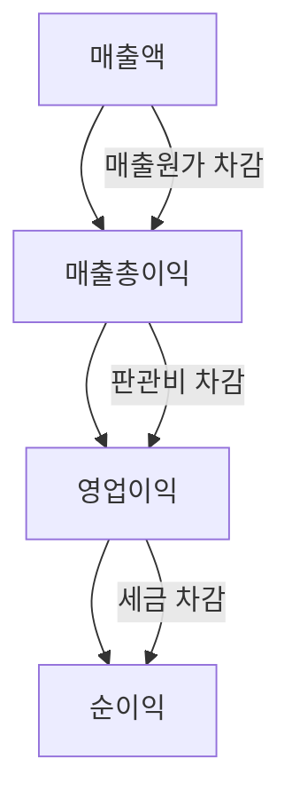
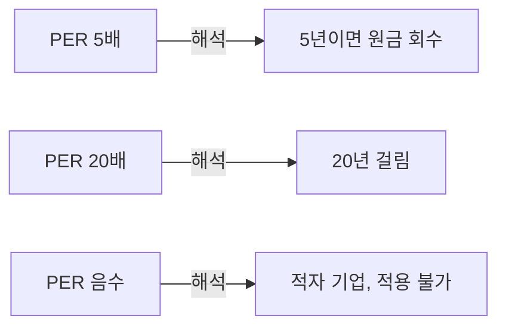
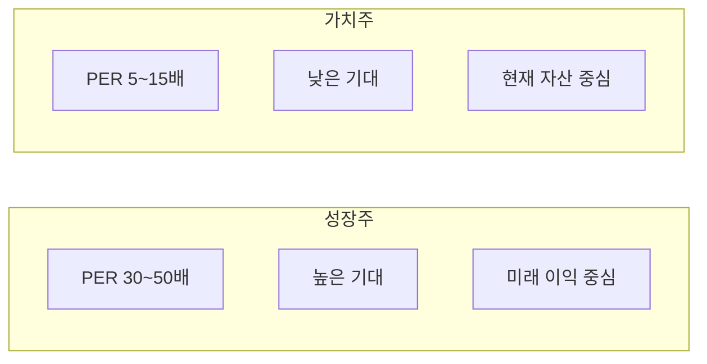
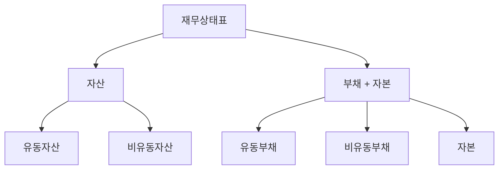
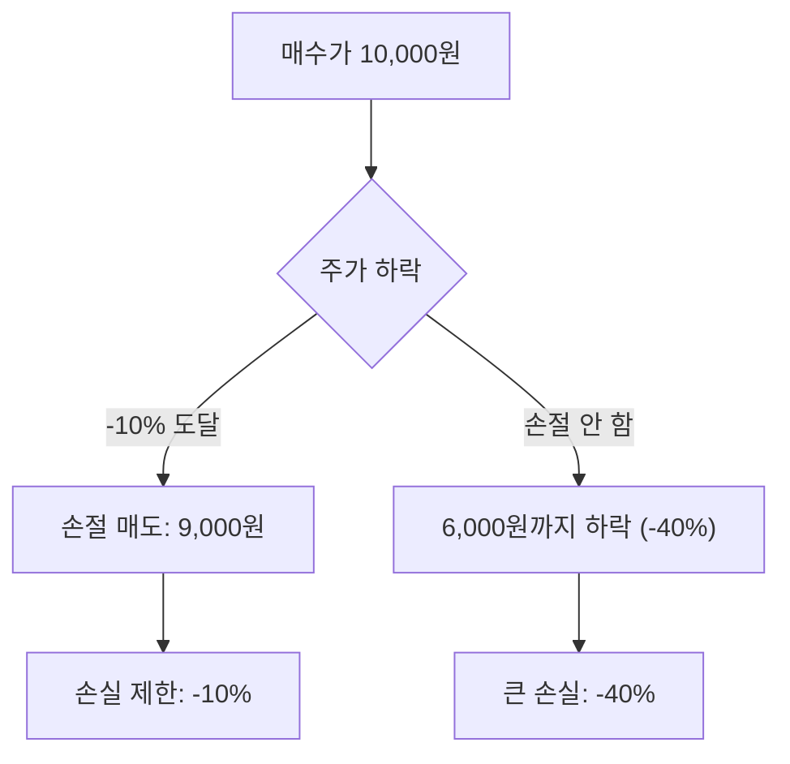

# 다이어그램 작성 가이드

## 개요

모든 용어 글의 "그림으로 이해하기" 섹션에는 **Mermaid 다이어그램**을 사용합니다. Mermaid는 GitHub에서 네이티브 렌더링되며, 블로그 발행 시 SVG로 변환되어 고품질 이미지를 제공합니다.

## Mermaid 다이어그램 유형

### 1. 플로우차트 (Flowchart)

프로세스, 의사결정, 계층 구조에 적합합니다.



**적합한 용어**: 매출→이익 흐름, 현금흐름, 유상증자 프로세스, 손절 판단

### 2. 프레임워크 (Framework / LR)

해석 가이드, 원인→결과 관계에 적합합니다.



**적합한 용어**: PER, PBR, ROE 해석, 밸류에이션 판단

### 3. 비교형

두 개념의 차이를 보여줍니다.



**적합한 용어**: 성장주 vs 가치주, 보통주 vs 우선주, 영업이익 vs 순이익

### 4. 구조도

계층이나 구성 요소를 보여줍니다.



**적합한 용어**: 자산/부채/자본, 포트폴리오 구성, 기업분석 프레임워크

## 작성 규칙

### 필수

- ` ```mermaid ` 코드 블록으로 감싼다
- 한글 위주로 노드 레이블 작성
- 노드 10~20개 이내 (간결하게)
- 핵심 관계 1가지에 집중
- 노드 텍스트에 특수문자가 있으면 `["텍스트"]` 형태로 감싼다

### 금지

- 외부 이미지 URL 사용 금지
- ASCII 텍스트 다이어그램 금지 (Mermaid 사용)
- 지나치게 복잡한 구조 (4단계 이상 중첩) 금지
- 투자 권유성 표현 금지

### Mermaid 문법 팁

| 용도 | 문법 |
|------|------|
| 상하 흐름 | `graph TD` |
| 좌우 흐름 | `graph LR` |
| 노드 연결 | `A --> B` |
| 라벨 연결 | `A -->\|"텍스트"\| B` |
| 그룹핑 | `subgraph 이름 ... end` |
| 둥근 노드 | `A("텍스트")` |
| 사각 노드 | `A["텍스트"]` |
| 다이아몬드 | `A{"텍스트"}` |

## SVG 렌더링 (블로그 발행)

`scripts/build_tistory.py`가 Mermaid 블록을 SVG로 변환합니다:

```bash
# mmdc (Mermaid CLI) 필요
npm install -g @mermaid-js/mermaid-cli

# HTML 빌드 시 자동 변환
python3 scripts/build_tistory.py --all
```

## 예시: 좋은 다이어그램 vs 나쁜 다이어그램

### ✅ 좋은 예



간결하고, 핵심 메시지(손절의 효과)가 명확합니다.

### ❌ 나쁜 예


노드 텍스트가 너무 길고, 시각적 구조가 없습니다.
