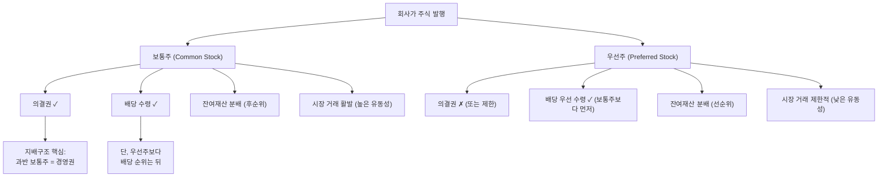

# 보통주 뜻, 일반 주주가 보유하는 주식

## 한 줄 정의

보통주(Common Stock/Ordinary Share)는 의결권·배당권·잔여재산분배권을 모두 갖춘 가장 기본적인 주식 형태로, 주식 시장에서 거래되는 대부분의 종목이 보통주입니다.

## 아주 쉽게 말하면

아파트 입주자대표회의를 생각해보세요. 아파트를 소유한 사람은 누구나 관리비 결정, 시설 보수, 규약 변경 등에 투표할 수 있습니다.

보통주도 마찬가지입니다. 1주라도 가진 사람은:
- 주주총회에서 **투표**할 수 있고 (의결권)
- 회사가 이익을 나눠줄 때 **몫**을 받을 수 있고 (배당권)
- 회사가 문을 닫을 때 남은 재산의 **분배**를 청구할 수 있습니다 (잔여재산분배권)

HTS에서 "삼성전자"를 검색하면 나오는 게 보통주이고, "삼성전자우"라고 뒤에 '우'가 붙은 게 우선주입니다. 별도 표시 없이 거래되는 주식은 거의 모두 보통주입니다.

## 왜 중요한가

**보통주 = 주식 시장의 "기본 화폐"**

증권사 앱에서 거래하는 주식, 뉴스에서 말하는 주가, ETF가 추종하는 지수 — 이 모든 것의 기준이 보통주입니다. 우선주는 보통주의 파생 상품에 가깝습니다.

**지배구조의 핵심 열쇠입니다**

보통주의 의결권은 단순한 "투표권"을 넘어 **회사를 통제하는 권력**입니다. 보통주 51%를 가지면 이사 선임, CEO 해임, 합병 승인 등 모든 중요 결정을 좌우할 수 있습니다. 이것이 최대주주의 보통주 지분율이 그토록 중요한 이유입니다.

**EPS, PER, PBR 모두 보통주 기준입니다**

- EPS = 순이익 ÷ **보통주** 발행 수
- 시가총액도 일반적으로 보통주 기준으로 산출

우선주가 있는 회사를 분석할 때 보통주와 우선주를 구분하지 않으면 밸류에이션이 왜곡됩니다.

## 그림으로 이해하기

_보통주와 우선주는 같은 회사에서 나온 주식이지만, 권리의 조합이 다릅니다._

## 숫자로 보는 예시

> ⚠️ 아래 숫자는 개념 설명을 위한 **가상 예시**이며, 실제 투자 데이터가 아닙니다.

**시나리오: "하늘전자"(가상) — 보통주와 우선주가 모두 상장된 회사**

| 항목 | 보통주 | 우선주 |
|------|--------|--------|
| 발행 주식 수 | 5,000만 주 | 1,000만 주 |
| 현재 주가 | 80,000원 | 64,000원 |
| 시가총액 | 4조 원 | 6,400억 원 |
| 배당금 (1주당) | 2,000원 | 2,100원 |
| 배당수익률 | 2.5% | 3.3% |
| 의결권 | ✓ 5,000만 표 | ✗ |
| 괴리율 | 기준 | -20% (보통주 대비) |

**투자자 A: 보통주 1,000주 보유**
- 투자 금액: 8,000만 원
- 배당 수익: 연 200만 원 (수익률 2.5%)
- 주주총회 의결권: 1,000표
- 지분율: 1,000 ÷ 5,000만 = 0.002%

**투자자 B: 같은 금액(8,000만 원)으로 우선주 구매**
- 매수 가능 수량: 1,250주 (8,000만 ÷ 64,000원)
- 배당 수익: 연 262.5만 원 (수익률 3.3%)
- 의결권: 없음

**괴리율 투자 관점:**
- 현재 괴리율 20% → 역사적 평균이 15%라면, 우선주가 상대적으로 저평가
- 만약 합병·인수 이벤트가 발생하면, 괴리율이 좁아지며 우선주가 더 크게 상승할 수 있음

## 표로 비교하기

| 비교 항목 | 보통주 | 우선주 | 왜 차이가 나는가 |
|----------|--------|--------|---------------|
| 의결권 | 1주 = 1표 | 없음 (대부분) | 우선주는 의결권 대신 배당 우선권을 교환 |
| 배당 순위 | 후순위 | 선순위 | 우선주에 먼저 배당 → 남은 금액으로 보통주 배당 |
| 배당률 | 변동 (이사회 결정) | 보통주 + α (보통 0.5~2%p 높음) | 의결권 포기의 보상 |
| 주가 수준 | 기준 | 보통주의 60~90% | 의결권 프리미엄만큼 보통주가 비쌈 |
| 거래량 | 많음 | 적음 (보통주의 10~30%) | 발행 수 자체가 적고 장기 보유자 많음 |
| 청산 시 분배 | 채권 → 우선주 → 보통주 | 채권 → 우선주 | 보통주가 가장 마지막 |
| 종목 코드 | 끝자리 0 (005930) | 끝자리 5 (005935) | 한국 시장 관행 |

## 초보자가 자주 하는 오해

**오해 1: "보통주와 우선주는 같은 회사니까 수익률도 비슷하다"**

배당수익률은 우선주가 높고, 주가 상승률은 상황에 따라 다릅니다. 지배구조 이슈가 부각되면 보통주가 급등(의결권 가치 상승)하고, 배당 확대 이벤트에는 우선주가 더 반응합니다. 같은 회사라도 투자 전략이 달라져야 합니다.

**오해 2: "개인 투자자 1주의 의결권은 의미 없다"**

국민연금이 1주주, 외국인이 2주주인 회사에서 개인 투자자 전체 지분이 30%라면? 개인들이 뭉치면 회사의 방향을 바꿀 수 있습니다. 실제로 한국에서도 "스튜어드십 코드" 도입 이후 소액주주의 의결권 행사가 경영진 교체, 배당 확대로 이어진 사례가 여러 번 있습니다.

**오해 3: "우선주가 더 안전하다"**

우선주는 배당에서 유리할 뿐, 주가 하락 위험은 보통주와 동일합니다. 오히려 거래량이 적어 급락 시 매도가 어려운 유동성 리스크가 더 큽니다. "우선"이라는 이름에 속으면 안 됩니다.

## 고수는 이렇게 봅니다

숙련된 투자자는 보통주-우선주 괴리율을 하나의 **투자 기회**로 봅니다.

**괴리율 전략:**
- 괴리율 역사적 고점(40% 이상) → 우선주 매수 검토 (괴리율 축소 기대)
- 지배구조 분쟁 가능성 → 보통주 매수 (의결권 프리미엄 확대 기대)
- 기업 인수 루머 → 보통주/우선주 합병 비율에 따라 수혜 종목 판단

**지배구조 분석:**
- 최대주주 보통주 지분율 30% 미만 → 경영권 불안정, 주주 행동주의 타깃 가능
- 보통주 지분이 분산된 회사 → 적대적 M&A 가능성 열려 있음
- 순환출자 구조에서 핵심 회사의 보통주 → 그룹 전체 지배력의 열쇠

## 기업분석에서는 이렇게 씁니다

**시가총액 계산:**
- 총 시가총액 = (보통주 주가 × 보통주 수) + (우선주 주가 × 우선주 수)
- 실무에서는 보통주 시가총액만으로 대략적 규모 비교를 하는 경우가 많음

**주당 지표:**
- EPS = 당기순이익 ÷ 가중평균 **보통주** 발행 수 (우선주 배당 차감 후)
- BPS = (순자산 - 우선주 청산가치) ÷ 보통주 발행 수
- 보통주 기준인지 전체 주식 기준인지에 따라 PER이 달라질 수 있으므로 주의

**지배구조 리스크 평가:**
- 최대주주 보통주 지분 + 특수관계인 지분 → 경영권 안정도
- 자사주 비율 → 의결권 없으므로 실질 의결권 분포 변경
- 국민연금·블랙록 등 기관 투자자의 의결권 행사 방향 → 주주가치 제고 가능성

## 함께 보면 좋은 용어

- [우선주](./preferred-stock.md): 의결권 대신 배당 우선권을 가진 주식
- [주식](./stock.md): 보통주와 우선주를 포함하는 상위 개념
- [배당](../level-06-events/dividend.md): 보통주·우선주 모두 받을 수 있는 이익 분배
- [EPS](../level-05-valuation/eps.md): 보통주 기준으로 계산하는 주당순이익
- [시가총액](./market-cap.md): 보통주 주가 × 보통주 수로 계산

## 정리

- 보통주는 의결권·배당권·잔여재산분배권을 모두 가진 가장 기본적인 주식이다.
- 주식 시장에서 별도 표시 없이 거래되는 종목은 거의 모두 보통주이며, 유동성이 가장 높다.
- 우선주 대비 주가가 높은 이유는 "의결권 프리미엄" 때문이다.
- EPS, PER, BPS 등 주당 지표는 보통주 기준으로 계산된다.
- 보통주-우선주 괴리율은 그 자체가 투자 기회 또는 리스크 지표가 될 수 있다.

## 한 줄 요약

> 보통주는 의결권과 배당권을 모두 가진 표준 주식이며, 대부분의 주식 거래는 보통주로 이루어집니다.

---

이 글은 투자 권유가 아니라 주식 용어와 기업분석 방법을 설명하기 위한 교육 콘텐츠입니다. 특정 종목의 매수·매도 판단은 독자 본인의 책임입니다.

Tags: 보통주, 보통주뜻, 주식종류, 주식초보, 의결권
