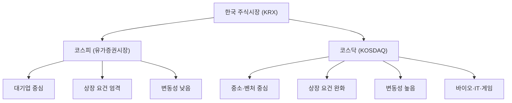

# 코스닥 뜻, 성장기업이 모인 시장

## 한 줄 정의

코스닥(KOSDAQ)은 기술·성장 중심의 중소기업이 상장되는 한국의 주식시장입니다.

## 아주 쉽게 말하면

코스피가 대기업 백화점이라면, 코스닥은 신생 브랜드가 모인 편집숍 같은 곳입니다. 아직 크지는 않지만 빠르게 성장할 가능성이 있는 회사들이 모여 있습니다.

미국의 나스닥(NASDAQ)을 모델로 만들어졌습니다.

## 왜 중요한가

- 바이오, IT, 게임, 2차전지 등 성장산업 기업이 많습니다.
- 코스피보다 상장 요건이 완화되어 초기 단계 기업도 상장할 수 있습니다.
- 성장성이 높은 만큼 변동성도 크고, 정보 비대칭이 있을 수 있습니다.
- 코스닥에서 시작해 코스피로 이전 상장하는 기업도 있습니다 (예: 셀트리온, 카카오).

## 그림으로 이해하기

_코스피와 코스닥은 같은 한국거래소에서 운영하지만 상장 기업의 성격이 다릅니다._

## 숫자로 보는 예시

> ⚠️ 아래 숫자는 개념 설명을 위한 **가상 예시**이며, 실제 투자 데이터가 아닙니다.

코스닥 지수 기준점(1996년 7월 1일) = 1,000

- 2000년 3월 (IT 버블 고점): 약 2,800 → 기준 대비 2.8배
- 2000년 말 (버블 붕괴): 약 500 → 기준 대비 0.5배
- 2024년 기준: 약 700~900

코스닥은 코스피보다 등락 폭이 훨씬 큽니다. 단기간에 큰 수익도, 큰 손실도 가능합니다.

## 표로 비교하기

| 구분 | 코스피 | 코스닥 |
|---|---|---|
| 상장 기업 특성 | 대기업, 전통 산업 | 중소·벤처, 기술 기업 |
| 상장 요건 | 엄격 (자기자본 300억 이상 등) | 완화 (기술성장기업 특례 등) |
| 시가총액 합계 | 약 2,000조 원 | 약 400조 원 |
| 외국인 비중 | 약 30% | 약 10% |
| 변동성 | 낮음 | 높음 |
| 애널리스트 커버리지 | 높음 | 낮은 종목 많음 |

## 초보자가 자주 하는 오해

**오해 1: 코스닥이 코스피보다 못한 시장이다**

코스닥은 "2군"이 아닙니다. 시장의 성격이 다를 뿐입니다. 나스닥에 애플·마이크로소프트가 있듯 코스닥에도 우량 기업이 있습니다. 다만 전체적으로 초기 단계 기업이 많아 리스크가 높을 수 있습니다.

**오해 2: 코스닥 종목은 모두 성장주다**

코스닥에 상장되어 있다고 모두 성장하는 것은 아닙니다. 상장 후 성장이 멈춘 기업, 적자가 지속되는 기업, 상장폐지 되는 기업도 있습니다. 시장이 아니라 개별 기업의 펀더멘털을 봐야 합니다.

## 고수는 이렇게 봅니다

숙련된 투자자는 코스닥에서 "아직 시장이 주목하지 않은 기업"을 찾습니다.

- 애널리스트 커버리지가 낮아 정보가 덜 반영된 기업을 찾습니다.
- 재무제표를 직접 읽고 실적을 직접 확인합니다.
- 유동성이 낮은 종목은 분할 매수·매도로 대응합니다.
- 코스닥에서 코스피로 이전 상장할 정도로 성장할 기업을 미리 발견하는 것이 큰 수익으로 이어질 수 있습니다.

## 기업분석에서는 이렇게 씁니다

코스닥 기업 분석 시 추가로 확인해야 할 것:

- 최대주주 지분율과 안정성 (경영권 분쟁 위험)
- 거래량 (유동성 부족 시 진입·이탈 어려움)
- 기술특례 상장 기업은 이익이 없을 수 있으므로 PSR, 파이프라인 분석 필요
- 관리종목·상장폐지 요건 해당 여부 확인

## 함께 보면 좋은 용어

- [코스피 뜻](../level-01-basic/kospi.md)
- [시가총액 뜻](../level-01-basic/market-cap.md)
- [거래량 뜻](../level-01-basic/trading-volume.md)
- [성장주 뜻](../level-09-strategy-risk/growth-stock.md)
- [PSR 뜻](../level-05-valuation/psr.md)

## 정리

- 코스닥은 기술·성장 중심의 중소기업이 상장되는 시장이다.
- 코스피보다 상장 요건이 완화되어 초기 기업도 진입 가능하다.
- 성장 가능성이 높지만 변동성과 정보 비대칭 리스크가 크다.

## 한 줄 요약

> 코스닥은 성장 가능성 높은 중소·기술 기업의 시장이며, 높은 수익 가능성과 높은 위험을 동시에 가집니다.

---

*면책 조항: 이 글은 투자 권유가 아니라 주식 용어와 기업분석 방법을 설명하기 위한 교육 콘텐츠입니다. 특정 종목의 매수·매도 판단은 독자 본인의 책임입니다.*

Tags: 코스닥, 코스닥뜻, KOSDAQ, 주식시장, 주식초보
