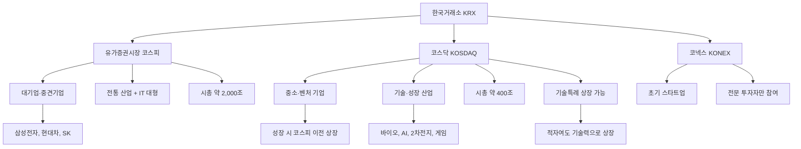

# 코스닥 뜻, 성장기업이 모인 시장

## 한 줄 정의

코스닥(KOSDAQ, Korea Securities Dealers Automated Quotations)은 기술·성장 중심의 중소·벤처 기업이 자금을 조달하고 주식을 거래하는 한국의 주식시장입니다.

## 아주 쉽게 말하면

코스피가 대기업이 입점한 백화점이라면, 코스닥은 신생 브랜드와 실력 있는 소규모 가게가 모인 편집숍 거리입니다. 아직 매장은 작지만, 몇 년 뒤 전국 체인으로 성장할 수 있는 가게들이 잔뜩 있는 곳이죠.

미국의 나스닥(NASDAQ)을 모델로 1996년에 개설되었습니다. 나스닥에 애플·엔비디아가 있는 것처럼, 코스닥에도 수천억~수조 원짜리 우량 기업이 존재합니다. 다만 전체적으로 초기 단계 기업 비율이 높아, 시장 전체의 변동성이 코스피보다 훨씬 큽니다.

## 왜 중요한가

- **성장산업 접근**: 바이오, AI, 2차전지, 게임, 반도체 소재·부품 등 차세대 산업 기업에 투자할 수 있는 거의 유일한 창구입니다.
- **초기 투자 기회**: 기업이 작을 때 발굴하면 코스피 대형주보다 훨씬 큰 수익을 기대할 수 있습니다.
- **시장 다양성**: 코스피만 보면 한국 경제의 절반만 보는 겁니다. 혁신 경제의 바로미터가 코스닥입니다.
- **이전 상장 사례**: 셀트리온, 카카오, 네이버(구 NHN)가 코스닥에서 시작해 코스피로 올라갔습니다. 초기에 투자한 사람은 수십 배 수익을 얻었습니다.
- **정보 비대칭 활용**: 애널리스트 커버리지가 낮아, 직접 분석할 능력이 있으면 시장이 놓친 가치를 찾을 수 있습니다.

## 그림으로 이해하기

_한국거래소는 코스피·코스닥·코넥스 세 시장을 운영합니다. 코스닥은 성장 기업의 '등용문' 역할을 합니다._

## 숫자로 보는 예시

> ⚠️ 아래 숫자는 개념 설명을 위한 **가상 예시**이며, 실제 투자 데이터가 아닙니다.

**코스닥 지수의 극적인 역사 (가상 시나리오)**

| 시점 | 코스닥 지수 | 사건 | 변동 |
|---|---|---|---|
| 1996.7 (기준) | 1,000 | 시장 개설 | — |
| 2000.3 | 2,800 | IT 버블 고점 | +180% |
| 2000.12 | 500 | 버블 붕괴 | −82% |
| 2004 | 320 | 카드 사태 여파 | 추가 하락 |
| 2018 | 900 | 바이오 랠리 | 서서히 회복 |
| 2021 | 1,050 | 유동성 장세 | 1,000 회복 |
| 2022 | 680 | 긴축·금리 인상 | −35% |

**가상 기업 "미래바이오"의 코스닥 여정**

미래바이오는 신약 파이프라인 3개를 가진 바이오 벤처입니다.

- **상장 시점**: 매출 50억 원, 영업이익 −30억 원 (적자). 기술특례로 상장.
- **시총**: 상장 당시 2,000억 원 → 2년 뒤 임상 3상 성공 발표 → 시총 8,000억 원(4배)
- **반대 사례**: 같은 해 상장한 "꿈나노"는 임상 실패로 시총 2,000억 → 300억(−85%)

이것이 코스닥의 양면성입니다. 성공하면 몇 배, 실패하면 −80% 이상 손실.

## 표로 비교하기

| 구분 | 코스피 | 코스닥 | 코넥스 | 나스닥(미국) |
|---|---|---|---|---|
| 개설 | 1956년 | 1996년 | 2013년 | 1971년 |
| 종목 수 | 약 950개 | 약 1,700개 | 약 130개 | 약 3,300개 |
| 시총 합계 | 약 2,000조 | 약 400조 | 약 5조 | 약 3경(USD 25조) |
| 대표 기업 | 삼성전자, SK하이닉스 | 에코프로비엠, HLB | 초기 스타트업 | 애플, 엔비디아 |
| 상장 요건 | 자기자본 300억+ | 기술특례 시 완화 | 지정 자문인 추천 | 시총·매출·이익 중 택1 |
| 외국인 비중 | 약 30% | 약 10% | 극소 | 약 40% |
| 변동성 | 중간 | 높음 | 매우 높음 | 중~높음 |
| 투자자 | 기관·외국인 중심 | 개인 비중 높음 | 전문투자자 한정 | 글로벌 혼합 |

## 초보자가 자주 하는 오해

**오해 1: 코스닥은 코스피의 "2군"이다**

등급이 아니라 성격이 다른 시장입니다. 나스닥이 뉴욕증권거래소(NYSE)의 2군이 아닌 것처럼, 코스닥도 독립된 시장입니다. 에코프로비엠 시총은 코스피 하위 200개 종목보다 큽니다.

**오해 2: 코스닥 종목은 전부 성장주다**

코스닥에 상장되었다고 성장이 보장되진 않습니다. 상장 후 수년간 매출이 정체되거나, 적자가 누적되어 관리종목이 되는 기업도 수두룩합니다. "코스닥 = 성장"이라는 공식은 없습니다.

**오해 3: 코스닥은 위험하니 절대 투자하면 안 된다**

코스닥 시장 전체가 위험한 게 아니라, 개별 종목 선별이 더 어려운 것입니다. 코스닥150 ETF처럼 분산된 상품에 투자하면 개별 종목 리스크를 줄이면서 성장산업 전체에 배팅할 수 있습니다.

## 고수는 이렇게 봅니다

숙련된 투자자에게 코스닥은 "10루타를 칠 수 있는 유일한 운동장"입니다. 대신 삼진 아웃 확률도 높죠.

- **정보 우위 전략**: 애널리스트가 커버하지 않는 종목(커버리지 0건)을 직접 분석해 시장이 모르는 가치를 선점합니다.
- **소형주 효과 활용**: 학술적으로 소형주가 장기적으로 대형주를 아웃퍼폼하는 경향(Fama-French 팩터)을 체계적으로 활용합니다.
- **유동성 프리미엄 수취**: 거래량이 적은 종목은 그만큼 할인되어 있습니다. 인내심을 갖고 분할 매수 후, 유동성이 돌아올 때(실적 발표, 테마 부각) 매도합니다.
- **이전 상장 시나리오 분석**: 시총이 1조 원을 넘기고 실적이 안정된 코스닥 기업이 코스피 이전을 검토하면, 기관 수급이 새로 유입되며 추가 상승하는 패턴을 노립니다.
- **관리종목 회피 체크리스트**: 4기 연속 영업적자, 자본잠식 50% 이상, 감사의견 거절 등 상장폐지 요건을 분기마다 체크합니다.

## 기업분석에서는 이렇게 씁니다

코스닥 기업은 코스피 대형주와 분석 방법이 다릅니다.

- **PSR(주가매출비율) 우선**: 아직 이익이 없는 바이오·초기 IT 기업은 PER 대신 PSR이나 EV/Sales로 밸류에이션합니다.
- **파이프라인 가치 산정**: 바이오 기업은 각 신약 후보물질의 성공 확률 × 예상 매출로 기업가치를 역산합니다 (rNPV 모형).
- **최대주주 지분율 확인**: 지분율이 20% 미만이면 경영권 분쟁 위험이 있어 할인 요인입니다.
- **거래량 체크**: 일 평균 거래대금이 10억 원 미만이면, 큰 금액 투자 시 매수·매도에 수일이 걸릴 수 있습니다.
- **상장폐지 스크리닝**: 매 분기 관리종목 지정 요건(4기 연속 적자, 자본잠식, 감사의견 등)을 체크합니다.
- **락업(보호예수) 해제일**: 상장 후 6개월~1년에 대주주·기관 물량이 풀리면 단기 수급 악화가 옵니다.

## 함께 보면 좋은 용어

- [코스피 뜻](../level-01-basic/kospi.md)
- [시가총액 뜻](../level-01-basic/market-cap.md)
- [거래량 뜻](../level-01-basic/trading-volume.md)
- [성장주 뜻](../level-09-strategy-risk/growth-stock.md)
- [PSR 뜻](../level-05-valuation/psr.md)

## 정리

- 코스닥은 기술·성장 중심의 중소·벤처 기업이 상장되는 시장이며, 1996년 나스닥을 모델로 개설되었다.
- 코스피보다 상장 요건이 완화되어 적자 기업도 기술특례로 진입 가능하다.
- 성장 가능성이 높지만 변동성·정보 비대칭·유동성 리스크가 크다.
- 코스닥150 ETF를 통해 분산 투자할 수 있고, 개별 종목은 PSR·파이프라인·수급을 중심으로 분석한다.
- 코스닥에서 코스피로 이전 상장하는 기업을 조기에 발굴하면 큰 수익이 가능하다.

## 한 줄 요약

> 코스닥은 성장 가능성 높은 중소·기술 기업의 시장이며, 높은 수익 기회와 높은 위험을 동시에 품고 있는 한국판 나스닥입니다.

---

이 글은 투자 권유가 아니라 주식 용어와 기업분석 방법을 설명하기 위한 교육 콘텐츠입니다. 특정 종목의 매수·매도 판단은 독자 본인의 책임입니다.

Tags: 코스닥, 코스닥뜻, 중소형주, 주식시장, 주식초보
