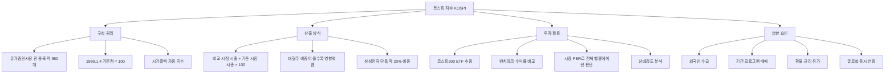

# 코스피 뜻, 한국 대표 주식시장 지수

## 한 줄 정의

코스피(KOSPI, Korea Composite Stock Price Index)는 한국거래소 유가증권시장에 상장된 모든 종목의 시가총액 변동을 하나의 숫자로 나타낸 지수입니다.

## 아주 쉽게 말하면

대형 쇼핑몰을 떠올려보세요. 몰 안에 수백 개의 매장이 있고, 각 매장의 매출이 매일 달라집니다. 코스피는 이 쇼핑몰 전체의 "오늘 장사가 잘 됐나?"를 한눈에 보여주는 숫자입니다.

코스피가 어제보다 올랐다면, 상장된 회사들의 전체 가치가 어제보다 커졌다는 뜻입니다. 반대로 떨어졌다면, 시장 전체의 가치가 줄었다는 의미입니다. 뉴스에서 "오늘 코스피 2,600 돌파"라고 말하면, 한국 대형 주식시장의 온도가 올라갔다고 이해하면 됩니다.

## 왜 중요한가

- **경제 방향 파악**: 한국 경제 전반이 좋아지고 있는지, 나빠지고 있는지 가장 빠르게 보여줍니다.
- **내 종목 상대 비교**: 코스피가 5% 올랐는데 내 종목은 제자리라면, 시장 평균보다 못한 것입니다.
- **외국인 투자 기준점**: 글로벌 펀드 매니저가 한국 시장에 자금을 넣을지 뺄지 결정할 때 가장 먼저 보는 지표입니다.
- **인덱스 투자의 기초**: 코스피200 ETF 같은 패시브 상품은 이 지수를 그대로 따라갑니다.
- **정책 영향 체감**: 금리 인상, 환율 변동, 무역 분쟁 같은 거시 이벤트가 시장에 미치는 충격을 실시간으로 보여줍니다.

## 그림으로 이해하기

_코스피는 시가총액 가중 방식이기 때문에, 삼성전자 하나가 2% 움직이면 지수 전체가 0.4%p 가까이 흔들릴 수 있습니다._

## 숫자로 보는 예시

> ⚠️ 아래 숫자는 개념 설명을 위한 **가상 예시**이며, 실제 투자 데이터가 아닙니다.

**가상 시나리오: "한빛시장" 지수 만들어 보기**

한빛시장에 3개 기업만 상장되어 있다고 가정합니다.

| 기업 | 기준일 시총 | 오늘 시총 | 변동 |
|---|---|---|---|
| A전자 | 50조 원 | 55조 원 | +10% |
| B자동차 | 30조 원 | 27조 원 | −10% |
| C은행 | 20조 원 | 22조 원 | +10% |

- 기준일 합산 시총: 100조 원 (기준점 = 100)
- 오늘 합산 시총: 104조 원
- 오늘 지수: 104조 ÷ 100조 × 100 = **104**

A전자(비중 50%)가 10% 올랐고, B자동차(비중 30%)가 10% 빠졌습니다. 시총 비중이 큰 A전자의 상승이 지수를 끌어올린 것입니다. 이것이 "시가총액 가중"의 핵심입니다.

**연도별 흐름 (가상)**

| 연도 | 코스피 | 사건 | 전년 대비 |
|---|---|---|---|
| 2018 | 2,040 | 미중 무역 갈등 시작 | −17% |
| 2019 | 2,200 | 반도체 업황 회복 | +8% |
| 2020.3 | 1,450 | 팬데믹 저점 | −34% |
| 2021.6 | 3,300 | 유동성 랠리 고점 | +128%(저점 대비) |
| 2022 | 2,230 | 긴축·금리 인상 | −32% |

## 표로 비교하기

| 구분 | 코스피 | 코스닥 | S&P500 |
|---|---|---|---|
| 시장 | 유가증권시장 | 코스닥시장 | 뉴욕증권거래소+나스닥 |
| 종목 수 | 약 950개 | 약 1,700개 | 500개(선별) |
| 대표 기업 | 삼성전자, 현대차, SK하이닉스 | 에코프로, 셀트리온헬스케어 | 애플, 마이크로소프트 |
| 기업 특성 | 대기업·중견기업 중심 | 중소·벤처·기술 기업 | 미국 대형 우량주 |
| 산출 방식 | 시가총액 가중 | 시가총액 가중 | 시가총액 가중(선별) |
| 상장 요건 | 엄격 (자본금·이익 기준) | 상대적으로 완화 | 매우 엄격 |
| 변동성 | 중간 | 높음 | 낮음 |
| 기준점 | 1980.1.4 = 100 | 1996.7.1 = 1,000 | 1941~43 = 10 |

## 초보자가 자주 하는 오해

**오해 1: 코스피가 오르면 내 주식도 반드시 오른다**

코스피는 "평균"입니다. 학교 평균 성적이 올라도, 내 성적은 떨어질 수 있죠. 특히 시가총액이 작은 중소형주는 코스피 지수와 완전히 반대로 움직이기도 합니다. 삼성전자·SK하이닉스 같은 초대형주가 오르면 지수는 올라도, 나머지 800개 종목은 빠질 수 있습니다.

**오해 2: 코스피 숫자가 높으면 무조건 비싸다**

2,500이 비싼지 싼지는 숫자 자체로 알 수 없습니다. 상장 기업들의 순이익이 두 배로 늘었다면 코스피 2,500도 싼 것이고, 이익이 반토막 났는데 2,500이면 매우 비싼 겁니다. 가격이 아니라 "이익 대비 가격(PER)"으로 판단해야 합니다.

**오해 3: 코스피에 직접 투자할 수 없다**

코스피 "지수" 자체를 살 수는 없지만, 코스피200 ETF를 사면 사실상 코스피에 투자하는 것과 같습니다. 증권 계좌에서 주식처럼 매수할 수 있으며, 개별 종목 고르기 어려운 초보자에게 좋은 출발점이 됩니다.

## 고수는 이렇게 봅니다

숙련된 투자자에게 코스피는 단순한 숫자가 아니라, 시장 전체의 "체온계"이자 "기회 측정기"입니다.

- **밸류에이션 밴드 활용**: 코스피 전체 PER이 역사적 하단(8~9배)에 오면 적극 매수 구간, 상단(13~15배)에 오면 경계 구간으로 판단합니다.
- **수급 삼각 분석**: 외국인·기관·개인의 매수/매도 패턴을 동시에 봅니다. 외국인이 3조 원 이상 연속 순매수하면 지수 상승 추세가 강하다고 봅니다.
- **상대강도(RS) 비교**: 내 종목이 코스피 대비 강한지 약한지를 판단합니다. 시장이 빠지는데 내 종목이 버티면, 향후 시장 반등 시 더 크게 오를 가능성이 높습니다.
- **선행지표 크로스체크**: 코스피는 후행적 성격도 있어서, 수출 증가율·제조업 PMI·신용 스프레드 같은 선행지표와 교차 확인합니다.
- **섹터 로테이션 판단**: 코스피 상승의 주도주가 바뀌는 시점(예: IT → 금융)을 포착해 포트폴리오를 조정합니다.

## 기업분석에서는 이렇게 씁니다

기업분석에서 코스피는 "시장 환경"을 파악하는 맥락 도구입니다.

- **상대 PER 비교**: 코스피 전체 PER이 10배인데 A기업 PER이 7배라면, 시장 평균보다 저평가되었을 가능성을 검토합니다.
- **베타(β) 계산**: 코스피가 1% 움직일 때 내 종목이 몇 % 움직이는지 측정합니다. 베타 1.5면 시장보다 1.5배 민감한 공격적 종목입니다.
- **시장 국면 판단**: 코스피가 200일 이동평균선 아래에 있으면 약세장으로 판단하고, 이때 개별 종목 매수 타이밍을 보수적으로 잡습니다.
- **이익 기여도 분석**: 코스피 EPS(주당순이익) 변화를 섹터별로 분해하면, 시장 상승이 실적에 의한 것인지 멀티플 확장에 의한 것인지 구분할 수 있습니다.

## 함께 보면 좋은 용어

- [코스닥 뜻](../level-01-basic/kosdaq.md)
- [시가총액 뜻](../level-01-basic/market-cap.md)
- [외국인 순매수 뜻](../level-02-market-trading/foreign-net-buying.md)
- [PER 뜻](../level-05-valuation/per.md)
- [성장주 뜻](../level-09-strategy-risk/growth-stock.md)

## 정리

- 코스피는 한국 유가증권시장 전체 종목의 시가총액을 하나의 숫자로 표현한 지수다.
- 시가총액 가중 방식이라 삼성전자 같은 초대형주의 영향력이 압도적이다.
- 코스피 숫자만으로 비싸다·싸다를 판단할 수 없으며, 반드시 기업 이익(PER)과 함께 봐야 한다.
- 코스피200 ETF를 통해 시장 전체에 간접 투자할 수 있다.
- 숙련된 투자자는 코스피를 밸류에이션 밴드·수급·상대강도의 복합 지표로 활용한다.

## 한 줄 요약

> 코스피는 한국 대표 주식시장의 전체 건강 상태를 보여주는 지수이며, 개별 종목의 상대적 위치를 판단하는 기준점입니다.

---

이 글은 투자 권유가 아니라 주식 용어와 기업분석 방법을 설명하기 위한 교육 콘텐츠입니다. 특정 종목의 매수·매도 판단은 독자 본인의 책임입니다.

Tags: 코스피, 코스피뜻, 대형주, 주식시장, 주식초보
