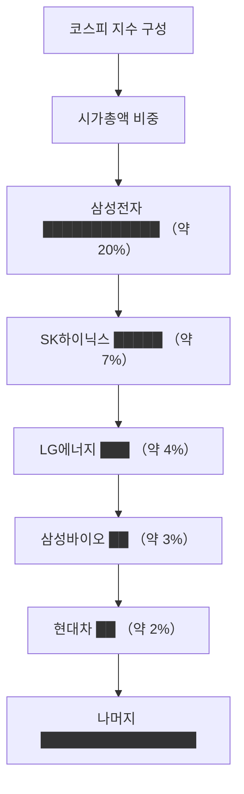

# 코스피 뜻, 한국 대표 주식시장을 이해하기

뉴스에서 "오늘 코스피가 2,500을 돌파했습니다"라는 말을 들어본 적 있을 것입니다.

코스피는 한국을 대표하는 주식시장이자, 그 시장 전체의 건강 상태를 보여주는 숫자입니다.

## 한 줄 정의

코스피(KOSPI)는 한국거래소 유가증권시장에 상장된 모든 종목의 시가총액을 지수로 나타낸 것입니다.

## 아주 쉽게 말하면

학교 전체 학생의 평균 성적 같은 것입니다. 개별 학생의 점수가 아니라, 학교 전체가 시험을 잘 봤는지 한눈에 보여주는 숫자입니다.

코스피 지수가 올랐다는 것은 시장에 상장된 회사들의 전체 가치가 올랐다는 뜻입니다.

## 왜 중요한가

- 한국 경제와 주식시장의 전반적인 방향을 알 수 있습니다.
- 내 종목이 시장 전체 흐름과 같이 가는지, 다르게 가는지 판단할 수 있습니다.
- 외국인 투자자들이 한국 시장을 볼 때 가장 먼저 보는 지표입니다.
- 코스피 지수를 추종하는 ETF(인덱스 펀드)에 투자할 수 있습니다.

## 그림으로 이해하기

_시가총액이 큰 대형주가 코스피 지수 방향에 큰 영향을 줍니다._

## 숫자로 보는 예시

> ⚠️ 아래 숫자는 개념 설명을 위한 **가상 예시**이며, 실제 투자 데이터가 아닙니다.

코스피 지수 기준점(1980년 1월 4일) = 100

- 2020년 3월 (코로나 저점): 약 1,450
- 2021년 6월 (고점): 약 3,300
- 기준점 대비 약 14~33배 상승

만약 1980년에 코스피 전체에 100만 원을 투자했다면, 2021년 고점 기준 약 3,300만 원이 된 셈입니다.

## 표로 비교하기

| 구분 | 코스피 | 코스닥 |
|---|---|---|
| 정식 명칭 | 유가증권시장 | 코스닥시장 |
| 상장 기업 수 | 약 950개 | 약 1,700개 |
| 대표 기업 | 삼성전자, 현대차 | 에코프로, 셀트리온헬스케어 |
| 기업 특성 | 대기업·중견기업 중심 | 중소·벤처·기술 기업 중심 |
| 상장 요건 | 엄격 (자본금, 이익 등) | 상대적으로 완화 |
| 변동성 | 상대적으로 낮음 | 상대적으로 높음 |

## 초보자가 자주 하는 오해

**오해 1: 코스피가 오르면 내 주식도 오른다**

코스피는 평균입니다. 시장 전체가 올라도 내 종목은 떨어질 수 있습니다. 특히 시가총액이 작은 종목은 코스피 지수와 다르게 움직이는 경우가 많습니다.

**오해 2: 코스피 숫자가 높으면 비싸다**

코스피 2,500이 비싼지 싼지는 숫자 자체로 판단할 수 없습니다. 상장 기업들의 이익이 함께 늘었다면 2,500도 싼 것일 수 있고, 이익이 줄었는데 2,500이면 비싼 것일 수 있습니다.

## 고수는 이렇게 봅니다

숙련된 투자자는 코스피 지수를 "시장 전체의 밸류에이션"으로 봅니다.

- 코스피 전체 PER이 역사적으로 어디쯤인가? (싼 구간인가, 비싼 구간인가)
- 외국인·기관의 수급이 유입인가, 유출인가?
- 내 종목이 시장 대비 강한가, 약한가? (상대강도)

## 기업분석에서는 이렇게 씁니다

기업분석에서 코스피는 "시장 환경" 파악에 쓰입니다.

- 코스피 전체 PER과 개별 종목 PER을 비교하면 상대적 저평가·고평가를 판단할 수 있습니다.
- 코스피가 급락할 때 내 종목의 방어력을 확인할 수 있습니다.
- 시장 전체가 싸다면 개별 종목도 함께 싸졌을 가능성이 있어, 상대적으로 저렴한 구간인지 검토해볼 수 있습니다.

## 함께 보면 좋은 용어

- [코스닥 뜻](../level-01-basic/kosdaq.md)
- [시가총액 뜻](../level-01-basic/market-cap.md)
- [외국인 순매수 뜻](../level-02-market-trading/foreign-net-buying.md)
- [PER 뜻](../level-05-valuation/per.md)
- [성장주 뜻](../level-09-strategy-risk/growth-stock.md)

## 정리

- 코스피는 한국 유가증권시장 전체 종목의 시가총액을 지수화한 것이다.
- 시가총액이 큰 종목일수록 지수에 미치는 영향이 크다.
- 코스피 숫자만으로 비싸다 싸다를 판단할 수 없으며, 이익과 함께 봐야 한다.

## 한 줄 요약

코스피는 한국 대표 주식시장의 전체 건강 상태를 보여주는 지수이며, 개별 종목 투자 판단의 배경이 됩니다.

---

*면책 조항: 이 글은 투자 권유가 아니라 주식 용어와 기업분석 방법을 설명하기 위한 교육 콘텐츠입니다. 특정 종목의 매수·매도 판단은 독자 본인의 책임입니다.*

Tags: 코스피, 코스피뜻, KOSPI, 주식시장, 주식초보
