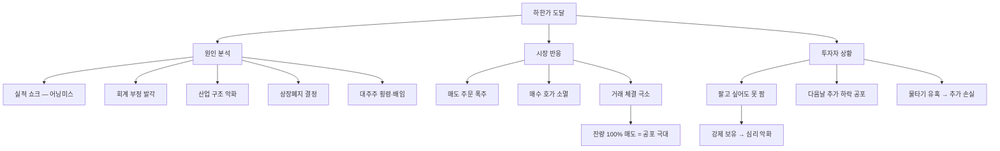

# 하한가 뜻, 하루에 주가가 빠질 수 있는 한계

## 한 줄 정의

하한가는 하루 동안 주가가 내릴 수 있는 최대 한도 가격이며, 한국 주식시장에서는 전일 종가 대비 −30%입니다.

## 아주 쉽게 말하면

건물 엘리베이터에 지하 1층까지만 버튼이 있다고 생각하세요. 아무리 아래를 눌러도 그 밑으로는 못 내려갑니다. 하한가가 바로 그 "지하 1층"입니다.

어제 종가가 10,000원이었다면, 오늘 아무리 나쁜 뉴스가 터져도 7,000원 아래로는 떨어지지 않습니다. 하지만 여기서 끝이 아닙니다. 내일은 7,000원이 새로운 기준이 되어 다시 −30%인 4,900원까지 떨어질 수 있습니다. 즉, 하한가는 "오늘의 바닥"이지 "영원한 바닥"이 아닙니다.

## 왜 중요한가

- **패닉 방지**: 공포에 의한 무한 급락을 하루 단위로 차단해 투자자에게 생각할 시간을 줍니다.
- **유동성 소멸 경고**: 하한가에 도달하면 매수자가 사라져 "팔고 싶어도 못 파는" 상황이 발생합니다.
- **손실 누적의 심각성**: 2일 연속이면 −51%, 3일이면 −66%. 회복하려면 +200%가 필요합니다.
- **투자 심리 이해**: 하한가 종목의 매도 잔량은 시장 공포의 크기를 보여주는 척도입니다.
- **리스크 관리 기본**: 하한가 가능성을 미리 인식하고 손절 기준을 세워야 큰 손실을 막을 수 있습니다.

## 그림으로 이해하기

_하한가에 도달하면 매도 주문만 쌓이고 매수자가 나타나지 않아, 보유자는 다음날까지 강제로 기다려야 합니다._

## 숫자로 보는 예시

> ⚠️ 아래 숫자는 개념 설명을 위한 **가상 예시**이며, 실제 투자 데이터가 아닙니다.

**가상 종목 "드림제약" — 연속 하한가 시나리오**

드림제약 전일 종가: 30,000원. 분식회계 적발 뉴스 발표.

| 일차 | 종가 | 일간 하락 | 원금 대비 잔존율 | 1,000만 원 투자 시 잔액 |
|---|---|---|---|---|
| 기준일 | 30,000원 | — | 100% | 1,000만 원 |
| 1일차 | 21,000원 | −30% | 70% | 700만 원 |
| 2일차 | 14,700원 | −30% | 49% | 490만 원 |
| 3일차 | 10,290원 | −30% | 34% | 343만 원 |
| 5일차 | 5,042원 | −30% | 17% | 168만 원 |

5일 연속 하한가면 원금의 83%가 증발합니다. 그리고 343만 원에서 원래 1,000만 원을 회복하려면 +192% 상승이 필요합니다.

**"하한가에서 반등" vs "하한가 후 추가 하락" 비교**

| 시나리오 | 하한가 원인 | 다음날 | 일주일 후 | 특징 |
|---|---|---|---|---|
| A (반등) | 시장 전체 급락 | +8% 반등 | 원래 수준 회복 | 개별 악재 아님 |
| B (추가 하락) | 회계 부정 | −15% 추가 하락 | 관리종목 지정 | 기업 자체 문제 |
| C (횡보) | 실적 쇼크 | −3% 소폭 하락 | 바닥 다지기 | 실적 재확인 대기 |

**손실과 회복의 비대칭**

| 손실률 | 회복에 필요한 수익률 |
|---|---|
| −10% | +11% |
| −30% (하한가 1회) | +43% |
| −51% (하한가 2회) | +104% |
| −66% (하한가 3회) | +192% |
| −83% (하한가 5회) | +500% |

이것이 "하락은 방어해야 한다"는 투자 격언의 수학적 근거입니다.

## 표로 비교하기

| 구분 | 하한가 1회 | 하한가 3회 연속 | 상장폐지 | 서킷브레이커 |
|---|---|---|---|---|
| 손실률 | −30% | −66% | −100% (가치 소멸) | 시장 일시 중단 |
| 매도 가능성 | 어려움 | 매우 어려움 | 정리매매 기간만 가능 | 20분 후 재개 |
| 회복 가능성 | 있음 | 낮음 | 없음 | 개별 종목 무관 |
| 대응 방법 | 손절 검토 | 원인 분석 후 판단 | 정리매매에서 탈출 | 시장 안정 후 판단 |
| 발생 빈도 | 주 수십 건 | 연 수건 | 연 10~20건 | 연 1~2회 |

## 초보자가 자주 하는 오해

**오해 1: 하한가까지 떨어졌으니 더 못 떨어진다**

하한가는 "오늘의 바닥"이지 "절대적 바닥"이 아닙니다. 내일 다시 −30%가 가능합니다. 실제로 회계 부정이나 상장폐지 사유가 발생하면 5일 이상 연속 하한가가 나옵니다. "이만큼 떨어졌으니 반등하겠지"라는 생각은 가장 위험한 오해입니다.

**오해 2: 하한가에 매수하면 싸게 사는 것이다**

시장 전체가 "이 가격에도 안 사겠다"고 외면한 것을 역으로 가는 행위입니다. 반등하면 +43% 수익이지만, 다음날 또 하한가면 즉시 −30% 추가 손실입니다. 이유 없이 싼 주식은 없습니다.

**오해 3: 물타기로 평균단가를 낮추면 된다**

하한가 종목에 물타기하면 손실 금액만 커집니다. 1,000만 원 투자 후 하한가, 여기서 500만 원 추가 투자(물타기), 다음날 또 하한가면? 총 투입 1,500만 원 중 잔액은 735만 원(−51%)입니다. 물타기는 하한가 원인이 완전히 해소된 후에만 고려해야 합니다.

## 고수는 이렇게 봅니다

숙련된 투자자는 하한가 종목을 대부분 "구경만" 합니다. 개입할 때는 매우 엄격한 조건을 따릅니다.

- **원인 구분이 최우선**: 일시적 쇼크(시장 급락, 단순 어닝미스)인지 구조적 문제(회계부정, 사업모델 붕괴)인지 판단합니다. 구조적 문제면 절대 손대지 않습니다.
- **거래량 정상화 확인**: 하한가 후 며칠 지나 거래량이 평소 수준으로 돌아오고, 매수·매도 호가가 균형을 이루면 그때부터 분석을 시작합니다.
- **관리종목 요건 확인**: 4기 연속 영업적자, 자본잠식 50%, 감사의견 거절 등 상장폐지 직행 요건에 해당하면 어떤 가격이든 매수하지 않습니다.
- **손절 기준 사전 설정**: 하한가 종목에 진입할 경우, 진입가 대비 −10% 추가 하락 시 무조건 매도하는 기계적 룰을 설정합니다.
- **포지션 사이즈 제한**: 하한가 경험 종목은 총 자산의 3% 이내로만 진입합니다. 맞으면 좋고, 틀려도 전체 포트폴리오에 타격이 없는 수준입니다.

## 기업분석에서는 이렇게 씁니다

하한가는 "시장이 이 기업의 가치를 하루 만에 −30% 이상 재평가한 순간"입니다. 기업분석가에게는 기존 분석을 재점검하라는 강력한 신호입니다.

- **실적 쇼크 하한가**: 이전 실적 추정이 왜 틀렸는지 분석합니다. 매출 감소인지, 비용 증가인지, 일회성인지, 구조적인지에 따라 향후 전망이 완전히 달라집니다.
- **회계 이슈 하한가**: 재무제표 전체의 신뢰성이 무너집니다. 과거 3년 치 실적도 재검증해야 하며, 대부분의 경우 분석 자체를 중단합니다.
- **업황 악화 하한가**: 개별 기업 문제인지 산업 전체 문제인지 구분합니다. 산업 전체라면 동종 업계 모든 종목의 밸류에이션을 일괄 하향 조정합니다.
- **투자 논리 재점검**: "내가 이 회사를 산 이유가 여전히 유효한가?" 이 질문에 자신 있게 "예"라고 답할 수 없으면, 반등을 기다리지 말고 손절합니다.

## 함께 보면 좋은 용어

- [상한가 뜻](../level-01-basic/upper-limit.md)
- [주가 뜻](../level-01-basic/stock-price.md)
- [거래량 뜻](../level-01-basic/trading-volume.md)
- [어닝쇼크 뜻](../level-08-industry-macro/earnings-shock.md)
- [손절 뜻](../level-10-company-analysis/stop-loss.md)

## 정리

- 하한가는 하루에 주가가 내릴 수 있는 최대 한도(한국은 −30%)이며, "오늘의 바닥"이지 "절대적 바닥"이 아니다.
- 연속 하한가는 실제로 발생하며, 3일이면 −66%, 5일이면 −83%의 파괴적 손실을 낳는다.
- 손실과 회복은 비대칭이다. −30% 손실을 만회하려면 +43% 수익이 필요하다.
- 하한가 종목에 대한 물타기·반등 기대 매수는 초보자가 가장 많이 돈을 잃는 패턴이다.
- 숙련된 투자자는 하한가 원인이 일시적인지 구조적인지 판단한 후에만, 극소 포지션으로 개입한다.

## 한 줄 요약

> 하한가는 하루 최대 하락 한도(−30%)이며, 하한가에 도달했다고 반등이 보장되는 것은 절대 아닙니다.

---

이 글은 투자 권유가 아니라 주식 용어와 기업분석 방법을 설명하기 위한 교육 콘텐츠입니다. 특정 종목의 매수·매도 판단은 독자 본인의 책임입니다.

Tags: 하한가, 하한가뜻, 가격제한폭, 주식초보, 주식용어
