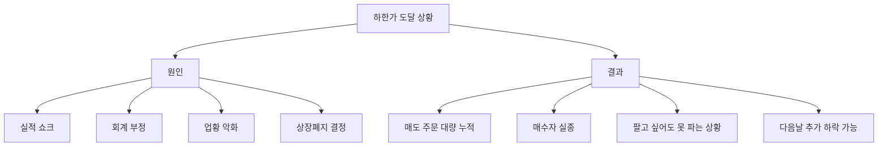

# 하한가 뜻, 하루에 주가가 빠질 수 있는 한계

## 한 줄 정의

하한가는 하루 동안 주가가 내릴 수 있는 최대 한도 가격입니다.

## 아주 쉽게 말하면

엘리베이터에 지하 1층까지만 있는 건물이라고 생각하세요. 아무리 아래 버튼을 눌러도 그 아래로는 못 내려갑니다.

한국 주식시장에서는 전일 종가 대비 -30%가 하루 최대 하락 한도입니다. 어제 1만 원이었으면 오늘 최저 7천 원까지만 떨어질 수 있습니다.

## 왜 중요한가

- 공포에 의한 과도한 급락에서 투자자를 보호합니다.
- 하한가에 도달하면 매도 주문만 쌓이고 매수자가 없어 거래가 안 될 수 있습니다.
- 하한가 종목은 다음날 추가 하락이 이어질 수 있어 물타기가 위험합니다.

## 그림으로 이해하기

_하한가에 도달하면 매도 물량만 쌓이고 매수자가 나타나지 않을 수 있습니다._

## 숫자로 보는 예시

> ⚠️ 아래 숫자는 개념 설명을 위한 **가상 예시**이며, 실제 투자 데이터가 아닙니다.

전일 종가가 30,000원인 종목이 3일 연속 하한가를 맞으면:

- 1일차: 30,000 × 0.7 = **21,000원** (-30%)
- 2일차: 21,000 × 0.7 = **14,700원** (원금 대비 -51%)
- 3일차: 14,700 × 0.7 = **10,290원** (원금 대비 -66%)

3일 만에 원금의 2/3가 사라집니다. 연속 하한가의 위력입니다.

## 표로 비교하기

| 상황 | 주가 반응 | 투자자 행동 | 위험도 |
|---|---|---|---|
| 실적 쇼크 | 하한가 1회 | 패닉 매도 후 반등 가능 | 중 |
| 회계 부정 발각 | 연속 하한가 | 매수자 실종, 탈출 불가 | 극심 |
| 상장폐지 결정 | 연속 하한가 | 거래 자체 불가능 | 극심 |
| 시장 전체 급락 | 다수 종목 하한가 접근 | 서킷브레이커 발동 가능 | 높음 |

## 초보자가 자주 하는 오해

**오해 1: 하한가까지 떨어졌으면 더 이상 안 떨어진다**

하한가는 "오늘의 바닥"이지 "절대적 바닥"이 아닙니다. 다음날 또 하한가가 나올 수 있습니다. 3일, 5일 연속 하한가도 실제로 발생합니다.

**오해 2: 하한가에 사면 싸게 사는 것이다**

하한가에 매수한다는 것은 시장 전체가 "이 가격에도 안 사겠다"고 판단한 것을 반대로 가는 행위입니다. 이유 없이 싼 주식은 없으며, 하한가의 원인이 해소되지 않으면 계속 하락합니다.

## 고수는 이렇게 봅니다

숙련된 투자자는 하한가 종목을 대부분 피합니다.

- 하한가 원인이 일시적인가, 구조적인가?
- 회사의 존속 자체가 위험한가?
- 하한가 이후 거래량이 정상화되었는가?

대부분의 경우, 하한가 종목은 "안 건드리는 것"이 최선입니다.

## 기업분석에서는 이렇게 씁니다

기업분석에서 하한가는 "시장이 이 회사의 가치를 급격히 재평가한 순간"입니다.

- 실적 쇼크 → 이전 분석의 전제가 틀렸는지 점검
- 회계 이슈 → 재무제표 신뢰성 자체를 재검토
- 업황 악화 → 산업 전체의 구조적 변화인지 확인

하한가는 기존 투자 논리가 유효한지 재점검하는 시그널입니다.

## 함께 보면 좋은 용어

- [상한가 뜻](../level-01-basic/upper-limit.md)
- [주가 뜻](../level-01-basic/stock-price.md)
- [거래량 뜻](../level-01-basic/trading-volume.md)
- [어닝쇼크 뜻](../level-08-industry-macro/earnings-shock.md)
- [손절 뜻](../level-10-company-analysis/stop-loss.md)

## 정리

- 하한가는 하루에 주가가 내릴 수 있는 최대 한도(한국은 -30%)이다.
- 하한가는 "오늘의 바닥"이지 "절대적 바닥"이 아니다.
- 연속 하한가는 실제로 발생하며, 원금 대부분을 잃을 수 있다.

## 한 줄 요약

> 하한가는 하루 최대 하락 한도(-30%)이며, 하한가에 도달했다고 반등이 보장되는 것은 아닙니다.

---

*면책 조항: 이 글은 투자 권유가 아니라 주식 용어와 기업분석 방법을 설명하기 위한 교육 콘텐츠입니다. 특정 종목의 매수·매도 판단은 독자 본인의 책임입니다.*

Tags: 하한가, 하한가뜻, 가격제한폭, 주식초보, 주식용어
