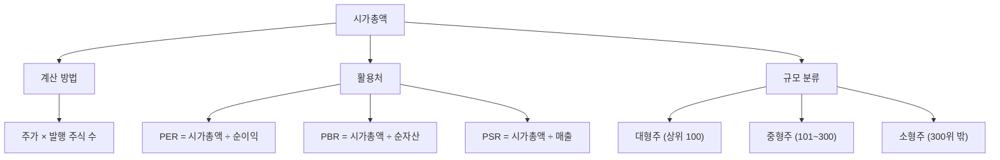

# 시가총액 뜻, 주가보다 먼저 봐야 하는 이유

## 한 줄 정의

시가총액은 주가 × 발행 주식 수로, 시장이 평가하는 회사 전체의 가격입니다.

## 아주 쉽게 말하면

피자 한 조각이 5,000원이고 8조각이라면, 피자 한 판 가격은 40,000원입니다.

주식도 마찬가지입니다. 1주 가격(주가)에 총 조각 수(발행 주식 수)를 곱하면 회사 전체의 시장 가격이 나옵니다. 이것이 시가총액입니다.

## 왜 중요한가

- 회사 규모를 정확히 비교할 수 있습니다. 주가만으로는 불가능합니다.
- 대형주·중형주·소형주를 구분하는 기준이 됩니다.
- 코스피·코스닥 지수에서 시가총액이 큰 종목일수록 지수에 미치는 영향이 큽니다.
- PER, PBR 등 밸류에이션 지표 계산의 출발점입니다.

## 그림으로 이해하기

_시가총액은 회사 규모 분류와 밸류에이션 계산 모두에 쓰이는 핵심 지표입니다._

## 숫자로 보는 예시

> ⚠️ 아래 숫자는 개념 설명을 위한 **가상 예시**이며, 실제 투자 데이터가 아닙니다.

| 회사 | 주가 | 발행 주식 수 | 시가총액 |
|---|---|---|---|
| A | 80만 원 | 600만 주 | 4.8조 원 |
| B | 5만 원 | 1억 주 | 5조 원 |
| C | 3,000원 | 20억 주 | 6조 원 |

주가 순서: A > B > C
회사 규모 순서: C > B > A

주가와 회사 규모는 완전히 다릅니다.

## 표로 비교하기

| 구분 | 시가총액 기준 | 특징 | 초보자 체크포인트 |
|---|---|---|---|
| 대형주 | 상위 100위 이내 | 안정적, 거래량 풍부 | 뉴스에서 자주 보이는 기업 |
| 중형주 | 101~300위 | 성장과 안정 사이 | 업종 내 2~3위 기업 |
| 소형주 | 300위 밖 | 변동성 크고 정보 부족 | 거래량 확인 필수 |

## 초보자가 자주 하는 오해

**오해 1: 주가가 높으면 시가총액도 크다**

주가가 100만 원이어도 발행 주식 수가 1만 주면 시가총액은 100억 원에 불과합니다. 반대로 주가 1,000원이어도 100억 주가 발행됐다면 시가총액은 10조 원입니다. 항상 곱셈으로 계산해야 합니다.

**오해 2: 시가총액이 크면 무조건 좋은 회사다**

시가총액에는 시장의 "기대"가 반영됩니다. 실적이 뒷받침되지 않는데 기대만으로 시가총액이 부풀어 있을 수도 있습니다. 크기가 크다고 투자에 유리한 것은 아닙니다.

## 고수는 이렇게 봅니다

숙련된 투자자는 시가총액을 "이 회사를 통째로 산다면 지불할 금액"으로 봅니다.

- 연간 순이익이 1,000억 원인데 시가총액이 1조라면, 10년 치 이익을 미리 지불하는 셈입니다.
- 동종 업계 다른 회사와 시가총액 대비 이익·매출을 비교하면 상대적 고평가·저평가를 판단할 수 있습니다.
- 시가총액의 변화 추이를 보면 시장의 기대가 어떻게 변하고 있는지 읽을 수 있습니다.

## 기업분석에서는 이렇게 씁니다

기업분석에서 시가총액은 밸류에이션의 출발점입니다.

- PER = 시가총액 ÷ 순이익 → 이익 대비 비싼지
- PBR = 시가총액 ÷ 순자산 → 자산 대비 비싼지
- PSR = 시가총액 ÷ 매출 → 매출 대비 비싼지

모든 비율 지표의 분자는 결국 시가총액(또는 주가)입니다. 시가총액을 모르면 밸류에이션을 시작할 수 없습니다.

## 함께 보면 좋은 용어

- [주가 뜻](../level-01-basic/stock-price.md)
- [주식 뜻](../level-01-basic/stock.md)
- [PER 뜻](../level-05-valuation/per.md)
- [PBR 뜻](../level-05-valuation/pbr.md)
- [코스피 뜻](../level-01-basic/kospi.md)

## 정리

- 시가총액 = 주가 × 발행 주식 수 = 시장이 매기는 회사 전체 가격이다.
- 회사 규모를 비교하려면 주가가 아니라 시가총액을 봐야 한다.
- 밸류에이션 지표(PER, PBR, PSR)의 출발점이 시가총액이다.

## 한 줄 요약

> 시가총액은 시장이 매기는 회사 전체 가격이며, 회사 크기를 비교할 때 주가 대신 봐야 하는 숫자입니다.

---

이 글은 투자 권유가 아니라 주식 용어와 기업분석 방법을 설명하기 위한 교육 콘텐츠입니다. 특정 종목의 매수·매도 판단은 독자 본인의 책임입니다.

Tags: 시가총액, 시가총액뜻, 주식용어, 주식초보, 기업규모
