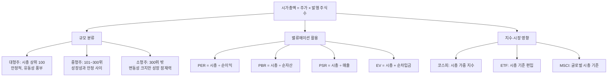

# 시가총액 뜻, 주가보다 먼저 봐야 하는 이유

## 한 줄 정의

시가총액(Market Capitalization)은 주가 × 발행 주식 수로 계산되며, 시장 참여자 전체가 합의한 "이 회사를 통째로 사려면 얼마를 내야 하는가"의 답입니다.

## 아주 쉽게 말하면

서울에 있는 아파트를 생각해보세요. "이 아파트 1평이 5,000만 원이다"라는 정보만으로는 아파트가 비싼지 싼지 모릅니다. 10평짜리(5억)와 50평짜리(25억)는 전혀 다른 물건입니다.

주식도 마찬가지입니다:
- **주가** = 1평 가격 (조각 하나의 값)
- **발행 주식 수** = 총 평수 (조각의 총 개수)
- **시가총액** = 아파트 전체 가격 (회사 전체의 값)

주가(1평 가격)만 보고 "이 회사가 비싸다/싸다"고 판단하는 건, 평당 가격만 보고 "이 아파트가 비싸다"라고 말하는 것과 같습니다. 10평짜리 평당 7,000만 원(= 7억)이 50평짜리 평당 5,000만 원(= 25억)보다 "싸다"고 할 수 있을까요?

## 왜 중요한가

**시가총액은 주식 투자에서 "진짜 가격표" 역할을 합니다.**

주가는 인위적인 숫자입니다. 회사가 주식을 1만 주로 나누면 주가가 높아지고, 1억 주로 나누면 낮아집니다. 회사 가치는 동일한데 주가만 달라지는 겁니다. 반면 시가총액은 어떻게 쪼개든 항상 같습니다.

**대형주/중형주/소형주 구분의 기준입니다**

증권사, 펀드, ETF 모두 시가총액을 기준으로 투자 유니버스를 분류합니다. "대형주에 투자한다"는 말은 "시가총액 상위 기업에 투자한다"는 뜻이지, "주가가 높은 기업"이라는 뜻이 아닙니다.

**지수에서의 영향력을 결정합니다**

코스피 지수는 시가총액 가중 방식입니다. 삼성전자 시가총액이 코스피 전체의 약 20%를 차지하므로, 삼성전자가 3% 오르면 코스피도 0.6%p 정도 움직입니다. 시가총액이 작은 종목은 100% 올라도 지수에 거의 영향을 주지 않습니다.

**M&A(인수합병)의 가격 기준입니다**

한 회사를 통째로 인수하려면 얼마를 내야 할까요? 이론적 최소 가격이 바로 시가총액입니다. (실제로는 경영권 프리미엄이 붙어 시가총액보다 30~50% 높은 가격에 인수가 이루어집니다.)

## 그림으로 이해하기

_시가총액은 기업 분류, 밸류에이션, 지수 구성 모두의 출발점입니다._

## 숫자로 보는 예시

> ⚠️ 아래 숫자는 개념 설명을 위한 **가상 예시**이며, 실제 투자 데이터가 아닙니다.

**"주가의 함정"을 보여주는 비교:**

| 회사 | 주가 | 발행 주식 수 | 시가총액 | 연간 순이익 | PER |
|------|------|-------------|---------|-----------|-----|
| 고가전자(가상) | 150만 원 | 300만 주 | 4.5조 원 | 3,000억 원 | 15배 |
| 중가제약(가상) | 8만 원 | 5,000만 주 | 4조 원 | 2,000억 원 | 20배 |
| 저가통신(가상) | 4,000원 | 30억 주 | 12조 원 | 1.5조 원 | 8배 |

**직감 vs 현실:**
- 직감: "150만 원짜리가 가장 크고 비싼 회사" → ❌
- 현실: 저가통신(주가 4,000원)이 **시가총액 12조**로 가장 큰 회사이며, PER 8배로 가장 "싼" 밸류에이션

**시가총액으로 "인수 관점" 사고하기:**

중가제약을 통째로 인수한다고 가정합시다:
- 인수 가격: 시가총액 4조 원 + 경영권 프리미엄(30%) = 약 5.2조 원
- 연간 순이익: 2,000억 원
- 투자금 회수: 5.2조 ÷ 2,000억 = **26년**

"4조 원을 내고 연 2,000억 벌이의 사업을 사겠는가?" — 이것이 시가총액을 보는 본질적 관점입니다.

**액면분할의 시가총액 불변 원리:**

| 시점 | 주가 | 발행 주식 수 | 시가총액 |
|------|------|-------------|---------|
| 분할 전 | 100만 원 | 500만 주 | 5조 원 |
| 1:5 분할 후 | 20만 원 | 2,500만 주 | 5조 원 |

주가는 1/5이 됐지만 시가총액은 그대로. 이것이 "주가는 인위적, 시가총액은 실질적"인 이유입니다.

## 표로 비교하기

| 구분 | 시가총액 기준 (한국 기준 대략적) | 투자 특성 | 리스크 | 적합한 투자자 |
|------|-------------------------------|----------|--------|-------------|
| 대형주 | 10조 원 이상 | 안정적, 배당 성향 높음, 정보 풍부 | 급격한 성장은 어려움 | 안정 추구형 |
| 중형주 | 1조~10조 원 | 성장성과 안정의 균형 | 대형주보다 변동성 큼 | 균형 추구형 |
| 소형주 | 1조 원 미만 | 높은 성장 잠재력 | 거래량 부족, 정보 비대칭 | 높은 리스크 감수 가능형 |
| 마이크로캡 | 1,000억 원 미만 | 초기 단계 or 부진 기업 | 상장폐지 리스크 존재 | 전문 투자자 |

## 초보자가 자주 하는 오해

**오해 1: "주가가 높으면 시가총액도 크다"**

가장 흔한 착각입니다. 주가 200만 원인 회사(발행 주식 5만 주)의 시가총액은 1,000억 원입니다. 주가 5,000원인 회사(발행 주식 100억 주)의 시가총액은 50조 원입니다. **500배 차이**. 주가만 보면 정반대로 판단합니다.

**오해 2: "시가총액이 크면 좋은 회사다"**

시가총액은 "시장의 기대"를 포함합니다. 아직 이익을 내지 못하는 바이오 기업이 시총 5조 원일 수 있습니다. 이는 "5조 원의 가치가 있다"가 아니라 "시장이 미래에 5조 이상의 가치를 만들 것으로 기대한다"는 의미입니다. 기대가 실현되지 않으면 시총은 급락합니다.

**오해 3: "시가총액 = 회사의 진짜 가치"**

시가총액은 "시장 참여자들의 합의된 의견"이지 "객관적 진실"이 아닙니다. 시장이 과열되면 실제 가치보다 시총이 부풀고(버블), 공포에 빠지면 가치 이하로 떨어집니다(언더밸류). 이 괴리를 찾는 것이 가치투자의 본질입니다.

## 고수는 이렇게 봅니다

숙련된 투자자는 시가총액을 볼 때 항상 이렇게 묻습니다:

> "이 시가총액을 정당화하려면, 이 회사가 앞으로 얼마를 벌어야 하는가?"

**구체적 사고 프로세스:**

1. 현재 시가총액 확인: 예) 3조 원
2. 현재 순이익 확인: 예) 2,000억 원 → PER 15배
3. 역산: "시장은 이 회사가 최소 15년간 연 2,000억 원을 벌 것으로 보고 있다"
4. 검증: "과연 가능한가? 경쟁사 진입, 기술 변화, 규제 리스크는?"
5. 비교: "같은 업종 A사는 PER 10인데, 왜 이 회사만 15인가? 프리미엄을 줄 이유가 있는가?"

또한 **시가총액의 시간 변화**를 추적합니다:
- 1년 전 시총 2조 → 현재 3조: "50% 상승. 이익도 50% 늘었나? 아니면 기대만 부풀었나?"

## 기업분석에서는 이렇게 씁니다

기업분석에서 시가총액은 모든 밸류에이션 작업의 **분자(numerator)** 역할을 합니다.

**직접 활용:**
- PER = 시가총액 ÷ 순이익 → "이익 기준 비싸다/싸다"
- PBR = 시가총액 ÷ 순자산 → "자산 기준 비싸다/싸다"
- PSR = 시가총액 ÷ 매출 → "매출 기준 비싸다" (적자 기업에 사용)

**파생 활용:**
- EV(기업가치) = 시가총액 + 순차입금 → 부채까지 포함한 "진짜 인수 가격"
- EV/EBITDA = EV ÷ 영업이익+감가상각 → 산업 간 비교에 유용

**적정 시가총액 역산:**
- "이 회사의 적정 PER이 12배이고, 내년 순이익 예상치가 5,000억이면"
- 적정 시가총액 = 12 × 5,000억 = 6조 원
- 현재 시가총액 4조 → **50% 상승 여력** (단, 이익 추정이 맞다면)

## 함께 보면 좋은 용어

- [주가](./stock-price.md): 시가총액 계산의 입력값, 1주의 시장 가격
- [주식](./stock.md): 시가총액을 구성하는 소유권 조각
- [코스피](./kospi.md): 시가총액 가중 방식의 대표 지수
- [PER](../level-05-valuation/per.md): 시가총액 ÷ 순이익으로 계산하는 밸류에이션
- [PBR](../level-05-valuation/pbr.md): 시가총액 ÷ 순자산으로 계산하는 밸류에이션

## 정리

- 시가총액 = 주가 × 발행 주식 수 = 시장이 매기는 회사 전체의 가격이다.
- 주가의 절대적 높낮이는 의미 없다. 회사 규모와 비싸고 싼지는 오직 시가총액으로 판단한다.
- 대형주/중형주/소형주 구분, 지수 영향력, 밸류에이션 계산 모두 시가총액이 기준이다.
- 시가총액은 "시장의 합의된 의견"이지 "객관적 진실"이 아니다. 과열과 공포 모두 반영된다.
- "이 시가총액을 정당화하려면 얼마를 벌어야 하는가?"가 분석의 핵심 질문이다.

## 한 줄 요약

> 시가총액은 시장이 매기는 회사 전체 가격이며, 회사 크기를 비교할 때 주가 대신 봐야 하는 숫자입니다.

---

이 글은 투자 권유가 아니라 주식 용어와 기업분석 방법을 설명하기 위한 교육 콘텐츠입니다. 특정 종목의 매수·매도 판단은 독자 본인의 책임입니다.

Tags: 시가총액, 시가총액뜻, 주식용어, 주식초보, 기업규모
