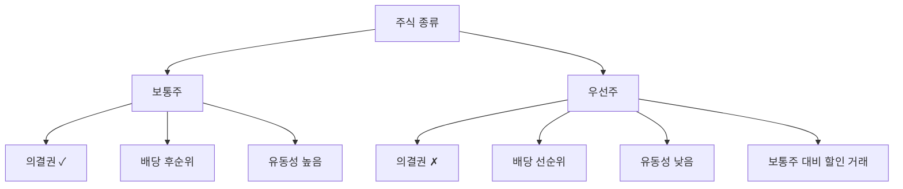

# 우선주 뜻, 배당은 우선이지만 의결권은 없다

## 한 줄 정의

우선주는 배당이나 잔여재산 분배에서 보통주보다 우선권을 갖는 대신, 의결권이 없거나 제한된 주식입니다.

## 아주 쉽게 말하면

식당에서 VIP 멤버십과 비슷합니다. VIP는 음식(배당)을 먼저 받을 수 있지만, 메뉴 결정(의결권) 회의에는 참석하지 못합니다.

배당을 우선으로 받는 대신, 회사 경영에 대한 투표권을 포기한 주식입니다.

## 왜 중요한가

- 배당 수익을 중시하는 투자자에게 매력적입니다.
- 같은 회사의 보통주보다 저렴하게 거래되어 배당수익률이 높은 경우가 많습니다.
- 의결권이 없으므로 경영권 분쟁과 무관합니다.
- 보통주와의 가격 차이(괴리율)가 투자 기회가 되기도 합니다.

## 그림으로 이해하기

_같은 회사의 주식이지만 권리 구조가 다르고, 그 차이가 가격에 반영됩니다._

## 숫자로 보는 예시

> ⚠️ 아래 숫자는 개념 설명을 위한 **가상 예시**이며, 실제 투자 데이터가 아닙니다.

A회사 보통주 주가: 100,000원, 우선주 주가: 80,000원인 경우:

- 괴리율 = (100,000 - 80,000) ÷ 100,000 = **20%**
- 보통주 배당: 주당 2,000원 → 배당수익률 2.0%
- 우선주 배당: 주당 2,050원 → 배당수익률 **2.56%**

우선주는 가격이 낮고 배당이 같거나 약간 높으므로, 배당수익률이 더 높습니다.

## 표로 비교하기

| 구분 | 보통주 | 우선주 |
|---|---|---|
| 의결권 | 있음 | 없음 |
| 배당 순위 | 후순위 | 선순위 |
| 주가 수준 | 기준 가격 | 보통주 대비 10~40% 할인 |
| 거래량 | 많음 | 적음 |
| 적합한 투자 성향 | 경영 참여·시세차익 중심 | 배당 수익 중심 |
| 가격 변동 요인 | 실적 + 시장 + 지배구조 | 실적 + 배당 + 괴리율 변동 |

## 초보자가 자주 하는 오해

**오해 1: 우선주가 보통주보다 무조건 좋다**

"우선"이라는 이름 때문에 더 좋은 주식이라고 착각할 수 있습니다. 하지만 의결권이 없고, 거래량이 적어 원할 때 팔기 어려울 수 있습니다. 장단점이 다를 뿐입니다.

**오해 2: 우선주는 배당을 무조건 받는다**

회사에 이익이 없으면 우선주도 배당을 못 받을 수 있습니다. "우선"은 보통주보다 먼저 받는다는 순서의 의미이지, 무조건 받는다는 보장이 아닙니다. (단, 누적적 우선주는 미지급분이 다음 해에 누적됩니다.)

## 고수는 이렇게 봅니다

숙련된 투자자는 우선주를 다음 상황에서 활용합니다.

- 배당 수익을 안정적으로 확보하고 싶을 때
- 보통주와의 괴리율이 역사적 고점일 때 (우선주 상대적 저평가 가능성)
- 합병·지주회사 전환 이벤트가 예상될 때 (합병 비율 재산정 기회)
- 경영권 분쟁 리스크를 피하고 싶을 때

## 기업분석에서는 이렇게 씁니다

기업분석에서 우선주를 별도로 분석할 때:

- 배당수익률 비교: 우선주의 실질 배당수익률이 시장 금리 대비 매력적인지
- 괴리율 분석: 역사적 괴리율 범위에서 현재 위치 확인
- 유동성 리스크: 하루 거래대금이 내 투자 규모 대비 충분한지
- 소각·전환 가능성: 최대주주의 우선주 소각 또는 보통주 전환 이력

## 함께 보면 좋은 용어

- [보통주 뜻](../level-01-basic/common-stock.md)
- [배당 뜻](../level-06-events/dividend.md)
- [배당수익률 뜻](../level-06-events/dividend-yield.md)
- [주식 뜻](../level-01-basic/stock.md)
- [시가총액 뜻](../level-01-basic/market-cap.md)

## 정리

- 우선주는 배당에서 우선권을 가지지만 의결권이 없는 주식이다.
- 보통주보다 저렴하게 거래되어 배당수익률이 높은 경우가 많다.
- 거래량이 적어 유동성 리스크가 있으므로 투자 규모에 주의해야 한다.

## 한 줄 요약

우선주는 배당에서 먼저 받는 대신 의결권을 포기한 주식이며, 배당 중심 투자자에게 적합합니다.

---

*면책 조항: 이 글은 투자 권유가 아니라 주식 용어와 기업분석 방법을 설명하기 위한 교육 콘텐츠입니다. 특정 종목의 매수·매도 판단은 독자 본인의 책임입니다.*

Tags: 우선주, 우선주뜻, 배당주, 주식종류, 주식초보
