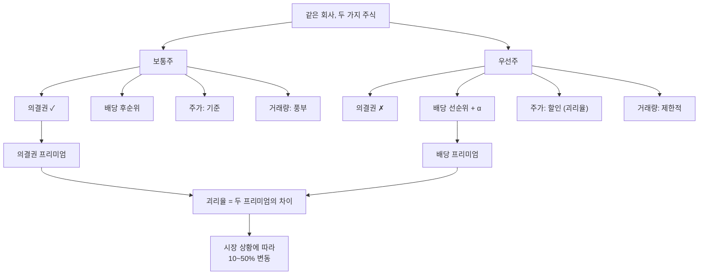

# 우선주 뜻, 배당은 우선이지만 의결권은 없다

## 한 줄 정의

우선주(Preferred Stock)는 배당과 잔여재산 분배에서 보통주보다 우선권을 갖는 대신, 주주총회 의결권이 없거나 제한된 주식입니다. "배당을 더 받는 대신 경영 참여를 포기한" 주식이라고 이해하면 됩니다.

## 아주 쉽게 말하면

친구들과 카페를 공동 운영하기로 했습니다. 두 가지 참여 방식이 있습니다:

- **A옵션(보통주)**: 이익의 동일 비율을 받되, 카페 운영 결정(메뉴, 인테리어, 직원 채용)에 투표할 수 있음
- **B옵션(우선주)**: 이익을 A보다 약간 더 받지만, 운영 결정에 참여할 수 없음

"나는 카페 경영에 관심 없고, 돈만 잘 나오면 돼"라는 사람은 B옵션을 택합니다. 이것이 우선주 투자자의 마인드셋입니다.

한국 주식 시장에서는 종목명 뒤에 '우'가 붙어 있으면 우선주입니다:
- "삼성전자" = 보통주 (코드: 005930)
- "삼성전자우" = 우선주 (코드: 005935)

## 왜 중요한가

**같은 회사에 투자하면서 전혀 다른 수익 구조를 선택할 수 있습니다**

보통주 투자는 "경영 참여 + 시세차익 + 배당"을 한 묶음으로 사는 것입니다. 우선주 투자는 의결권을 빼는 대신 배당수익률을 높이는 선택입니다. 같은 회사, 같은 실적인데 투자 전략이 완전히 달라집니다.

**괴리율이라는 독특한 투자 기회가 존재합니다**

보통주와 우선주의 가격 차이(괴리율)는 시장 상황에 따라 10%에서 50%까지 벌어졌다 좁아졌다 합니다. 이 변동 자체가 수익 기회입니다.

**한국 시장 특유의 현상입니다**

미국에서는 우선주가 채권에 가까운 성격(고정 배당)이지만, 한국에서는 "보통주의 할인 버전"에 가깝습니다. 변동 배당이고, 시세 차익도 추구합니다. 한국 투자자라면 이 차이를 반드시 알아야 합니다.

## 그림으로 이해하기

_보통주는 "의결권 프리미엄"으로 비싸고, 우선주는 "배당 프리미엄"으로 수익률이 높습니다. 이 차이가 괴리율입니다._

## 숫자로 보는 예시

> ⚠️ 아래 숫자는 개념 설명을 위한 **가상 예시**이며, 실제 투자 데이터가 아닙니다.

**시나리오: "대한화학"(가상) — 5년간 괴리율 변동 추적**

| 연도 | 보통주 주가 | 우선주 주가 | 괴리율 | 배당금(보/우) | 배당수익률(보/우) |
|------|-----------|-----------|--------|------------|---------------|
| 1년차 | 50,000원 | 40,000원 | 20% | 1,500 / 1,600원 | 3.0% / 4.0% |
| 2년차 | 65,000원 | 48,000원 | 26% | 1,800 / 1,900원 | 2.8% / 4.0% |
| 3년차 | 55,000원 | 47,000원 | 15% | 2,000 / 2,100원 | 3.6% / 4.5% |
| 4년차 | 70,000원 | 52,000원 | 26% | 2,200 / 2,300원 | 3.1% / 4.4% |
| 5년차 | 60,000원 | 51,000원 | 15% | 2,400 / 2,500원 | 4.0% / 4.9% |

**읽는 법:**
- 괴리율 범위: 15~26%. 평균 약 20%
- 3년차에 괴리율 15%로 축소 → 우선주가 상대적으로 많이 오름 (보통주 -15%, 우선주 -2%)
- 배당수익률은 항상 우선주가 1%p 이상 높음

**5년 총수익 비교 (1년차 초 100주 매수 가정):**

| | 보통주 | 우선주 |
|--|--------|--------|
| 매수 비용 | 500만 원 | 400만 원 |
| 5년 누적 배당 | 99만 원 | 104만 원 |
| 평가 금액 (5년차) | 600만 원 | 510만 원 |
| 총수익 | 199만 원 (39.8%) | 214만 원 (53.5%) |

이 시나리오에서는 **우선주가 총수익 기준 우위**. 하지만 이는 괴리율이 축소된 경우이며, 반대로 벌어지면 결과가 뒤집힐 수 있습니다.

## 표로 비교하기

| 구분 | 한국 우선주 | 미국 우선주 | 차이점 |
|------|-----------|-----------|--------|
| 배당 방식 | 변동 배당 (보통주 + α) | 고정 배당 (연 4~6%) | 한국은 주식, 미국은 채권에 가까움 |
| 시세 차익 | 가능 (보통주와 유사하게 움직임) | 제한적 (채권처럼 안정) | 한국 우선주는 "할인된 보통주" |
| 발행 비율 | 보통주의 10~25% | 다양 | 한국은 소량 발행이 대부분 |
| 투자 성격 | 성장 + 배당 (하이브리드) | 인컴(Income) 투자 | 전략이 완전히 다름 |
| 환매(콜) 조건 | 없음 (일반적) | 있음 (발행사 콜 가능) | 미국은 금리 하락 시 환매 리스크 |

## 초보자가 자주 하는 오해

**오해 1: "우선주는 무조건 배당을 받을 수 있다"**

회사가 적자여서 배당을 아예 안 하면, 우선주도 0원입니다. "우선"은 "보통주보다 먼저"라는 순서의 의미이지, "무조건"이라는 보장이 아닙니다.

단, **누적적 우선주**의 경우 올해 못 받은 배당이 내년으로 이월됩니다. 보통주에 배당하기 전에 밀린 우선주 배당을 모두 지급해야 합니다.

**오해 2: "우선주가 보통주보다 안전하다"**

주가 하락 리스크는 동일합니다. 보통주가 50% 빠지면 우선주도 비슷하게(또는 더) 빠집니다. 오히려 거래량이 적어서 급락 시 매도 자체가 어려울 수 있습니다. "우선"이라는 이름이 주는 안전감은 착각입니다.

**오해 3: "우선주는 보통주 주가를 따라간다"**

대체로 같은 방향으로 움직이지만, **괴리율은 고정이 아닙니다**. 경영권 분쟁이 터지면 보통주만 급등(의결권 가치 폭등)하고 우선주는 제자리일 수 있습니다. 반대로 배당 확대 발표 시에는 우선주가 더 강하게 반응합니다.

## 고수는 이렇게 봅니다

**괴리율 투자 전략:**

1. **평균 회귀**: 괴리율이 역사적 평균보다 크게 벌어지면 우선주 매수, 좁아지면 이익 실현
2. **이벤트 드리븐**: 합병·지주회사 전환·자사주 매입 등 이벤트 시 합병 비율에 따라 수혜 판단
3. **배당 재투자**: 높은 배당수익률을 재투자하면 복리 효과로 장기 수익이 보통주를 앞설 수 있음

**우선주 선택 체크리스트:**

- 배당 지급 이력: 최소 5년 연속 배당 여부 확인
- 괴리율 위치: 현재 괴리율이 5년 평균 대비 어디인지
- 일 거래대금: 내 투자 금액의 10배 이상인지 (유동성)
- 배당성향 추이: 회사가 배당을 늘리는 방향인지

## 기업분석에서는 이렇게 씁니다

**밸류에이션 시 우선주 처리:**

- 총 시가총액 = 보통주 시총 + 우선주 시총 (둘 다 합산)
- EPS 계산 시: 순이익에서 우선주 배당을 먼저 차감 → 나머지를 보통주 수로 나눔
- 적정 괴리율 추정: 의결권 가치(경영권 안정도, M&A 가능성)에 따라 10~30% 범위 설정

**지배구조 분석에서의 의미:**

우선주는 의결권이 없으므로:
- 자사주 매입 시 우선주를 사면 → 의결권 구조에 영향 없음 (순수 주주환원)
- 보통주를 사면 → 실질 의결권 집중 효과 (지배구조 변화)
- 최대주주가 우선주를 소각하면 → 배당 부담 감소, 보통주 1주당 이익 증가

## 함께 보면 좋은 용어

- [보통주](./common-stock.md): 우선주의 반대편, 의결권이 있는 표준 주식
- [배당](../level-06-events/dividend.md): 우선주 투자의 핵심 수익원
- [배당수익률](../level-06-events/dividend-yield.md): 우선주 매력도 판단의 핵심 지표
- [주식](./stock.md): 보통주와 우선주를 포함하는 상위 개념
- [시가총액](./market-cap.md): 보통주 + 우선주 시총의 합

## 정리

- 우선주는 배당 우선권 대신 의결권을 포기한 주식이다. "배당 더 받기 vs 경영 참여"의 트레이드오프.
- 한국 우선주는 미국과 달리 "할인된 보통주" 성격이며, 시세 차익도 추구 가능하다.
- 보통주-우선주 괴리율(10~50%)은 시장 상황에 따라 변하며, 이 자체가 투자 기회다.
- 거래량이 적어 유동성 리스크가 있으므로, 투자 규모 대비 거래대금을 반드시 확인해야 한다.
- "우선"은 순서의 의미이지 "무조건" 또는 "안전"의 의미가 아니다.

## 한 줄 요약

> 우선주는 배당에서 먼저 받는 대신 의결권을 포기한 주식이며, 배당 중심 투자자에게 적합합니다.

---

이 글은 투자 권유가 아니라 주식 용어와 기업분석 방법을 설명하기 위한 교육 콘텐츠입니다. 특정 종목의 매수·매도 판단은 독자 본인의 책임입니다.

Tags: 우선주, 우선주뜻, 배당주, 주식종류, 주식초보
