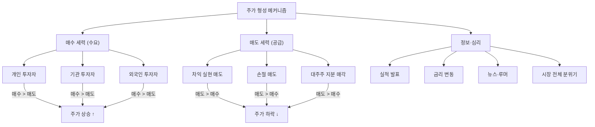

# 주가 뜻, 가격표만 보면 안 되는 이유

## 한 줄 정의

주가(株價, Stock Price)는 주식 1주가 증권 시장에서 거래되는 현재 가격으로, 매수자와 매도자의 합의에 의해 실시간으로 결정됩니다.

## 아주 쉽게 말하면

중고거래 앱을 떠올려 보세요. 어떤 물건의 "적정 가격"이란 게 정해져 있지 않습니다. 파는 사람은 비싸게 팔고 싶고, 사는 사람은 싸게 사고 싶습니다. 둘이 합의하는 순간 — 그 금액이 "거래 가격"입니다.

주식도 똑같습니다. 삼성전자를 7만 원에 팔고 싶은 사람과 7만 원에 사고 싶은 사람이 만나면, 그 순간 주가는 7만 원입니다. 1초 뒤에 6만 9,900원에 거래가 일어나면 주가는 6만 9,900원으로 바뀝니다.

핵심: **주가 = 마지막으로 거래가 성사된 가격**. 그 이상도 이하도 아닙니다.

## 왜 중요한가

주가는 투자자가 가장 먼저 접하는 정보이면서, 동시에 가장 오해하기 쉬운 정보입니다.

**"비싸다/싸다"의 착각을 만듭니다**

사람의 뇌는 숫자의 크기에 반응합니다. 주가 50만 원이면 "비싸다", 주가 2,000원이면 "싸다"고 직감적으로 느낍니다. 하지만 이 직감은 거의 항상 틀립니다. 주가의 절대적 크기는 **발행 주식 수라는 인위적 변수**에 의해 결정되기 때문입니다. 한 회사가 액면분할을 하면 주가는 1/10이 되지만, 회사 가치는 1원도 바뀌지 않습니다.

**다른 모든 지표의 입력값입니다**

| 지표 | 공식 | 주가의 역할 |
|------|------|------------|
| 시가총액 | 주가 × 발행 주식 수 | 회사 전체 가치 추정 |
| PER | 주가 ÷ EPS | 이익 대비 비싸고 싼지 판단 |
| PBR | 주가 ÷ BPS | 자산 대비 비싸고 싼지 판단 |
| 배당수익률 | 배당금 ÷ 주가 | 현금 수익률 판단 |

주가 단독으로는 "현재 시장 분위기"만 보여줍니다. 진짜 정보는 주가를 다른 수치와 **비율로 변환**했을 때 나타납니다.

**실시간 수요-공급의 거울입니다**

주가가 오르는 이유는 단 하나: 현재 가격에 사고 싶은 사람이 팔고 싶은 사람보다 많기 때문입니다. 그 "사고 싶은 이유"가 실적이든, 루머이든, 광기이든 상관없습니다. 주가는 모든 참여자의 기대와 공포를 하나의 숫자로 압축한 결과물입니다.

## 그림으로 이해하기

_주가는 세 가지 힘(수요, 공급, 정보)이 실시간으로 부딪히는 교차점에서 결정됩니다._

## 숫자로 보는 예시

> ⚠️ 아래 숫자는 개념 설명을 위한 **가상 예시**이며, 실제 투자 데이터가 아닙니다.

**"주가 착시"를 보여주는 세 회사 비교:**

| 회사 | 주가 | 발행 주식 수 | 시가총액 | EPS | PER |
|------|------|-------------|---------|-----|-----|
| 높은주가전자(가상) | 80만 원 | 200만 주 | 1.6조 원 | 40,000원 | 20배 |
| 낮은주가반도체(가상) | 3,000원 | 50억 주 | 15조 원 | 300원 | 10배 |
| 중간식품(가상) | 5만 원 | 2,000만 주 | 1조 원 | 5,000원 | 10배 |

직감적으로는 "80만 원짜리가 제일 비싸다"고 느끼지만:
- **회사 규모**: 낮은주가반도체(15조)가 가장 큼
- **이익 대비 가격**: 높은주가전자(PER 20)가 가장 "비쌈"
- **투자 판단**: 주가 3,000원인 낮은주가반도체가 PER 10으로 가장 "싼" 밸류에이션

**액면분할 사례:**

한 회사가 주가 100만 원 → 10만 원으로 1:10 액면분할을 했다면:
- 분할 전: 100만 원 × 100만 주 = 시가총액 **1조 원**
- 분할 후: 10만 원 × 1,000만 주 = 시가총액 **1조 원** (동일)
- 투자자 보유: 10주(1,000만 원) → 100주(1,000만 원) — 아무것도 바뀌지 않음

주가가 1/10이 됐다고 "싸졌다"는 건 완전한 착각입니다.

## 표로 비교하기

| 주가 관련 용어 | 의미 | 왜 알아야 하는가 |
|---------------|------|-----------------|
| 시가 | 당일 첫 거래 가격 | 전날 대비 시장 분위기를 보여줌 |
| 종가 | 당일 마지막 거래 가격 | 일봉 차트의 기준, 대부분의 지표 계산에 사용 |
| 고가/저가 | 당일 최고/최저 가격 | 일중 변동 폭(변동성) 파악 |
| 호가 | 매수·매도 희망 가격 | 아직 체결되지 않은 "예약 주문" |
| 52주 신고가 | 최근 1년 최고 가격 | 강한 상승 추세 신호 (하지만 맹신 금물) |
| 52주 신저가 | 최근 1년 최저 가격 | 바닥 또는 추가 하락의 갈림길 |
| 기준가 | 전일 종가 (정상 거래일) | 당일 등락률 계산의 기준 |

## 초보자가 자주 하는 오해

**오해 1: "주가가 낮으면 싼 주식이다"**

주가 2,000원짜리라도 시가총액이 10조 원일 수 있습니다. "주가 낮음 = 저평가"라는 공식은 존재하지 않습니다. 비싸고 싼지는 **이익 또는 자산 대비 비율**(PER, PBR)로 판단합니다.

실제로 "동전주"(주가 1,000원 이하)는 저평가가 아니라 **기업 가치가 그만큼 없기 때문**인 경우가 대부분입니다.

**오해 2: "많이 떨어졌으면 바닥이다"**

10만 원 → 5만 원(-50%)이 됐다고 "더 이상 떨어질 데가 없다"는 생각은 위험합니다. 5만 원 → 2.5만 원(-50%)이 가능하고, 상장폐지까지 갈 수도 있습니다. 과거 가격은 미래의 하한선을 보장하지 않습니다.

"반토막 난 주식은 다시 반토막 날 수 있다"는 말을 기억하세요.

**오해 3: "주가가 올랐으니 팔아야 한다"**

주가가 5만 원 → 10만 원이 됐을 때 "충분히 올랐다"고 매도하는 것은 주가의 절대 수준에 반응하는 것입니다. 중요한 건 "10만 원인 지금 시점에도 이 회사의 가치가 주가 이상인가?"입니다. 가치가 여전히 크다면, 수익 실현을 서두를 이유가 없습니다.

## 고수는 이렇게 봅니다

숙련된 투자자에게 주가 차트는 **체온계**와 같습니다. 체온이 38도라는 사실 자체가 중요한 게 아니라, "왜 열이 나는지"를 진단하는 출발점입니다.

**주가를 해석하는 프레임:**

- **절대 수준은 무시한다**: 주가 100원이든 100만 원이든, 항상 시가총액과 밸류에이션으로 변환해서 판단
- **상대 비교를 한다**: "A회사 PER 8, 동종 업계 평균 PER 15 → A가 상대적으로 싸다"
- **변화 속도를 본다**: 주가 자체보다 "얼마나 빠르게 움직이는가"(변동성)가 리스크 관리에 더 중요
- **거래량과 함께 본다**: 주가 상승 + 거래량 급증 = 강한 확신. 주가 상승 + 거래량 감소 = 약한 추세

## 기업분석에서는 이렇게 씁니다

기업분석에서 주가는 **"시장이 현재 매기고 있는 가격표"**입니다. 분석가의 일은 이 가격표가 적정한지 검증하는 것입니다.

**구체적 활용 과정:**

1. 현재 주가로부터 시가총액 계산 (주가 × 발행 주식 수)
2. 시가총액과 예상 이익을 비교해 PER 도출
3. 동종 업계 PER, 과거 PER 밴드와 비교
4. 괴리가 있다면 → 시장이 놓친 정보가 있는지, 내가 놓친 리스크가 있는지 양방향 검증
5. 결론: "현재 주가 대비 상승/하락 여지가 있다" (목표 가격 제시)

핵심은 주가를 **출발점**으로 쓰되, **판단 기준**으로는 쓰지 않는 것입니다.

## 함께 보면 좋은 용어

- [주식](./stock.md): 주가가 붙는 대상, 회사의 소유권 조각
- [시가총액](./market-cap.md): 주가 × 발행 주식 수 = 회사의 시장 가치
- [거래량](./trading-volume.md): 주가 변동의 "확신 강도"를 보여주는 지표
- [PER](../level-05-valuation/per.md): 이익 대비 주가 수준 판단
- [호가창](../level-02-market-trading/order-book.md): 주가가 실시간으로 형성되는 현장

## 정리

- 주가는 "마지막으로 거래가 성사된 가격"이며, 매수·매도의 힘겨루기로 실시간 결정된다.
- 주가의 절대 수준(높다/낮다)으로는 회사가 비싼지 싼지 알 수 없다. 반드시 시가총액·PER·PBR 등과 함께 봐야 한다.
- 액면분할을 하면 주가는 변하지만 회사 가치는 동일하다. 이것이 "주가 ≠ 가치"의 결정적 증거다.
- 주가 하락은 "바닥"을 의미하지 않고, 주가 상승은 "고점"을 의미하지 않는다.
- 기업분석에서 주가는 판단의 출발점이지, 판단의 근거가 아니다.

## 한 줄 요약

> 주가는 주식 1주의 시장 가격이며, 그 숫자만으로는 회사가 비싼지 싼지 알 수 없습니다.

---

이 글은 투자 권유가 아니라 주식 용어와 기업분석 방법을 설명하기 위한 교육 콘텐츠입니다. 특정 종목의 매수·매도 판단은 독자 본인의 책임입니다.

Tags: 주가, 주가뜻, 주식가격, 주식초보, 주식용어
