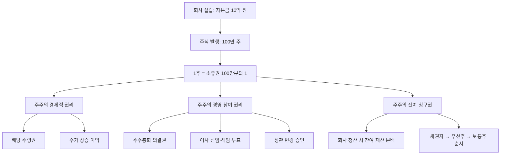

# 주식 뜻, 회사의 일부를 산다는 의미

## 한 줄 정의

주식(Stock/Share)은 회사의 소유권을 균등하게 나눈 단위로, 1주를 보유하면 그 회사의 법적 공동 소유자(주주)가 됩니다.

## 아주 쉽게 말하면

친구 4명이 돈을 모아 카페를 열었다고 상상해보세요. 각자 2,500만 원씩 총 1억 원을 투자했습니다. 이때 각 친구는 카페의 25%를 소유하고 있습니다.

이제 규모를 키워봅시다. 카페가 프랜차이즈로 성장해서, 소유권을 100만 조각으로 쪼갰습니다. 이 "조각" 하나가 바로 **주식 1주**입니다. 여러분이 HTS에서 "삼성전자 1주 매수"를 누르면, 삼성전자라는 거대한 회사의 수십억 분의 일을 소유하는 것과 동일한 원리입니다.

핵심은 이겁니다: **주식을 산다 = 그 회사의 공동 사장이 된다** (아주 작은 비율이지만 법적으로 동일한 지위).

## 왜 중요한가

"주식 = 소유권 조각"이라는 한 가지 사실에서 주식 시장의 거의 모든 개념이 파생됩니다.

**투자 수익의 원천이 명확해집니다**

주가가 오르는 이유는 단순합니다. 회사가 더 많은 돈을 벌면, 내가 가진 "조각"의 가치도 올라갑니다. 반대로 회사가 망하면 내 조각은 휴지가 됩니다. 주식 투자의 본질은 "앞으로 가치가 올라갈 회사의 조각을 미리 사두는 것"입니다.

**배당과 의결권이 자연스럽게 연결됩니다**

소유자이기 때문에 회사가 이익을 나눠줄 때(배당) 내 비율만큼 받고, 중요한 결정(이사 선임, 합병 등)에 투표할 수 있습니다. 삼성전자 1주만 있어도 주주총회에 참석할 수 있는 이유가 여기 있습니다.

**모든 밸류에이션 지표의 출발점입니다**

PER, PBR, ROE 같은 지표들은 결국 "이 조각을 지금 가격에 사는 게 합리적인가?"를 다양한 각도에서 검증하는 도구입니다. 주식이 소유권이라는 전제를 모르면 이런 지표들이 왜 필요한지 이해하기 어렵습니다.

## 그림으로 이해하기

_주식 1주는 단순한 숫자가 아니라, 경제적·경영적·법적 권리가 묶인 복합 자산입니다._

## 숫자로 보는 예시

> ⚠️ 아래 숫자는 개념 설명을 위한 **가상 예시**이며, 실제 투자 데이터가 아닙니다.

**시나리오: 커피 프랜차이즈 "모닝빈"(가상)**

모닝빈은 전국 200개 매장을 운영하는 상장 기업입니다.

| 항목 | 수치 |
|------|------|
| 발행 주식 수 | 500만 주 |
| 현재 주가 | 20,000원 |
| 시가총액 | 1,000억 원 (= 20,000 × 500만) |
| 연간 순이익 | 100억 원 |
| 주당순이익(EPS) | 2,000원 (= 100억 ÷ 500만) |
| 배당금 | 주당 500원 (배당성향 25%) |

**투자자 A가 100주를 샀다면:**

- 투자 금액: 20,000원 × 100주 = **200만 원**
- 소유 비율: 100 ÷ 5,000,000 = **0.002%**
- 연간 배당: 500원 × 100주 = **5만 원**
- 배당수익률: 5만 ÷ 200만 = **2.5%**

**1년 후 모닝빈 매출이 30% 성장하여 주가가 26,000원이 됐다면:**

- 평가 금액: 26,000 × 100 = 260만 원
- 시세 차익: 60만 원 (수익률 30%)
- 배당 포함 총수익: 65만 원 (수익률 32.5%)

이처럼 주식 투자 수익은 **시세 차익 + 배당**이라는 두 축으로 구성됩니다.

## 표로 비교하기

| 구분 | 의미 | 초보자 체크포인트 | 실수하기 쉬운 점 |
|------|------|------------------|-----------------|
| 주식 1주 | 회사 소유권 1조각 | 1주만 사도 주주가 됨 | 소수점 이하 매수는 국내 불가 |
| 발행 주식 수 | 회사를 나눈 총 조각 수 | 조각이 많을수록 1주 비중은 작아짐 | 유상증자 시 기존 주주 지분 희석됨 |
| 주가 | 시장에서 거래되는 1주 가격 | 회사의 진짜 가치와 항상 같지 않음 | 주가 높다고 큰 회사가 아님 |
| 시가총액 | 주가 × 발행 주식 수 | 회사 규모 비교의 기준 | 시총이 같아도 재무 구조는 다를 수 있음 |
| 배당 | 이익 중 주주 몫으로 돌려주는 금액 | 모든 회사가 배당하는 건 아님 | 배당락일 이후 매수하면 해당 분기 배당 못 받음 |
| 액면가 | 주식에 적힌 최초 가격 | 대부분 500원 또는 5,000원 | 액면가와 시장 주가는 별개 |

## 초보자가 자주 하는 오해

**오해 1: "주식을 사면 회사에 직접 돈이 들어간다"**

증권사 앱에서 주식을 매수하면, 그 돈은 **이전 주주**(파는 사람)에게 갑니다. 회사 통장에는 1원도 들어가지 않습니다. 회사에 직접 자금이 유입되는 건 IPO(최초 상장)나 유상증자 때뿐입니다. 우리가 하는 대부분의 거래는 "이미 발행된 조각을 다른 사람에게서 사는 것"입니다.

**오해 2: "주가가 비싸면 큰 회사다"**

삼성전자 1주는 약 6만 원, 롯데칠성 1주는 약 170만 원(가상 수치)입니다. 그렇다고 롯데칠성이 삼성전자보다 큰 회사일까요? 아닙니다. 삼성전자는 발행 주식 수가 60억 주로 시가총액이 360조 원이고, 롯데칠성은 발행 주식이 적어 시총이 훨씬 작습니다. **회사 크기는 주가가 아니라 시가총액**으로 비교합니다.

**오해 3: "주식은 도박이다"**

도박은 제로섬 게임(누군가의 손실이 다른 누군가의 이익)입니다. 하지만 주식 시장은 기업이 가치를 창출하면 전체 파이가 커지는 **포지티브섬**입니다. 물론 개별 종목 투기는 도박에 가까울 수 있지만, "좋은 회사의 소유권을 적정 가격에 사는 행위"는 사업 투자와 본질적으로 같습니다.

## 고수는 이렇게 봅니다

숙련된 투자자는 "삼성전자 1주를 7만 원에 매수"라는 행위를 이렇게 변환합니다:

> "삼성전자 전체를 420조 원에 인수하겠는가?"

이게 바로 워런 버핏이 말하는 "주식을 사는 것이 아니라 사업을 산다"는 관점입니다.

**이 관점에서 체크하는 질문들:**

- 이 회사는 어떤 사업으로 돈을 버는가? (반도체? 스마트폰? 가전?)
- 이 사업의 경쟁 우위는 5년 후에도 유지될 수 있는가?
- 현재 시가총액(= 인수 가격)으로 이 회사 전체를 산다면, 연간 수익률은 몇 %인가?
- 더 싸게 살 수 있는 시점이 올 가능성은?

이 사고방식을 가지면 일일 주가 등락에 흔들리지 않습니다. 1주를 사든 1,000주를 사든, "이 회사를 통째로 소유할 가치가 있는가"라는 질문의 답이 같다면 주가 하락은 오히려 추가 매수 기회가 됩니다.

## 기업분석에서는 이렇게 씁니다

기업분석의 모든 과정은 궁극적으로 하나의 질문으로 수렴합니다:

> "이 회사의 소유권 1조각(= 1주)이 현재 시장 가격만큼의 가치가 있는가?"

이 질문에 답하기 위한 단계적 프레임워크:

1. **사업 이해** — 이 회사는 무엇을 팔아서 돈을 버는가?
2. **이익 추정** — 향후 3~5년간 얼마를 벌 것인가?
3. **밸류에이션** — 이 이익 수준에서 적정 가격(주가)은 얼마인가?
4. **안전마진** — 내 추정이 틀릴 경우를 대비해 얼마나 할인된 가격에 살 것인가?

PER, PBR, DCF 등 다양한 도구가 있지만, 모두 "1조각의 적정 가격"을 다른 관점에서 계산하는 방법일 뿐입니다. 주식이 소유권이라는 첫 번째 원리를 기억하면, 복잡해 보이는 밸류에이션 공식들이 직관적으로 연결됩니다.

## 함께 보면 좋은 용어

- [주가](./stock-price.md): 1주가 시장에서 거래되는 현재 가격
- [시가총액](./market-cap.md): 주가 × 발행 주식 수 = 회사 전체의 시장 가치
- [보통주](./common-stock.md): 의결권이 있는 일반 주식 (가장 흔한 형태)
- [우선주](./preferred-stock.md): 배당 우선권 대신 의결권을 포기한 주식
- [배당](../level-06-events/dividend.md): 이익을 주주에게 현금으로 분배하는 것

## 정리

- 주식은 회사의 소유권을 나눈 조각이며, 1주를 사면 법적으로 그 회사의 공동 소유자가 된다.
- 주주의 권리는 크게 세 가지: 배당 수령, 의결권 행사, 잔여재산 분배 청구.
- 주식 투자 수익 = 시세 차익(주가 상승) + 배당 소득.
- 회사 규모는 주가가 아니라 시가총액(주가 × 발행 주식 수)으로 비교한다.
- 주식을 "사업의 일부를 소유하는 행위"로 바라보면, 단기 등락에 흔들리지 않는 투자 기준이 생긴다.

## 한 줄 요약

> 주식은 회사의 소유권 조각이며, 주식을 산다는 것은 그 회사의 사업 일부를 소유하겠다는 의사결정입니다.

---

이 글은 투자 권유가 아니라 주식 용어와 기업분석 방법을 설명하기 위한 교육 콘텐츠입니다. 특정 종목의 매수·매도 판단은 독자 본인의 책임입니다.

Tags: 주식, 주식뜻, 주식용어, 주식초보, 기업분석
