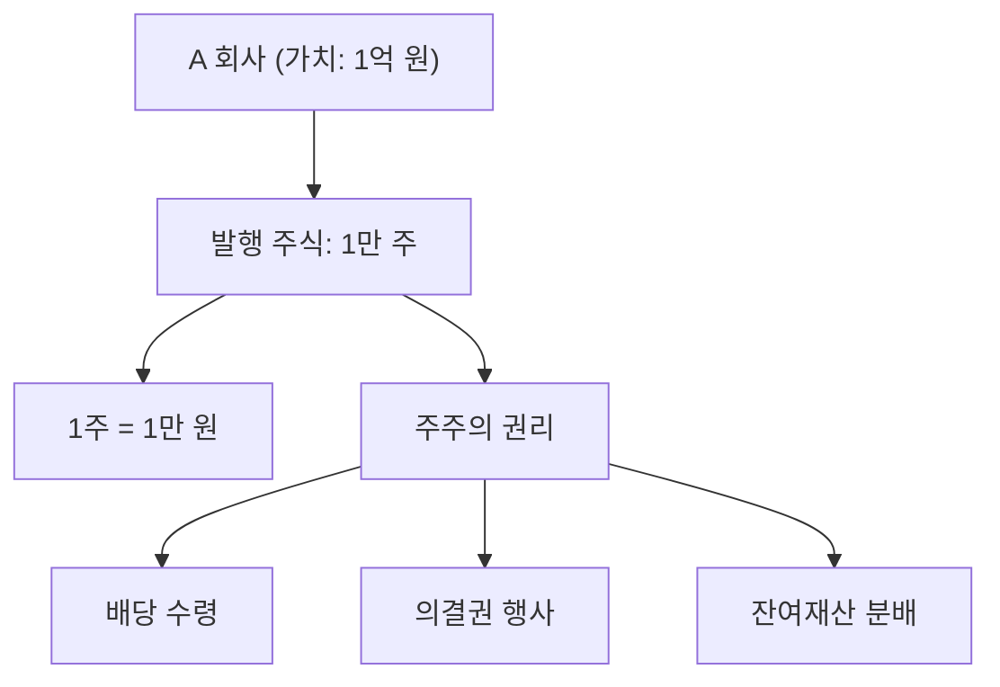

# 주식 뜻, 회사의 일부를 산다는 의미

## 한 줄 정의

주식은 회사의 소유권을 잘게 나눈 조각입니다.

## 아주 쉽게 말하면

피자 한 판을 8조각으로 나눴다고 생각해보세요. 1조각을 산 사람은 피자 전체의 8분의 1을 가진 겁니다.

회사도 마찬가지입니다. 회사를 수천만 조각으로 나눈 것이 주식이고, 그 중 1주를 사면 그 회사의 아주 작은 일부를 소유하는 겁니다.

## 왜 중요한가

주식이 "회사의 조각"이라는 사실을 알면 다음이 자연스럽게 연결됩니다.

- **주가 상승**: 회사가 돈을 잘 벌면 내 조각의 가치가 올라갑니다.
- **배당**: 회사가 이익을 나눠줄 때, 내 조각 비율만큼 받습니다.
- **의결권**: 주식을 가진 만큼 회사 운영에 의견을 낼 수 있습니다.

결국 주식 투자는 "어떤 회사의 조각을 살 것인가"를 결정하는 일입니다.

## 그림으로 이해하기

_1주를 사면 회사의 소유권 일부와 함께 배당·의결권·잔여재산 권리를 갖습니다._

## 숫자로 보는 예시

> ⚠️ 아래 숫자는 개념 설명을 위한 **가상 예시**이며, 실제 투자 데이터가 아닙니다.

A회사(가상)의 전체 가치가 1억 원이고, 주식을 1만 주 발행했다면:

- 1주의 가치 = 1억 원 ÷ 1만 주 = **1만 원**
- 10주를 사면 = 회사의 0.1%를 소유
- 회사 가치가 2억 원이 되면 = 1주 가치도 **2만 원**으로 상승

## 표로 비교하기

| 구분 | 의미 | 초보자 체크포인트 |
|---|---|---|
| 주식 1주 | 회사 소유권 1조각 | 1주만 사도 주주가 됨 |
| 발행 주식 수 | 회사를 나눈 총 조각 수 | 조각이 많을수록 1주 비중은 작아짐 |
| 주가 | 시장에서 거래되는 1주 가격 | 회사의 진짜 가치와 항상 같지는 않음 |
| 시가총액 | 주가 × 발행 주식 수 | 회사 규모를 비교할 때 사용 |
| 배당 | 이익 중 주주에게 돌려주는 금액 | 모든 회사가 배당을 하는 건 아님 |

## 초보자가 자주 하는 오해

**오해 1: 주식을 사면 회사에 직접 돈이 들어간다**

대부분의 거래는 이미 발행된 주식을 다른 투자자에게서 사는 것입니다. 회사에 직접 자금이 유입되는 건 IPO(상장)나 유상증자 때뿐입니다.

**오해 2: 주가가 비싸면 큰 회사다**

주가는 1주의 가격일 뿐입니다. 1주가 100만 원이어도 발행 주식 수가 적으면 작은 회사일 수 있습니다. 회사 규모는 시가총액(주가 × 발행 주식 수)으로 판단합니다.

## 고수는 이렇게 봅니다

숙련된 투자자는 "주식을 산다"를 "이 회사의 사업을 일부 소유한다"로 바꿔 생각합니다.

- 이 회사는 어떤 사업으로 돈을 버는가?
- 이 사업의 경쟁력은 지속될 수 있는가?
- 내가 이 회사 전체를 산다면 얼마를 지불하겠는가?

이 관점을 가지면 단기 주가 등락에 덜 흔들립니다.

## 기업분석에서는 이렇게 씁니다

기업분석의 출발점은 "이 회사는 무엇으로 돈을 버는가"입니다.

주식이 회사의 소유권이라는 점을 기억하면, 모든 밸류에이션 지표(PER, PBR, ROE 등)는 결국 "이 조각을 지금 가격에 사는 게 합리적인가"를 판단하는 도구임을 알 수 있습니다.

기업분석 = "소유할 가치가 있는 회사인가"를 숫자로 검증하는 과정입니다.

## 함께 보면 좋은 용어

- [주가](./stock-price.md): 1주가 시장에서 거래되는 가격
- [시가총액](./market-cap.md): 회사 전체의 시장 가치
- [보통주](./common-stock.md): 의결권이 있는 일반 주식
- [우선주](./preferred-stock.md): 배당 우선권이 있는 주식
- [배당](../level-06-events/dividend.md): 이익을 주주에게 분배하는 것

## 정리

- 주식은 회사의 소유권을 나눈 조각이다.
- 1주를 사면 배당, 의결권, 잔여재산 분배 권리를 갖는다.
- 회사 규모는 주가가 아니라 시가총액으로 비교한다.

## 한 줄 요약

> 주식은 회사의 소유권 조각이며, 주식을 산다는 것은 그 회사의 사업 일부를 소유한다는 뜻입니다.

---

이 글은 투자 권유가 아니라 주식 용어와 기업분석 방법을 설명하기 위한 교육 콘텐츠입니다. 특정 종목의 매수·매도 판단은 독자 본인의 책임입니다.

Tags: 주식, 주식뜻, 주식용어, 주식초보, 기업분석
