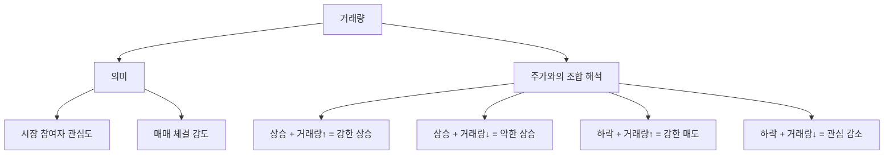

# 거래량 뜻, 주가 움직임의 신뢰도를 읽는 도구

## 한 줄 정의

거래량은 일정 기간 동안 매매가 체결된 주식의 수량입니다.

## 아주 쉽게 말하면

시장에서 사과가 하루에 100개 팔렸다면 거래량은 100개입니다.

주식도 마찬가지로, 하루 동안 A회사 주식이 50만 주 거래됐다면 그날 거래량은 50만 주입니다. 거래량이 많을수록 그 종목에 관심이 크다는 뜻입니다.

## 왜 중요한가

- 거래량은 시장 참여자들의 관심도를 보여줍니다.
- 주가 상승 + 거래량 증가 → 많은 사람이 동의하며 사고 있다는 의미입니다.
- 주가 상승 + 거래량 감소 → 소수만 거래하는 것이라 지속력이 약할 수 있습니다.
- 갑자기 거래량이 폭발하면 뉴스나 이벤트가 발생했을 가능성이 높습니다.

## 그림으로 이해하기

_거래량은 주가 방향의 '신뢰도'를 판단하는 보조 도구입니다._

## 숫자로 보는 예시

> ⚠️ 아래 숫자는 개념 설명을 위한 **가상 예시**이며, 실제 투자 데이터가 아닙니다.

A회사의 평소 하루 거래량이 10만 주라고 가정합니다.

- 어느 날 거래량 50만 주 + 주가 5% 상승 → 평소 5배 관심, 강한 매수세
- 어느 날 거래량 2만 주 + 주가 5% 상승 → 소수 거래, 지속력 의문
- 어느 날 거래량 100만 주 + 주가 변동 없음 → 매수·매도가 팽팽히 맞섬

## 표로 비교하기

| 주가 방향 | 거래량 변화 | 해석 | 신뢰도 |
|---|---|---|---|
| 상승 | 증가 | 많은 참여자가 매수 동의 | 높음 |
| 상승 | 감소 | 소수만 거래, 지속력 의문 | 낮음 |
| 하락 | 증가 | 강한 매도세, 악재 가능 | 높음 |
| 하락 | 감소 | 관심 감소에 따른 하락 | 낮음 |
| 횡보 | 급증 | 매수·매도 팽팽, 방향 전환 전조 | 관찰 필요 |

## 초보자가 자주 하는 오해

**오해 1: 거래량이 많으면 무조건 주가가 오른다**

거래량은 "관심"을 의미할 뿐 방향은 아닙니다. 거래량이 폭발적으로 늘면서 주가가 급락하는 경우도 많습니다. 거래량은 방향이 아니라 강도를 보는 도구입니다.

**오해 2: 거래량이 적은 주식은 안전하다**

거래량이 너무 적으면 사고 싶을 때 못 사고, 팔고 싶을 때 못 파는 유동성 위험이 있습니다. 급한 상황에서 원하는 가격에 매도할 수 없을 수 있습니다.

## 고수는 이렇게 봅니다

숙련된 투자자는 거래량을 "확인 도구"로 씁니다.

- 주가가 중요한 가격대를 돌파할 때, 거래량이 동반됐는지 확인합니다.
- 거래량 없이 오른 주가는 신뢰하지 않습니다.
- 바닥에서 거래량이 서서히 늘어나기 시작하면 관심을 가집니다.

## 기업분석에서는 이렇게 씁니다

기업분석 자체에서 거래량을 직접 쓰지는 않지만, 실제 매매에서 중요합니다.

좋은 기업을 찾았더라도 거래량이 너무 적으면:

- 원하는 수량을 한 번에 매수하기 어렵습니다.
- 매도 시 시장 충격(슬리피지)이 발생할 수 있습니다.
- 기관 투자자는 거래량이 적은 종목을 기피합니다.

## 함께 보면 좋은 용어

- [주가 뜻](../level-01-basic/stock-price.md)
- [체결 뜻](../level-02-market-trading/execution.md)
- [호가 뜻](../level-02-market-trading/order-book.md)
- [매수와 매도 뜻](../level-02-market-trading/buy-sell.md)
- [상한가 뜻](../level-01-basic/upper-limit.md)

## 정리

- 거래량은 일정 기간 동안 체결된 주식 수량이다.
- 주가 방향과 거래량을 함께 보면 움직임의 신뢰도를 판단할 수 있다.
- 거래량이 너무 적으면 유동성 위험이 있다.

## 한 줄 요약

> 거래량은 주가 움직임의 신뢰도를 알려주는 도구이며, 주가 방향과 함께 봐야 의미가 있습니다.

---

이 글은 투자 권유가 아니라 주식 용어와 기업분석 방법을 설명하기 위한 교육 콘텐츠입니다. 특정 종목의 매수·매도 판단은 독자 본인의 책임입니다.

Tags: 거래량, 거래량뜻, 주식거래, 주식초보, 주식용어
