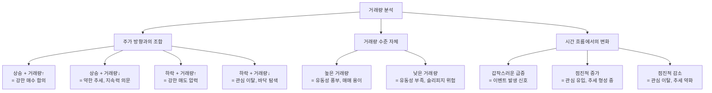

# 거래량 뜻, 주가 움직임의 신뢰도를 읽는 도구

## 한 줄 정의

거래량(Trading Volume)은 일정 기간 동안 매수와 매도가 실제로 체결된 주식의 수량으로, 시장 참여자들의 "관심 강도"와 "확신 수준"을 수치화한 지표입니다.

## 아주 쉽게 말하면

뉴스를 볼 때를 생각해보세요. "맛집이 생겼다"는 소문은 누구나 퍼뜨릴 수 있습니다. 하지만 그 식당 앞에 **실제로 줄이 100m**라면? 그건 소문이 아니라 사실입니다.

거래량은 주식 시장에서의 "줄 길이"입니다.

- 주가가 올랐는데 거래량도 폭발 → 진짜로 많은 사람이 돈을 걸고 있다 (줄이 길다)
- 주가가 올랐는데 거래량은 평소와 비슷 → 소수만 움직인 것 (줄이 짧다)

**거래량 = 시장 참여자들이 실제 돈으로 투표한 결과**입니다. 말(뉴스, 의견)은 거짓말할 수 있지만, 돈은 거짓말하기 어렵습니다.

## 왜 중요한가

**주가만 보면 "무엇이 일어났는지"는 알 수 있지만, "얼마나 확실한지"는 모릅니다.**

주가 5% 상승이라는 동일한 결과라도:
- 거래량 평소의 10배 → 기관, 외국인, 개인 모두가 합류한 강한 합의
- 거래량 평소의 0.5배 → 한두 명의 큰 손에 의한 일시적 움직임

이 차이를 무시하면 "가짜 신호"에 속습니다.

**유동성(내가 팔고 싶을 때 팔 수 있는가)의 직접적 지표입니다**

거래량이 하루 1,000주인 종목에서 10,000주를 한 번에 팔려고 하면? 시장가로 매도해도 주가가 급락하면서 원하는 가격을 받을 수 없습니다. 이것을 "유동성 리스크"라고 합니다. 거래량이 적은 종목은 들어가기도 쉽지만, 나오기도 어렵습니다.

**시장의 전환점을 미리 감지할 수 있습니다**

오랫동안 조용하던 종목에서 갑자기 거래량이 3~5배로 뛰면, 뭔가 변하고 있다는 신호입니다. 아직 주가에 반영되지 않은 정보가 일부 참여자에게 흘러들어갔을 가능성이 있습니다. 거래량은 종종 주가보다 먼저 움직입니다.

## 그림으로 이해하기

_거래량은 "방향과의 조합", "절대 수준", "변화 추이" 세 가지 축으로 해석합니다._

## 숫자로 보는 예시

> ⚠️ 아래 숫자는 개념 설명을 위한 **가상 예시**이며, 실제 투자 데이터가 아닙니다.

**시나리오: 식품기업 "맛나라"(가상) — 평소 일 거래량 20만 주**

| 날짜 | 주가 변동 | 거래량 | 평소 대비 | 해석 |
|------|----------|--------|----------|------|
| 월요일 | +2% | 25만 주 | 1.3배 | 정상 범위, 특이 없음 |
| 화요일 | +5% | 120만 주 | 6배 | 강한 매수세, 호재 가능성 |
| 수요일 | +3% | 80만 주 | 4배 | 여전히 높지만 감소 중 |
| 목요일 | +1% | 30만 주 | 1.5배 | 추세 약화 신호 |
| 금요일 | -2% | 60만 주 | 3배 | 차익 실현 매물 출회 |

**읽는 법:**
- 화요일: "6배 거래량 + 5% 상승 = 뭔가 확실한 호재가 있다"
- 수~목: "거래량 감소 + 상승폭 축소 = 초기 매수세가 소진되고 있다"
- 금요일: "거래량 재증가 + 하락 = 먼저 산 사람들이 팔기 시작했다"

**거래대금으로 환산하면 더 정확합니다:**

거래량 50만 주라 해도, 주가 1,000원인 종목(거래대금 5억)과 주가 10만 원인 종목(거래대금 500억)은 전혀 다른 무게감입니다. 실무에서는 **거래대금**(= 거래량 × 주가)을 함께 봅니다.

## 표로 비교하기

| 거래량 패턴 | 의미 | 실전 활용 | 주의사항 |
|------------|------|----------|---------|
| 돌파 + 거래량 폭발 | 가격대 돌파의 신뢰도 높음 | 추세 추종 전략의 진입 신호 | 이미 늦을 수도 있음 |
| 바닥권에서 거래량 서서히 증가 | 누군가 조용히 매집 중 | 관심 종목으로 등록, 관찰 | 하락이 더 이어질 수도 |
| 급등 후 거래량 급감 | 관심 소진, 추세 종료 가능 | 추가 매수 자제 | 조정 후 재상승 가능성도 있음 |
| 하락 + 거래량 폭발 (캐피틀레이션) | 패닉 셀링, 바닥 근처 가능 | 역발상 매수 검토 (고위험) | 바닥을 확인한 건 아님 |
| 장기간 극저 거래량 | 시장 무관심, 유동성 고갈 | 진입·퇴출 어려움 주의 | 갑작스런 변동에 취약 |

## 초보자가 자주 하는 오해

**오해 1: "거래량이 많으면 주가가 오른다"**

거래량은 **방향 없는 지표**입니다. 100만 주가 거래됐다는 건 100만 주를 산 사람과 100만 주를 판 사람이 있다는 뜻입니다. 매수자와 매도자는 항상 같은 수입니다. 거래량은 "강도"를 말해줄 뿐, "방향"은 주가 자체를 봐야 합니다.

**오해 2: "거래량이 적은 주식은 안전하다"**

정반대입니다. 거래량이 적으면:
- 소수의 매매로도 주가가 크게 움직여 **변동성이 오히려 클 수** 있습니다.
- 급하게 팔아야 할 때 매수자가 없어 **손실이 확대**됩니다.
- 시장 조작(작전)에 **취약**합니다.

거래량이 적은 종목에는 "들어갈 때 나올 수 있는지"부터 확인해야 합니다.

**오해 3: "프로그램 매매가 거래량 대부분이니 의미 없다"**

알고리즘 매매가 늘어난 건 사실이지만, 그들도 "정보"에 반응합니다. 거래량이 급증하는 순간 알고리즘과 실제 투자자 모두가 반응하고 있다는 뜻이므로, 오히려 신뢰도가 높은 신호입니다.

## 고수는 이렇게 봅니다

숙련된 투자자에게 거래량은 **"체온계"** 역할을 합니다. 주가가 "몸의 상태"라면, 거래량은 "열이 나는지, 정상인지"를 보여줍니다.

**실전 활용 패턴:**

1. **돌파 확인용**: 저항선을 뚫을 때 거래량이 평소의 3배 이상 → "진짜 돌파". 거래량 없이 뚫으면 → "가짜 돌파, 되돌림 가능성 높음"

2. **바닥 확인용**: 오래 하락한 종목에서 "거래량 급증 + 긴 꼬리 양봉" → "매도세 소진, 전환 가능성". 이를 "셀링 클라이맥스(selling climax)"라 부릅니다.

3. **추세 지속 확인용**: 상승 추세 중 조정(하락)이 올 때 거래량이 줄어들면 → "주요 매도세 없이 숨 고르기". 건강한 조정의 신호입니다.

4. **거래량 이평선 활용**: 20일 평균 거래량 대비 현재 거래량의 비율을 보면, "비정상적 관심"을 객관적으로 감지할 수 있습니다.

## 기업분석에서는 이렇게 씁니다

기업분석(펀더멘털 분석)은 본질적으로 거래량과 무관합니다 — 회사의 이익·자산·성장을 보는 것이니까요. 하지만 **실전 매매 단계**에서 거래량이 중요해집니다.

**"좋은 기업을 찾았다. 그런데 살 수 있나?"**

- 일 거래량 5만 주인 종목에 1억 원(= 약 2만 주)을 투자하려면: 하루 거래량의 40%를 차지 → **시장 충격 발생**
- 실무 규칙: "일 거래대금의 10% 이상을 한 번에 매수/매도하지 않는다"
- 기관 투자자가 소형주를 기피하는 이유: 거래량 부족으로 **진입·퇴출이 불가능**

**거래량 기준 투자 적합성:**

| 투자 금액 | 최소 필요 일 거래대금 | 이유 |
|----------|---------------------|------|
| 100만 원 | 1,000만 원 이상 | 시장 충격 없이 매매 가능 |
| 1,000만 원 | 1억 원 이상 | 하루 매매의 10% 이내 유지 |
| 1억 원 | 10억 원 이상 | 분할 매수 시에도 안전 |

## 함께 보면 좋은 용어

- [주가](./stock-price.md): 거래량과 함께 봐야 방향의 신뢰도를 판단할 수 있음
- [체결](../level-02-market-trading/execution.md): 매수·매도 주문이 만나 거래량 1주가 발생하는 순간
- [호가창](../level-02-market-trading/order-book.md): 아직 체결되지 않은 매수·매도 주문 대기 현황
- [매수와 매도](../level-02-market-trading/buy-sell.md): 거래량을 만드는 양 날개
- [상한가](./upper-limit.md): 거래량 폭발과 함께 발생하는 극단 상황

## 정리

- 거래량 = 실제 체결된 주식 수량. 시장 참여자가 "실제 돈으로 투표한 결과"다.
- 주가의 방향만으로는 불충분하다. 거래량이 동반됐는지 봐야 그 움직임의 **강도와 신뢰도**를 알 수 있다.
- 거래량이 너무 적은 종목은 유동성 리스크가 있다: 사기는 쉬워도 팔기 어렵다.
- 거래량 급증은 "뭔가 변하고 있다"는 경고등이다 — 좋든 나쁘든.
- 기업분석으로 좋은 회사를 찾았더라도, 거래량이 충분해야 실제 투자가 가능하다.

## 한 줄 요약

> 거래량은 주가 움직임의 신뢰도를 알려주는 도구이며, 주가 방향과 함께 봐야 의미가 있습니다.

---

이 글은 투자 권유가 아니라 주식 용어와 기업분석 방법을 설명하기 위한 교육 콘텐츠입니다. 특정 종목의 매수·매도 판단은 독자 본인의 책임입니다.

Tags: 거래량, 거래량뜻, 주식거래, 주식초보, 주식용어
