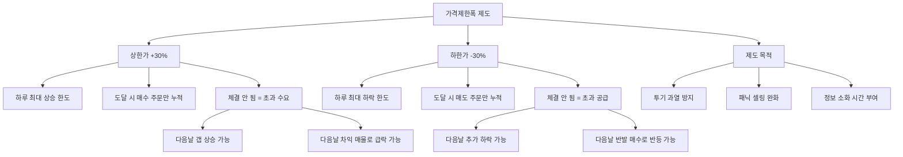

# 상한가 뜻, 하루에 주가가 오를 수 있는 한계

## 한 줄 정의

상한가는 하루 동안 주가가 오를 수 있는 최대 한도 가격이며, 한국 주식시장에서는 전일 종가 대비 +30%입니다.

## 아주 쉽게 말하면

고속도로에 속도 제한이 있는 것처럼, 주식시장에도 하루에 가격이 달릴 수 있는 최대 속도가 정해져 있습니다.

어제 종가가 10,000원이었다면 오늘은 아무리 좋은 뉴스가 나와도 13,000원까지만 갈 수 있습니다. 이 13,000원이 바로 "상한가"입니다. 반대로 최악의 뉴스가 나와도 7,000원 아래로는 떨어지지 않는데, 이건 "하한가"입니다. 시장이 하루 만에 패닉에 빠지거나 과열되는 것을 막는 안전장치죠.

## 왜 중요한가

- **투자자 보호**: 갑작스러운 루머나 작전으로 주가가 하루에 100% 폭등하는 것을 제도적으로 차단합니다.
- **냉각 시간 부여**: 극단적 상승 시 시장 참여자에게 "하룻밤 생각할 시간"을 줍니다.
- **호가 잔량 해석**: 상한가에 도달하면 매수 주문만 쌓이고 체결이 안 됩니다. 이 "상한가 잔량"은 다음날 수급 판단의 단서가 됩니다.
- **연속 상한가 현상**: 2일, 3일 연속 상한가 종목은 엄청난 수요 불균형을 의미하며, 동시에 가장 위험한 구간이기도 합니다.
- **제도 변화 이해**: 한국은 2015년에 ±15% → ±30%로 확대했습니다. 이 변화의 의미를 아는 것이 시장 제도 이해의 기초입니다.

## 그림으로 이해하기

_상한가·하한가에 도달하면 한쪽 주문만 쌓이고 체결이 멈춥니다. 다음날 어떤 방향으로 갈지는 예측이 매우 어렵습니다._

## 숫자로 보는 예시

> ⚠️ 아래 숫자는 개념 설명을 위한 **가상 예시**이며, 실제 투자 데이터가 아닙니다.

**가상 종목 "한빛전자" — 연속 상한가 시나리오**

한빛전자 전일 종가: 50,000원. 신규 반도체 수주 계약 발표.

| 일차 | 시초가 | 종가(상한가) | 상한가 잔량 | 누적 수익률 |
|---|---|---|---|---|
| 1일차 | 55,000원 | 65,000원 | 500만 주 | +30% |
| 2일차 | 65,000원 | 84,500원 | 300만 주 | +69% |
| 3일차 | 84,500원 | 109,850원 | 50만 주 | +120% |
| 4일차 | 109,850원 | 95,000원(급락) | — | +90% |

3일 연속 상한가 후 4일차에 차익 매물이 쏟아지며 −13% 급락했습니다. 3일차 상한가에 매수한 사람은 하루 만에 −13% 손실입니다.

**상한가 잔량의 의미**

- 1일차 잔량 500만 주: 사고 싶은데 못 산 사람이 엄청 많다 → 다음날 추가 상승 확률 높음
- 3일차 잔량 50만 주: 수요가 급격히 줄었다 → 동력 소진 신호

**가격제한폭 확대 전후 비교**

| 구분 | 2015년 이전 | 2015년 이후 |
|---|---|---|
| 가격제한폭 | ±15% | ±30% |
| 3일 연속 상한가 시 | +52% | +120% |
| 3일 연속 하한가 시 | −39% | −66% |
| 시장 영향 | 완충 효과 큼 | 하루 변동 폭 확대 |

## 표로 비교하기

| 구분 | 한국 | 미국 | 일본 | 중국 |
|---|---|---|---|---|
| 가격제한폭 | ±30% | 없음 | 가격대별 상이 | ±10% (일반) |
| 예외 | IPO 첫날 없음 | — | — | 과학창업판 ±20% |
| 대체 장치 | VI(변동성 완화) | 서킷브레이커 | 서킷브레이커 | 서킷브레이커 |
| 특징 | 단순 명확 | 자유도 높음 | 종목별 차등 | 매우 엄격 |
| IPO 첫날 | 공모가 ×2~4배 가능 | 제한 없음 | 초일 1.5배 | 첫 5일 무제한 |

## 초보자가 자주 하는 오해

**오해 1: 상한가 종목은 무조건 다음날도 오른다**

통계적으로 상한가 다음날 추가 상승하는 비율은 약 50~60% 수준입니다. 즉 10번 중 4~5번은 하락합니다. 특히 뉴스·테마에 의한 상한가는 하루짜리 이벤트로 끝나는 경우가 많습니다. "상한가 따라잡기"는 초보자가 가장 많이 돈을 잃는 패턴 중 하나입니다.

**오해 2: 상한가에 사면 무조건 수익이다**

상한가 가격(+30%)에 매수했다는 것은 "하루 최고가에 샀다"는 뜻입니다. 다음날 시초가가 전일 상한가보다 낮게 시작하면 즉시 손실입니다. 갭 하락으로 시작하면 손절할 틈도 없이 −10~20% 손실을 볼 수 있습니다.

**오해 3: 가격제한폭이 있으니 큰 손실은 없다**

하루 −30%는 "작은 손실"이 아닙니다. 1,000만 원 투자 시 하루에 300만 원이 사라집니다. 게다가 하한가에 도달하면 매도 자체가 안 되어, 다음날 추가 하락을 지켜볼 수밖에 없습니다. 3일 연속 하한가면 −66%입니다.

## 고수는 이렇게 봅니다

숙련된 투자자는 상한가를 "따라가는 것"이 아니라, 상한가라는 현상에서 "정보를 읽습니다."

- **상한가 원인 분류**: 실적 서프라이즈 → 지속 가능성 높음 / 테마·루머 → 일시적 / M&A 뉴스 → 인수가 확인 후 판단. 원인별로 대응이 완전히 다릅니다.
- **잔량 추이 분석**: 상한가 잔량이 시간이 갈수록 늘어나면 수요 강도가 진짜입니다. 반대로 잔량이 줄어들면 매수 취소가 나오고 있다는 뜻으로 위험 신호입니다.
- **거래량 대비 잔량 비율**: 당일 거래량이 1,000만 주인데 상한가 잔량이 50만 주면, 이미 원하는 사람 대부분이 사간 것입니다(소진). 잔량이 500만 주면 아직 수요가 남아있습니다.
- **VI(변동성 완화장치) 활용**: 한국 시장은 ±10% 이상 급변 시 2분간 거래를 중단하는 VI 제도가 있습니다. VI 발동 횟수가 많은 종목은 그만큼 변동성이 극심하다는 경고입니다.
- **공매도 잔고 확인**: 상한가 직전에 공매도 잔고가 높았다면, 숏커버링(강제 매수)이 상한가를 만든 것일 수 있습니다. 숏커버가 끝나면 상승 동력도 소멸합니다.

## 기업분석에서는 이렇게 씁니다

기업분석에서 상한가 자체는 분석 대상이 아닙니다. 그러나 상한가가 발생한 이유는 기업가치 재평가의 시작점이 됩니다.

- **실적 서프라이즈 상한가**: 컨센서스 대비 순이익이 50% 이상 초과했다면, 향후 실적 추정을 상향 조정하고 목표주가를 재산정합니다.
- **신사업 발표 상한가**: 발표된 사업의 TAM(전체 시장 규모)과 기업의 현실적 점유 가능성을 분석합니다. 시장 규모 1조 원에 점유율 5% 가정 → 매출 500억 원 추가 → 이것이 시총 변화를 정당화하는지 계산합니다.
- **M&A 뉴스 상한가**: 인수 제안 가격과 현재 주가의 괴리를 확인합니다. 제안가가 현재가보다 30% 높으면 상한가 한 번으로 갭이 메워질 수 있습니다.
- **테마·루머 상한가**: 구체적 실적 기여가 불분명하면 기업가치 변동 없음으로 판단합니다. "뉴스에 사고 뉴스에 판다"의 전형입니다.

## 함께 보면 좋은 용어

- [하한가 뜻](../level-01-basic/lower-limit.md)
- [주가 뜻](../level-01-basic/stock-price.md)
- [거래량 뜻](../level-01-basic/trading-volume.md)
- [체결 뜻](../level-02-market-trading/execution.md)
- [어닝서프라이즈 뜻](../level-08-industry-macro/earnings-surprise.md)

## 정리

- 상한가는 하루에 주가가 오를 수 있는 최대 한도이며, 한국은 전일 종가 대비 +30%이다.
- 과열·패닉을 막는 안전장치이며, 2015년 ±15%에서 ±30%로 확대되었다.
- 상한가를 쫓아 매수하는 것은 매우 위험하며, 다음날 급락 가능성이 항상 존재한다.
- 숙련된 투자자는 상한가 자체가 아니라 발생 원인·잔량 추이·거래량을 종합적으로 분석한다.
- 기업분석에서는 상한가 이유(실적·신사업·M&A·테마)에 따라 기업가치 재평가 여부를 판단한다.

## 한 줄 요약

> 상한가는 하루 최대 상승 한도(+30%)이며, 상한가 자체보다 왜 발생했는지, 잔량은 어떤지를 분석하는 것이 진짜 실력입니다.

---

이 글은 투자 권유가 아니라 주식 용어와 기업분석 방법을 설명하기 위한 교육 콘텐츠입니다. 특정 종목의 매수·매도 판단은 독자 본인의 책임입니다.

Tags: 상한가, 상한가뜻, 가격제한폭, 주식초보, 주식용어
