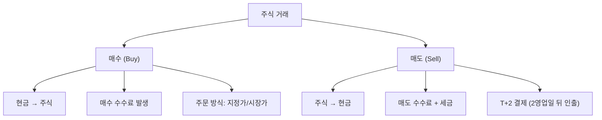

# 매수와 매도 뜻, 주식 거래의 기본

## 한 줄 정의

매수는 주식을 사는 것, 매도는 주식을 파는 것입니다.

## 아주 쉽게 말하면

- 매수 = "이 회사 주식을 사겠습니다" (돈 → 주식)
- 매도 = "이 회사 주식을 팔겠습니다" (주식 → 돈)

마트에서 물건을 사는 것이 매수, 중고거래로 물건을 파는 것이 매도입니다.

## 왜 중요한가

- 모든 투자 수익은 매수와 매도의 가격 차이에서 나옵니다.
- 같은 종목이라도 매수·매도 방법(지정가, 시장가)에 따라 체결 가격이 달라집니다.
- 매수만큼 매도도 중요한데, 초보자는 매수에만 집중하는 경향이 있습니다.

## 그림으로 이해하기

_매수는 돈을 주고 주식을 받는 것, 매도는 주식을 주고 돈을 받는 것입니다._

## 숫자로 보는 예시

> ⚠️ 아래 숫자는 개념 설명을 위한 **가상 예시**이며, 실제 투자 데이터가 아닙니다.

A주식 투자 과정:

- 매수: 45,000원 × 100주 = 450만 원 지출
- 보유: 3개월간 주가 상승
- 매도: 55,000원 × 100주 = 550만 원 수령
- **수익 = 550만 - 450만 = 100만 원** (수익률 약 22%)
- 실제 수익 = 100만 원 - 수수료 - 세금

## 표로 비교하기

| 구분 | 매수 | 매도 |
|---|---|---|
| 의미 | 주식을 삼 | 주식을 팜 |
| 결과 | 현금 감소, 주식 보유 | 주식 소멸, 현금 증가 |
| 수수료 | 매수 수수료 (약 0.01~0.3%) | 매도 수수료 + 세금 (0.2~0.35%) |
| 심리 | "더 오를 것이다" | "여기서 팔자" |
| 초보 실수 | 충동 매수, 고점 매수 | 매도 못하고 물림, 손절 못함 |

## 초보자가 자주 하는 오해

**오해 1: 좋은 종목만 찾으면 매도는 신경 안 써도 된다**

아무리 좋은 종목이라도 매수 가격이 너무 높으면 손실이 나고, 적절한 시점에 매도하지 않으면 수익이 사라집니다. 매수와 매도는 동전의 양면입니다.

**오해 2: 매도하면 수익이 바로 들어온다**

한국 주식시장은 T+2 결제입니다. 매도한 날로부터 2영업일 뒤에 실제 현금이 인출 가능해집니다. (재투자는 당일 가능)

## 고수는 이렇게 봅니다

숙련된 투자자는 매수 전에 매도 기준을 먼저 정합니다.

- **매수 전 체크**: 이 종목을 언제, 왜 팔 것인가?
- **목표 수익률** 도달 시 분할 매도
- **투자 논리가 깨지면** 즉시 매도 (손절)
- "사는 것은 기술, 파는 것은 예술"이라는 말이 있을 정도로 매도가 어렵습니다.

## 기업분석에서는 이렇게 씁니다

기업분석은 매수와 매도 판단의 근거를 만드는 과정입니다.

- 기업 가치 > 현재 주가 → 매수 근거
- 기업 가치 < 현재 주가 → 매도(또는 비매수) 근거
- 기업 가치를 정확히 판단할수록 매수·매도의 근거가 명확해집니다.

## 함께 보면 좋은 용어

- [지정가와 시장가 뜻](../level-02-market-trading/limit-market-order.md)
- [체결 뜻](../level-02-market-trading/execution.md)
- [호가 뜻](../level-02-market-trading/order-book.md)
- [손절 뜻](../level-10-company-analysis/stop-loss.md)
- [분할매수 뜻](../level-10-company-analysis/dollar-cost-averaging.md)

## 정리

- 매수는 주식을 사는 것, 매도는 주식을 파는 것이다.
- 수익 = 매도 가격 - 매수 가격 - 수수료 - 세금이다.
- 매수만큼 매도 기준을 미리 정하는 것이 중요하다.

## 한 줄 요약

> 매수는 사는 것, 매도는 파는 것이며, 좋은 투자는 매수 전에 매도 기준을 먼저 정하는 것에서 시작합니다.

---

이 글은 투자 권유가 아니라 주식 용어와 기업분석 방법을 설명하기 위한 교육 콘텐츠입니다. 특정 종목의 매수·매도 판단은 독자 본인의 책임입니다.

Tags: 매수, 매도, 매수매도, 주식초보, 주식용어
