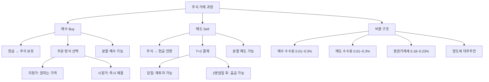

# 매수와 매도 뜻, 주식 거래의 기본

## 한 줄 정의

매수는 주식을 사는 행위, 매도는 주식을 파는 행위이며, 이 둘의 가격 차이가 투자 수익(또는 손실)을 결정합니다.

## 아주 쉽게 말하면

중고 물품 거래를 떠올려보세요. 중고 카메라를 50만 원에 사서(매수), 몇 달 뒤 인기가 올라 70만 원에 팔면(매도) 20만 원 이익입니다. 반대로 40만 원에 팔면 10만 원 손해죠.

주식도 정확히 같은 구조입니다. 다만 가격이 매 초마다 바뀌고, 수수료와 세금이 붙는다는 차이가 있을 뿐입니다. "사는 것은 기술, 파는 것은 예술"이라는 말이 있을 정도로, 매도 타이밍이 수익을 결정합니다.

## 왜 중요한가

- **수익의 유일한 원천**: 모든 투자 수익은 "매도 가격 − 매수 가격 − 비용"으로 결정됩니다. 예외 없습니다.
- **매수와 매도는 비대칭**: 매수는 언제든 할 수 있지만, 매도는 보유 중이어야 합니다. 사는 건 쉬운데 파는 건 심리적으로 100배 어렵습니다.
- **비용 구조 이해**: 매수 시 수수료, 매도 시 수수료 + 세금이 발생합니다. 이 비용이 단타 매매의 수익을 갉아먹습니다.
- **결제일 이해(T+2)**: 매도 후 실제 현금을 출금하려면 2영업일을 기다려야 합니다.
- **분할 매수·매도**: 한 번에 몰아서 하지 않고 나눠서 하면 리스크를 줄일 수 있습니다.

## 그림으로 이해하기

_매수와 매도는 대칭이 아닙니다. 매도 시에는 수수료 외에 증권거래세가 추가로 발생합니다._

## 숫자로 보는 예시

> ⚠️ 아래 숫자는 개념 설명을 위한 **가상 예시**이며, 실제 투자 데이터가 아닙니다.

**가상 시나리오: "민수"의 첫 주식 투자**

민수가 한빛전자 주식을 매수합니다.

| 단계 | 내용 | 금액 |
|---|---|---|
| 매수 | 45,000원 × 100주 | 4,500,000원 지출 |
| 매수 수수료 | 0.015% | 675원 |
| 3개월 보유 | 주가 55,000원으로 상승 | — |
| 매도 | 55,000원 × 100주 | 5,500,000원 수령 |
| 매도 수수료 | 0.015% | 825원 |
| 증권거래세 | 0.18% | 9,900원 |
| **순수익** | 1,000,000 − 675 − 825 − 9,900 | **988,600원** |

수익률: 988,600 ÷ 4,500,000 = **약 22%**

**매매 횟수에 따른 비용 누적 (연간)**

| 매매 스타일 | 연간 매매 횟수 | 연간 비용(수수료+세금) | 비용이 갉아먹는 수익 |
|---|---|---|---|
| 장기 투자 | 2~4회 | 약 0.4% | 거의 무시 |
| 중기 스윙 | 24회 | 약 5% | 무시 못함 |
| 단기 데이트레이딩 | 250회 | 약 50% | 수익 대부분 소멸 |

하루에 한 번 사고팔면 연간 비용만 투자금의 50%입니다. 단타가 어려운 이유입니다.

**분할 매수 vs 일괄 매수 비교**

한빛전자를 1,000만 원어치 사려는 상황:

| 방법 | 1회차 | 2회차 | 3회차 | 평균 매수가 |
|---|---|---|---|---|
| 일괄 매수 | 50,000원 × 200주 | — | — | 50,000원 |
| 3회 분할 | 50,000원 × 66주 | 48,000원 × 70주 | 52,000원 × 64주 | 49,800원 |

분할 매수는 한 번에 고점을 잡는 위험을 줄여줍니다. 반대로 주가가 계속 오르면 일괄 매수가 유리합니다.

## 표로 비교하기

| 구분 | 매수 | 매도 | 비고 |
|---|---|---|---|
| 의미 | 주식을 삼 | 주식을 팜 | — |
| 결과 | 현금↓ 주식↑ | 주식↓ 현금↑ | — |
| 수수료 | 0.01~0.3% | 0.01~0.3% | 증권사별 상이 |
| 세금 | 없음 | 증권거래세 0.18~0.23% | 코스피 0.18%, 코스닥 0.23% |
| 결제 | 즉시 보유 표시 | T+2 후 출금 가능 | 재투자는 당일 OK |
| 심리 | "더 오를 것이다" | "여기서 팔아야지" | 매도가 심리적으로 더 어려움 |
| 초보 실수 | 충동 매수, FOMO | 손절 못함, 익절 너무 빨리 | — |
| 고수 접근 | 분할 매수, 이유 명확 | 매도 기준 사전 설정 | — |

## 초보자가 자주 하는 오해

**오해 1: 좋은 종목만 찾으면 매도는 알아서 된다**

아무리 좋은 종목이라도 고점에서 매수하면 수년간 물릴 수 있습니다. 또한 +50% 수익을 보다가 매도 못 하고 결국 −10%에서 손절하는 일이 비일비재합니다. "언제 팔 것인가"를 미리 정하지 않으면, 감정이 판단을 지배합니다.

**오해 2: 매도하면 돈이 즉시 들어온다**

한국 주식시장은 T+2 결제입니다. 월요일에 매도하면 수요일에 현금 인출이 가능합니다. 다만 매도 대금으로 다른 주식을 재매수하는 것은 당일 가능합니다. 급하게 현금이 필요할 때 이 2일 차이를 모르면 당황합니다.

**오해 3: 매수만 하면 투자다**

매수는 투자의 시작이지 전부가 아닙니다. 매수 후 모니터링 → 매도 기준 충족 시 실행까지가 하나의 사이클입니다. "사기만 하고 안 파는 것"은 전략이 아니라 방치입니다. 장기 투자도 정기적으로 기업 상태를 확인하고 매도 여부를 판단합니다.

## 고수는 이렇게 봅니다

숙련된 투자자에게 매수와 매도는 별개의 결정이 아니라, 하나의 "거래 계획(trading plan)"입니다.

- **매수 전 매도 기준 설정**: "이 종목을 왜, 언제, 얼마에 팔 것인가?"를 매수 전에 정합니다. 목표가 도달, 투자 논리 훼손, 더 좋은 기회 발견 — 세 가지 매도 조건을 미리 써둡니다.
- **분할 매수·분할 매도**: 매수도 3회, 매도도 3회로 나눕니다. 타이밍을 완벽하게 맞추는 것은 불가능하다는 전제하에, 리스크를 분산합니다.
- **매도 후 복기**: 매도 후 주가가 더 올랐을 때 "아 팔지 말걸" 하는 대신, 매도 기준이 합리적이었는지만 복기합니다. 결과가 아니라 과정을 평가합니다.
- **비용 최적화**: 수수료가 낮은 증권사(MTS 기준 0.003~0.015%)를 사용하고, 불필요한 매매 횟수를 줄여 비용을 통제합니다.
- **감정 제거**: "한 번 더 올라갈 것 같은데" "아직 안 빠질 것 같은데"라는 감정이 끼면, 사전에 정한 규칙으로 돌아갑니다.

## 기업분석에서는 이렇게 씁니다

기업분석은 매수·매도 판단의 "근거"를 만드는 과정입니다.

- **매수 근거 만들기**: 적정 가치(DCF, PER 기반) > 현재 주가 → 안전마진이 존재 → 매수 조건 충족. 예: 적정가 70,000원인데 현재 50,000원이면 안전마진 40%.
- **매도 근거 만들기**: (1) 주가가 적정 가치에 도달, (2) 기업 펀더멘털이 악화(실적 하향, 경쟁 심화), (3) 더 확실한 투자 기회 발견 → 세 경우 중 하나에 매도.
- **포지션 사이징**: 확신도에 따라 매수 규모를 결정합니다. 분석이 깊고 확신이 높으면 5~10%, 탐색적이면 1~2%만 매수합니다.
- **손절 기준**: 분석 전제가 깨지면(예: 예상 매출 미달성) 가격에 관계없이 매도합니다. "원래 이유가 사라지면 파는 것"이 원칙입니다.

## 함께 보면 좋은 용어

- [지정가와 시장가 뜻](../level-02-market-trading/limit-market-order.md)
- [체결 뜻](../level-02-market-trading/execution.md)
- [호가 뜻](../level-02-market-trading/order-book.md)
- [손절 뜻](../level-10-company-analysis/stop-loss.md)
- [분할매수 뜻](../level-10-company-analysis/dollar-cost-averaging.md)

## 정리

- 매수는 주식을 사는 것, 매도는 파는 것이며, 이 차이가 수익·손실을 결정한다.
- 매도 시 수수료 외에 증권거래세가 추가되며, 매매 빈도가 높을수록 비용이 누적된다.
- 매수보다 매도가 심리적으로 훨씬 어렵기 때문에, 매수 전에 매도 기준을 먼저 정해야 한다.
- 분할 매수·분할 매도로 타이밍 리스크를 줄일 수 있다.
- 기업분석은 매수·매도의 "이유"를 만들어주는 과정이다.

## 한 줄 요약

> 매수는 사는 것, 매도는 파는 것이며, 좋은 투자는 매수 전에 매도 기준을 먼저 정하는 것에서 시작합니다.

---

이 글은 투자 권유가 아니라 주식 용어와 기업분석 방법을 설명하기 위한 교육 콘텐츠입니다. 특정 종목의 매수·매도 판단은 독자 본인의 책임입니다.

Tags: 매수, 매도, 매수매도, 주식초보, 주식용어
