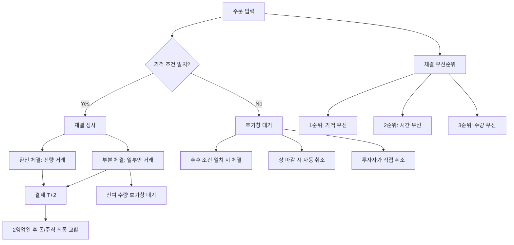

# 체결 뜻, 주문이 실제 거래가 되는 순간

## 한 줄 정의

체결은 매수 주문과 매도 주문의 가격·수량 조건이 일치하여 실제 거래가 성사되는 것입니다.

## 아주 쉽게 말하면

당근마켓에서 "3만 원에 팝니다"라고 올렸는데, 누가 "3만 원에 살게요"라고 연락하면 거래가 성립하죠? 이게 "체결"입니다.

그런데 "2만 5천 원에 깎아주세요"라고 하면? 판매자가 거절하면 거래 불성립 — 이게 "미체결"입니다. 주식시장에서도 정확히 같은 원리로, 매수자와 매도자의 가격이 일치해야만 체결됩니다. 다만 주식에서는 이 모든 과정이 컴퓨터로 1초에 수천 건씩 자동 매칭됩니다.

## 왜 중요한가

- **주문 ≠ 체결**: 주문을 넣었다고 주식을 산 게 아닙니다. 체결되어야 비로소 내 주식이 됩니다.
- **체결 가격 = 실제 매수/매도 단가**: 내 수익률의 기준점이 됩니다.
- **부분 체결 이해**: 1,000주를 주문해도 300주만 체결될 수 있습니다. 나머지는 대기 중입니다.
- **체결 강도 분석**: 매수 체결이 많은지 매도 체결이 많은지로 실시간 수급을 판단할 수 있습니다.
- **슬리피지(Slippage)**: 시장가 주문 시 예상보다 불리한 가격에 체결될 수 있습니다.

## 그림으로 이해하기

_체결은 가격 우선 → 시간 우선 → 수량 우선 순서로 매칭됩니다. 같은 가격이면 먼저 주문한 사람이 먼저 체결됩니다._

## 숫자로 보는 예시

> ⚠️ 아래 숫자는 개념 설명을 위한 **가상 예시**이며, 실제 투자 데이터가 아닙니다.

**가상 시나리오: "영희"의 주문 체결 과정**

영희가 한빛전자 1,000주를 10,000원에 지정가 매수 주문합니다.

| 시간 | 이벤트 | 체결 수량 | 누적 체결 | 미체결 잔량 |
|---|---|---|---|---|
| 09:05 | 매도 300주 유입 | 300주 체결 | 300주 | 700주 |
| 09:23 | 매도 200주 유입 | 200주 체결 | 500주 | 500주 |
| 11:40 | 주가 10,100원으로 상승 | 체결 없음 | 500주 | 500주 |
| 14:50 | 주가 10,000원 복귀, 매도 500주 | 500주 체결 | 1,000주 | 0주 |

총 3번에 걸쳐 부분 체결 → 완전 체결까지 약 6시간 걸렸습니다.

**시장가 vs 지정가 체결 비교**

현재 한빛전자 호가 상황:
- 매도 1호가: 10,100원 (500주)
- 매도 2호가: 10,200원 (300주)
- 매도 3호가: 10,300원 (200주)

| 주문 방식 | 주문 내용 | 체결 결과 | 평균 체결가 |
|---|---|---|---|
| 시장가 1,000주 | "아무 가격이나 즉시 체결" | 500주@10,100 + 300주@10,200 + 200주@10,300 | 10,160원 |
| 지정가 10,100원 1,000주 | "10,100원 이하에서만" | 500주@10,100원만 체결 | 10,100원 |

시장가는 즉시 체결되지만 슬리피지 발생. 지정가는 원하는 가격이지만 부분 체결 위험.

**체결 강도 읽기**

| 시간대 | 매수 체결(주) | 매도 체결(주) | 체결 강도 | 해석 |
|---|---|---|---|---|
| 09:00~10:00 | 80,000 | 40,000 | 67% | 매수 우세(상승 압력) |
| 10:00~11:00 | 50,000 | 60,000 | 45% | 매도 우세(하락 압력) |
| 13:00~14:00 | 30,000 | 30,000 | 50% | 균형(방향 모색) |

체결 강도 = 매수 체결 ÷ (매수 체결 + 매도 체결) × 100. 50% 이상이면 매수 우세.

## 표로 비교하기

| 구분 | 완전 체결 | 부분 체결 | 미체결 | 동시호가 체결 |
|---|---|---|---|---|
| 상태 | 전량 거래 성사 | 일부만 성사 | 거래 불성립 | 개장·마감 시 일괄 |
| 조건 | 호가에 충분한 물량 | 물량 부족 | 가격 미달 | 단일가 매칭 |
| 잔여 주문 | 없음 | 호가창 대기 | 전량 대기/취소 | 없음 |
| 발생 빈도 | 시장가 주문 시 높음 | 대량 주문 시 흔함 | 지정가 주문 시 흔함 | 1일 2회(개장·마감) |
| 대응 | 확인만 | 잔량 유지/취소 선택 | 가격 수정/취소 | 자동 처리 |

## 초보자가 자주 하는 오해

**오해 1: 주문을 넣으면 무조건 체결된다**

지정가 주문은 조건이 맞지 않으면 하루 종일 체결이 안 될 수 있습니다. 장 마감 시 자동 취소됩니다. "분명 주문 넣었는데 왜 내 잔고에 안 보이지?"라는 초보자 질문의 90%가 이 경우입니다. 주문 후 반드시 체결 여부를 확인하세요.

**오해 2: 체결 = 결제 완료다**

체결은 "거래 약속 성사"이고, 결제(돈과 주식의 실제 교환)는 T+2에 이루어집니다. 체결 당일에는 주식이 잔고에 표시되고 매도도 가능하지만, 현금 인출은 2영업일 후입니다.

**오해 3: 시장가 주문은 현재가에 체결된다**

시장가 주문은 "가격 무관하게 즉시 체결하라"는 주문입니다. 호가창에 물량이 얇으면 현재가보다 훨씬 불리한 가격에 체결될 수 있습니다(슬리피지). 소형주에서 시장가로 대량 주문하면 1~5%까지 불리하게 체결되기도 합니다.

## 고수는 이렇게 봅니다

숙련된 투자자는 체결을 단순한 주문 이행이 아니라, 시장 정보를 읽는 도구로 활용합니다.

- **체결 강도로 실시간 수급 판단**: 체결 강도가 70% 이상이면 강한 매수세, 30% 이하면 강한 매도세로 단기 방향을 예측합니다.
- **분할 주문으로 시장 충격 최소화**: 1만 주를 한 번에 시장가로 넣으면 호가를 밀어올립니다. 2,000주씩 5회로 나눠 넣으면 평균 체결가를 개선할 수 있습니다.
- **동시호가 전략**: 장 시작 전(08:30~09:00)에 쌓인 주문으로 개장가를 예측합니다. 동시호가 체결 물량이 평소보다 3배 이상이면 방향성이 강합니다.
- **체결 틱(tick) 분석**: 체결이 매도 호가에서 발생하면 매수자가 적극적인 것, 매수 호가에서 발생하면 매도자가 급한 것입니다.
- **VWAP(거래량 가중 평균가)**: 기관 투자자는 하루 VWAP 대비 유리한 가격에 체결하는 것을 목표로 합니다.

## 기업분석에서는 이렇게 씁니다

체결 자체는 기업분석의 대상은 아니지만, 분석 결과를 실행할 때 핵심 제약 조건이 됩니다.

- **유동성 확인**: 일평균 거래대금이 10억 원 미만인 종목은 분석이 좋아도 원하는 규모의 체결이 어렵습니다. 1억 원을 투자하려면 일거래대금의 10% 이내로 나눠 매수해야 시장 충격이 적습니다.
- **블록딜 분석**: 대주주나 기관이 장외에서 대량 체결(블록딜)을 하면 공시됩니다. 할인율(통상 5~10%)과 인수자가 누구인지가 기업분석에 반영됩니다.
- **체결 패턴 이상 감지**: 장 마감 동시호가에 대량 체결이 반복되면, 가격 조작이나 특정 세력의 개입을 의심할 수 있습니다.
- **실행 비용 포함 수익률**: 이론적 수익률에서 슬리피지(0.1~0.5%)를 차감해야 실제 실현 가능 수익률입니다.

## 함께 보면 좋은 용어

- [호가 뜻](../level-02-market-trading/order-book.md)
- [지정가와 시장가 뜻](../level-02-market-trading/limit-market-order.md)
- [매수와 매도 뜻](../level-02-market-trading/buy-sell.md)
- [거래량 뜻](../level-01-basic/trading-volume.md)
- [주가 뜻](../level-01-basic/stock-price.md)

## 정리

- 체결은 매수·매도 주문의 조건이 일치하여 실제 거래가 성사되는 것이다.
- 주문 ≠ 체결이며, 지정가 주문은 미체결·부분 체결이 빈번하다.
- 체결 우선순위는 가격 → 시간 → 수량 순이며, 시장가 주문이 지정가보다 우선 체결된다.
- 체결 강도는 실시간 수급을 보여주는 유용한 지표이다.
- 유동성이 낮은 종목은 분석이 좋아도 원하는 체결이 어려울 수 있으므로, 실행 가능성을 항상 확인해야 한다.

## 한 줄 요약

> 체결은 매수·매도 주문이 만나 실제 거래가 성사되는 순간이며, 주문을 넣었다고 반드시 체결되는 것은 아닙니다.

---

이 글은 투자 권유가 아니라 주식 용어와 기업분석 방법을 설명하기 위한 교육 콘텐츠입니다. 특정 종목의 매수·매도 판단은 독자 본인의 책임입니다.

Tags: 체결, 체결뜻, 주식거래, 주식초보, 주식용어
