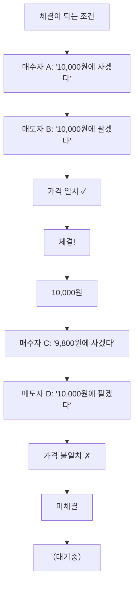

# 체결 뜻, 주문이 실제 거래가 되는 순간

주문을 넣었는데 "체결"이 됐다는 알림이 올 때도 있고, 안 올 때도 있습니다.

체결은 매수자와 매도자의 주문이 만나 실제 거래가 성립되는 순간입니다.

## 한 줄 정의

체결은 매수 주문과 매도 주문이 가격·수량 조건이 맞아 실제 거래가 성사되는 것입니다.

## 아주 쉽게 말하면

중고거래에서 "3만 원에 팔겠습니다"와 "3만 원에 사겠습니다"가 만나면 거래가 성사됩니다. 이것이 체결입니다.

주식도 매도자가 부른 가격과 매수자가 부른 가격이 일치하면 체결됩니다. 일치하지 않으면 체결되지 않고 호가창에 대기합니다.

## 왜 중요한가

- 주문을 넣었다고 거래가 끝난 것이 아닙니다. 체결돼야 진짜 내 주식이 됩니다.
- 체결 가격이 내 실제 매수 단가가 됩니다.
- 부분 체결(일부만 체결)이 발생할 수 있습니다.
- 체결 원리를 알아야 왜 주문이 안 되는지 이해할 수 있습니다.

## 그림으로 이해하기

_매수·매도 가격이 일치하면 체결, 일치하지 않으면 대기합니다._

## 숫자로 보는 예시

> ⚠️ 아래 숫자는 개념 설명을 위한 **가상 예시**이며, 실제 투자 데이터가 아닙니다.

내가 A주식 1,000주를 10,000원에 지정가 매수 주문했을 때:

- 10,000원에 매도 물량이 500주만 있으면 → 500주만 체결 (부분 체결)
- 나머지 500주는 호가창에 대기
- 추가 매도 물량이 들어오면 순차적으로 체결
- 장 마감까지 안 들어오면 → 미체결 주문은 자동 취소

## 표로 비교하기

| 체결 유형 | 설명 | 예시 |
|---|---|---|
| 완전 체결 | 주문 수량 전부 거래 성사 | 1,000주 주문 → 1,000주 모두 체결 |
| 부분 체결 | 일부 수량만 거래 성사 | 1,000주 주문 → 500주만 체결, 500주 대기 |
| 미체결 | 거래 성사 안 됨 | 가격 조건 미달, 장 마감 시 자동 취소 |
| 동시호가 체결 | 장 시작/마감 시 일괄 체결 | 09:00, 15:30에 단일가로 체결 |

## 초보자가 자주 하는 오해

**오해 1: 주문 = 체결이다**

주문은 "사겠다/팔겠다"는 의사 표시이고, 체결은 실제 거래 성사입니다. 지정가 주문은 조건이 맞지 않으면 체결되지 않습니다. 주문 넣었다고 안심하면 안 됩니다.

**오해 2: 체결되면 바로 돈/주식을 받는다**

체결은 "거래 약속"이 성사된 것이고, 실제 결제(돈과 주식 교환)는 T+2일에 이루어집니다. 다만 재투자는 체결 당일부터 가능합니다.

## 고수는 이렇게 봅니다

숙련된 투자자는 체결 과정을 최적화합니다.

- 체결 강도(매수 체결 비율 vs 매도 체결 비율)로 실시간 수급 판단
- 대량 주문 시 한 번에 넣지 않고 분할하여 시장 충격 최소화
- 장 시작·마감 동시호가 체결 특성을 활용한 주문 전략

## 기업분석에서는 이렇게 씁니다

기업분석과 체결은 직접 관련은 없지만:

- 유동성이 부족한 종목은 원하는 수량이 한 번에 체결되지 않아, 분석이 좋아도 실행이 어려울 수 있음
- 체결 강도 데이터로 시장의 실시간 평가를 참고
- 기관의 대량 체결(블록딜)은 공시 사항이므로 기업분석에 반영

## 함께 보면 좋은 용어

- [호가 뜻](../level-02-market-trading/order-book.md)
- [지정가와 시장가 뜻](../level-02-market-trading/limit-market-order.md)
- [매수와 매도 뜻](../level-02-market-trading/buy-sell.md)
- [거래량 뜻](../level-01-basic/trading-volume.md)
- [주가 뜻](../level-01-basic/stock-price.md)

## 정리

- 체결은 매수·매도 주문의 가격이 일치해 거래가 성사되는 것이다.
- 부분 체결, 미체결도 발생할 수 있으므로 주문 후 확인이 필요하다.
- 체결과 결제(T+2)는 다른 시점이다.

## 한 줄 요약

체결은 매수·매도 주문이 만나 실제 거래가 성사되는 순간이며, 주문을 넣었다고 반드시 체결되는 것은 아닙니다.

---

*면책 조항: 이 글은 투자 권유가 아니라 주식 용어와 기업분석 방법을 설명하기 위한 교육 콘텐츠입니다. 특정 종목의 매수·매도 판단은 독자 본인의 책임입니다.*

Tags: 체결, 체결뜻, 주식거래, 주식초보, 주식용어
