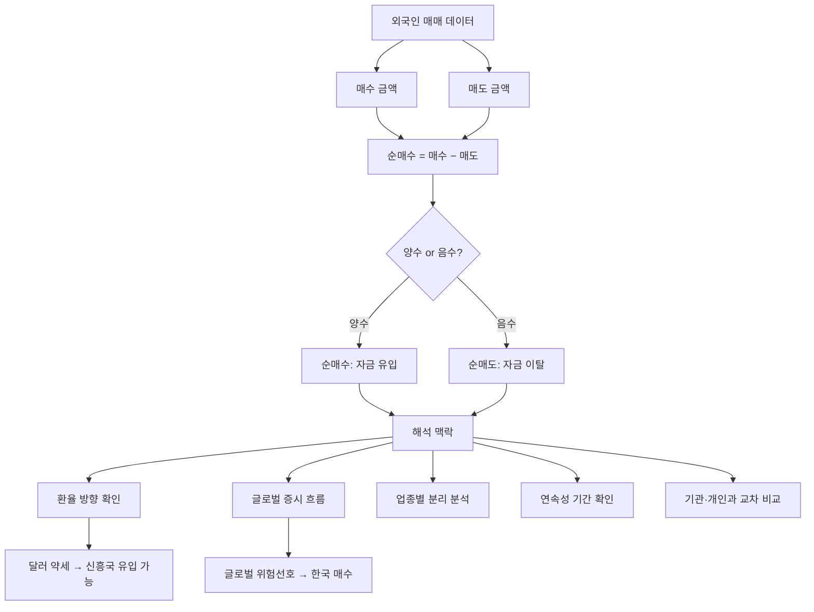

# 외국인 순매수 뜻, 외국인이 사면 주가가 오를까

"외국인이 삼성전자를 3,000억 원 순매수했습니다." 뉴스에서 매일 나오는 이 문장, 정확히 무슨 뜻이고 어떻게 활용해야 할까요?

## 한 줄 정의

외국인 순매수는 외국인 투자자가 특정 기간에 매수한 금액에서 매도한 금액을 뺀 값입니다.

## 아주 쉽게 말하면

놀이공원에 입장하는 사람과 퇴장하는 사람을 세는 것과 같습니다. 오늘 외국인이 놀이공원(한국 시장)에 1,000명 들어오고 600명 나갔으면, 순입장 400명. 이것이 "순매수"입니다.

금액으로 하면: 외국인이 오늘 A주식을 1,000억 원어치 사고, 500억 원어치 팔았으면 순매수는 +500억 원입니다. 판 것보다 산 게 500억 원 더 많다는 뜻이죠. 반대로 산 것보다 판 게 많으면 "순매도"라고 부릅니다.

## 왜 중요한가

- **시장 영향력**: 외국인은 한국 코스피 거래의 약 25~30%를 차지합니다. 이 규모의 자금이 한쪽으로 쏠리면 주가가 움직입니다.
- **추세 확인**: 외국인이 20일 이상 연속 순매수하면 강한 상승 추세의 신호로 해석됩니다.
- **글로벌 자금 흐름 신호**: 외국인 매수가 늘면 글로벌 자금이 한국으로 유입되고 있다는 의미입니다. 이는 환율·금리·신흥국 선호도와 연결됩니다.
- **스마트 머니 추적**: 외국인 중 상당수는 전문 기관(연기금, 국부펀드, 헤지펀드)으로, 이들의 움직임은 "정보에 기반한 거래"일 가능성이 높습니다.
- **뉴스 해독 능력**: 매일 나오는 수급 뉴스를 제대로 해석하려면 이 개념을 정확히 알아야 합니다.

## 그림으로 이해하기

_외국인 순매수는 단순 숫자가 아니라, 환율·글로벌 흐름·업종·연속성의 맥락에서 해석해야 합니다._

## 숫자로 보는 예시

> ⚠️ 아래 숫자는 개념 설명을 위한 **가상 예시**이며, 실제 투자 데이터가 아닙니다.

**가상 시나리오: 2024년 상반기 외국인 수급 흐름**

| 월 | 외국인 순매수 | 환율(원/달러) | 코스피 변동 | 주요 배경 |
|---|---|---|---|---|
| 1월 | +2.0조 | 1,300→1,280 | +5% | 달러 약세, 반도체 업황 기대 |
| 2월 | +0.5조 | 1,280→1,290 | +1% | 매수세 둔화 |
| 3월 | −1.5조 | 1,290→1,330 | −4% | 미국 금리 인상 우려 |
| 4월 | −3.0조 | 1,330→1,380 | −7% | 신흥국 자금 이탈 |
| 5월 | +1.0조 | 1,380→1,350 | +3% | 저가 매수 유입 |
| 6월 | +4.0조 | 1,350→1,300 | +8% | 반도체 실적 서프라이즈 |

**패턴 발견**: 외국인 순매수와 원/달러 환율은 역의 관계(환율 하락 = 외국인 유입)를 보이는 경우가 많습니다.

**업종별 외국인 순매수 (가상 6월)**

| 업종 | 순매수 | 해석 |
|---|---|---|
| 반도체 | +2.5조 | AI 수혜 기대, 글로벌 테마 |
| 자동차 | +0.8조 | 수출 호조, 환율 수혜 |
| 금융 | +0.5조 | 배당 매력, 저평가 |
| 바이오 | −0.3조 | 실적 불확실, 차익 실현 |
| 2차전지 | −1.0조 | 글로벌 경쟁 심화 우려 |

**같은 날 "코스피 전체 순매수"는 +3조인데, 업종별로 보면 명암이 갈립니다.**

## 표로 비교하기

| 구분 | 외국인 | 기관 | 개인 |
|---|---|---|---|
| 코스피 비중 | 약 30% | 약 20% | 약 50% |
| 대표 주체 | 글로벌 펀드, 국부펀드, 헤지펀드 | 연기금, 보험, 자산운용사 | 일반 투자자 |
| 매매 성향 | 추세 추종, 대형주 중심 | 분산·장기·리밸런싱 | 단기 매매, 역추세 |
| 정보 접근 | 글로벌 네트워크, 리서치 | 기업 탐방, 애널리스트 | 뉴스·커뮤니티 의존 |
| 환율 영향 | 직접적 (투자금 환전 필요) | 간접적 | 없음 |
| 특징 | 순매수 연속성이 강함 | 시장과 반대로 움직이는 경향 | 시장 고점에 매수 경향 |

## 초보자가 자주 하는 오해

**오해 1: 외국인이 사면 무조건 주가가 오른다**

외국인 순매수와 주가 상승이 일치하는 비율은 약 60~70%입니다. 즉 10번 중 3~4번은 외국인이 사도 주가가 빠집니다. 외국인도 단기 차익 실현 목적으로 매수하거나, 파생상품 헤지를 위한 현물 매수(방향과 무관)를 하기도 합니다.

**오해 2: 외국인 순매도가 나오면 무조건 팔아야 한다**

외국인이 파는 이유가 "한국 기업이 나빠서"가 아닐 수 있습니다. 본국 펀드의 환매 요청, 글로벌 리밸런싱(다른 나라로 자금 이동), 환율 헤지 만기 도래 등 한국 기업의 가치와 무관한 이유가 상당 비중을 차지합니다.

**오해 3: 외국인은 항상 맞는다**

외국인도 틀립니다. 2020년 코로나 초기에 외국인은 12조 원 이상을 순매도했지만, 이후 코스피는 1,400에서 3,300까지 올랐습니다. "외국인 = 스마트 머니"라는 공식은 항상 성립하지 않습니다.

## 고수는 이렇게 봅니다

숙련된 투자자는 외국인 수급을 단순 숫자가 아닌 맥락 속에서 해석합니다.

- **연속성 판단**: 1~2일 순매수는 의미 없습니다. 10일 이상 연속, 합산 2조 원 이상일 때 추세적 의미를 부여합니다.
- **환율 동시 분석**: 원/달러 환율 하락(원화 강세)과 외국인 매수가 동시에 나타나면 진정한 자금 유입입니다. 환율 상승 중 매수는 환차손을 감수한 것으로, 더 강한 확신의 신호입니다.
- **업종 분리**: 코스피 전체 순매수보다 "어떤 업종을 사는가"가 중요합니다. 반도체만 집중 매수하면 AI 테마, 금융주 매수면 배당·저평가 전략입니다.
- **3주체 교차 분석**: 외국인 매수 + 기관 매수 + 개인 매도 = 가장 강한 상승 신호. 외국인 매수 + 기관 매도 + 개인 매수 = 방향성 불명확.
- **프로그램 매매 구분**: 외국인 순매수 중 상당 부분이 차익거래 프로그램(선물-현물 차익)일 수 있습니다. 비차익 순매수만 분리해야 실질 수급을 알 수 있습니다.

## 기업분석에서는 이렇게 씁니다

개별 종목 분석에서 외국인 수급은 "보조 확인 지표"입니다.

- **지분율 추이**: 외국인 지분율이 6개월간 지속 상승 → 글로벌 기준으로도 매력적인 기업이라는 간접 증거. 지분율 30% 이상이면 "외국인 선호주"로 분류됩니다.
- **외국인 지분 상한 확인**: 특정 업종(방송, 통신 등)은 외국인 지분율 상한이 있습니다. 상한에 가까우면 추가 매수 여력이 제한되어 수급 동력이 약해집니다.
- **실적 전후 수급 변화**: 실적 발표 후 외국인이 매수를 늘리면 "실적을 긍정적으로 평가"라는 시장 해석. 반대로 실적이 좋은데 외국인이 팔면 "기대에 미달" 또는 "선반영 차익 실현"입니다.
- **환율 민감도**: 수출 기업은 원화 약세 시 외국인이 더 싸게 살 수 있고 기업 실적도 좋아져 이중 매력이 생깁니다. 환율과 연계해 외국인 매수 타이밍을 예측할 수 있습니다.

## 함께 보면 좋은 용어

- [기관 순매수 뜻](../level-02-market-trading/institutional-net-buying.md)
- [개인 순매수 뜻](../level-02-market-trading/individual-net-buying.md)
- [거래량 뜻](../level-01-basic/trading-volume.md)
- [코스피 뜻](../level-01-basic/kospi.md)
- [시가총액 뜻](../level-01-basic/market-cap.md)

## 정리

- 외국인 순매수 = 매수 금액 − 매도 금액이며, 양수면 유입, 음수면 이탈을 의미한다.
- 외국인은 코스피 거래의 약 30%를 차지하여 시장 영향력이 크지만, 항상 맞는 것은 아니다.
- 단순 숫자보다 연속성·환율·업종·3주체 교차를 함께 봐야 의미 있는 해석이 가능하다.
- 외국인 매매 이유(실적 기대, 환율, 글로벌 리밸런싱, 프로그램 매매)를 구분해야 한다.
- 개별 종목에서는 외국인 지분율 추이와 실적 전후 수급 변화를 보조 지표로 활용한다.

## 한 줄 요약

> 외국인 순매수는 외국인이 산 것에서 판 것을 뺀 값이며, 시장 방향의 유력한 참고 지표이지만 맹신해서는 안 됩니다.

---

이 글은 투자 권유가 아니라 주식 용어와 기업분석 방법을 설명하기 위한 교육 콘텐츠입니다. 특정 종목의 매수·매도 판단은 독자 본인의 책임입니다.

Tags: 외국인순매수, 수급, 주체별매매, 주식초보, 주식용어
