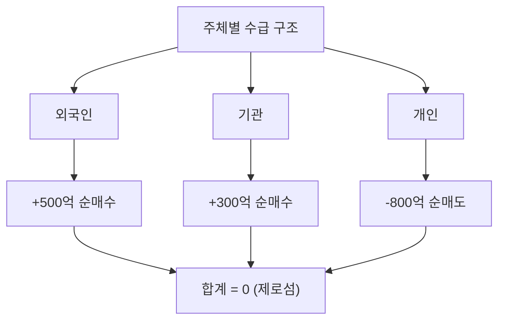

# 개인 순매수 뜻, 개인 투자자 수급을 해석하는 법

"개인이 1조 원 순매수!" 뉴스를 보면 개인 투자자의 힘이 대단해 보입니다.

하지만 개인 순매수가 항상 좋은 신호인 것은 아닙니다. 왜 그런지, 어떻게 해석해야 하는지 알아봅시다.

## 한 줄 정의

개인 순매수는 개인 투자자가 매수한 금액에서 매도한 금액을 뺀 값입니다.

## 아주 쉽게 말하면

여러분처럼 개인 증권 계좌로 주식을 사고파는 모든 사람의 매매를 합산한 것입니다.

개인 전체가 오늘 5,000억 원어치 사고 3,000억 원어치 팔았으면, 개인 순매수는 2,000억 원입니다.

## 왜 중요한가

- 개인은 한국 시장 거래의 약 50% 이상을 차지합니다.
- 시장 심리(탐욕, 공포)를 가장 직접적으로 반영합니다.
- 역사적으로 개인이 대량 매수할 때가 고점, 대량 매도할 때가 저점인 경우가 많았습니다 (역지표).
- 최근에는 개인 투자자의 수준이 높아져 단순히 역지표로만 보기 어렵습니다.

## 그림으로 이해하기

_주체별 순매수를 모두 합하면 항상 0입니다. 누군가의 매수는 누군가의 매도입니다._

## 숫자로 보는 예시

역사적 패턴 (가상 예시):

- 2020년 3월 (코로나 급락): 개인 순매수 +12조 원 → 이후 시장 큰 폭 반등 (개인 승리)
- 2021년 하반기 (고점): 개인 순매수 +20조 원 → 이후 시장 하락 (개인 물림)

개인 순매수 자체로는 방향을 예측할 수 없습니다. 맥락이 중요합니다.

## 표로 비교하기

| 상황 | 개인 순매수 | 외국인·기관 | 결과 (역사적 경향) |
|---|---|---|---|
| 시장 급락 후 | 대량 순매수 | 순매도 | 반등 시 개인 수익 가능 |
| 시장 과열기 | 대량 순매수 | 순매도 | 고점 물림 위험 |
| 시장 바닥 확인 | 순매도 (포기) | 순매수 시작 | 이후 상승 전환 |
| 테마·뉴스 급등 | 뒤늦게 순매수 | 차익 실현 매도 | 개인 고점 매수 위험 |

## 초보자가 자주 하는 오해

**오해 1: 개인이 많이 사면 주가가 오른다**

개인 매수는 주가 상승의 원인이 되기도 하지만, 이미 많이 오른 뒤 뒤늦게 뛰어드는 경우도 많습니다. "개인이 많이 산다"는 정보만으로는 좋은 신호인지 나쁜 신호인지 판단할 수 없습니다.

**오해 2: 개인은 항상 틀린다 (역지표)**

과거에는 개인 투자자가 정보력에서 열세여서 역지표로 불렸습니다. 하지만 정보 접근성이 높아진 현재는 꼭 그렇지 않습니다. 2020년 코로나 저점 매수처럼 개인이 맞는 경우도 많습니다.

## 고수는 이렇게 봅니다

숙련된 투자자는 개인 수급을 "시장 심리 지표"로 활용합니다.

- 개인이 극단적으로 사거나 팔 때 → 감정적 극단에 도달했을 가능성
- 개인 신용잔고(빚투)가 급증할 때 → 과열 신호
- 개인이 포기하고 떠날 때 → 역설적으로 바닥 신호일 수 있음

숫자보다 "분위기"를 읽는 도구로 씁니다.

## 기업분석에서는 이렇게 씁니다

개별 종목 분석에서 개인 수급은 참고 수준입니다.

- 개인만 대량 매수하고 기관·외국인이 무관심한 종목 → 테마성 급등일 가능성, 신중해야 함
- 개인 비중이 90% 이상인 종목 → 유동성·변동성 리스크 주의
- 개인·기관·외국인 모두 매수하는 종목 → 시장 전체가 동의하는 흐름

## 함께 보면 좋은 용어

- [외국인 순매수 뜻](../level-02-market-trading/foreign-net-buying.md)
- [기관 순매수 뜻](../level-02-market-trading/institutional-net-buying.md)
- [신용거래 뜻](../level-02-market-trading/margin-trading.md)
- [거래량 뜻](../level-01-basic/trading-volume.md)
- [상한가 뜻](../level-01-basic/upper-limit.md)

## 정리

- 개인 순매수 = 개인 투자자의 매수 금액 - 매도 금액이다.
- 개인은 한국 시장 거래의 절반 이상을 차지한다.
- 개인 수급은 시장 심리를 반영하지만, 단독으로 방향을 예측하는 데 쓰면 위험하다.

## 한 줄 요약

> 개인 순매수는 일반 투자자들의 매매 방향을 보여주며, 시장 심리를 읽는 보조 지표로 활용해야 합니다.

---

*면책 조항: 이 글은 투자 권유가 아니라 주식 용어와 기업분석 방법을 설명하기 위한 교육 콘텐츠입니다. 특정 종목의 매수·매도 판단은 독자 본인의 책임입니다.*

Tags: 개인순매수, 개인투자자, 수급, 주식초보, 주식용어
