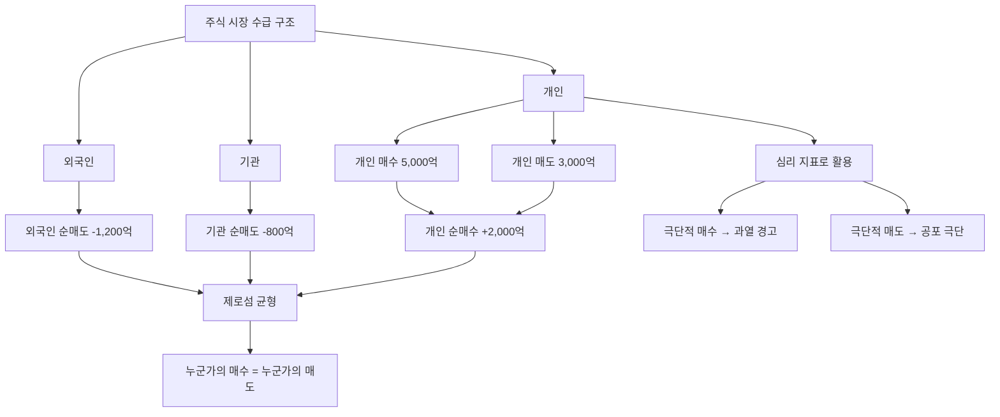

# 개인 순매수 뜻, 개인 투자자 수급을 해석하는 법

"개인 1조 원 순매수!" 뉴스 헤드라인을 보면 개인 투자자의 힘이 대단해 보입니다. 하지만 숙련된 투자자일수록 이 숫자를 보며 걱정부터 합니다. 왜일까요?

개인 순매수는 단순히 "많이 샀으니 오른다"가 아닙니다. 맥락에 따라 정반대 의미를 가질 수 있는, 해석이 까다로운 지표입니다. 이 글에서 그 이유를 차근차근 풀어보겠습니다.

## 한 줄 정의

개인 순매수는 일정 기간 동안 개인 투자자 전체가 매수한 금액에서 매도한 금액을 뺀 값입니다.

## 아주 쉽게 말하면

여러분처럼 개인 증권 계좌로 주식을 사고파는 모든 사람의 거래를 합산한 것입니다. 전국의 개인 투자자가 오늘 하루 동안 5,000억 원어치 사고 3,000억 원어치 팔았다면, 개인 순매수는 +2,000억 원입니다.

반대로 3,000억 원 사고 5,000억 원 팔았다면 개인 순매도 2,000억 원(순매수 -2,000억 원)이 됩니다.

## 왜 중요한가

개인 투자자는 한국 시장에서 독특한 위치를 차지합니다.

- **거래 비중 50% 이상** — 코스피·코스닥 거래의 절반 이상이 개인 물량입니다.
- **심리 반영** — 뉴스, SNS, 커뮤니티에 가장 빠르게 반응하는 주체입니다.
- **역지표 논쟁** — 과거 통계상 개인이 대량 매수한 시점이 고점이고, 포기 매도한 시점이 저점인 경우가 많아 "역지표"로 불립니다.
- **변화하는 위상** — 2020년 이후 정보 접근성 향상으로 개인의 판단력이 과거와 다르다는 의견도 있습니다.

이처럼 개인 순매수는 단순한 숫자가 아니라 **시장 심리의 온도계** 역할을 합니다.

## 그림으로 이해하기

_세 주체(외국인·기관·개인)의 순매수를 합치면 항상 0입니다. 시장은 철저한 제로섬 구조입니다._

## 숫자로 보는 예시

가상의 종합주가지수 흐름을 통해 개인 순매수의 의미를 살펴봅시다.

**시나리오: 가상 코스피 2023년 1분기 → 2024년 4분기**

| 시점 | 지수 | 개인 순매수(월) | 외국인 | 기관 | 이후 3개월 |
|---|---|---|---|---|---|
| 2023년 3월 | 2,200 | +4.5조 | -3.0조 | -1.5조 | 지수 2,100 하락 |
| 2023년 9월 | 2,050 | -2.0조 (투매) | +1.5조 | +0.5조 | 지수 2,300 반등 |
| 2024년 1월 | 2,450 | +6.0조 | -4.0조 | -2.0조 | 지수 2,200 조정 |
| 2024년 10월 | 2,100 | -3.5조 (포기) | +2.5조 | +1.0조 | 지수 2,400 회복 |

패턴이 보이시나요? 개인이 극단적으로 많이 살 때 지수가 빠지고, 포기할 때 반등하는 경향이 나타납니다. 하지만 **매번 그런 것은 아닙니다**. 2020년 코로나 저점에서 개인의 대량 매수는 결과적으로 정확한 판단이었습니다.

핵심은 "개인 순매수 자체"가 아니라 **"어떤 맥락에서 극단적인가"**입니다.

## 표로 비교하기

| 구분 | 개인 순매수 ↑↑ (대량 매수) | 개인 순매도 ↑↑ (대량 매도) |
|---|---|---|
| 시장 심리 | 탐욕·낙관 극대화 | 공포·비관 극대화 |
| 역사적 경향 | 고점 근처일 가능성 | 저점 근처일 가능성 |
| 신용잔고 | 동시에 급증하면 위험 신호 | 반대매매 동반 시 바닥 신호 |
| 뉴스 톤 | "이번엔 다르다" | "주식 폐지해야" |
| 외국인·기관 | 동시에 매도 중 | 슬금슬금 매수 전환 |
| 정보 비대칭 | 뒤늦은 뉴스 추종 매수 | 감정적 손절 매도 |

| 상황별 해석 | 개인 행동 | 외국인·기관 | 역사적 결과 |
|---|---|---|---|
| 시장 급락 직후 | 공포에 매도 | 저가 매수 시작 | 이후 반등 (개인 손실) |
| 시장 급락 직후 | 용기 있게 매수 | 여전히 매도 | 이후 추가 하락 가능 |
| 과열 랠리 | 뒤늦게 대량 매수 | 차익 실현 매도 | 고점 후 조정 |
| 장기 횡보 후 | 지쳐서 매도 | 조용히 매집 | 이후 상승 전환 |

## 초보자가 자주 하는 오해

**오해 1: "개인이 많이 사면 주가가 오른다"**

개인 매수가 주가를 밀어올리는 힘이 되기도 하지만, 이미 충분히 오른 뒤에 뛰어드는 "추격 매수"인 경우가 더 많습니다. 특히 뉴스에 개인 순매수가 크게 보도될 때는 이미 상당 부분 올라온 뒤입니다.

**오해 2: "개인은 항상 틀린다 (무조건 역지표)"**

과거에는 정보 접근성 차이가 컸기에 역지표 성격이 강했습니다. 그러나 2020년 이후 개인 투자자의 분석 수준이 높아지면서 꼭 그렇지만은 않습니다. "항상 역지표"라고 단정하는 것도 위험한 일반화입니다.

**오해 3: "개인 순매수 데이터만 보면 타이밍을 잡을 수 있다"**

개인 순매수는 후행 지표입니다. 오늘 발표되는 수치는 이미 어제의 거래 결과입니다. 이 데이터 하나로 매매 타이밍을 잡으려는 시도는 백미러만 보고 운전하는 것과 같습니다.

## 고수는 이렇게 봅니다

숙련된 투자자는 개인 순매수를 **절대값이 아닌 극단값**으로 읽습니다.

- **평소 대비 2~3배 이상 순매수** → 시장 탐욕 극에 달했을 가능성. 신규 진입 자제 고려.
- **평소 대비 2~3배 이상 순매도 + 신용 반대매매 급증** → 공포 극단. 우량주 분할매수 검토.
- **개인 신용잔고 추이** → 순매수보다 "빚으로 산 비중"이 더 강력한 과열 신호입니다.
- **개별 종목 vs 시장 전체** — 시장 전체 개인 순매수는 심리 지표로 유효하지만, 개별 종목은 대주주 매도 등 노이즈가 커서 해석이 어렵습니다.
- **투자자 예탁금 잔고** — 개인이 증권사에 넣어둔 대기 자금도 함께 봅니다. 예탁금이 빠지면서 순매수가 늘면 "마지막 총알"을 쏘는 셈이라 경계합니다.

## 기업분석에서는 이렇게 씁니다

개별 종목 분석에서 개인 수급은 **보조 판단 재료**입니다.

가상 기업 "미래테크"의 사례를 봅시다.

- 분기 실적 발표 후 개인만 대량 매수, 외국인·기관 무반응 → 테마성 기대 매수일 가능성이 높습니다. 실적 개선이 지속 가능한지 추가 확인이 필요합니다.
- 개인 보유 비중이 전체 유통주식의 85% 이상 → 기관 커버리지 부재, 유동성 급변 위험 존재. 매수·매도 호가 간격이 넓어 슬리피지가 클 수 있습니다.
- 외국인·기관·개인 동시에 순매수 → 시장 참여자 전체가 동의하는 방향. 상대적으로 신뢰도 높은 흐름입니다.
- 개인이 6개월 이상 꾸준히 순매도 → "관심 이탈" 구간. 역설적으로 악재가 주가에 충분히 반영됐을 수 있습니다.

## 함께 보면 좋은 용어

- [외국인 순매수 뜻](../level-02-market-trading/foreign-net-buying.md)
- [기관 순매수 뜻](../level-02-market-trading/institutional-net-buying.md)
- [신용거래 뜻](../level-02-market-trading/margin-trading.md)
- [거래량 뜻](../level-01-basic/trading-volume.md)
- [상한가 뜻](../level-01-basic/upper-limit.md)

## 정리

- 개인 순매수 = 개인 투자자 전체의 매수 금액 - 매도 금액이다.
- 한국 시장 거래의 절반 이상을 차지하므로 시장 심리를 가장 직접 반영한다.
- 역사적으로 극단적 개인 순매수는 고점, 극단적 순매도는 저점 근처일 때가 많았다.
- 단, "항상 역지표"라는 공식은 없다. 맥락(시장 국면, 신용잔고, 외국인·기관 동향)을 함께 봐야 한다.
- 개별 종목보다 시장 전체 수급에서 심리 지표로 쓸 때 유효성이 높다.

## 한 줄 요약

> 개인 순매수는 시장 심리의 온도계이며, 극단값일 때 비로소 의미 있는 신호가 됩니다.

---

이 글은 투자 권유가 아니라 주식 용어와 기업분석 방법을 설명하기 위한 교육 콘텐츠입니다. 특정 종목의 매수·매도 판단은 독자 본인의 책임입니다.

Tags: 개인순매수, 개인투자자, 수급, 주식초보, 주식용어
