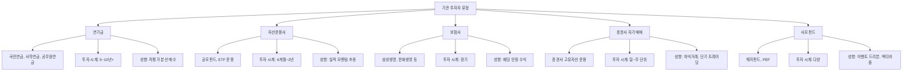

# 기관 순매수 뜻, 기관 투자자의 매매를 보는 법

"기관이 대량 매수에 나섰습니다." 뉴스에서 자주 보는 이 말, 여기서 '기관'이 정확히 누구이고 왜 중요할까요?

## 한 줄 정의

기관 순매수는 기관 투자자(연기금·자산운용사·보험사·증권사 등)가 매수한 금액에서 매도한 금액을 뺀 값입니다.

## 아주 쉽게 말하면

개인 투자자가 "용돈으로 주식 사는 학생"이라면, 기관 투자자는 "수백억~수조 원을 운용하는 전문 회사"입니다. 국민연금, 삼성자산운용, 한화생명 같은 곳이죠.

이들이 오늘 A주식을 2,000억 원어치 사고 800억 원어치 팔았으면, 기관 순매수는 +1,200억 원입니다. "전문가 집단이 이 주식을 더 사고 싶어한다"는 의미로 해석됩니다. 다만 "왜 사는지"까지 파악해야 진짜 의미를 알 수 있습니다.

## 왜 중요한가

- **정보력 우위**: 기관은 전담 애널리스트, 기업 탐방, 경영진 미팅 등 개인이 접근하기 어려운 정보를 활용합니다.
- **자금 규모 영향**: 연기금 하나가 수천억 원을 한 종목에 투입하면 수급만으로 주가가 움직입니다.
- **하방 지지 역할**: 연기금이 꾸준히 매수하는 종목은 급락 시 "연기금 방어벽"이 생겨 하방이 제한됩니다.
- **투자 시계의 다양성**: 연기금(5~10년), 펀드(6개월~2년), 증권사(일~주 단위)별로 투자 기간이 달라 각각 다른 정보를 줍니다.
- **프로그램 매매 구분**: 기관 순매수 중 상당 부분이 선물-현물 차익거래(프로그램)일 수 있어, 실질 매수와 구분이 필요합니다.

## 그림으로 이해하기

_'기관'이라는 한 단어 안에 전혀 다른 성격의 투자자들이 섞여 있습니다._

## 숫자로 보는 예시

> ⚠️ 아래 숫자는 개념 설명을 위한 **가상 예시**이며, 실제 투자 데이터가 아닙니다.

**가상 종목 "한빛전자" — 기관 주체별 매매 분해**

| 기관 유형 | 매수 | 매도 | 순매수 | 해석 |
|---|---|---|---|---|
| 연기금 | 500억 | 100억 | +400억 | 장기 가치 매수 |
| 자산운용 | 300억 | 200억 | +100억 | 펀드 편입 |
| 보험 | 100억 | 300억 | −200억 | 포트폴리오 리밸런싱 |
| 증권사 자기매매 | 800억 | 700억 | +100억 | 프로그램 매매 가능성 |
| **기관 합계** | **1,700억** | **1,300억** | **+400억** | — |

합산 +400억이지만, 진짜 의미 있는 매수는 연기금 +400억입니다. 증권사 +100억은 프로그램일 수 있고, 보험은 오히려 팔고 있습니다.

**기관 연속 매수의 힘 (가상 시나리오)**

| 기간 | 기관 누적 순매수 | 주가 변화 | 주도 주체 |
|---|---|---|---|
| 1~5일 | +500억 | +2% | 자산운용 중심 |
| 6~10일 | +1,500억 (누적 2,000억) | +5% | 연기금 합류 |
| 11~20일 | +4,000억 (누적 6,000억) | +12% | 연기금+자산운용 동시 |
| 21~30일 | +2,000억 (누적 8,000억) | +15% | 매수 강도 둔화 |

연기금이 합류한 6일차부터 상승 기울기가 급해졌습니다. 연기금의 합류는 "장기 가치 인정"의 신호입니다.

**프로그램 매매 vs 실질 매매 구분**

| 구분 | 프로그램 매매 | 실질(비프로그램) 매매 |
|---|---|---|
| 원인 | 선물-현물 차익거래 | 기업 가치 판단 |
| 지속성 | 1~2일 | 수주~수개월 |
| 의미 | 기업과 무관 | 펀더멘털 반영 |
| 확인법 | 선물 만기 전후 급증 | 꾸준한 누적 |

## 표로 비교하기

| 기관 유형 | 투자 시계 | 매매 특징 | 주가 영향 | 신뢰도 |
|---|---|---|---|---|
| 연기금 | 5~10년 | 저평가 분산 매수, 하방 지지 | 장기 방향성 | 높음 |
| 자산운용사 | 6개월~2년 | 실적 모멘텀 추종 | 중기 추세 | 중간 |
| 보험사 | 장기 | 배당주 선호, 안정 추구 | 배당주 지지 | 중간 |
| 증권사 자기매매 | 일~주 | 프로그램·차익 매매 | 단기 노이즈 | 낮음 |
| 사모펀드 | 다양 | 이벤트 드리븐, 행동주의 | 이벤트성 급등 | 상황별 |

## 초보자가 자주 하는 오해

**오해 1: 기관이 사면 반드시 오른다**

기관도 실수합니다. 펀드 설정(새 펀드에 자금 유입) 때문에 기계적으로 매수하거나, 벤치마크 추종을 위해 가치와 무관하게 사는 경우도 있습니다. 또한 기관이 산 후에도 시장 전체가 급락하면 함께 빠집니다.

**오해 2: 기관은 한 덩어리로 같은 방향으로 움직인다**

연기금은 사는데 자산운용사는 파는 경우가 일상적입니다. "기관 순매수 +300억"이라는 숫자 안에 "+500억(연기금) + (−200억)(운용사)"가 숨어 있을 수 있습니다. 합산 숫자만 보면 실질을 놓칩니다.

**오해 3: 기관 순매수 데이터는 실시간이다**

기관 순매수 데이터는 장 마감 후 15:40 이후에 확정됩니다. 장중에 보이는 수치는 추정치이며 최종 수치와 다를 수 있습니다. 장중 "기관 매수" 뉴스를 보고 뒤따라 매수하면 이미 늦을 수 있습니다.

## 고수는 이렇게 봅니다

숙련된 투자자는 기관 매매에서 "누가, 얼마나 오래, 왜"를 파악합니다.

- **주체 분리 확인**: 한국거래소 투자자별 매매동향에서 연기금·투신·보험·증권사를 분리해 봅니다. 연기금 단독 순매수가 의미가 가장 큽니다.
- **연속성 판단**: 기관이 5일 이상 연속 순매수하고, 누적 금액이 시총의 1% 이상이면 의미 있는 수급으로 봅니다.
- **프로그램 제외**: "비프로그램 기관 순매수"를 별도로 확인합니다. 프로그램 매매를 제외해야 기업 가치에 기반한 실질 수급을 알 수 있습니다.
- **3주체 교차**: 외국인 매수 + 기관 매수 + 개인 매도 = 가장 강력한 상승 신호. 반대로 기관만 사고 외국인·개인 모두 팔면 기관의 단독 행보이므로 신중하게 봅니다.
- **펀드 플로우 체크**: 국내 주식형 펀드에 자금이 순유입되면 자산운용사의 매수가 구조적으로 늘어납니다. 이 경우 특정 기업 선호가 아닌 시장 전체 자금 유입입니다.

## 기업분석에서는 이렇게 씁니다

기업분석에서 기관 수급은 "내 분석의 시장 검증" 역할을 합니다.

- **분석 확신 강화**: 내가 저평가라고 판단한 종목에 연기금이 꾸준히 매수 중이면, 분석의 방향이 맞을 가능성이 높아집니다.
- **반대 방향 점검**: 내 판단과 기관의 방향이 반대이면, 내 분석의 사각지대(놓친 리스크)를 재점검합니다.
- **연기금 포트폴리오 역추적**: 연기금이 5% 이상 보유한 종목 리스트를 저평가 후보군으로 활용합니다.
- **펀드 환매 리스크**: 자산운용사가 대량 매도하는 이유가 펀드 환매(자금 유출)인 경우, 기업 가치와 무관한 매도이므로 오히려 매수 기회가 될 수 있습니다.
- **기관 보유 비중 변화**: 기관 지분율이 분기마다 올라가는 종목은 "기관 러브콜"을 받는 것으로, 중장기 안정적 상승이 기대됩니다.

## 함께 보면 좋은 용어

- [외국인 순매수 뜻](../level-02-market-trading/foreign-net-buying.md)
- [개인 순매수 뜻](../level-02-market-trading/individual-net-buying.md)
- [거래량 뜻](../level-01-basic/trading-volume.md)
- [배당 뜻](../level-06-events/dividend.md)
- [PER 뜻](../level-05-valuation/per.md)

## 정리

- 기관 순매수 = 기관의 매수 금액 − 매도 금액이며, 기관은 연기금·자산운용·보험·증권사 등을 포함한다.
- 기관 내에서도 주체별 투자 성향이 완전히 다르므로, 합산 수치보다 주체 분리가 중요하다.
- 연기금의 연속 매수가 가장 의미 있는 신호이며, 프로그램 매매는 노이즈로 분류한다.
- 기관이 사도 시장 전체 급락에는 함께 빠지므로, 기관 매수 = 상승 보장이 아니다.
- 기업분석에서는 기관 수급을 "분석의 시장 검증"으로 활용한다.

## 한 줄 요약

> 기관 순매수는 전문 투자자들의 매매 방향을 보여주지만, 주체별 성향이 다르므로 합산 수치만으로 판단하면 안 됩니다.

---

이 글은 투자 권유가 아니라 주식 용어와 기업분석 방법을 설명하기 위한 교육 콘텐츠입니다. 특정 종목의 매수·매도 판단은 독자 본인의 책임입니다.

Tags: 기관순매수, 기관투자자, 수급, 주식초보, 주식용어
