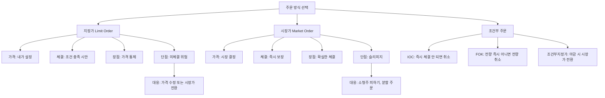

# 지정가와 시장가 차이, 주문 방식 쉽게 이해하기

## 한 줄 정의

지정가는 내가 원하는 가격을 지정해 체결을 기다리는 주문, 시장가는 가격에 관계없이 즉시 체결하는 주문입니다.

## 아주 쉽게 말하면

택시를 타는 두 가지 방법을 떠올려보세요.

- **지정가** = "기본요금 4,800원 이하 택시만 탈게요." → 조건에 맞는 택시가 올 때까지 기다려야 합니다. 안 오면 못 탑니다.
- **시장가** = "아무 택시든 지금 당장 타겠습니다." → 즉시 탈 수 있지만, 할증 시간이면 비싼 요금을 내야 합니다.

주식도 같습니다. 지정가는 원하는 가격을 고집하되 못 살 수 있고, 시장가는 반드시 사되 예상보다 비쌀 수 있습니다.

## 왜 중요한가

- **수익률 직접 영향**: 매수가 10,000원 vs 10,200원 차이가 2%입니다. 100번 매매하면 누적 차이가 큽니다.
- **체결 확실성 트레이드오프**: 급등주를 못 사는 것도 손해, 불리한 가격에 사는 것도 손해. 상황별 판단이 필요합니다.
- **슬리피지 관리**: 시장가의 불리한 체결(슬리피지)은 단타 트레이더의 수익을 갉아먹는 주범입니다.
- **조건부 주문 활용**: 지정가를 응용한 조건부 주문(IOC, FOK 등)을 이해하면 고급 매매가 가능합니다.
- **유동성에 따른 선택**: 대형주와 소형주에서 최적의 주문 방식이 다릅니다.

## 그림으로 이해하기

_상황에 따라 주문 방식을 바꿔 사용하는 것이 실전 매매의 기본기입니다._

## 숫자로 보는 예시

> ⚠️ 아래 숫자는 개념 설명을 위한 **가상 예시**이며, 실제 투자 데이터가 아닙니다.

**가상 시나리오: "지수"의 한빛전자 매수**

현재 한빛전자 호가창:

| 호가 | 매도 잔량 | 매수 잔량 |
|---|---|---|
| 10,300원 | 2,000주 | — |
| 10,200원 | 1,500주 | — |
| 10,100원 | 800주 | — |
| 10,000원 | — | 1,200주 |
| 9,900원 | — | 3,000주 |

지수가 2,000주를 사고 싶을 때:

| 주문 방식 | 결과 | 평균 체결가 | 현재가 대비 |
|---|---|---|---|
| 지정가 10,000원 | 미체결 (호가에 대기) | — | 기다림 |
| 지정가 10,100원 | 800주만 체결, 1,200주 대기 | 10,100원 | +1% |
| 시장가 | 800주@10,100 + 1,200주@10,200 | 10,160원 | +1.6% |
| 지정가 10,200원 | 800주@10,100 + 1,200주@10,200 전량 체결 | 10,160원 | +1.6% |

지정가 10,200원과 시장가의 결과가 같습니다. 하지만 호가가 급변하는 상황에서는 시장가가 10,300원까지 밀릴 수 있습니다.

**슬리피지 비교: 대형주 vs 소형주**

| 종목 유형 | 일거래대금 | 스프레드 | 시장가 1,000만원 슬리피지 |
|---|---|---|---|
| 대형주 (삼성전자급) | 1조 원+ | 0.01% | 거의 없음 (100원 이내) |
| 중형주 | 100억~500억 | 0.1~0.3% | 1~3만 원 |
| 소형주 | 10억 미만 | 1~3% | 10~30만 원 |

소형주에 시장가로 1,000만 원을 한 번에 넣으면 30만 원을 손해볼 수 있습니다.

**1년간 주문 방식별 누적 차이**

| 매매 스타일 | 연간 매매 횟수 | 매번 슬리피지 0.2% 시 연간 손실 |
|---|---|---|
| 장기 투자 | 4회 | 0.8% (무시 가능) |
| 스윙 트레이딩 | 50회 | 10% (수익률 크게 잠식) |
| 데이트레이딩 | 500회 | 100% (슬리피지만으로 원금 소멸) |

## 표로 비교하기

| 구분 | 지정가 | 시장가 | 조건부지정가 | IOC |
|---|---|---|---|---|
| 가격 통제 | ◎ 완전 통제 | × 통제 불가 | ○ 마감까지 | ○ 즉시만 |
| 체결 확실성 | △ 불확실 | ◎ 즉시 보장 | ○ 마감 시 보장 | △ 부분 가능 |
| 슬리피지 | 없음 | 있음 | 마감 시 있음 | 적음 |
| 미체결 처리 | 장 마감 취소 | 해당 없음 | 시장가 전환 | 즉시 취소 |
| 적합 상황 | 평시 매매 | 긴급 체결 | 당일 반드시 체결 원할 때 | 빠른 부분 체결 |
| 초보 추천 | ◎ | △ | ○ | × |

## 초보자가 자주 하는 오해

**오해 1: 시장가 주문 = 현재 화면에 보이는 가격에 체결**

시장가는 "지금 시장에서 가능한 최선의 가격"에 체결됩니다. 주문을 넣는 0.1초 사이에도 가격이 변할 수 있고, 호가창에 물량이 부족하면 2호가, 3호가까지 밀려서 체결됩니다. 특히 장 시작 직후나 급등락 시에는 화면 가격과 1~3% 차이가 날 수 있습니다.

**오해 2: 지정가를 걸어두면 반드시 체결된다**

주가가 내 지정 가격까지 왔어도 "시간 우선 원칙"에 의해 나보다 먼저 같은 가격에 주문한 사람이 우선 체결됩니다. 인기 종목의 인기 가격대에서는 수천 명이 같은 가격에 대기하고 있어, 주가가 스쳐 지나가기만 하면 내 차례가 안 올 수 있습니다.

**오해 3: 비싼 종목은 시장가가 위험하고, 싼 종목은 괜찮다**

정반대입니다. 삼성전자 같은 대형주는 호가 간격이 좁고 물량이 풍부해 시장가도 안전합니다. 반면 1,000원짜리 소형주는 호가 간격이 넓고(50원 = 5%) 물량이 적어, 시장가 주문 시 5~10% 불리하게 체결될 수 있습니다.

## 고수는 이렇게 봅니다

숙련된 투자자는 주문 방식을 "전략의 일부"로 사용합니다.

- **단계적 지정가 설정**: "10,000원에 30%, 9,800원에 30%, 9,600원에 40%" 식으로 분할 지정가를 설정해, 어디까지 빠지든 평균 매수가를 관리합니다.
- **시장가 사용 조건 명확화**: (1) 대형주만, (2) 손절 시만, (3) 긴급 이벤트 대응 시만. 이 세 경우 외에는 절대 시장가를 쓰지 않습니다.
- **호가 스프레드 확인 후 결정**: 매수 1호가와 매도 1호가 차이(스프레드)가 0.1% 이하면 시장가도 무방, 1% 이상이면 반드시 지정가를 씁니다.
- **IOC 활용**: "지금 체결 가능한 만큼만 사고, 나머지는 취소하라." 시장가의 속도 + 지정가의 가격 통제를 결합한 방식입니다.
- **조건부지정가로 당일 매매 보장**: "10,100원에 지정가로 대기하되, 장 마감 시까지 미체결이면 시장가로 전환하라." 반드시 당일 체결이 필요할 때 사용합니다.

## 기업분석에서는 이렇게 씁니다

기업분석과 주문 방식은 직접 관련이 없지만, 분석 결과를 실행할 때 주문 전략이 수익률을 좌우합니다.

- **적정가 기반 지정가**: DCF로 적정가 70,000원을 산출했다면, 안전마진 20%를 적용해 56,000원에 지정가 매수를 설정합니다. 주가가 안 내려오면 기다립니다. 저평가 매수의 핵심은 인내입니다.
- **긴급 매도 시 시장가**: 분석 전제가 깨지는 뉴스(예: 주력 제품 결함)가 나오면, 0.5% 슬리피지를 감수하고 시장가로 즉시 탈출합니다. 여기서 지정가를 고집하면 추가 −5~10% 손실을 볼 수 있습니다.
- **분할 진입 지정가**: 1,000만 원 투자 시 한 번에 넣지 않고, 적정가·적정가−5%·적정가−10% 세 단계에 각각 333만 원씩 지정가를 설정합니다.
- **유동성 검증**: 분석 대상 종목의 일거래대금이 투자 예정 금액의 10배 이상인지 확인합니다. 미달이면 지정가로 수일에 걸쳐 분할 매수합니다.

## 함께 보면 좋은 용어

- [호가 뜻](../level-02-market-trading/order-book.md)
- [체결 뜻](../level-02-market-trading/execution.md)
- [매수와 매도 뜻](../level-02-market-trading/buy-sell.md)
- [거래량 뜻](../level-01-basic/trading-volume.md)
- [분할매수 뜻](../level-10-company-analysis/dollar-cost-averaging.md)

## 정리

- 지정가는 가격을 내가 정하고 체결을 기다리는 주문(가격 확정, 체결 불확실)이다.
- 시장가는 즉시 체결되지만 가격을 시장에 맡기는 주문(체결 확실, 가격 불확실)이다.
- 슬리피지는 시장가의 숨은 비용이며, 소형주·급변 시 특히 크다.
- 초보자는 지정가를 기본으로, 손절 시에만 시장가를 사용하는 것이 합리적이다.
- 숙련된 투자자는 IOC·조건부지정가·분할 지정가를 상황별로 활용한다.

## 한 줄 요약

> 지정가는 가격을 내가 정하고 기다리는 주문, 시장가는 즉시 체결되지만 가격을 시장에 맡기는 주문이며, 상황별로 구분해 써야 합니다.

---

이 글은 투자 권유가 아니라 주식 용어와 기업분석 방법을 설명하기 위한 교육 콘텐츠입니다. 특정 종목의 매수·매도 판단은 독자 본인의 책임입니다.

Tags: 지정가, 시장가, 주문방식, 주식초보, 주식용어
