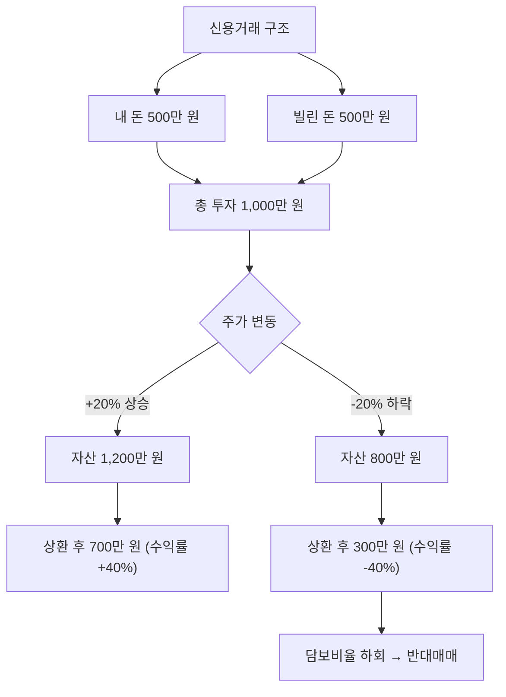

# 신용거래 뜻, 빚을 내서 주식을 사는 구조

"빚투(빚내서 투자)"라는 말을 들어본 적 있나요? 신용거래가 바로 그것입니다.

증권사에서 돈을 빌려 주식을 사는 것인데, 수익도 커지지만 위험도 배로 커집니다.

## 한 줄 정의

신용거래는 증권사에서 돈을 빌려 주식을 매수하는 거래 방식입니다.

## 아주 쉽게 말하면

내 돈 500만 원에 증권사에서 500만 원을 빌려서 총 1,000만 원어치 주식을 사는 것입니다.

주가가 오르면 빌린 돈을 갚고도 수익이 크지만, 주가가 내리면 빌린 돈은 갚아야 하므로 손실이 두 배로 됩니다.

## 왜 중요한가

- 레버리지(지렛대) 효과로 적은 자본으로 큰 수익을 노릴 수 있습니다.
- 반대로 손실도 증폭되어 원금 이상 잃을 수 있습니다.
- 일정 기간 내에 갚아야 하므로 시간 압박이 있습니다.
- 주가가 일정 수준 이하로 떨어지면 강제 청산(반대매매)당합니다.
- 시장 전체 신용잔고가 높으면 시장 과열 신호로 해석됩니다.

## 그림으로 이해하기

_같은 주가 변동이라도 레버리지로 인해 수익률이 2배로 움직입니다._

## 숫자로 보는 예시

> ⚠️ 아래 숫자는 개념 설명을 위한 **가상 예시**이며, 실제 투자 데이터가 아닙니다.

신용 비율 50% (내 돈 50%, 빌린 돈 50%)로 투자 시:

| 주가 변동 | 실제 자산 변동 | 내 수익률 | 비고 |
|---|---|---|---|
| +30% | 1,300만 원 | +60% | 수익 2배 |
| +10% | 1,100만 원 | +20% | 수익 2배 |
| -10% | 900만 원 | -20% | 손실 2배 |
| -30% | 700만 원 | -60% | 손실 2배 |
| -50% | 500만 원 | -100% | 원금 전액 손실 |

## 표로 비교하기

| 구분 | 현금 매수 | 신용거래 |
|---|---|---|
| 투자 가능 금액 | 내 돈만큼 | 내 돈 + 빌린 돈 |
| 수익 배율 | 1배 | 약 2배 |
| 손실 배율 | 1배 | 약 2배 |
| 시간 제한 | 없음 | 상환 기한 있음 (보통 90~180일) |
| 강제 청산 | 없음 | 담보비율 하회 시 반대매매 |
| 비용 | 없음 | 이자 (연 5~9%) |
| 적합한 경우 | 대부분의 투자 | 확신이 매우 높을 때만 |

## 초보자가 자주 하는 오해

**오해 1: 신용거래는 돈을 공짜로 빌리는 것이다**

신용거래에는 이자가 붙습니다 (연 5~9%). 주가가 제자리여도 이자만큼 손실입니다. 보유 기간이 길어질수록 이자 부담이 커집니다.

**오해 2: 손실이 나도 버티면 된다**

신용거래는 담보 비율(보통 140%)을 유지해야 합니다. 주가가 떨어져 담보 비율이 깨지면 증권사가 내 주식을 시장가로 강제 매도(반대매매)합니다. 버티고 싶어도 버틸 수 없습니다.

## 고수는 이렇게 봅니다

숙련된 투자자 대부분은 신용거래를 극도로 제한적으로만 사용합니다.

- 포지션의 10% 이내로만 레버리지 사용
- 반대매매 발동 가격을 미리 계산하고, 그 전에 손절
- 시장 전체 신용잔고 급증 시 → 과열 경고로 판단하고 현금 비중 확대

대부분의 투자 대가는 "빚으로 투자하지 말라"고 조언합니다.

## 기업분석에서는 이렇게 씁니다

기업분석 자체에서 신용거래를 쓰지는 않지만, 종목 분석 시 참고합니다.

- 특정 종목의 신용잔고가 급증하면 → 단기 투기 수요 유입, 향후 매도 물량으로 전환 가능
- 신용 비율이 높은 종목은 하락 시 반대매매 연쇄 가능성 → 추가 급락 리스크
- 시장 전체 신용잔고/시가총액 비율 → 시장 과열 정도 판단

## 함께 보면 좋은 용어

- [미수거래 뜻](../level-02-market-trading/unsettled-trading.md)
- [공매도 뜻](../level-02-market-trading/short-selling.md)
- [주가 뜻](../level-01-basic/stock-price.md)
- [손절 뜻](../level-10-company-analysis/stop-loss.md)
- [거래량 뜻](../level-01-basic/trading-volume.md)

## 정리

- 신용거래는 증권사에서 돈을 빌려 주식을 사는 것이다.
- 수익과 손실이 모두 레버리지만큼 증폭된다.
- 담보 비율이 깨지면 강제 청산(반대매매)당하므로, 초보자에게 매우 위험하다.

## 한 줄 요약

> 신용거래는 빚으로 주식을 사는 것이며, 수익도 손실도 배로 커지고 강제 청산 위험이 있어 초보자에게 권장되지 않습니다.

---

이 글은 투자 권유가 아니라 주식 용어와 기업분석 방법을 설명하기 위한 교육 콘텐츠입니다. 특정 종목의 매수·매도 판단은 독자 본인의 책임입니다.

Tags: 신용거래, 신용거래뜻, 빚투, 주식초보, 주식용어
