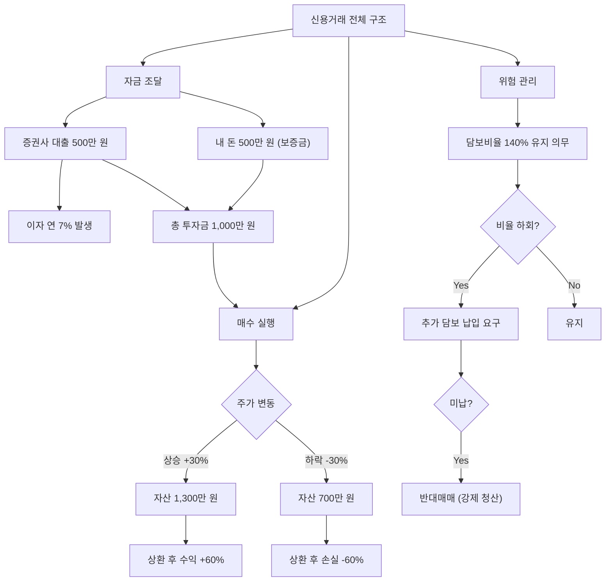

# 신용거래 뜻, 빚을 내서 주식을 사는 구조

"빚투(빚내서 투자)"라는 말을 한 번쯤은 들어보셨을 겁니다. 신용거래가 바로 그것입니다. 증권사에서 돈을 빌려 주식을 매수하는 방식인데, 수익이 커질 수 있지만 위험도 배로 커집니다.

이 글에서는 신용거래의 구조를 완전히 분해해서, 왜 대부분의 투자 대가들이 "빚으로 투자하지 말라"고 말하는지 구체적으로 보여드리겠습니다.

## 한 줄 정의

신용거래는 증권사에서 돈을 빌려 주식을 매수하거나, 주식을 빌려 매도하는 거래 방식입니다.

## 아주 쉽게 말하면

내 돈 500만 원에 증권사에서 500만 원을 빌려서 총 1,000만 원어치 주식을 사는 것입니다. 주가가 20% 오르면 내 수익률은 40%가 되지만, 주가가 20% 내리면 내 손실률은 -40%입니다. 빌린 돈은 어떤 상황에서든 갚아야 합니다.

카드 할부로 비유하면 이해가 쉽습니다. 할부금은 물건값이 떨어져도 매달 나갑니다. 신용거래 이자도 마찬가지입니다.

## 왜 중요한가

신용거래를 이해해야 하는 이유는 단순히 "위험하니까 하지 마세요"를 넘어섭니다.

- **레버리지 구조** — 적은 자본으로 큰 포지션을 만들 수 있지만, 양날의 검입니다.
- **반대매매 리스크** — 주가가 일정 수준 이하로 떨어지면 증권사가 내 주식을 강제로 팔아버립니다. 내 의지와 무관합니다.
- **이자 비용** — 연 5~9%의 이자가 매일 발생합니다. 주가가 제자리여도 돈을 잃습니다.
- **상환 기한** — 보통 90~180일 안에 갚아야 합니다. 장기 투자가 불가능합니다.
- **시장 과열 지표** — 시장 전체 신용잔고가 급증하면 투기 과열 신호로 읽힙니다.
- **하락 가속기** — 시장이 빠질 때 반대매매가 추가 매도를 만들어 낙폭을 키웁니다.

## 그림으로 이해하기

_빌린 돈은 주가가 어떻게 되든 갚아야 하며, 담보비율이 깨지면 선택권 없이 강제 매도됩니다._

## 숫자로 보는 예시

가상 투자자 "김초보"의 신용거래 시나리오를 추적해봅시다.

**조건**: 자기자본 1,000만 원, 신용대출 1,000만 원 (신용비율 50%), 이자 연 7%, 담보유지비율 140%

| 일차 | 주가 변동 | 총자산 | 빚 (원금+이자) | 순자산 | 담보비율 | 상태 |
|---|---|---|---|---|---|---|
| 매수일 | 기준가 | 2,000만 | 1,000만 | 1,000만 | 200% | 정상 |
| 30일 후 | -10% | 1,800만 | 1,006만 | 794만 | 179% | 정상 |
| 60일 후 | -25% | 1,500만 | 1,012만 | 488만 | 149% | 경고 |
| 75일 후 | -32% | 1,360만 | 1,014만 | 346만 | 134% | **반대매매** |

김초보는 75일 만에 자기자본 1,000만 원 중 654만 원을 잃었습니다. 현금으로 샀다면 -32%인 320만 원 손실이었을 텐데, 신용거래로 인해 손실이 **2배 이상**으로 커졌습니다.

더 심각한 문제는 반대매매가 시장가로 체결된다는 점입니다. 하한가 근처에서 체결되면 실제 손실은 표의 계산보다 더 클 수 있습니다.

## 표로 비교하기

| 구분 | 현금 매수 | 신용거래 (50% 대출) |
|---|---|---|
| 투자 가능 금액 | 내 돈만큼 | 내 돈의 약 2배 |
| 수익 배율 | 1배 | 약 2배 |
| 손실 배율 | 1배 | 약 2배 |
| 최대 손실 | -100% (주가 0원) | -100% 이전에 반대매매 |
| 시간 제한 | 없음 (영원히 보유 가능) | 상환 기한 90~180일 |
| 강제 청산 | 없음 | 담보비율 하회 시 반대매매 |
| 보유 비용 | 없음 | 이자 연 5~9% |
| 심리 부담 | 낮음 | 매우 높음 (매일 손익 체크) |
| 적합한 경우 | 대부분의 상황 | 매우 높은 확신 + 단기 |

| 상환 기한별 이자 부담 (1,000만 원 대출, 연 7% 기준) |
|---|
| 30일: 약 19만 원 |
| 90일: 약 58만 원 |
| 180일: 약 115만 원 |

주가가 0% 변동이어도 180일이면 이자만 115만 원을 잃습니다.

## 초보자가 자주 하는 오해

**오해 1: "주가가 빠져도 버티면 된다"**

현금 매수라면 맞는 말입니다. 하지만 신용거래는 담보비율이 깨지는 순간 증권사가 내 동의 없이 시장가로 강제 매도합니다. 본인이 "버티겠다"고 결심해도 소용없습니다. 추가 담보를 넣을 현금이 없으면 반대매매는 자동 실행됩니다.

**오해 2: "이자가 별로 안 비싸다"**

연 7%는 월 0.58%, 하루 0.019%입니다. 작아 보이지만 주가가 횡보하는 기간이 길어지면 이자만으로 수십만 원이 사라집니다. 게다가 주가가 하락하면 원금 손실 + 이자 손실이 동시에 발생합니다.

**오해 3: "소액이면 괜찮다"**

금액이 작아도 구조는 동일합니다. 100만 원 신용거래든 1억 원 신용거래든 담보비율 하회 시 반대매매가 발동합니다. 오히려 소액일수록 추가 담보를 넣을 여력이 없어 반대매매 확률이 높습니다.

**오해 4: "증권사가 돈을 빌려주니까 오를 거라는 뜻"**

증권사는 대출 이자를 수익원으로 삼는 것이지, 해당 종목이 오를 것이라 판단해서 빌려주는 것이 아닙니다. 담보(내 주식)가 있으니 빌려주는 것이고, 담보가치가 떨어지면 즉시 회수합니다.

## 고수는 이렇게 봅니다

숙련된 투자자 대부분은 신용거래를 극도로 제한하거나 아예 사용하지 않습니다.

- **시장 신용잔고 모니터링** — 전체 시장 신용잔고가 역대 최고치에 근접하면 과열 경고로 판단합니다. 신용잔고가 급감(반대매매 연쇄)할 때가 시장 바닥인 경우가 많습니다.
- **종목별 신용비율** — 특정 종목의 신용잔고/시가총액 비율이 3% 이상이면 투기적 수급이 많다고 경계합니다.
- **신용 만기일 집중** — 대량의 신용거래가 동시에 만기를 맞으면 물량 출회 압력이 생깁니다. 이 시점을 피해서 매수 타이밍을 잡습니다.
- **자기 자금만 사용 원칙** — 워런 버핏, 피터 린치 등 대부분의 전설적 투자자는 레버리지 없이 복리를 만들었습니다.
- **예외적 사용** — 극소수의 경우(확정된 이벤트 직전 단기 매매 등)에만 전체 자산의 10% 이내로 제한합니다.

## 기업분석에서는 이렇게 씁니다

기업의 펀더멘털 분석에 신용거래가 직접 쓰이지는 않지만, 종목 수급 분석에서 중요한 보조 지표입니다.

가상 기업 "테크비전"의 사례:

- 실적 발표 후 주가 급등 → 신용잔고 3주 만에 2배 증가 → 단기 차익 실현 매물 출현 예상. 이 종목에 신규 진입하려면 신용 물량이 소화된 후가 유리합니다.
- 신용잔고가 6개월째 꾸준히 감소 → 투기적 수요가 빠지고 장기 투자자 중심으로 수급 정리됨. 펀더멘털이 좋다면 매수 환경이 개선된 것입니다.
- 시장 급락 시 테크비전의 신용비율이 5%로 높음 → 추가 하락(반대매매 연쇄) 가능성 경계. 현재 주가가 싸 보여도 수급 불안정 구간입니다.

## 함께 보면 좋은 용어

- [미수거래 뜻](../level-02-market-trading/unsettled-trading.md)
- [공매도 뜻](../level-02-market-trading/short-selling.md)
- [주가 뜻](../level-01-basic/stock-price.md)
- [거래량 뜻](../level-01-basic/trading-volume.md)
- [개인 순매수 뜻](../level-02-market-trading/individual-net-buying.md)

## 정리

- 신용거래는 증권사에서 돈을 빌려 주식을 사는 레버리지 거래이다.
- 수익과 손실이 모두 빌린 비율만큼 증폭된다 (50% 대출이면 약 2배).
- 담보비율이 깨지면 내 의지와 무관하게 반대매매(강제 청산)가 실행된다.
- 이자가 매일 발생하므로 횡보만 해도 손실이다.
- 시장 전체 신용잔고는 과열/공포를 가늠하는 중요한 시장 지표이다.

## 한 줄 요약

> 신용거래는 수익도 손실도 배로 만드는 레버리지이며, 반대매매라는 "시간 폭탄"이 붙어 있어 초보자에게 가장 위험한 거래 방식입니다.

---

이 글은 투자 권유가 아니라 주식 용어와 기업분석 방법을 설명하기 위한 교육 콘텐츠입니다. 특정 종목의 매수·매도 판단은 독자 본인의 책임입니다.

Tags: 신용거래, 신용거래뜻, 빚투, 주식초보, 주식용어
