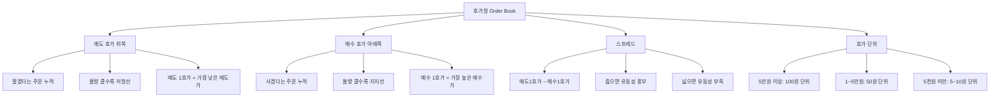

# 호가 뜻, 주식을 사고파는 가격표 읽기

## 한 줄 정의

호가는 주식을 사거나 팔겠다고 제시하는 가격과 수량이며, 이것들을 모아놓은 화면을 호가창(주문장, order book)이라 합니다.

## 아주 쉽게 말하면

수산시장 경매를 떠올려보세요. "참치 1박스 50만 원에 팝니다!", "45만 원에 살게요!" 하고 서로 외칩니다. 파는 사람의 가격이 사는 사람의 가격까지 내려오면(또는 반대로) 거래가 성사됩니다.

호가창은 이 모든 "외침"을 한 화면에 정리해놓은 것입니다. 위쪽에는 팔겠다는 사람들(매도 호가), 아래쪽에는 사겠다는 사람들(매수 호가)이 줄 서 있습니다. 이걸 읽을 줄 알면 "지금 사려는 사람이 많은지, 팔려는 사람이 많은지"를 실시간으로 볼 수 있습니다.

## 왜 중요한가

- **실시간 수급 판단**: 매수·매도 세력의 힘 관계를 눈으로 직접 확인할 수 있는 유일한 도구입니다.
- **체결 가격 예측**: 시장가로 주문하면 어떤 가격에 체결될지 호가창을 보고 미리 알 수 있습니다.
- **지지·저항 파악**: 특정 가격에 대량 물량이 쌓여 있으면 그 가격이 벽(지지 또는 저항) 역할을 합니다.
- **유동성 확인**: 호가 간 간격(스프레드)이 넓으면 유동성이 부족하다는 경고입니다.
- **주문 전략 수립**: 내 주문을 어떤 가격에 넣을지, 분할할지 한 번에 넣을지 결정하는 근거입니다.

## 그림으로 이해하기

_호가창은 "팔고 싶은 가격(위)"과 "사고 싶은 가격(아래)"이 만나는 시장의 실시간 가격표입니다._

## 숫자로 보는 예시

> ⚠️ 아래 숫자는 개념 설명을 위한 **가상 예시**이며, 실제 투자 데이터가 아닙니다.

**가상 종목 "한빛전자" 호가창**

| 순위 | 매도 호가 | 매도 잔량 | | 매수 호가 | 매수 잔량 |
|---|---|---|---|---|---|
| 5 | 10,500원 | 2,000주 | | | |
| 4 | 10,400원 | 3,000주 | | | |
| 3 | 10,300원 | 1,500주 | | | |
| 2 | 10,200원 | 8,000주 ← 매도벽 | | | |
| 1 | 10,100원 | 1,000주 | | | |
| | | | | 10,000원 | 5,000주 |
| | | | | 9,900원 | 2,000주 |
| | | | | 9,800원 | 10,000주 ← 매수벽 |
| | | | | 9,700원 | 3,000주 |
| | | | | 9,600원 | 1,500주 |

**이 호가창에서 읽을 수 있는 정보:**

- **스프레드**: 10,100 − 10,000 = 100원 (1%) → 유동성 보통
- **매도벽**: 10,200원에 8,000주 → 이 가격을 뚫으려면 강한 매수세 필요
- **매수벽**: 9,800원에 10,000주 → 이 가격 아래로 떨어지기 어려움
- **시장가 매수 3,000주 시**: 1,000주@10,100 + 2,000주@10,200 = 평균 10,167원

**호가창 변화로 읽는 시장 심리**

| 시간 | 매수 1호가 잔량 | 매도 1호가 잔량 | 해석 |
|---|---|---|---|
| 09:05 | 5,000주 | 1,000주 | 매수세 강함 → 상승 압력 |
| 09:30 | 2,000주 | 6,000주 | 매도세 강해짐 → 하락 압력 |
| 10:00 | 500주 | 500주 | 양쪽 다 소진 → 방향 탐색 중 |
| 10:15 | 8,000주 | 300주 | 대량 매수 유입 → 급등 직전 신호 |

**스프레드 비교: 종목별 차이**

| 종목 유형 | 매도1호가 | 매수1호가 | 스프레드 | 의미 |
|---|---|---|---|---|
| 삼성전자 | 72,100원 | 72,000원 | 0.14% | 매우 좁음 → 유동성 풍부 |
| 중형주 A | 25,200원 | 25,050원 | 0.6% | 보통 |
| 소형주 B | 3,200원 | 3,050원 | 4.7% | 매우 넓음 → 유동성 부족 |

## 표로 비교하기

| 호가창 신호 | 의미 | 해석 | 대응 |
|---|---|---|---|
| 매수 잔량 >> 매도 잔량 | 사려는 힘 강함 | 단기 상승 가능성 | 매수 고려 |
| 매도 잔량 >> 매수 잔량 | 팔려는 힘 강함 | 단기 하락 가능성 | 매수 보류 |
| 특정 가격 대량 매도 | 매도벽(저항선) | 돌파 어려움 | 해당 가격 아래 지정가 매수 |
| 특정 가격 대량 매수 | 매수벽(지지선) | 하방 방어 | 해당 가격 부근 손절 설정 |
| 스프레드 넓음 (1%+) | 유동성 부족 | 거래 비용 증가 | 반드시 지정가 사용 |
| 잔량 급격 변화 | 허수 주문 가능 | 실제 의도 불명확 | 과신 금지 |

## 초보자가 자주 하는 오해

**오해 1: 호가창에 보이는 물량은 반드시 체결된다**

호가창의 물량은 "주문"이지 "확정된 거래"가 아닙니다. 주문은 1초 만에 취소할 수 있습니다. 대량 매수 주문을 걸어 매수세가 강한 것처럼 보이게 한 뒤, 다른 사람이 따라 사면 취소하고 빠지는 "허수(스푸핑)" 전술이 실제로 존재합니다. 불법이지만 완전히 근절되지 않았습니다.

**오해 2: 호가창만 보면 주가 방향을 정확히 알 수 있다**

호가창은 "지금 이 순간"의 주문 상태일 뿐입니다. 1초 뒤에 기관이 수만 주를 시장가로 던지면 모든 것이 바뀝니다. 호가창은 "참고 도구"이며, 이것만으로 매매를 결정하면 허수 주문에 속거나 급변에 대응 못 합니다.

**오해 3: 매수 잔량이 많으면 반드시 오른다**

매수 잔량이 많아도 그것이 진짜 매수 의지인지 허수인지 구별이 어렵습니다. 또한 호가창에 안 보이는 "숨은 주문(iceberg order)"도 있어, 보이는 것이 전부가 아닙니다.

## 고수는 이렇게 봅니다

숙련된 투자자에게 호가창은 "시장의 표정"을 읽는 도구입니다.

- **잔량 변화 속도 관찰**: 물량의 절대 크기보다 "얼마나 빨리 채워지고 비워지는가"가 중요합니다. 매수벽이 빠르게 소진되면 매도세가 예상보다 강하다는 의미입니다.
- **호가 두께(depth) 활용**: 매도 1~5호가 합산 vs 매수 1~5호가 합산 비율을 봅니다. 2:1 이상이면 매도 압력 우세.
- **허수 필터링**: 주문이 걸렸다 취소를 반복하면 허수입니다. 진짜 물량은 "체결되면서 줄어드는" 물량입니다.
- **대형주에서는 참고만**: 대형주는 HFT(초단타)가 호가를 지배하므로 일반 투자자가 호가창을 분석할 의미가 적습니다. 소·중형주에서 더 유용합니다.
- **호가 단위별 전략**: 5만 원 종목은 호가 단위 100원(0.2%). 10,000원 종목은 50원(0.5%). 호가 단위가 넓을수록 한 단계 차이의 비용이 크므로, 지정가 위치 선택이 더 중요합니다.

## 기업분석에서는 이렇게 씁니다

기업분석 자체에서 호가를 분석하지는 않지만, 분석 결과를 실행할 때 필수적으로 확인합니다.

- **실행 가능성 점검**: 분석으로 "매수 적정가 10,000원"을 산출했더라도, 호가창에서 매도 물량이 없으면 그 가격에 살 수 없습니다. 특히 소형주는 원하는 수량만큼 매수하는 데 수일이 걸릴 수 있습니다.
- **거래 비용 산정**: 스프레드가 1%인 종목은 매수 즉시 −1%에서 시작합니다. 이 비용을 안전마진에 포함시켜야 합니다.
- **대량 매도벽 분석**: 특정 가격에 대주주나 기관의 대량 매도 물량이 쌓여 있으면, 그 가격이 단기 상한이 될 수 있습니다. 이를 감안해 목표가를 설정합니다.
- **유동성 프리미엄**: 같은 실적이라도 거래량이 적은 종목은 호가 스프레드가 넓어 "유동성 할인"을 적용합니다. 적정가에서 10~20%를 추가로 할인해 매수가를 설정하는 것이 실전적입니다.

## 함께 보면 좋은 용어

- [매수와 매도 뜻](../level-02-market-trading/buy-sell.md)
- [지정가와 시장가 뜻](../level-02-market-trading/limit-market-order.md)
- [체결 뜻](../level-02-market-trading/execution.md)
- [거래량 뜻](../level-01-basic/trading-volume.md)
- [주가 뜻](../level-01-basic/stock-price.md)

## 정리

- 호가는 사거나 팔겠다고 제시하는 가격·수량이며, 이를 모아놓은 것이 호가창이다.
- 호가창에서 매수·매도 세력의 힘 관계, 지지·저항, 유동성을 실시간으로 읽을 수 있다.
- 호가창의 물량은 확정이 아닌 주문이므로, 허수·취소 가능성을 항상 감안해야 한다.
- 스프레드가 넓은 종목은 시장가 주문을 피하고, 반드시 지정가를 사용해야 한다.
- 중장기 투자에서는 호가창보다 기업 가치에 집중하되, 실행 시점에서만 호가를 확인한다.

## 한 줄 요약

> 호가는 주식을 사고팔겠다고 제시하는 가격이며, 호가창을 통해 현재 매수·매도 세력의 힘 관계와 유동성을 실시간으로 확인할 수 있습니다.

---

이 글은 투자 권유가 아니라 주식 용어와 기업분석 방법을 설명하기 위한 교육 콘텐츠입니다. 특정 종목의 매수·매도 판단은 독자 본인의 책임입니다.

Tags: 호가, 호가뜻, 호가창, 주식초보, 주식용어
