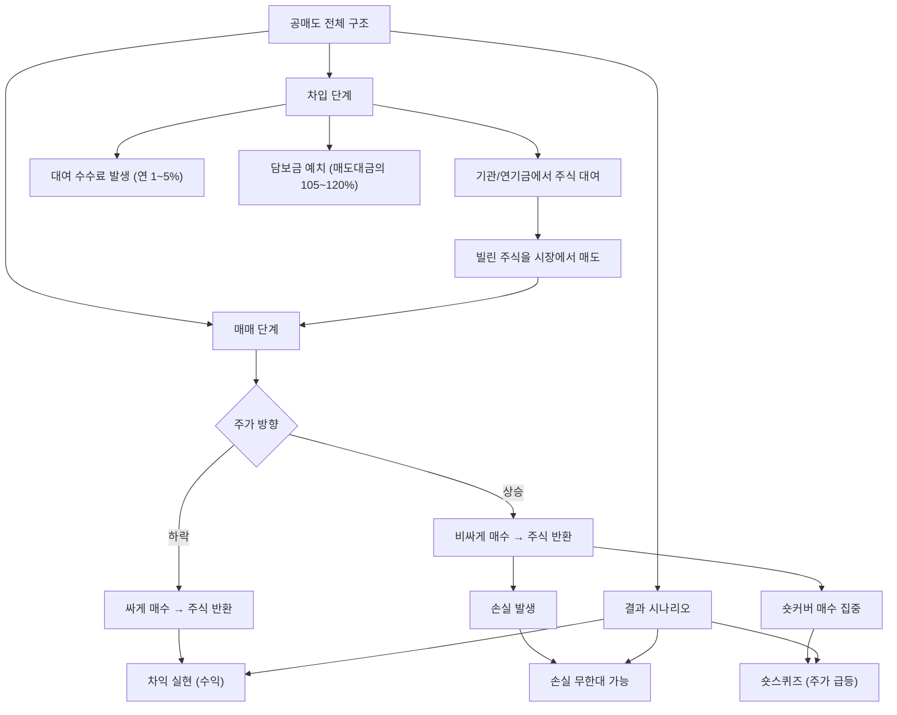

# 공매도 뜻, 주가 하락에 투자하는 방식

"공매도 때문에 내 주식이 떨어졌다!" — 주식 커뮤니티에서 가장 많이 보이는 분노의 대상입니다. 하지만 공매도를 정확히 이해하면, 오히려 이 정보를 투자에 활용할 수 있습니다.

이 글에서는 공매도의 작동 원리부터 숏스퀴즈, 한국 시장의 규제 현황까지 구조적으로 풀어보겠습니다.

## 한 줄 정의

공매도는 주식을 빌려서 먼저 팔고, 나중에 싸게 사서 갚아 차익을 얻는 매매 방식입니다.

## 아주 쉽게 말하면

친구에게 교과서를 빌려서 중고서점에 1만 원에 팝니다. 며칠 뒤 온라인에서 같은 교과서를 5천 원에 구해 친구에게 돌려줍니다. 남는 5천 원이 수익입니다.

주식도 같은 원리입니다. 남의 주식을 빌려서 비싸게 팔고 → 주가가 내린 뒤 싸게 사서 돌려주면 차익이 생깁니다. 반대로 주가가 오르면? 더 비싸게 사서 갚아야 하므로 손실이 납니다.

## 왜 중요한가

공매도는 단순히 "나쁜 세력의 무기"가 아닙니다. 시장 구조에서 여러 역할을 합니다.

- **가격 발견 기능** — "이 주식이 고평가됐다"는 의견도 가격에 반영시켜 버블을 억제합니다.
- **유동성 공급** — 매도 물량을 늘려 매수·매도 호가 간격을 좁히고 거래를 원활하게 합니다.
- **부정 기업 견제** — 회계 조작, 사기 기업을 공매도 세력이 밝혀낸 사례가 다수 있습니다.
- **숏스퀴즈 가능성** — 공매도가 과도하면 되갚기 매수(숏커버)가 집중돼 급등이 발생합니다.
- **형평성 논란** — 한국에서는 기관만 쉽게 할 수 있어 개인과의 무기 비대칭 논란이 있습니다.
- **투자 신호** — 공매도 잔고 변화를 통해 시장 참여자들의 비관 정도를 읽을 수 있습니다.

## 그림으로 이해하기

_일반 매수는 "싸게 사서 비싸게 판다"인데, 공매도는 순서를 뒤집어 "비싸게 팔고 싸게 산다"입니다._

## 숫자로 보는 예시

가상 종목 "그린에너지"를 공매도하는 시나리오입니다.

**조건**: 주가 50,000원일 때 1,000주 차입 매도, 대여수수료 연 3%, 담보금 110%

| 시나리오 | 되갚기 가격 | 매도대금 | 매수대금 | 대여료(30일) | 순손익 |
|---|---|---|---|---|---|
| 주가 30% 하락 | 35,000원 | 5,000만 | 3,500만 | 12.5만 | **+1,487만** |
| 주가 10% 하락 | 45,000원 | 5,000만 | 4,500만 | 12.5만 | **+487만** |
| 주가 변동 없음 | 50,000원 | 5,000만 | 5,000만 | 12.5만 | **-12.5만** |
| 주가 20% 상승 | 60,000원 | 5,000만 | 6,000만 | 12.5만 | **-1,012만** |
| 주가 50% 상승 | 75,000원 | 5,000만 | 7,500만 | 12.5만 | **-2,512만** |
| 주가 100% 상승 | 100,000원 | 5,000만 | 1억 | 12.5만 | **-5,012만** |

핵심 비대칭: 일반 매수의 최대 손실은 -100%(원금 전액)이지만, 공매도의 최대 손실은 **이론상 무한대**입니다. 주가가 2배, 3배, 10배 올라도 갚아야 하기 때문입니다.

## 표로 비교하기

| 구분 | 일반 매수 (롱 포지션) | 공매도 (숏 포지션) |
|---|---|---|
| 수익 조건 | 주가 상승 | 주가 하락 |
| 최대 수익 | 무한대 (상한 없음) | 100% (주가 → 0원) |
| 최대 손실 | -100% (원금 전액) | 무한대 (상한 없음) |
| 보유 비용 | 없음 | 대여수수료 + 담보금 이자 |
| 시간 압박 | 없음 (영원히 보유 가능) | 대여 기간 제한 |
| 진입 조건 | 매수 자금만 있으면 가능 | 차입 가능 종목 + 담보금 필요 |
| 한국 개인 | 자유롭게 가능 | 제한적 (일부 종목, 높은 담보) |

| 공매도 관련 주요 용어 정리 |  |
|---|---|
| 차입 공매도 | 실제로 주식을 빌린 뒤 매도 (합법) |
| 무차입 공매도 | 빌리지 않고 매도 (불법) |
| 공매도 잔고 | 아직 되갚지 않은 공매도 물량 |
| 숏커버 | 공매도 포지션을 청산하기 위한 매수 |
| 숏스퀴즈 | 숏커버가 집중되며 주가가 급등하는 현상 |
| 공매도 과열 종목 지정 | 과도한 공매도 시 거래소가 일시 제한 |

## 초보자가 자주 하는 오해

**오해 1: "공매도는 불법이다"**

공매도 자체는 전 세계 대부분의 주식 시장에서 합법입니다. 불법인 것은 주식을 실제로 빌리지 않고 파는 **무차입 공매도**입니다. 합법적인 차입 공매도는 빌린 증거가 확인된 후에만 매도할 수 있습니다.

**오해 2: "공매도가 주가를 떨어뜨리는 원인이다"**

공매도는 이미 존재하는 하락 요인(실적 악화, 경쟁 심화 등)을 가격에 반영하는 도구입니다. 펀더멘털이 견고한 기업은 공매도가 집중되어도 결국 공매도 세력이 손실을 보고 숏커버합니다. 오히려 그 숏커버가 주가 상승을 가속하기도 합니다.

**오해 3: "공매도 잔고가 높으면 무조건 위험한 종목이다"**

공매도 잔고가 높다는 것은 "누군가 하락에 확신을 갖고 있다"는 의미이지, "반드시 떨어진다"는 뜻이 아닙니다. 오히려 공매도 잔고가 극단적으로 높은 종목은 숏스퀴즈로 급등할 가능성도 있습니다. 맥락을 함께 봐야 합니다.

**오해 4: "개인은 절대 공매도를 할 수 없다"**

한국에서는 2023년 이후 공매도 전면 금지 기간이 있었고, 재개 시에도 개인의 접근이 제한적인 것은 사실입니다. 하지만 제도적으로 개인도 일부 종목에 대해 차입 공매도가 가능하며, 인버스 ETF를 통해 간접적으로 하락에 베팅할 수도 있습니다.

## 고수는 이렇게 봅니다

숙련된 투자자는 공매도를 직접 하기보다, **공매도 데이터를 읽는 도구**로 활용합니다.

- **공매도 잔고 비율 모니터링** — 유통주식 대비 공매도 잔고가 10% 이상이면 "시장이 이 종목을 상당히 부정적으로 본다"고 해석합니다. 그 이유를 조사합니다.
- **공매도 잔고 감소 추세** — 잔고가 줄어든다면 숏커버가 진행 중이며, 추가 상승 동력이 될 수 있습니다.
- **숏스퀴즈 시그널 포착** — 공매도 잔고 높음 + 갑작스런 호재(실적 서프라이즈 등) = 숏스퀴즈 가능성. 단, 이를 노린 투기는 매우 위험합니다.
- **공매도 리포트 활용** — 해외 공매도 전문 기관(힌덴버그 리서치 등)이 발표하는 리포트의 지적 사항을 검증 재료로 활용합니다.
- **대차잔고(대여 잔고) 추적** — 공매도 실행 전 단계인 대차잔고 증가를 선행 지표로 봅니다.

## 기업분석에서는 이렇게 씁니다

개별 기업을 분석할 때 공매도 데이터는 "시장의 반대 의견"을 읽는 창구입니다.

가상 기업 "바이오넥스트"의 사례:

- 신약 임상 3상 결과 발표 2주 전, 공매도 잔고가 5%에서 12%로 급증 → 누군가 임상 실패에 베팅 중입니다. 내가 이 종목을 보유 중이라면 임상 데이터를 다시 검토해야 합니다.
- 임상 결과가 성공적이었다면 → 12%의 공매도 잔고가 모두 숏커버해야 합니다. 유통주식의 12%에 해당하는 매수세가 추가로 유입되므로 급등 가능성이 있습니다.
- 공매도 리포트가 "바이오넥스트의 회계 의혹"을 제기 → 리포트의 근거를 직접 확인합니다. 감사보고서, 현금흐름, 관련 공시를 점검합니다. 사실이면 매도, 과장이면 숏스퀴즈를 기다릴 수 있습니다.

## 함께 보면 좋은 용어

- [신용거래 뜻](../level-02-market-trading/margin-trading.md)
- [거래량 뜻](../level-01-basic/trading-volume.md)
- [주가 뜻](../level-01-basic/stock-price.md)
- [외국인 순매수 뜻](../level-02-market-trading/foreign-net-buying.md)
- [기관 순매수 뜻](../level-02-market-trading/institutional-net-buying.md)

## 정리

- 공매도는 주식을 빌려서 먼저 팔고, 나중에 싸게 사서 갚는 매매 방식이다.
- 주가 하락 시 수익이지만, 상승 시 이론상 무한대 손실이 가능하다.
- 시장의 가격 발견 기능을 돕고 과대평가를 견제하지만, 한국에서는 형평성 논란이 있다.
- 공매도 잔고 데이터는 시장 참여자들의 비관 정도를 읽는 유용한 도구이다.
- 숏스퀴즈는 과도한 공매도 잔고가 급등의 연료가 되는 역설적 현상이다.

## 한 줄 요약

> 공매도는 하락에 베팅하는 매매 방식이며, 그 잔고 데이터는 시장의 반대 의견을 읽을 수 있는 투자 신호입니다.

---

이 글은 투자 권유가 아니라 주식 용어와 기업분석 방법을 설명하기 위한 교육 콘텐츠입니다. 특정 종목의 매수·매도 판단은 독자 본인의 책임입니다.

Tags: 공매도, 공매도뜻, 주식거래, 주식초보, 주식용어
