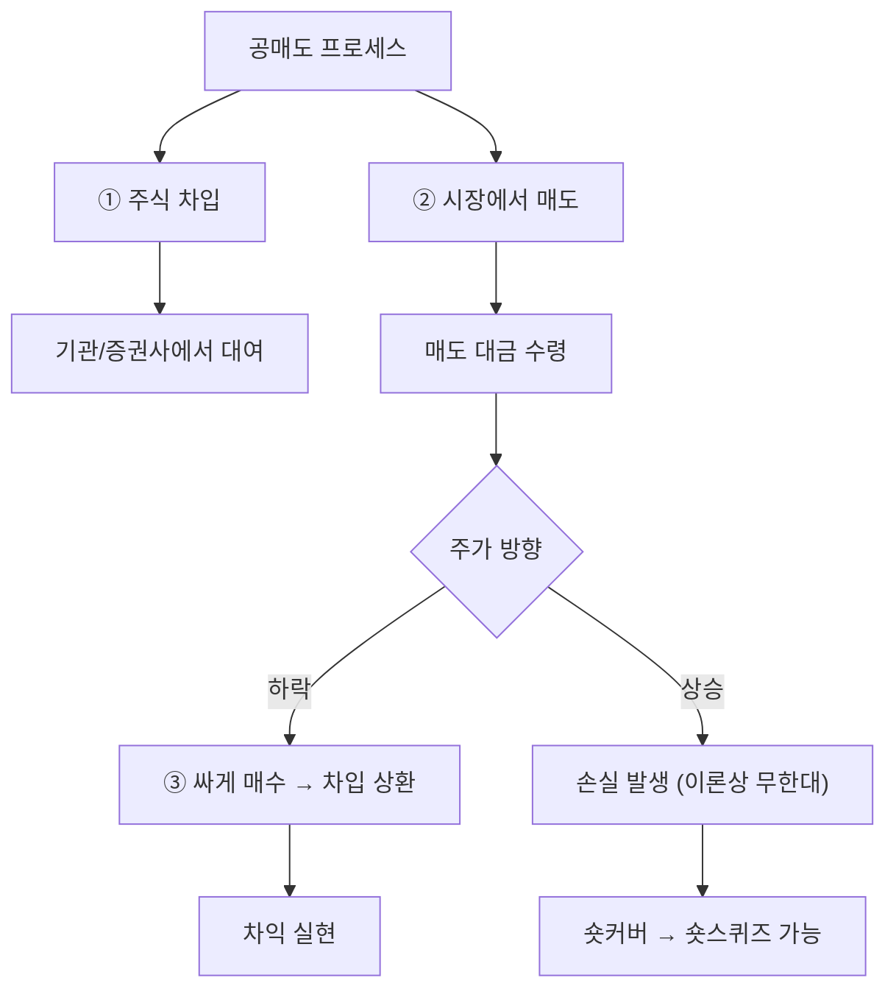

# 공매도 뜻, 주가 하락에 투자하는 방식

"공매도 때문에 주가가 떨어졌다"는 말을 들어본 적 있을 것입니다.

공매도는 주가가 내릴 것이라고 예상할 때 수익을 내는 매매 방식입니다. 논란이 많지만, 정확히 알아야 대응할 수 있습니다.

## 한 줄 정의

공매도는 주식을 빌려서 먼저 팔고, 나중에 싸게 사서 갚아 차익을 얻는 매매 방식입니다.

## 아주 쉽게 말하면

친구에게 교과서를 빌려서 중고서점에 1만 원에 팝니다. 며칠 뒤 같은 교과서를 5천 원에 새로 사서 친구에게 돌려줍니다. 남는 5천 원이 수익입니다.

주식도 마찬가지로, 남의 주식을 빌려서 비싸게 팔고 → 주가가 내린 뒤 싸게 사서 돌려주면 차익이 생깁니다.

## 왜 중요한가

- 시장에 "하락 방향"의 의견도 반영시켜 가격 효율성을 높입니다.
- 과대평가된 기업의 주가를 견제하는 역할을 합니다.
- 개인 투자자 입장에서는 공매도 잔고가 높은 종목의 리스크를 인식해야 합니다.
- 한국에서는 개인 공매도가 제한적이어서 형평성 논란이 있습니다.

## 그림으로 이해하기

_빌려서 비싸게 팔고, 싸게 사서 갚으면 차익이 발생합니다._

## 숫자로 보는 예시

> ⚠️ 아래 숫자는 개념 설명을 위한 **가상 예시**이며, 실제 투자 데이터가 아닙니다.

A주식 공매도 시나리오:

- 빌려서 판 가격: 50,000원 × 1,000주 = 5,000만 원
- 되갚기 위해 산 가격: 35,000원 × 1,000주 = 3,500만 원
- **수익 = 1,500만 원** (대여 수수료 별도)

반대로 주가가 올랐다면:
- 되갚기 가격: 65,000원 × 1,000주 = 6,500만 원
- **손실 = -1,500만 원** (이론적으로 손실 무한대 가능)

## 표로 비교하기

| 구분 | 일반 매수 (롱) | 공매도 (숏) |
|---|---|---|
| 수익 조건 | 주가 상승 | 주가 하락 |
| 최대 수익 | 무한대 | 100% (주가 0원까지) |
| 최대 손실 | 투자금 전액 (-100%) | 무한대 (주가 상승 한계 없음) |
| 비용 | 매수 대금 | 대여 수수료 + 담보금 |
| 한국 개인 | 자유롭게 가능 | 제한적 (일부 종목만) |

## 초보자가 자주 하는 오해

**오해 1: 공매도는 불법이다**

공매도 자체는 합법입니다. 불법인 것은 "무차입 공매도" (주식을 빌리지도 않고 파는 것)입니다. 합법적 공매도는 실제로 주식을 빌린 뒤 파는 "차입 공매도"입니다.

**오해 2: 공매도가 주가 하락의 원인이다**

공매도는 하락을 만드는 것이 아니라, 이미 과대평가된 주가를 시장가격에 반영하는 도구입니다. 기업의 가치가 견고하면 공매도 세력은 손실을 보고 되갚아야(숏커버) 합니다. 이것이 오히려 주가 상승 동력(숏스퀴즈)이 되기도 합니다.

## 고수는 이렇게 봅니다

숙련된 투자자는 공매도를 "시장의 반대 의견"으로 해석합니다.

- 공매도 잔고가 급증한 종목 → 누군가 하락에 확신을 갖고 있음
- 공매도 잔고가 높은데 주가가 오르면 → 숏스퀴즈 가능성 (급등)
- 내가 투자한 종목에 공매도가 몰리면 → 내 투자 논리를 다시 점검하는 기회

## 기업분석에서는 이렇게 씁니다

기업분석에서 공매도 데이터는 "시장이 이 기업에 대해 어떻게 생각하는가"의 단서입니다.

- 공매도 비율이 높은 기업 → 회계 문제, 실적 둔화, 경쟁 심화 등 시장이 우려하는 이유 확인
- 공매도 리포트가 나온 기업 → 지적 사항의 사실 여부 직접 검증
- 숏커버 랠리 → 펀더멘털 변화인지, 일시적 수급인지 구분

## 함께 보면 좋은 용어

- [신용거래 뜻](../level-02-market-trading/margin-trading.md)
- [거래량 뜻](../level-01-basic/trading-volume.md)
- [주가 뜻](../level-01-basic/stock-price.md)
- [외국인 순매수 뜻](../level-02-market-trading/foreign-net-buying.md)
- [어닝쇼크 뜻](../level-08-industry-macro/earnings-shock.md)

## 정리

- 공매도는 주식을 빌려서 팔고, 나중에 싸게 사서 갚는 방식이다.
- 주가 하락 시 수익이지만, 상승 시 손실이 무한대로 커질 수 있다.
- 시장의 가격 효율성을 높이지만, 개인과의 형평성 논란이 있다.

## 한 줄 요약

공매도는 주가 하락에 베팅하는 매매 방식이며, 시장의 반대 의견을 반영하는 도구입니다.

---

*면책 조항: 이 글은 투자 권유가 아니라 주식 용어와 기업분석 방법을 설명하기 위한 교육 콘텐츠입니다. 특정 종목의 매수·매도 판단은 독자 본인의 책임입니다.*

Tags: 공매도, 공매도뜻, 주식거래, 주식초보, 주식용어
