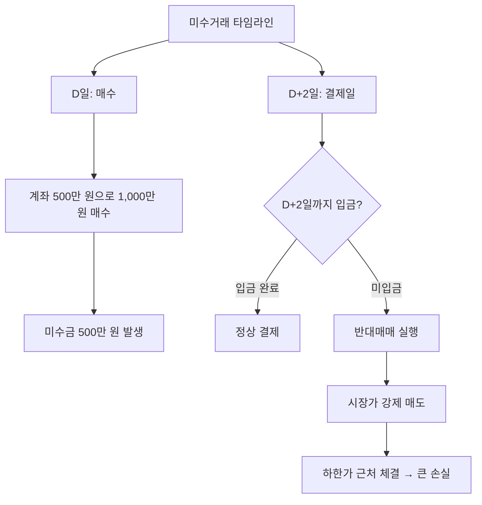

# 미수거래 뜻, 초보자가 조심해야 하는 이유

"미수금이 발생했습니다"라는 알림을 받고 당황한 적 있나요?

미수거래는 아직 결제되지 않은 돈으로 주식을 사는 것입니다. 신용거래보다 기간이 짧아 더 급하게 대응해야 합니다.

## 한 줄 정의

미수거래는 주식 매수 대금을 결제일(T+2)까지 납부하지 못한 상태의 거래입니다.

## 아주 쉽게 말하면

식당에서 밥을 먹고 "내일 돈 가져올게요"라고 한 것과 비슷합니다. 한국 주식시장은 매수한 날로부터 2영업일 뒤에 실제 결제가 이루어집니다.

내 계좌에 500만 원이 있는데 1,000만 원어치를 살 수 있는 경우가 있습니다. 부족한 500만 원이 미수금이며, 2일 안에 입금하지 않으면 반대매매가 됩니다.

## 왜 중요한가

- 자기도 모르게 미수거래를 하고 있는 경우가 많습니다.
- 결제일까지 돈을 입금하지 못하면 증권사가 강제로 주식을 팝니다(반대매매).
- 반대매매는 시장가(가장 불리한 가격)로 이루어져 큰 손실이 발생합니다.
- 신용거래와 달리 기한이 매우 짧아(2일) 대응할 시간이 부족합니다.

## 그림으로 이해하기

_매수 후 2영업일 내에 돈을 내지 않으면 강제 매도됩니다._

## 숫자로 보는 예시

> ⚠️ 아래 숫자는 개념 설명을 위한 **가상 예시**이며, 실제 투자 데이터가 아닙니다.

미수거래 후 반대매매 시나리오:

- D일: 주가 10,000원에 1,000주 매수 (총 1,000만 원, 미수금 500만 원)
- D+2일: 주가 9,000원으로 하락, 미입금 상태
- 반대매매: 시장가(하한가 근처 8,500원)로 전량 매도
- 매도 대금: 850만 원
- 증권사가 미수금 500만 원 회수
- **내 잔액: 350만 원** (원래 500만 원에서 150만 원 손실)

## 표로 비교하기

| 구분 | 미수거래 | 신용거래 |
|---|---|---|
| 빌리는 기간 | 2영업일 | 90~180일 |
| 이자 | 없음 (기간이 짧아서) | 있음 (연 5~9%) |
| 강제 청산 시점 | D+2일 미입금 시 | 담보비율 하회 시 |
| 본인 인식 | 모르고 하는 경우 많음 | 의도적으로 신청 |
| 위험 수준 | 높음 (대응 시간 부족) | 높음 (기간은 있음) |

## 초보자가 자주 하는 오해

**오해 1: 증거금 100%면 미수가 안 생긴다**

증거금률은 종목별로 다릅니다. 증거금률 40% 종목은 400만 원만 있어도 1,000만 원어치를 살 수 있습니다. 내 예수금보다 많이 살 수 있는 설정이 기본으로 되어 있는 증권 앱이 많습니다.

**오해 2: 미수금은 주가가 오르면 문제없다**

주가가 올라 매도 차익으로 미수금을 갚으면 괜찮습니다. 하지만 2일 안에 반드시 올라야 한다는 보장이 없습니다. D+2일에 주가가 하락 중이면 손실 + 반대매매를 동시에 맞습니다.

## 고수는 이렇게 봅니다

숙련된 투자자는 미수거래를 원천 차단합니다.

- 증권 앱에서 "현금 매수만 가능" 설정 (100% 증거금)
- 미수 발생 시 즉시 당일 정리 (익일까지 미루지 않음)
- 시장 전체 미수금 증가 시 → 과열 & 반대매매 연쇄 하락 경계

## 기업분석에서는 이렇게 씁니다

기업분석 자체와 직접 관련은 없지만, 시장 분석에서 참고합니다.

- 시장 전체 미수금·반대매매 급증 → 급락장에서의 추가 하락 압력
- 특정 종목에 미수거래가 집중 → 단기 투기 자금 유입, 급반전 위험
- 반대매매 물량이 쏟아지는 시점 → 역설적으로 매수 기회가 될 수 있음

## 함께 보면 좋은 용어

- [신용거래 뜻](../level-02-market-trading/margin-trading.md)
- [체결 뜻](../level-02-market-trading/execution.md)
- [매수와 매도 뜻](../level-02-market-trading/buy-sell.md)
- [하한가 뜻](../level-01-basic/lower-limit.md)
- [손절 뜻](../level-10-company-analysis/stop-loss.md)

## 정리

- 미수거래는 결제 대금을 아직 내지 않은 상태의 매수이다.
- 2영업일 내에 미입금하면 시장가로 강제 매도(반대매매)된다.
- 자기도 모르게 발생할 수 있으므로, 증거금률 설정을 100%로 바꾸는 편이 실수를 줄일 수 있다.

## 한 줄 요약

> 미수거래는 결제 전에 주식을 사는 것이며, 2일 내 미입금 시 반대매매로 큰 손실을 볼 수 있으므로 초보자는 원천 차단해야 합니다.

---

*면책 조항: 이 글은 투자 권유가 아니라 주식 용어와 기업분석 방법을 설명하기 위한 교육 콘텐츠입니다. 특정 종목의 매수·매도 판단은 독자 본인의 책임입니다.*

Tags: 미수거래, 미수거래뜻, 반대매매, 주식초보, 주식용어
