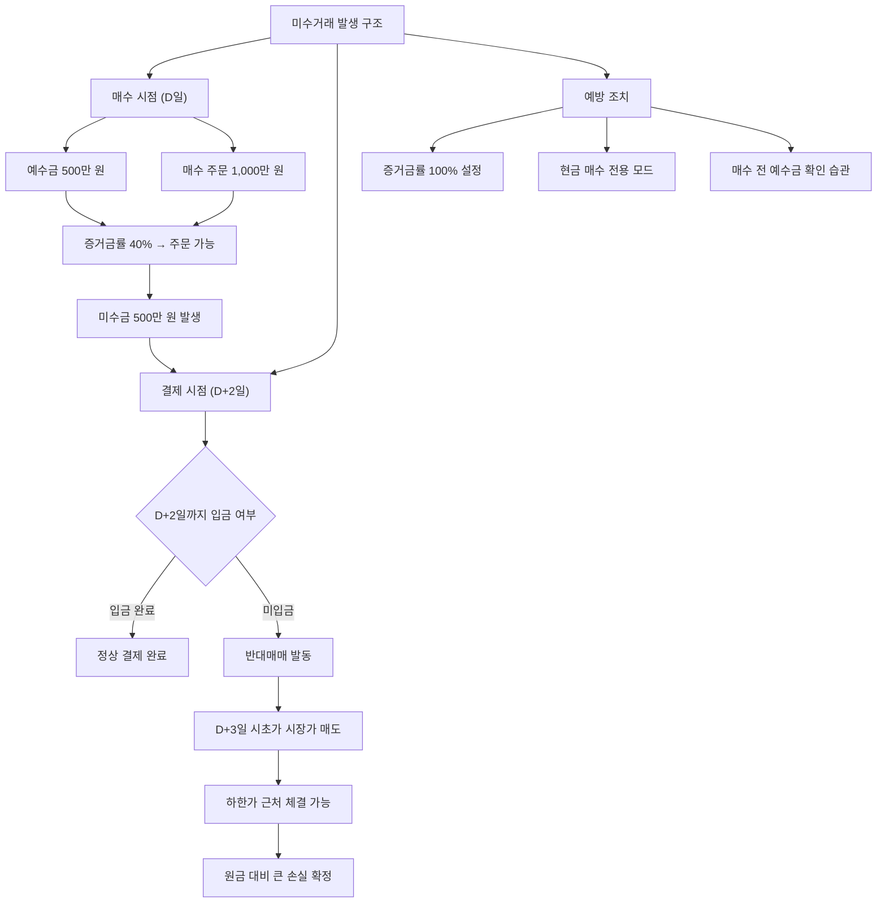

# 미수거래 뜻, 초보자가 조심해야 하는 이유

"미수금이 발생했습니다." 어느 날 갑자기 이런 알림을 받고 당황한 경험이 있으신가요? 미수거래는 본인도 모르게 빚을 지는 구조여서, 주식 초보자에게 가장 흔한 사고 중 하나입니다.

이 글에서는 미수거래가 왜 발생하는지, 반대매매가 어떻게 작동하는지, 그리고 어떻게 원천 차단하는지까지 완전히 설명하겠습니다.

## 한 줄 정의

미수거래는 주식 매수 대금을 결제일(T+2)까지 납부하지 못한 상태의 거래입니다.

## 아주 쉽게 말하면

식당에서 밥을 먹고 "모레까지 돈 가져올게요"라고 외상을 한 것과 비슷합니다.

한국 주식시장은 매수 당일에 돈을 완전히 내지 않아도 주문이 체결됩니다. 실제 결제는 매수일로부터 2영업일 뒤(T+2)에 이루어집니다. 내 계좌에 500만 원이 있는데 증거금률 40% 종목을 1,000만 원어치 살 수 있었다면, 부족한 500만 원이 미수금입니다. 이 돈을 2일 안에 입금하지 않으면 증권사가 내 주식을 강제로 팔아버립니다.

## 왜 중요한가

미수거래가 위험한 이유는 **자기도 모르게** 발생한다는 점입니다.

- **무의식적 발생** — 증권 앱의 기본 설정이 미수 허용인 경우가 많아, 예수금 이상으로 매수할 수 있습니다.
- **초단기 기한** — 신용거래는 90~180일의 여유가 있지만, 미수거래는 단 2영업일입니다.
- **반대매매 충격** — 미입금 시 증권사가 시장가(하한가 근처)로 강제 매도합니다. 최악의 가격에 팔리는 셈입니다.
- **연쇄 효과** — 시장 급락 시 미수 반대매매가 추가 매도 물량을 만들어 하락을 가속합니다.
- **신용도 영향** — 미수금 미납이 반복되면 계좌 거래가 제한될 수 있습니다.

## 그림으로 이해하기

_미수거래는 예방이 가장 중요합니다. 증거금률 설정 하나로 원천 차단할 수 있습니다._

## 숫자로 보는 예시

가상 투자자 "박초보"의 미수거래 사고를 단계별로 추적합니다.

**상황**: 예수금 300만 원, A종목 증거금률 30%

| 단계 | 시점 | 상황 | 금액 |
|---|---|---|---|
| 1 | D일 (월요일) | A종목 10,000원 × 1,000주 매수 | 매수대금 1,000만 원 |
| 2 | D일 | 증거금 300만 원 차감, 미수금 발생 | 미수금 700만 원 |
| 3 | D+1일 (화요일) | 주가 9,200원으로 하락 | 평가손실 -80만 원 |
| 4 | D+2일 (수요일) | 입금 불가, 주가 8,800원 | 미수금 미납 확정 |
| 5 | D+3일 (목요일) | 반대매매: 시장가 매도 체결 8,500원 | 매도대금 850만 원 |
| 6 | 정산 | 증권사 미수금 700만 원 회수 | 박초보 잔액 150만 원 |

**결과**: 300만 원으로 시작했는데, 4일 만에 150만 원만 남았습니다. 손실률 -50%.

만약 현금으로만 300만 원어치(300주)를 샀다면? 주가 8,500원 기준 평가금액 255만 원, 손실률 -15%입니다. 미수거래가 손실을 **3배 이상** 키운 셈입니다.

## 표로 비교하기

| 구분 | 미수거래 | 신용거래 | 현금 매수 |
|---|---|---|---|
| 빌리는 기간 | 2영업일 | 90~180일 | 해당 없음 |
| 이자 | 없음 (기간 극히 짧음) | 연 5~9% | 없음 |
| 강제 청산 시점 | D+2 미입금 시 D+3 아침 | 담보비율 하회 시 | 해당 없음 |
| 매도 방식 | 시장가 (최악 가격) | 시장가 | 본인 판단 |
| 본인 인식 | 모르고 하는 경우 빈번 | 의도적 신청 | 명확히 인식 |
| 대응 시간 | 거의 없음 (1~2일) | 수일~수주 | 무제한 |
| 예방 가능 여부 | 설정 한 번으로 차단 가능 | 미신청으로 차단 | 기본 상태 |

| 증거금률별 미수 발생 비교 (예수금 500만 원 기준) |  |  |
|---|---|---|
| 증거금률 | 매수 가능 금액 | 미수금 |
| 100% | 500만 원 | 0원 (미수 불가) |
| 40% | 1,250만 원 | 750만 원 |
| 30% | 1,667만 원 | 1,167만 원 |
| 20% | 2,500만 원 | 2,000만 원 |

## 초보자가 자주 하는 오해

**오해 1: "증거금 100%로 설정했으니 절대 미수가 안 생긴다"**

대부분의 경우 맞습니다. 하지만 일부 증권사에서는 종목별 증거금률이 자동 적용되어 전체 설정을 우회하는 경우가 있습니다. 또한 미체결 주문이 취소되며 가수금이 풀리는 타이밍에 다른 주문이 체결되면 미수가 생길 수 있습니다. 확인이 중요합니다.

**오해 2: "미수금은 주가가 오르면 문제없다"**

2일 안에 주가가 올라서 매도 차익으로 미수금을 갚으면 괜찮습니다. 하지만 "반드시 2일 안에 오른다"는 보장이 없습니다. 특히 금요일에 미수 매수를 하면 주말을 사이에 두고 월요일 해외 악재가 터질 경우 대응이 불가능합니다.

**오해 3: "반대매매는 내가 산 가격으로 팔아준다"**

반대매매는 시장가 주문으로 실행됩니다. 시장가란 "어떤 가격이든 체결되는 대로 팔겠다"는 뜻입니다. 급락장에서는 하한가 근처에서 체결될 수 있습니다. 증권사는 빌려준 돈을 회수하는 것이 목적이지, 고객의 손실을 최소화하는 것이 목적이 아닙니다.

**오해 4: "소액이면 미수거래도 괜찮다"**

금액이 작아도 반대매매의 메커니즘은 동일합니다. 더 큰 문제는 소액 미수거래에 "성공"하면 점점 금액을 키우게 되고, 결국 큰 금액에서 사고가 터진다는 점입니다. 습관의 문제입니다.

## 고수는 이렇게 봅니다

숙련된 투자자는 미수거래를 100% 차단하고, 시장 데이터로만 활용합니다.

- **계좌 설정 첫날 확인** — 새 증권사 계좌를 열면 가장 먼저 "현금 100% 매수" 또는 "미수 미사용"으로 설정합니다. 이것은 투자 전략이 아니라 안전벨트입니다.
- **시장 미수금 총액 모니터링** — 시장 전체 미수금이 급증하면 투기적 과열 신호입니다. 이후 하락 시 반대매매 연쇄로 낙폭이 커질 수 있어 경계합니다.
- **반대매매 집중일 활용** — 미수 결제일이 집중되는 시점(보통 급락 후 2~3영업일 뒤)에 우량주가 반대매매로 과도하게 빠지면, 역설적으로 매수 기회로 봅니다.
- **미수 발생 종목 회피** — 특정 종목에 미수거래가 집중되면 단기 투기 자금이 몰린 것이므로, 해당 종목의 변동성이 비정상적으로 커질 수 있어 피합니다.

## 기업분석에서는 이렇게 씁니다

기업 펀더멘털 분석과 미수거래는 직접적 관련이 없지만, 종목 수급 환경을 판단할 때 참고합니다.

가상 기업 "퀀텀소프트"의 사례:

- 호재성 뉴스 발표 → 3일간 급등 → 미수 매수 급증 → 뉴스 발표 후 5영업일째 반대매매 물량 출회 예상. 이 시점에 신규 매수를 하려면 반대매매 물량이 소화된 뒤가 유리합니다.
- 실적 발표를 앞두고 미수거래 급증 → 기대감으로 미수 매수한 투자자가 많다는 뜻. 실적이 기대에 못 미치면 실망 매도 + 반대매매가 동시에 터져 급락 폭이 커질 수 있습니다.
- 장기 횡보 중 미수 잔고 감소 → 단기 투기 자금이 이탈하고 장기 투자자 중심으로 수급 정리. 펀더멘털이 견고하다면 긍정적 신호입니다.

## 함께 보면 좋은 용어

- [신용거래 뜻](../level-02-market-trading/margin-trading.md)
- [체결 뜻](../level-02-market-trading/execution.md)
- [매수와 매도 뜻](../level-02-market-trading/buy-sell.md)
- [하한가 뜻](../level-01-basic/lower-limit.md)
- [개인 순매수 뜻](../level-02-market-trading/individual-net-buying.md)

## 정리

- 미수거래는 결제 대금(T+2)을 아직 내지 않은 상태의 매수이다.
- 증거금률이 낮은 종목은 예수금 이상으로 매수가 가능하여 자기도 모르게 미수가 발생한다.
- 미입금 시 D+3일에 시장가 반대매매가 실행되며, 최악의 가격에 팔릴 수 있다.
- 증권 앱에서 "현금 100% 매수" 설정 하나로 원천 차단이 가능하다.
- 시장 전체 미수금 데이터는 투기 과열과 반대매매 연쇄를 예측하는 보조 지표로 쓰인다.

## 한 줄 요약

> 미수거래는 자기도 모르게 빚을 지는 구조이며, 증거금 100% 설정으로 반드시 차단해야 하는 초보자 최대의 함정입니다.

---

이 글은 투자 권유가 아니라 주식 용어와 기업분석 방법을 설명하기 위한 교육 콘텐츠입니다. 특정 종목의 매수·매도 판단은 독자 본인의 책임입니다.

Tags: 미수거래, 미수거래뜻, 반대매매, 주식초보, 주식용어
