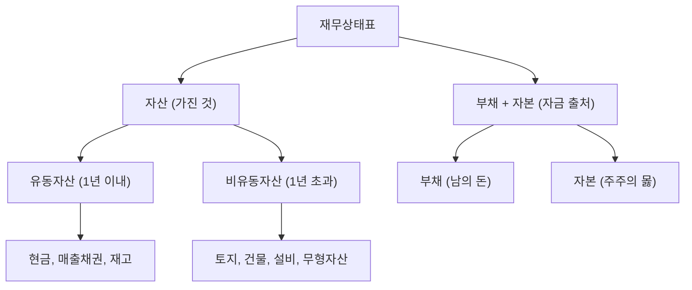

# 자산 뜻, 기업이 가진 모든 것

"이 회사의 자산이 10조 원이다"라는 말은 회사가 보유한 모든 것의 합계가 10조라는 뜻입니다.

자산은 재무상태표(대차대조표)의 왼쪽에 나오며, 회사의 규모와 구조를 보여줍니다.

## 한 줄 정의

자산은 기업이 소유하거나 통제하는 경제적 가치가 있는 모든 것의 합계입니다.

## 아주 쉽게 말하면

내가 가진 모든 것을 리스트로 적은 것입니다. 현금, 통장 잔고, 집, 자동차, 주식, 받을 돈까지 다 합치면 내 자산입니다.

회사도 마찬가지로, 현금·공장·특허·받을 돈·재고 등을 모두 합친 것이 자산입니다.

## 왜 중요한가

- 회사의 규모를 자산 총액으로 파악할 수 있습니다.
- 자산 = 부채 + 자본 (회계 항등식). 자산의 출처를 알 수 있습니다.
- 자산의 구성(현금 vs 공장 vs 재고)을 보면 사업 특성을 이해할 수 있습니다.
- PBR(주가순자산비율) 계산의 기초가 됩니다.

## 그림으로 이해하기

_자산은 항상 부채와 자본의 합과 같습니다._

## 숫자로 보는 예시

> ⚠️ 아래 숫자는 개념 설명을 위한 **가상 예시**이며, 실제 투자 데이터가 아닙니다.

A회사 재무상태표:

| 자산 항목 | 금액 | 비중 |
|---|---|---|
| 현금 및 예금 | 2,000억 | 20% |
| 매출채권 (받을 돈) | 1,500억 | 15% |
| 재고자산 | 1,000억 | 10% |
| 유형자산 (공장, 설비) | 4,500억 | 45% |
| 무형자산 (특허, 브랜드) | 1,000억 | 10% |
| **자산 합계** | **10,000억** | **100%** |

## 표로 비교하기

| 구분 | 유동자산 | 비유동자산 |
|---|---|---|
| 기간 | 1년 내 현금화 가능 | 1년 이상 장기 보유 |
| 예시 | 현금, 매출채권, 재고 | 공장, 토지, 특허 |
| 특징 | 유동성 높음 | 사업 기반, 유동성 낮음 |
| 중요 포인트 | 단기 지급 능력 | 장기 성장 기반 |
| 관련 지표 | 유동비율 | ROA, 자산회전율 |

## 초보자가 자주 하는 오해

**오해 1: 자산이 크면 좋은 회사다**

자산이 크더라도 대부분이 부채로 조달된 것이면 위험합니다. 자산 10조인데 부채가 9조면 자본은 1조뿐입니다. 자산의 크기보다 자산의 출처(부채 vs 자본)가 더 중요합니다.

**오해 2: 자산 = 현금**

자산에는 현금 외에도 공장, 재고, 특허, 받을 돈 등이 포함됩니다. 당장 현금이 부족해도 자산은 클 수 있습니다. 유동성(현금화 속도)을 별도로 확인해야 합니다.

## 고수는 이렇게 봅니다

숙련된 투자자는 자산의 "질"을 봅니다.

- 현금 비중이 높으면 → 안전하지만 효율적 투자를 못하는 것일 수도
- 재고가 급증하면 → 제품이 안 팔리는 신호일 수 있음
- 매출채권이 매출 대비 과도하면 → 외상이 많아 현금 회수 리스크
- 무형자산(영업권)이 크면 → 인수합병으로 부풀려진 것인지 확인

## 기업분석에서는 이렇게 씁니다

기업분석에서 자산은 재무 건전성과 사업 효율성을 판단하는 기초입니다.

- ROA(총자산이익률) = 순이익 ÷ 자산 → 자산을 얼마나 효율적으로 쓰는가
- PBR = 시가총액 ÷ 순자산(자본) → 자산가치 대비 주가 수준
- 자산 구성 변화 추적 → 사업 방향성 파악 (설비투자 확대? 현금 축적?)

## 함께 보면 좋은 용어

- [부채 뜻](../level-03-financial-statements/liabilities.md)
- [자본 뜻](../level-03-financial-statements/equity.md)
- [ROA 뜻](../level-04-ratios/roa.md)
- [PBR 뜻](../level-05-valuation/pbr.md)
- [유동비율 뜻](../level-04-ratios/current-ratio.md)

## 정리

- 자산 = 기업이 가진 모든 것 (현금, 설비, 재고, 특허 등)이다.
- 자산 = 부채 + 자본 (항상 균형).
- 자산의 크기보다 구성과 질이 더 중요하다.

## 한 줄 요약

> 자산은 기업이 보유한 경제적 가치의 총합이며, 그 크기보다 구성(현금 vs 설비 vs 재고)과 출처(부채 vs 자본)가 분석의 핵심입니다.

---

*면책 조항: 이 글은 투자 권유가 아니라 주식 용어와 기업분석 방법을 설명하기 위한 교육 콘텐츠입니다. 특정 종목의 매수·매도 판단은 독자 본인의 책임입니다.*

Tags: 자산, 자산뜻, 재무상태표, 주식초보, 기업분석
