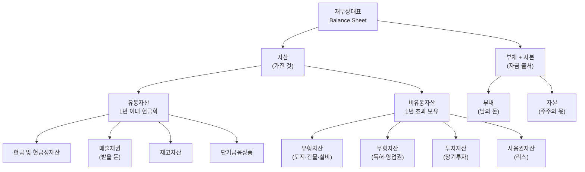

# 자산 뜻, 기업이 가진 모든 것

재무상태표를 처음 열어보면 가장 먼저 눈에 들어오는 숫자가 "자산총계"입니다. "자산이 10조"라는 말은 회사가 보유한 모든 것의 합계가 10조라는 뜻이죠. 하지만 단순히 크기만 보면 함정에 빠집니다. 그 10조가 현금인지, 재고인지, 남의 돈으로 산 공장인지에 따라 기업의 체력은 완전히 달라지거든요.

이 글에서는 자산의 개념, 분류 체계, 그리고 실전에서 어떻게 읽어야 하는지를 가상 기업 시나리오와 함께 설명합니다.

## 한 줄 정의

자산은 기업이 소유하거나 통제하는 경제적 가치가 있는 모든 것의 합계입니다.

## 아주 쉽게 말하면

여러분의 개인 재산을 떠올려 보세요. 통장 잔고, 집, 자동차, 받을 돈, 주식 계좌... 이 모든 것을 리스트로 적으면 그게 여러분의 자산입니다.

회사도 마찬가지입니다. 현금, 공장, 특허권, 매출채권(거래처에서 받을 돈), 창고의 재고 등을 모두 합친 것이 자산입니다. 다만 회사는 이 리스트를 공식 문서(재무상태표)로 매 분기 공개해야 한다는 차이가 있습니다.

핵심은 회계 항등식입니다: **자산 = 부채 + 자본**. 회사가 가진 것(자산)은 반드시 남의 돈(부채)이거나 주주의 돈(자본)으로 구성됩니다. 이 균형은 절대 깨지지 않습니다.

## 왜 중요한가

- **기업 규모 파악**: 자산총계로 회사의 크기를 가늠합니다. 삼성전자급인지 스타트업인지 한눈에 보입니다.
- **자금 출처 추적**: 자산 = 부채 + 자본이므로, 자산이 10조인데 부채가 8조면 "빚으로 운영하는 회사"임을 즉시 알 수 있습니다.
- **사업 특성 이해**: IT기업은 무형자산 비중이 높고, 제조업은 유형자산 비중이 높습니다. 자산 구성만 봐도 어떤 사업인지 짐작됩니다.
- **핵심 지표의 기초**: ROA(총자산이익률), PBR(주가순자산비율), 유동비율 등 주요 지표가 모두 자산에서 출발합니다.
- **시계열 분석**: 자산이 매년 늘어나는 회사는 성장 중이고, 줄어드는 회사는 구조조정 중일 수 있습니다.

## 그림으로 이해하기

_자산의 좌측(유동)은 단기 유동성, 우측(비유동)은 장기 사업 기반을 나타냅니다._

## 숫자로 보는 예시

> ⚠️ 아래 숫자는 개념 설명을 위한 **가상 예시**이며, 실제 투자 데이터가 아닙니다.

가상 기업 "한빛테크"의 2025년 재무상태표를 봅시다.

| 자산 항목 | 금액 | 비중 | 해석 포인트 |
|---|---|---|---|
| 현금 및 현금성자산 | 3,000억 | 15% | 즉시 사용 가능한 여유 자금 |
| 단기금융상품 | 2,000억 | 10% | 1년 내 만기 도래 |
| 매출채권 | 4,000억 | 20% | 거래처에서 받아야 할 돈 |
| 재고자산 | 2,000억 | 10% | 창고에 쌓인 제품·원재료 |
| 유형자산 (공장·설비) | 6,000억 | 30% | 제조 역량의 핵심 |
| 무형자산 (특허·SW) | 2,000억 | 10% | 기술력·브랜드 가치 |
| 기타 비유동자산 | 1,000억 | 5% | 장기 보증금 등 |
| **자산 합계** | **20,000억** | **100%** | — |

이 회사의 자금 출처는 어떨까요?

| 구분 | 금액 | 비중 |
|---|---|---|
| 부채 | 8,000억 | 40% |
| 자본 | 12,000억 | 60% |
| **부채 + 자본** | **20,000억** | **100%** |

자산 20,000억 = 부채 8,000억 + 자본 12,000억. 항등식이 정확히 맞습니다.

## 표로 비교하기

| 구분 | 유동자산 | 비유동자산 |
|---|---|---|
| 기간 기준 | 1년 내 현금화 가능 | 1년 이상 장기 보유 |
| 대표 항목 | 현금, 매출채권, 재고 | 공장, 토지, 특허, 영업권 |
| 역할 | 단기 지급 능력 확보 | 사업 운영 기반 |
| 변동성 | 매 분기 크게 변동 | 비교적 안정적 |
| 관련 지표 | 유동비율, 당좌비율 | ROA, 자산회전율 |
| 투자자 관심 | "돈 갚을 능력 있나?" | "성장 기반 탄탄한가?" |
| 업종 차이 | 금융·유통업은 유동 비중 높음 | 제조·인프라는 비유동 비중 높음 |

## 초보자가 자주 하는 오해

**오해 1: 자산이 크면 무조건 좋은 회사다**

자산이 10조여도 부채가 9조면 순수한 주주 몫(자본)은 1조뿐입니다. 자산의 "크기"보다 자산의 "출처"를 봐야 합니다. 부채비율(부채 ÷ 자본)이 200%를 넘으면 재무 건전성에 주의가 필요합니다.

**오해 2: 자산 = 현금이다**

현금은 자산의 일부일 뿐입니다. 제조업은 유형자산(공장·설비) 비중이 50% 이상인 경우가 많습니다. "자산이 많다"고 해서 당장 현금이 풍부한 것은 아닙니다. 유동비율을 별도로 확인해야 합니다.

**오해 3: 재무상태표의 자산 = 시장가치다**

재무상태표는 대부분 취득원가(장부가)로 기록합니다. 10년 전에 산 땅이 현재 시세의 1/5로 적혀 있을 수 있습니다. 반대로 감가상각이 끝난 설비가 0원으로 기록돼도 실제로는 잘 돌아가고 있을 수 있습니다. 장부가와 시장가의 괴리를 항상 의식해야 합니다.

**오해 4: 무형자산은 실체가 없으니 무시해도 된다**

특허, 소프트웨어, 브랜드 가치는 IT·바이오·소비재 기업에서 핵심 경쟁력입니다. 무형자산 비중이 높다고 해서 "뻥튀기"라고 단정하면 우량 기업을 놓칠 수 있습니다. 다만 인수합병으로 발생한 영업권(Goodwill)은 과대평가 리스크가 있으므로 별도 확인이 필요합니다.

## 고수는 이렇게 봅니다

숙련된 투자자는 자산의 "질(Quality)"을 분석합니다.

- **현금 비중 과다** → 여유 자금은 좋지만, 투자처를 못 찾는 경영진의 한계일 수도 있습니다. "사내 유보금만 쌓는 회사"에 해당합니다.
- **재고 급증** → 전년 대비 매출은 정체인데 재고만 늘었다면, 제품이 팔리지 않는다는 경고 신호입니다. 재고자산회전율을 꼭 확인하세요.
- **매출채권 과다** → 매출 대비 매출채권 비율이 높으면 외상 매출이 많다는 뜻입니다. 부실채권 발생 시 한 번에 손실 처리될 수 있습니다.
- **영업권 급증** → 인수합병 후 영업권이 자산의 30% 이상이면, 향후 감액 손실(Impairment) 리스크를 경계해야 합니다.
- **자산 회전율 하락** → 매출 ÷ 자산이 낮아지면, 동일한 자산으로 수익 창출 능력이 떨어지고 있다는 의미입니다.

## 기업분석에서는 이렇게 씁니다

기업분석에서 자산은 재무 건전성과 사업 효율성을 판단하는 출발점입니다.

- **ROA(총자산이익률)** = 순이익 ÷ 총자산 → 자산 1원당 얼마를 벌었는지 측정합니다. ROA 10%면 자산 100억으로 10억을 번 셈입니다.
- **PBR(주가순자산비율)** = 시가총액 ÷ 순자산(자본) → 순자산 대비 시장이 매긴 가격입니다. PBR 1 미만이면 장부가보다 싸게 거래되는 것입니다.
- **자산 구성 변화 추적** → 3년간 설비투자가 꾸준히 늘면 성장 투자 중, 현금만 쌓이면 투자 기회 부재를 의심합니다.
- **동종업 비교** → 같은 매출 규모인데 A사는 자산 5조, B사는 자산 10조라면, A사가 자산을 더 효율적으로 쓰는 것입니다(자산회전율 높음).

## 함께 보면 좋은 용어

- [부채 뜻](../level-03-financial-statements/liabilities.md)
- [자본 뜻](../level-03-financial-statements/equity.md)
- [ROA 뜻](../level-04-ratios/roa.md)
- [PBR 뜻](../level-05-valuation/pbr.md)
- [유동비율 뜻](../level-04-ratios/current-ratio.md)

## 정리

- 자산 = 기업이 가진 모든 것(현금, 설비, 재고, 특허 등)의 합계다.
- 자산 = 부채 + 자본. 이 항등식은 절대 깨지지 않는다.
- 유동자산(1년 내 현금화)과 비유동자산(장기 보유)으로 나뉜다.
- 자산의 크기보다 구성(현금 vs 설비 vs 재고)과 질(회전율, 부실 여부)이 분석의 핵심이다.
- ROA, PBR, 유동비율 등 핵심 지표가 모두 자산에서 출발한다.

## 한 줄 요약

> 자산은 기업이 보유한 경제적 가치의 총합이며, 그 크기보다 구성(현금 vs 설비 vs 재고)과 출처(부채 vs 자본)를 함께 봐야 진짜 체력이 보입니다.

---

이 글은 투자 권유가 아니라 주식 용어와 기업분석 방법을 설명하기 위한 교육 콘텐츠입니다. 특정 종목의 매수·매도 판단은 독자 본인의 책임입니다.

Tags: 자산, 자산뜻, 재무상태표, 주식초보, 기업분석
