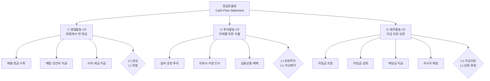

# 현금흐름 뜻 — 기업의 실제 돈 움직임

손익계산서에 "순이익 1,000억"이라고 적혀 있으면 회사 통장에 1,000억이 들어온 걸까요? 아닙니다. 외상 매출이 많으면 장부상 이익은 있지만 실제 현금은 한 푼도 안 들어올 수 있습니다. "흑자도산"이 바로 이런 상황입니다.

현금흐름표는 이런 함정을 잡아줍니다. 실제로 현금이 얼마나 들어오고 나갔는지, 그리고 어디에 썼는지를 낱낱이 보여주는 "진짜 통장 내역서"입니다.

## 한 줄 정의

현금흐름은 일정 기간 동안 기업에 실제로 들어오고 나간 현금의 흐름을 말합니다.

## 아주 쉽게 말하면

월급이 300만 원(수익)이어도 카드값 100만, 월세 50만, 적금 80만을 빼면 통장에 남는 돈은 70만 원입니다. "벌었다"와 "통장에 남았다"는 다릅니다.

기업도 마찬가지입니다. 매출 1조를 올려도 외상이 많으면 현금은 적고, 설비투자에 수천억을 쓰면 통장은 텅 빌 수 있습니다. 현금흐름표는 이 "실제 돈의 출입"을 영업·투자·재무 세 가지 영역으로 나눠 보여줍니다.

## 왜 중요한가

- **흑자도산 방지**: 이익이 있어도 현금이 없으면 직원 급여, 이자, 거래대금을 못 내서 부도가 납니다. 영업활동 현금흐름이 지속적 마이너스면 위험 신호입니다.
- **이익의 질 검증**: 순이익이 1,000억인데 영업활동 현금흐름이 200억이면, 800억은 "장부상으로만 존재하는 이익"일 가능성이 높습니다.
- **투자 방향 파악**: 투자활동 현금흐름을 보면 기업이 어디에 돈을 쓰는지(설비 확장? 인수합병? 금융상품?) 알 수 있습니다.
- **재무 전략 이해**: 재무활동을 보면 돈을 빌리는 중인지, 갚는 중인지, 배당을 늘리는지 줄이는지 파악됩니다.
- **생존 능력 평가**: 현금이 계속 줄어드는 기업은 결국 추가 차입이나 증자가 필요합니다. 현금흐름 추세가 기업의 미래 생존을 결정합니다.

## 그림으로 이해하기

_영업(+) · 투자(-) · 재무(-)가 가장 이상적인 성숙 기업의 패턴입니다._

## 숫자로 보는 예시

> ⚠️ 아래 숫자는 개념 설명을 위한 **가상 예시**이며, 실제 투자 데이터가 아닙니다.

가상 기업 "한빛테크" 2025년 현금흐름표:

| 항목 | 금액 | 해석 |
|---|---|---|
| **영업활동 현금흐름** | **+3,200억** | 본업에서 현금을 잘 벌고 있음 |
| - 순이익 | 2,400억 | 손익계산서 기준 |
| - 감가상각비 (가산) | 1,200억 | 현금 유출 없는 비용 → 다시 더함 |
| - 매출채권 증가 (차감) | -400억 | 외상 증가 → 현금 미수취 |
| **투자활동 현금흐름** | **-2,500억** | 적극적 성장 투자 중 |
| - 설비투자 (CAPEX) | -2,000억 | 신규 공장 라인 증설 |
| - 금융상품 매입 | -500억 | 여유자금 운용 |
| **재무활동 현금흐름** | **-500억** | 부채 줄이고 배당 지급 |
| - 차입금 상환 | -300억 | 장기차입금 일부 상환 |
| - 배당금 지급 | -200억 | 주주환원 |
| **순현금 변동** | **+200억** | 기말 현금 증가 |
| 기초 현금 | 3,000억 | 연초 보유 현금 |
| **기말 현금** | **3,200억** | 연말 보유 현금 |

핵심 체크: 영업CF(+3,200억) > 순이익(2,400억) → 이익의 질이 높습니다. 감가상각 등 비현금 비용이 크기 때문입니다.

## 표로 비교하기

| 구분 | 영업활동 CF | 투자활동 CF | 재무활동 CF |
|---|---|---|---|
| 의미 | 본업 현금 창출력 | 미래 성장 투자 | 자금 조달·상환 |
| 플러스(+) 의미 | 정상 영업으로 현금 유입 | 자산 매각 (주의 필요) | 차입·증자로 자금 조달 |
| 마이너스(-) 의미 | 영업 부진 (위험) | 설비·인수 투자 (긍정 가능) | 상환·배당 (건전 가능) |
| 이상적 부호 | + (클수록 좋음) | - (투자 중) | - (상환·환원 중) |
| 지속적 경고 | 3분기 연속 마이너스 | 3년 연속 플러스 (구조조정?) | 매년 플러스 (빚만 늘어남) |
| 핵심 질문 | "본업으로 돈을 버는가?" | "미래를 위해 쓰는가?" | "빌리는가, 갚는가?" |

## 초보자가 자주 하는 오해

**오해 1: 순이익이 플러스면 현금도 충분하다**

매출채권(외상)이 쌓이면 이익은 있지만 현금은 안 들어옵니다. 감가상각비처럼 현금 유출 없는 비용도 이익을 줄이지만 현금은 안 나갑니다. 이익과 현금의 괴리는 반드시 발생합니다.

**오해 2: 투자활동 현금흐름이 마이너스면 나쁘다**

오히려 적극 투자 중이라는 긍정 신호입니다. 영업CF가 플러스인 상태에서 투자CF가 마이너스면 "벌어서 미래에 투자하는" 건전한 성장 패턴입니다. 투자CF가 플러스인데 영업CF가 마이너스면 — 그때가 문제입니다(자산 팔아서 버티는 중).

**오해 3: 현금흐름표는 손익계산서와 같은 것을 다른 방식으로 보여줄 뿐이다**

완전히 다른 정보입니다. 손익계산서는 "발생주의"(거래 발생 시점 기준), 현금흐름표는 "현금주의"(현금 입출금 시점 기준)입니다. 매출 1억을 올려도 6개월 후 수금이면, 손익계산서엔 즉시 반영되지만 현금흐름표엔 6개월 후에야 반영됩니다.

**오해 4: 기말 현금이 많으면 좋은 회사다**

현금이 과도하게 많은데 투자도 안 하고 배당도 안 하면, 경영진이 주주 가치를 창출하지 못하고 있다는 비판을 받을 수 있습니다. 현금의 "적정 수준"이 중요합니다.

## 고수는 이렇게 봅니다

숙련된 투자자는 현금흐름의 "패턴"과 "질"을 분석합니다.

- **영업CF vs 순이익 비율**: 영업CF ÷ 순이익이 지속적으로 1 이상이면 이익의 질이 높습니다. 0.5 이하가 반복되면 분식회계 가능성까지 의심합니다.
- **CAPEX 강도**: 투자CF 중 설비투자(CAPEX)가 영업CF의 몇 %인지. 50% 이하면 여유 있는 투자, 100% 이상이면 빌려서 투자하는 격입니다.
- **현금 전환 주기**: 매출 발생부터 현금 수취까지 걸리는 기간. 이 주기가 길어지면 운전자본 부담이 커집니다.
- **3년 누적 분석**: 단일 분기는 변동이 크므로, 3년 누적 영업CF가 3년 누적 순이익을 초과하는지 확인합니다.
- **생애주기 판단**: 영업(+), 투자(-), 재무(-)면 성숙기. 영업(+), 투자(-大), 재무(+)면 성장기. 영업(-), 투자(+), 재무(-)면 쇠퇴기.

## 기업분석에서는 이렇게 씁니다

현금흐름은 기업의 생애주기와 재무 건전성을 판단하는 핵심 도구입니다.

- **생애주기 분류**: 3가지 CF의 부호 조합으로 성장기·성숙기·쇠퇴기를 판단합니다.
  - 성장기: 영업(+), 투자(-大), 재무(+) → 빌려서 공격 투자
  - 성숙기: 영업(+大), 투자(-), 재무(-) → 자체 현금으로 투자 + 상환 + 배당
  - 쇠퇴기: 영업(-), 투자(+), 재무(-) → 자산 팔아 빚 갚는 중
- **FCF 계산**: 영업CF - CAPEX = 잉여현금흐름(FCF). 주주에게 돌려줄 수 있는 "자유로운 현금"입니다.
- **현금 소진율(Burn Rate)**: 적자 기업의 경우 보유 현금 ÷ 월간 현금 소진액으로 생존 가능 기간을 추정합니다.
- **동종업 비교**: 같은 매출 규모인데 A사는 영업CF 마진 20%, B사는 5%라면, A사의 현금 창출 능력이 압도적으로 우수합니다.

## 함께 보면 좋은 용어

- [잉여현금흐름 FCF](./fcf.md) — 영업CF에서 투자를 뺀 '자유롭게 쓸 수 있는 현금'
- [영업이익](./operating-income.md) — 손익계산서 기준 수익성 (현금 기준 아님)
- [순이익](./net-income.md) — 현금흐름과 괴리가 생길 수 있는 회계 이익
- [매출액](./revenue.md) — 현금 수취 시점과 매출 인식 시점의 차이 이해
- [부채](./liabilities.md) — 재무활동 현금흐름에서 차입·상환으로 연결

## 정리

- 현금흐름표는 영업·투자·재무 세 가지 활동으로 나눠, 실제 현금의 입출을 보여준다.
- 영업활동 CF가 꾸준히 플러스여야 기업이 본업으로 돈을 벌고 있다는 증거다.
- 순이익과 현금흐름은 다르다. 이익이 있어도 현금이 없으면 부도 위험이 있다.
- 3가지 CF의 부호 조합으로 기업의 생애주기(성장·성숙·쇠퇴)를 판단할 수 있다.
- 영업CF ÷ 순이익 비율로 이익의 질을 검증하는 습관이 중요하다.

## 한 줄 요약

> 현금흐름은 기업의 '진짜 통장 잔고 변화'이며, 영업활동에서 꾸준히 플러스가 나와야 건강한 기업입니다.

---

이 글은 투자 권유가 아니라 주식 용어와 기업분석 방법을 설명하기 위한 교육 콘텐츠입니다. 특정 종목의 매수·매도 판단은 독자 본인의 책임입니다.

Tags: 현금흐름, 영업활동현금흐름, 투자활동현금흐름, 재무활동현금흐름, 현금흐름표
