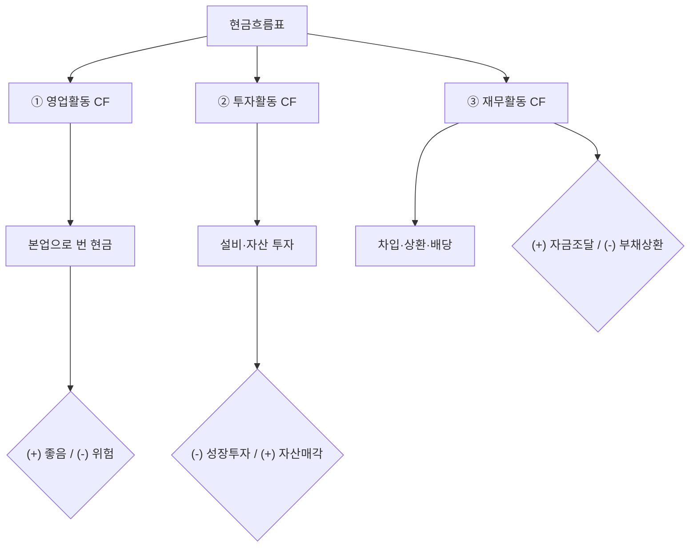

# 현금흐름 뜻 — 기업의 실제 돈 움직임

## 한 줄 정의

현금흐름은 일정 기간 동안 기업에 실제로 들어오고 나간 현금의 흐름을 말합니다.

## 아주 쉽게 말하면

월급이 300만 원이어도 카드값, 월세, 적금을 빼면 통장에 남는 돈은 다릅니다. 기업도 매출(수익)과 실제 현금 입금은 다르기 때문에, 진짜 돈이 얼마나 돌고 있는지 보여주는 것이 현금흐름표입니다.

## 왜 중요한가

손익계산서에서 흑자여도 현금이 부족하면 부도날 수 있습니다(흑자도산). 현금흐름표는 기업이 실제로 현금을 벌고 있는지, 어디에 쓰고 있는지를 보여주는 '진짜 성적표'입니다.

## 그림으로 이해하기

## 숫자로 보는 예시

> ⚠️ 아래 숫자는 개념 설명을 위한 **가상 예시**이며, 실제 투자 데이터가 아닙니다.

C기업 분기 현금흐름표:
- 영업활동 현금흐름: **+500억 원** (본업에서 현금 창출)
- 투자활동 현금흐름: **-300억 원** (공장 증설)
- 재무활동 현금흐름: **-100억 원** (차입금 상환)
- 순현금 변동: +100억 원
- 기초 현금: 200억 원 → **기말 현금: 300억 원**

## 표로 비교하기

| 구분 | 영업활동 CF | 투자활동 CF | 재무활동 CF |
|------|------------|------------|------------|
| 의미 | 본업 현금 창출력 | 미래 성장 투자 | 자금 조달·상환 |
| 플러스(+) | 정상 영업 | 자산 매각 | 차입·증자 |
| 마이너스(-) | 영업 부진 | 설비 투자 | 상환·배당 |
| 이상적 부호 | + (클수록 좋음) | - (투자 중) | - (상환 중) |

## 초보자가 자주 하는 오해

1. **"순이익이 플러스면 현금도 충분하다"**
   → 매출채권(외상)이 쌓이면 이익은 있지만 현금은 안 들어옵니다. 반드시 영업활동 현금흐름을 따로 확인해야 합니다.

2. **"투자활동 현금흐름이 마이너스면 나쁘다"**
   → 오히려 적극 투자 중이라는 긍정 신호일 수 있습니다. 영업CF가 플러스인 상태에서 투자CF가 마이너스면 건전한 성장 패턴입니다.

## 고수는 이렇게 봅니다

숙련된 투자자는 '영업CF vs 순이익' 비율을 봅니다. 영업CF가 순이익보다 지속적으로 크면 이익의 질이 높다고 판단합니다. 반대로 순이익은 나오는데 영업CF가 마이너스면 회계적 이익만 있고 실제 현금은 빠져나가는 위험 신호입니다.

## 기업분석에서는 이렇게 씁니다

기업의 현금흐름 패턴으로 생애주기를 판단합니다:
- 성장기: 영업(+), 투자(-大), 재무(+) → 빌려서 공격 투자
- 성숙기: 영업(+大), 투자(-), 재무(-) → 자체 현금으로 투자+상환
- 쇠퇴기: 영업(-), 투자(+), 재무(-) → 자산 팔아 빚 갚음

## 함께 보면 좋은 용어

- [잉여현금흐름 FCF](./fcf.md) — 영업CF에서 투자를 뺀 '자유롭게 쓸 수 있는 현금'
- [영업이익](./operating-income.md) — 손익계산서 기준 수익성 (현금 기준 아님)
- [순이익](./net-income.md) — 현금흐름과 괴리가 생길 수 있는 회계 이익
- [매출액](./revenue.md) — 현금 수취 시점과 매출 인식 시점의 차이 이해
- [부채](./liabilities.md) — 재무활동 현금흐름에서 차입·상환으로 연결

## 정리

현금흐름표는 영업·투자·재무 세 가지 활동으로 나뉘며, 기업의 실제 돈 움직임을 보여줍니다. 손익계산서의 이익보다 현금흐름이 기업의 생존 능력을 더 정직하게 드러냅니다.

## 한 줄 요약

> 현금흐름은 기업의 '진짜 통장 잔고 변화'이며, 영업활동에서 꾸준히 플러스가 나와야 건강한 기업입니다.

---

*면책 조항: 이 글은 투자 권유가 아니라 주식 용어와 기업분석 방법을 설명하기 위한 교육 콘텐츠입니다. 특정 종목의 매수·매도 판단은 독자 본인의 책임입니다.*

Tags: 현금흐름, 영업활동현금흐름, 투자활동현금흐름, 재무활동현금흐름, 현금흐름표
