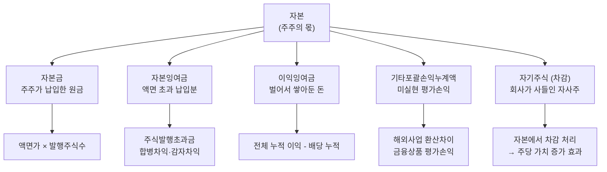

# 자본 뜻 — 주주의 몫

재무상태표에서 부채 아래에 위치한 "자본총계"는 기업의 진짜 체력을 보여주는 숫자입니다. 자산이 아무리 커도 부채를 빼면 남는 게 없다면, 그 기업은 사실상 주주의 몫이 0인 셈이죠.

자본은 "주주가 넣은 돈 + 기업이 벌어서 쌓은 돈"의 합계입니다. 이 글에서는 자본의 구성 요소를 분해하고, 실전에서 자본을 어떻게 읽어야 하는지를 가상 기업 시나리오와 함께 설명합니다.

## 한 줄 정의

자본은 기업의 총자산에서 부채를 뺀 나머지, 즉 주주에게 귀속되는 순자산입니다.

## 아주 쉽게 말하면

3억짜리 집을 가지고 있는데 대출이 2억이면, 진짜 내 돈은 1억입니다. 이 1억이 "순자산"이자 "자본"입니다.

기업도 마찬가지입니다. 자산 20,000억에서 부채 8,000억을 빼면 자본 12,000억. 이 12,000억이 주주 전체의 몫입니다. 주식 1주를 산다는 것은 이 자본의 일부를 소유한다는 뜻이기도 합니다.

핵심 공식: **자본 = 자산 - 부채** (회계 항등식 자산 = 부채 + 자본의 변형)

## 왜 중요한가

- **재무 체력의 바로미터**: 자본이 꾸준히 늘어나면 이익을 축적하고 있다는 뜻이고, 줄어들면 적자 누적의 경고입니다.
- **자본잠식 판단**: 자본이 자본금보다 작으면 부분 자본잠식, 마이너스면 완전 자본잠식(상장폐지 사유)입니다.
- **ROE의 분모**: ROE = 순이익 ÷ 자본. 같은 이익이라도 자본이 작으면 ROE가 높아집니다. 자본 규모를 모르면 ROE를 제대로 해석할 수 없습니다.
- **PBR의 기초**: PBR = 시가총액 ÷ 자본. PBR 1 미만이면 시장이 기업을 장부가보다 싸게 평가하는 것입니다.
- **배당 여력 파악**: 배당은 이익잉여금(자본의 핵심 구성 요소)에서 지급합니다. 이익잉여금이 충분해야 배당을 유지할 수 있습니다.

## 그림으로 이해하기

_이익잉여금은 대부분의 우량 기업에서 자본의 가장 큰 비중을 차지합니다._

## 숫자로 보는 예시

> ⚠️ 아래 숫자는 개념 설명을 위한 **가상 예시**이며, 실제 투자 데이터가 아닙니다.

가상 기업 "한빛테크"의 자본 구조를 봅시다.

| 자본 항목 | 금액 | 비중 | 해석 포인트 |
|---|---|---|---|
| 자본금 | 500억 | 4.2% | 액면가 5,000원 × 1,000만 주 |
| 자본잉여금 | 1,500억 | 12.5% | IPO 당시 주식발행초과금 |
| 이익잉여금 | 11,000억 | 91.7% | 10년간 벌어서 쌓은 누적 이익 |
| 기타포괄손익누계액 | 200억 | 1.7% | 해외법인 환산차이 등 |
| 자기주식 | -1,200억 | -10.0% | 주주환원 목적 매입 |
| **자본 합계** | **12,000억** | **100%** | — |

주요 지표 계산:
- **BPS(주당순자산)** = 12,000억 ÷ 1,000만 주 = **120,000원**
- 현재 주가가 150,000원이라면 → **PBR = 1.25배** (장부가 대비 25% 프리미엄)
- 올해 순이익 2,400억 → **ROE = 2,400 ÷ 12,000 = 20%** (우수)

## 표로 비교하기

| 구분 | 자본금 | 이익잉여금 | 자본잉여금 | 자기주식 |
|---|---|---|---|---|
| 원천 | 주주 납입 | 영업 이익 축적 | 주식발행초과금 등 | 자사주 매입 (차감) |
| 변동 요인 | 유·무상증자 | 당기순이익, 배당 | 합병차익, 감자차익 | 자사주 매입·소각 |
| 투자자 관심 | 희석 여부 | 성장의 핵심 증거 | 일회성 여부 | 주주환원 의지 |
| 크기 비중 | 보통 매우 작음 | 보통 가장 큼 | 중간 | 차감 항목 |
| 좋은 신호 | 안정적 유지 | 매년 증가 | 변동 적음 | 꾸준한 매입·소각 |
| 나쁜 신호 | 빈번한 증자 | 감소 추세 | 급변동 | 매입 후 처분(임직원 지급) |

## 초보자가 자주 하는 오해

**오해 1: 자본금이 크면 큰 회사다**

자본금은 단순히 "액면가 × 주식수"일 뿐입니다. 액면가가 100원이면 1억 주를 발행해도 자본금은 100억에 불과합니다. 기업 규모는 자본금이 아니라 자본총계(또는 시가총액)로 판단해야 합니다.

**오해 2: 자본이 마이너스일 수는 없다**

적자가 오래 누적되면 이익잉여금이 마이너스(결손금)가 되고, 이것이 자본금과 자본잉여금을 초과하면 자본 전체가 마이너스가 됩니다. 이를 "완전 자본잠식"이라 하며, 코스피 기준 상장폐지 사유에 해당합니다.

**오해 3: 자본 = 회사에 있는 현금이다**

자본은 회계상 계산 결과(자산 - 부채)이지, 금고에 현금으로 쌓여있는 게 아닙니다. 이익잉여금 1조가 있어도 그 돈은 이미 공장, 재고, 투자 등으로 운용 중입니다. 현금 여력은 현금흐름표를 별도로 확인해야 합니다.

**오해 4: 자기주식 매입은 자본이 줄어드니까 나쁘다**

자기주식은 자본에서 차감되지만, 유통 주식수가 줄어들어 주당 가치(BPS, EPS)가 높아집니다. 소각까지 하면 영구적으로 주당 가치가 상승합니다. 시장에서는 대부분 긍정적 주주환원 신호로 해석합니다.

## 고수는 이렇게 봅니다

숙련된 투자자는 자본의 "변화 방향"과 "구성"을 분석합니다.

- **이익잉여금 추이**: 3~5년간 이익잉여금이 꾸준히 증가하면 → 복리로 성장하는 기업. 감소하면 → 배당 과다 또는 적자 전환 의심.
- **자본잠식률 모니터링**: (자본금 - 자본총계) ÷ 자본금 × 100. 50% 이상이면 관리종목 지정 위험.
- **자기주식 전략**: 매입만 하고 소각 안 하면 → 언제든 시장에 재매각 가능(오버행 리스크). 소각까지 하는 기업이 진정한 주주환원.
- **유상증자 이력**: 자본금과 자본잉여금이 갑자기 급증하면 → 유상증자로 기존 주주 지분 희석 발생. 증자 목적(시설투자 vs 운영자금)에 따라 평가가 달라집니다.
- **ROE와 자본 규모의 관계**: 자본이 너무 작으면 ROE가 비정상적으로 높게 나옵니다. 반드시 절대 금액을 함께 확인해야 합니다.

## 기업분석에서는 이렇게 씁니다

기업분석에서 자본은 가치평가와 수익성 분석의 기초입니다.

- **ROE(자기자본이익률)** = 순이익 ÷ 자본 × 100 → 주주의 돈으로 얼마를 벌었는지. ROE 15% 이상이면 우수, 20% 이상이면 탁월로 평가합니다.
- **BPS(주당순자산)** = 자본 ÷ 발행주식수 → 주식 1주가 가진 장부상 가치. 청산 시 이론적으로 받을 수 있는 금액입니다.
- **PBR(주가순자산비율)** = 주가 ÷ BPS → 1 미만이면 장부가보다 싸게 거래 중(저평가 가능성). 다만 이익을 못 내는 기업은 PBR이 낮아도 가치함정일 수 있습니다.
- **자본 변동 추적** → 유상증자, 자사주 매입·소각, 배당 정책의 변화를 3년간 추적하면 경영진의 주주환원 의지를 파악할 수 있습니다.

## 함께 보면 좋은 용어

- [자산](./assets.md) — 자산 = 부채 + 자본
- [부채](./liabilities.md) — 자본과 합쳐 자산의 원천 구성
- [BPS](../level-05-valuation/bps.md) — 자본 ÷ 주식수 = 주당순자산
- [ROE](../level-04-ratios/roe.md) — 순이익 ÷ 자본 = 자기자본이익률
- [유상증자](../level-07-earnings/paid-in-capital-increase.md) — 자본금과 자본잉여금이 동시에 증가하는 이벤트

## 정리

- 자본 = 자산 - 부채 = 주주에게 귀속되는 순자산이다.
- 자본금(납입 원금), 이익잉여금(벌어서 쌓은 돈), 자본잉여금(액면 초과분), 자기주식(차감)으로 구성된다.
- 이익잉여금의 꾸준한 증가가 건전한 성장의 가장 강력한 신호다.
- 자본잠식(자본 < 자본금 또는 마이너스)은 심각한 경고 신호다.
- ROE, BPS, PBR 등 핵심 가치평가 지표가 모두 자본에서 출발한다.

## 한 줄 요약

> 자본은 '주주의 진짜 몫'이며, 이익잉여금이 꾸준히 늘고 자본잠식 없이 유지되는 기업이 재무적으로 건전한 기업입니다.

---

이 글은 투자 권유가 아니라 주식 용어와 기업분석 방법을 설명하기 위한 교육 콘텐츠입니다. 특정 종목의 매수·매도 판단은 독자 본인의 책임입니다.

Tags: 자본, 자본금, 이익잉여금, 자기자본, 재무상태표
