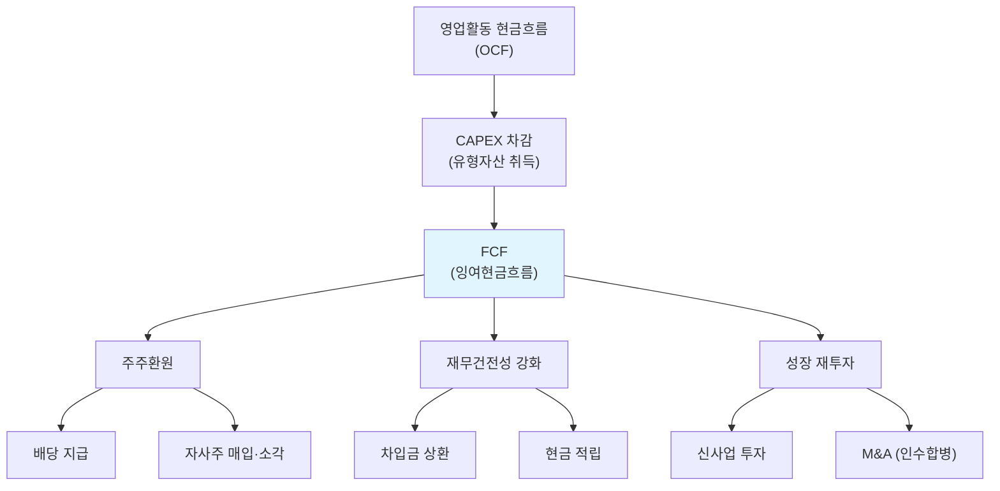

# 잉여현금흐름(FCF) 뜻 — 자유롭게 쓸 수 있는 현금

기업 분석에서 가장 정직한 숫자가 뭐냐고 물으면, 많은 전문가가 "FCF"를 꼽습니다. 순이익은 회계 처리 방식에 따라 부풀릴 수 있지만, FCF는 실제로 통장에 남는 현금이라 조작이 극히 어렵습니다.

워런 버핏이 "Owner Earnings(주주이익)"이라 부르며 투자 판단의 핵심으로 삼는 지표이기도 합니다. 이 글에서는 FCF의 개념, 계산법, 그리고 실전에서 어떻게 활용하는지를 가상 기업 시나리오와 함께 설명합니다.

## 한 줄 정의

FCF(Free Cash Flow)는 영업활동으로 벌어들인 현금에서 사업 유지에 필요한 투자(CAPEX)를 뺀, 기업이 자유롭게 쓸 수 있는 현금입니다.

## 아주 쉽게 말하면

월급에서 생활비, 교통비, 식비 등 "살아가는 데 필수인 지출"을 빼고 남은 돈을 생각해 보세요. 이 여유 자금으로 저축하든, 여행을 가든, 빚을 갚든 여러분 자유입니다.

기업도 마찬가지입니다. 본업으로 번 현금(영업CF)에서 공장 유지보수, 설비 교체 등 "사업을 계속하기 위해 반드시 써야 하는 투자(CAPEX)"를 빼면 FCF가 나옵니다. 이 돈으로 배당을 주든, 자사주를 사든, 부채를 갚든 경영진이 자유롭게 결정할 수 있습니다.

**공식: FCF = 영업활동 현금흐름 - CAPEX(자본적 지출)**

## 왜 중요한가

- **이익의 진위 검증**: 순이익은 감가상각 방법, 충당금 설정 등으로 조정 가능하지만, FCF는 실제 현금이므로 조작이 어렵습니다.
- **주주환원 여력**: 배당과 자사주 매입의 재원은 FCF입니다. FCF가 꾸준히 플러스여야 지속 가능한 주주환원이 가능합니다.
- **기업 가치평가의 핵심**: DCF(할인현금흐름) 모델에서 미래 FCF를 추정해 현재가치로 할인하여 적정 주가를 산출합니다.
- **부채 상환 능력**: FCF가 풍부하면 차입금을 빠르게 갚을 수 있어 재무 건전성이 개선됩니다.
- **경영 자율성**: FCF가 충분한 기업은 외부 자금 조달 없이 신사업 투자, M&A 등을 자체적으로 실행할 수 있습니다.

## 그림으로 이해하기

_FCF는 주주환원, 재무건전성, 성장투자 세 가지 방향으로 활용됩니다._

## 숫자로 보는 예시

> ⚠️ 아래 숫자는 개념 설명을 위한 **가상 예시**이며, 실제 투자 데이터가 아닙니다.

가상 기업 "한빛테크" 3개년 FCF 추이:

| 항목 | 2023년 | 2024년 | 2025년 |
|---|---|---|---|
| 영업활동 현금흐름 | 2,800억 | 3,000억 | 3,200억 |
| CAPEX (설비투자) | -1,200억 | -1,000억 | -800억 |
| **FCF** | **1,600억** | **2,000억** | **2,400억** |
| 배당 지급 | -400억 | -500억 | -600억 |
| 자사주 매입 | -200억 | -300억 | -400억 |
| 차입금 상환 | -500억 | -500억 | -500억 |
| 잔여 현금 | 500억 | 700억 | 900억 |

핵심 포인트:
- FCF가 3년 연속 증가 → 현금 창출 능력 개선 중
- 배당 + 자사주 = 주주환원 총액이 매년 증가하면서도 FCF 내에서 충당 → 지속 가능한 환원
- 시가총액이 24,000억이라면 → FCF 수익률 = 2,400 ÷ 24,000 = **10%** (매우 높은 수준)

## 표로 비교하기

| 구분 | 순이익 | 영업CF | FCF |
|---|---|---|---|
| 기준 | 회계 발생주의 | 현금 유입·유출 | 현금 - 필수투자 |
| 계산 출발점 | 매출 - 모든 비용 | 실제 현금 수취·지급 | 영업CF - CAPEX |
| 조작 가능성 | 상대적 높음 | 낮음 | 가장 낮음 |
| 포함 항목 | 감가상각, 충당금 등 비현금 항목 포함 | 비현금 항목 제외 | CAPEX까지 차감 |
| 주요 용도 | EPS·PER 계산 | 현금 창출력 확인 | 주주환원 여력, DCF 밸류에이션 |
| 마이너스 의미 | 적자 | 현금 유출 | 투자 과다 or 영업 부진 |
| 투자자 질문 | "얼마 벌었나?" | "현금은 들어오나?" | "주주에게 줄 돈이 있나?" |

## 초보자가 자주 하는 오해

**오해 1: FCF가 마이너스면 망하는 기업이다**

대규모 설비투자(공장 신설, 반도체 팹 건설 등) 시기에는 CAPEX가 급증해 FCF가 일시적으로 마이너스가 됩니다. 이때는 투자 완료 후 FCF가 회복되는지, 그리고 투자 재원이 어디서 오는지(자체 현금 vs 차입)를 확인하는 게 핵심입니다.

**오해 2: FCF = 순이익이다**

감가상각비는 순이익에서 차감되지만 실제 현금 유출은 아닙니다(과거에 이미 지출한 것의 분할 인식). 반면 CAPEX는 순이익에 즉시 반영되지 않지만 현금은 당장 나갑니다. 이런 시차 때문에 FCF와 순이익은 크게 다를 수 있습니다.

**오해 3: FCF만 보면 된다, 순이익은 필요 없다**

FCF는 CAPEX 타이밍에 따라 연도별 변동이 큽니다. 대규모 투자 해에는 FCF가 급감하고, 투자가 없는 해에는 급증합니다. 순이익과 FCF를 함께 보고, 3~5년 평균으로 판단하는 것이 정확합니다.

**오해 4: CAPEX가 적으면 좋다**

CAPEX가 과도하게 적으면 기존 설비가 노후화되고, 경쟁력이 떨어질 수 있습니다. "유지보수 CAPEX"(기존 설비 교체)는 반드시 필요하며, "성장 CAPEX"(신규 설비)를 줄인다는 것은 미래 성장을 포기한다는 의미일 수 있습니다.

## 고수는 이렇게 봅니다

숙련된 투자자는 FCF의 "지속성"과 "사용처"를 분석합니다.

- **FCF 수익률(FCF Yield)**: FCF ÷ 시가총액. 5% 이상이면 주주환원 여력 충분, 10% 이상이면 저평가 가능성. 단, 성장주는 FCF Yield가 낮아도 정당화될 수 있습니다.
- **FCF 마진**: FCF ÷ 매출. 업종 내 비교 시 현금 창출 효율을 보여줍니다. IT/플랫폼은 20%+, 제조업은 5~10%가 일반적입니다.
- **FCF 전환율**: FCF ÷ 순이익. 1 이상이면 이익의 질이 높음. 0.5 이하가 지속되면 이익은 있지만 현금이 안 쌓이는 구조적 문제를 의심합니다.
- **3~5년 누적 FCF vs 누적 순이익**: 장기적으로 누적 FCF가 누적 순이익에 근접해야 정상. 크게 괴리되면 회계 품질에 의문을 제기합니다.
- **FCF 사용 우선순위**: 배당·자사주(주주환원) vs 부채상환(안정) vs M&A(성장). 경영진의 자본배분 철학을 FCF 사용처에서 읽을 수 있습니다.

## 기업분석에서는 이렇게 씁니다

FCF는 기업 가치평가(Valuation)의 핵심 입력값입니다.

- **DCF 모델**: 미래 5~10년의 FCF를 추정하고 WACC(가중평균자본비용)로 할인해 기업 가치를 산출합니다. FCF 추정의 정확도가 밸류에이션의 신뢰도를 결정합니다.
- **FCF 기반 적정 PER 역산**: 기대 FCF 수익률 5%를 기준으로 역산하면 시가총액 = FCF × 20. 이를 EPS로 나누면 적정 PER이 도출됩니다.
- **배당 지속가능성 검증**: 배당금 ÷ FCF = 배당성향(현금 기준). 이 비율이 80%를 넘으면 배당 지속에 부담이 있고, 100%를 넘으면 빚내서 배당하는 셈입니다.
- **동종업 비교**: 같은 매출 규모에서 A사 FCF 마진 15%, B사 5%라면 A사의 현금 창출 구조가 압도적으로 우수합니다.

## 함께 보면 좋은 용어

- [현금흐름](./cash-flow.md) — FCF의 출발점인 영업활동 현금흐름을 포함
- [영업이익](./operating-income.md) — 발생주의 수익성 vs 현금주의 FCF 비교
- [배당](../level-06-events/dividend.md) — FCF가 뒷받침해야 지속 가능한 배당
- [자사주 매입](../level-06-events/share-buyback.md) — FCF 활용처 중 하나
- [EV/EBITDA](../level-05-valuation/ev-ebitda.md) — FCF와 함께 쓰이는 현금 기반 밸류에이션

## 정리

- FCF = 영업활동 현금흐름 - CAPEX = 기업이 자유롭게 쓸 수 있는 현금이다.
- 순이익보다 조작이 어렵고, 배당·자사주·부채상환 등 주주가치 제고의 원천이다.
- FCF 수익률(FCF ÷ 시가총액)로 주주환원 여력과 저평가 여부를 가늠한다.
- 일시적 마이너스는 성장투자 때문일 수 있으므로 3~5년 평균으로 판단해야 한다.
- DCF 밸류에이션의 핵심 입력값으로, 미래 FCF 추정이 적정 주가를 결정한다.

## 한 줄 요약

> FCF는 기업이 '마음대로 쓸 수 있는 진짜 현금'이며, 주주환원과 기업 가치평가의 핵심 원천입니다.

---

이 글은 투자 권유가 아니라 주식 용어와 기업분석 방법을 설명하기 위한 교육 콘텐츠입니다. 특정 종목의 매수·매도 판단은 독자 본인의 책임입니다.

Tags: 잉여현금흐름, 현금흐름, 설비투자, 배당여력, 기업분석
