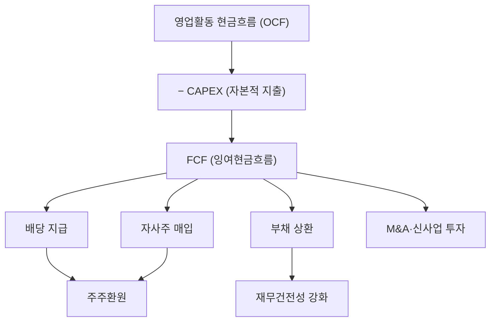

# 잉여현금흐름(FCF) 뜻 — 자유롭게 쓸 수 있는 현금

## 한 줄 정의

FCF(Free Cash Flow)는 영업활동으로 벌어들인 현금에서 사업 유지에 필요한 투자(CAPEX)를 뺀, 기업이 자유롭게 쓸 수 있는 현금입니다.

## 아주 쉽게 말하면

월급에서 생활비와 필수 지출을 빼고 남은 '여유 자금'입니다. 이 돈으로 저축하든, 여행을 가든, 빚을 갚든 자유입니다. 기업도 FCF로 배당, 자사주 매입, 부채 상환 등을 합니다.

## 왜 중요한가

순이익은 회계 조정으로 부풀릴 수 있지만, FCF는 실제 현금이라 조작이 어렵습니다. 워런 버핏이 "Owner Earnings(주주이익)"이라 부르며 가장 중시하는 지표이기도 합니다. FCF가 꾸준히 플러스인 기업이 주주환원 여력이 있습니다.

## 그림으로 이해하기

## 숫자로 보는 예시

> ⚠️ 아래 숫자는 개념 설명을 위한 **가상 예시**이며, 실제 투자 데이터가 아닙니다.

D기업 연간 실적:
- 영업활동 현금흐름: 1,200억 원
- CAPEX(유형자산 취득): 400억 원
- **FCF = 1,200 - 400 = 800억 원**
- 배당 지급: 300억 원
- 자사주 매입: 200억 원
- 잔여 현금: 300억 원 (부채 상환 또는 적립)

## 표로 비교하기

| 구분 | 순이익 | 영업CF | FCF |
|------|--------|--------|-----|
| 기준 | 회계 발생주의 | 현금 유입·유출 | 현금 - 필수투자 |
| 조작 가능성 | 상대적 높음 | 낮음 | 가장 낮음 |
| 용도 | EPS·PER 계산 | 현금 창출력 확인 | 주주환원 여력 판단 |
| 마이너스 의미 | 적자 | 현금 유출 | 투자 과다 or 영업 부진 |

## 초보자가 자주 하는 오해

1. **"FCF가 마이너스면 망하는 기업이다"**
   → 대규모 성장 투자(공장 신설 등) 시기에는 FCF가 일시적으로 마이너스가 됩니다. 투자 완료 후 FCF가 회복되는지가 핵심입니다.

2. **"FCF = 순이익이다"**
   → 감가상각비는 순이익에서 빠지지만 실제 현금 유출은 아닙니다. 반대로 CAPEX는 순이익에 바로 반영되지 않지만 현금은 나갑니다. 둘은 상당히 다를 수 있습니다.

## 고수는 이렇게 봅니다

숙련된 투자자는 FCF 수익률(FCF ÷ 시가총액)을 봅니다. FCF 수익률이 5% 이상이면 주주환원 여력이 충분하다고 판단합니다. 또한 3~5년 평균 FCF를 보고 일시적 변동을 걸러냅니다.

## 기업분석에서는 이렇게 씁니다

DCF(할인현금흐름) 밸류에이션의 핵심 입력값이 바로 FCF입니다. 미래 5~10년의 FCF를 추정하고 할인율로 현재가치를 구해 적정 주가를 산출합니다. FCF 추정의 정확도가 밸류에이션의 신뢰도를 결정합니다.

## 함께 보면 좋은 용어

- [현금흐름](./cash-flow.md) — FCF의 출발점인 영업활동 현금흐름을 포함
- [영업이익](./operating-income.md) — 발생주의 수익성 vs 현금주의 FCF 비교
- [배당](../level-06-events/dividend.md) — FCF가 뒷받침해야 지속 가능한 배당
- [자사주 매입](../level-06-events/share-buyback.md) — FCF 활용처 중 하나
- [EV/EBITDA](../level-05-valuation/ev-ebitda.md) — FCF와 함께 쓰이는 현금 기반 밸류에이션

## 정리

FCF는 영업으로 번 현금에서 필수 투자를 뺀 '진짜 여유 자금'입니다. 순이익보다 조작이 어렵고, 배당·자사주·부채상환 등 주주가치 제고의 원천이 됩니다. 꾸준한 FCF 창출이 좋은 기업의 핵심 조건입니다.

## 한 줄 요약

> FCF는 기업이 '마음대로 쓸 수 있는 진짜 현금'이며, 주주환원의 원천입니다.

---

*면책 조항: 이 글은 투자 권유가 아니라 주식 용어와 기업분석 방법을 설명하기 위한 교육 콘텐츠입니다. 특정 종목의 매수·매도 판단은 독자 본인의 책임입니다.*

Tags: FCF, 잉여현금흐름, 영업현금흐름, CAPEX, 주주환원
