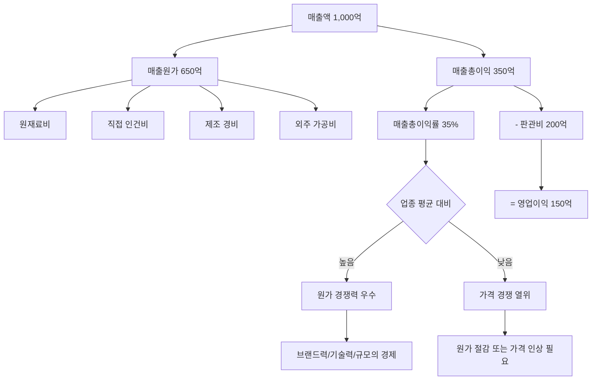

# 매출총이익 뜻, 원가를 빼고 남은 돈

매출이 1,000억 원이라고 해서 1,000억이 다 남는 것은 아닙니다. 제품을 만드는 데 들어간 원가를 빼야 합니다. 이 "원가를 빼고 남은 돈"이 바로 매출총이익입니다.

매출총이익은 기업의 제품·서비스가 **그 자체로 돈이 되는 구조인지**를 보여주는 가장 기본적인 지표입니다. 여기서부터 기업의 원가 경쟁력이 드러납니다.

## 한 줄 정의

매출총이익은 매출액에서 매출원가(제품을 만들거나 구매하는 데 든 직접 비용)를 뺀 금액입니다.

## 아주 쉽게 말하면

치킨집에서 치킨 1마리를 2만 원에 팔았습니다. 닭, 튀김가루, 기름 등 재료비가 1만 2천 원 들었다면, 매출총이익은 8천 원입니다.

아직 월세, 직원 월급, 배달 앱 수수료 등은 빼지 않은 상태입니다. 순수하게 "이 치킨 한 마리를 팔면 재료비 빼고 얼마가 남느냐"를 보여주는 것이 매출총이익입니다.

## 왜 중요한가

매출총이익은 기업 분석의 **첫 번째 필터** 역할을 합니다.

- **제품 경쟁력의 지표** — 매출총이익률이 높다는 것은 원가 대비 높은 가격을 받을 수 있다는 뜻이며, 이는 브랜드력·기술력·독점적 지위가 있다는 증거입니다.
- **비용 구조의 출발점** — 매출총이익이 너무 낮으면 아무리 판관비를 줄여도 영업이익을 내기 어렵습니다. 구조적 한계를 보여줍니다.
- **업종 내 비교 도구** — 같은 업종에서 매출총이익률이 높은 회사는 원가 관리가 뛰어나거나, 프리미엄 가격을 받을 수 있는 포지션입니다.
- **추세 변화가 신호** — 매출총이익률이 분기마다 떨어지면 원재료비 상승, 가격 경쟁 심화, 제품 믹스 악화 등 근본적 문제를 암시합니다.
- **투자 결정의 기초** — 매출총이익이 마이너스인 기업은 "팔수록 손해"인 구조이므로, 아무리 매출이 성장해도 근본적 한계가 있습니다.

## 그림으로 이해하기

_매출총이익은 손익계산서에서 "영업이익의 재원"입니다. 여기가 부족하면 이후 단계에서 이익을 만들기 어렵습니다._

## 숫자로 보는 예시

가상 기업 "스마트웨어"(의류 브랜드)의 3년간 매출총이익 변화를 추적합니다.

| 항목 | 2022년 | 2023년 | 2024년 |
|---|---|---|---|
| 매출액 | 500억 원 | 600억 원 | 700억 원 |
| 매출원가 | 275억 원 | 348억 원 | 427억 원 |
| 매출총이익 | 225억 원 | 252억 원 | 273억 원 |
| 매출총이익률 | **45.0%** | **42.0%** | **39.0%** |

매출은 3년간 40% 성장했지만, 매출총이익률은 45% → 39%로 **6%p 하락**했습니다. 무슨 일이 벌어진 걸까요?

가능한 원인:
- 원재료(원단) 가격 상승을 판매가에 전가하지 못했다
- 할인 판매(세일) 비중이 늘어 평균 판매 단가가 하락했다
- 원가가 높은 저가 라인을 확대해 제품 믹스가 악화됐다

투자자 관점: 매출 성장에도 불구하고 매출총이익률 하락이 지속되면, "성장은 하지만 질이 나빠지고 있다"는 경고 신호입니다.

**업종별 매출총이익률 비교 (가상 수치)**

| 업종 | 대표 기업 유형 | 매출총이익률 범위 |
|---|---|---|
| SaaS/소프트웨어 | 클라우드, 구독 서비스 | 70~85% |
| 제약/바이오 | 신약 개발사 | 60~80% |
| 화장품/명품 | 브랜드 소비재 | 55~75% |
| 반도체 | 팹리스, 파운드리 | 40~60% |
| 식품/음료 | 가공식품, 음료 | 30~45% |
| 자동차/중공업 | 완성차, 조선 | 15~25% |
| 유통/편의점 | 마트, 이커머스 | 15~25% |
| 건설 | 시공사 | 10~20% |

같은 "매출총이익률 30%"라도 SaaS 기업이면 문제지만, 유통 기업이면 우수한 수준입니다. **반드시 업종 내에서 비교**해야 합니다.

## 표로 비교하기

| 구분 | 매출총이익 | 영업이익 | 순이익 |
|---|---|---|---|
| 공식 | 매출 - 매출원가 | 매출총이익 - 판관비 | 영업이익 ± 영업외 - 세금 |
| 빼는 비용 | 직접 제조 비용만 | + 간접비(인건비, 마케팅 등) | + 이자, 환차손, 세금 등 |
| 보여주는 것 | 제품 자체의 마진 | 본업 전체의 수익성 | 최종 주주 귀속 이익 |
| 업종 비교 | 원가 경쟁력 비교 | 운영 효율성 비교 | 종합 수익성 비교 |
| 핵심 관리 포인트 | 원재료비, 제조 효율 | 인건비, 마케팅비, R&D | 부채 이자, 세금 |

| 매출총이익률 변화 시그널 해석 |  |
|---|---|
| 상승 + 매출 성장 | 최고의 조합. 제품 경쟁력 강화 + 성장 |
| 상승 + 매출 정체 | 제품 믹스 개선 또는 원가 절감 성공 |
| 하락 + 매출 성장 | 저마진 제품으로 볼륨만 키우는 중. 질적 성장 아님 |
| 하락 + 매출 정체 | 가격 경쟁 심화. 가장 위험한 조합 |

## 초보자가 자주 하는 오해

**오해 1: "매출총이익이 높으면 무조건 좋은 회사다"**

매출총이익률 80%인 스타트업이 판관비(마케팅, 인건비)를 100%p 이상 쓰면 영업적자입니다. 매출총이익은 "제품 자체"는 돈이 되지만, 그 제품을 팔기 위한 비용이 더 클 수 있습니다. 영업이익까지 봐야 전체 그림이 보입니다.

**오해 2: "매출총이익률은 업종 상관없이 비교할 수 있다"**

소프트웨어 회사 80%와 유통 회사 20%를 비교해서 "소프트웨어가 4배 좋다"고 할 수 없습니다. 각 업종의 비용 구조가 근본적으로 다릅니다. 유통은 매출총이익률이 낮지만 자산 회전율이 높아 ROE가 비슷할 수 있습니다.

**오해 3: "매출원가는 회사가 마음대로 줄일 수 있다"**

원재료비는 시장가격에 의해 결정됩니다. 유가, 원자재, 환율 등 외부 요인의 영향을 크게 받습니다. 이런 변동을 얼마나 판매가에 전가할 수 있느냐(pricing power)가 진짜 경쟁력입니다.

## 고수는 이렇게 봅니다

숙련된 투자자는 매출총이익률의 **추세와 원인**을 봅니다.

- **분기별 추세 추적** — 매출총이익률이 3분기 연속 하락하면 구조적 문제일 가능성이 높습니다. 경영진의 실적 발표(컨퍼런스콜)에서 원인을 확인합니다.
- **경쟁사 대비 포지션** — 동종 업계에서 매출총이익률이 상위 25%면 pricing power가 있다는 뜻입니다. 이는 브랜드, 특허, 규모의 경제 중 하나 이상에서 비롯됩니다.
- **제품 믹스 변화 감지** — 고마진 제품(예: 프리미엄 라인) 비중이 늘면 매출총이익률이 올라가고, 저마진 제품(예: 보급형) 비중이 늘면 내려갑니다.
- **원가 전가 능력 테스트** — 원재료비가 20% 올랐을 때 매출총이익률이 변하지 않으면 → 판매가 인상에 성공한 것(강한 브랜드). 떨어지면 → 가격 전가 실패(약한 포지션).
- **고정비 vs 변동비 비율** — 매출원가 중 고정비(감가상각 등) 비중이 높은 기업은 매출이 늘수록 매출총이익률이 개선됩니다(규모의 경제). 반대로 매출이 줄면 급격히 악화됩니다.

## 기업분석에서는 이렇게 씁니다

매출총이익은 기업의 "체질"을 보는 첫 관문이며, 밸류에이션의 기초 데이터입니다.

가상 기업 "헬스케어플러스"(건강기능식품)의 분석:

- **동종 비교**: 헬스케어플러스 매출총이익률 62%, 업계 평균 48%. 자체 원료 생산 + 프리미엄 브랜드 포지션으로 14%p 격차. 이 격차가 유지되는 한 기업가치 프리미엄이 정당화됩니다.
- **추세 확인**: 2022년 64% → 2023년 63% → 2024년 62%. 연 1%p씩 하락 중. 원인은 해외 진출 시 유통 마진을 양보한 것. 해외 매출 비중이 안정되면 하락이 멈출지 확인 필요.
- **원가 리스크 분석**: 핵심 원재료(콜라겐) 수입 비중 70%. 환율 10% 상승 시 매출총이익률 약 3%p 하락 예상. 환헷지 여부를 IR에서 확인합니다.
- **경쟁 진입 시 영향**: 대기업이 유사 제품으로 진입하면 가격 경쟁 → 매출총이익률 하락 가능. 특허, 인증 등 진입장벽의 견고함을 평가합니다.

## 함께 보면 좋은 용어

- [매출액 뜻](../level-03-financial-statements/revenue.md)
- [영업이익 뜻](../level-03-financial-statements/operating-income.md)
- [매출총이익률 뜻](../level-04-ratios/gross-margin.md)
- [영업이익률 뜻](../level-04-ratios/operating-margin.md)
- [순이익 뜻](../level-03-financial-statements/net-income.md)

## 정리

- 매출총이익 = 매출액 - 매출원가이며, 제품 자체의 기본 수익성을 나타낸다.
- 매출총이익률은 반드시 같은 업종 내에서 비교해야 의미가 있다.
- 추세가 중요하다: 3분기 연속 하락은 구조적 문제, 상승은 경쟁력 강화 신호이다.
- 매출총이익이 마이너스면 "팔수록 손해"인 구조이므로 투자 대상에서 제외해야 한다.
- 원가 전가 능력(pricing power)이 매출총이익률을 결정하는 핵심 요소이다.

## 한 줄 요약

> 매출총이익은 원가를 빼고 남은 돈이며, 이 비율의 추세가 기업의 제품 경쟁력이 강해지는지 약해지는지를 보여줍니다.

---

이 글은 투자 권유가 아니라 주식 용어와 기업분석 방법을 설명하기 위한 교육 콘텐츠입니다. 특정 종목의 매수·매도 판단은 독자 본인의 책임입니다.

Tags: 매출총이익, 매출총이익뜻, 재무제표, 주식초보, 기업분석
