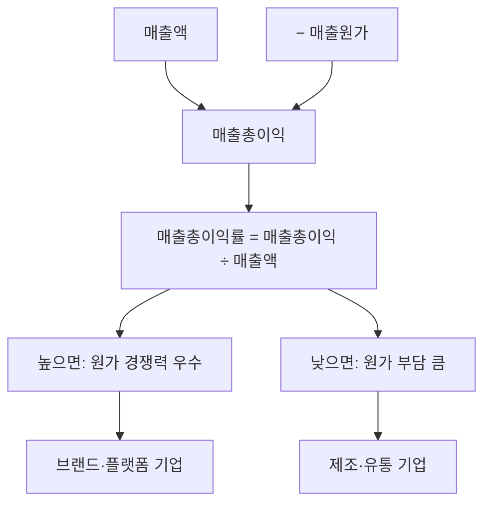

# 매출총이익 뜻, 원가를 빼고 남은 돈

매출이 1,000억 원이라고 해서 1,000억이 다 남는 것은 아닙니다. 제품을 만드는 데 들어간 원가를 빼야 합니다.

매출총이익은 매출에서 직접적인 제조 원가만 뺀 금액으로, 제품의 기본 수익성을 보여줍니다.

## 한 줄 정의

매출총이익은 매출액에서 매출원가(제품을 만들거나 구매하는 데 든 직접 비용)를 뺀 금액입니다.

## 아주 쉽게 말하면

치킨집에서 치킨 1마리를 2만 원에 팔았는데, 닭과 재료비가 1만 2천 원이었다면 매출총이익은 8천 원입니다.

아직 월세, 직원 월급, 전기세 등은 빼지 않은 상태입니다. 순수하게 제품 자체의 마진만 보여줍니다.

## 왜 중요한가

- 제품·서비스의 기본 경쟁력을 알 수 있습니다.
- 매출총이익이 높으면 → 원가 대비 높은 가격을 받을 수 있는 경쟁력
- 매출총이익이 낮으면 → 가격 경쟁이 치열하거나, 원가가 높은 구조
- 같은 업종 내에서 비교하면 어떤 회사의 제품이 더 경쟁력 있는지 알 수 있습니다.

## 그림으로 이해하기

_매출에서 원가를 빼면 매출총이익, 이를 비율로 나타내면 매출총이익률입니다._

## 숫자로 보는 예시

> ⚠️ 아래 숫자는 개념 설명을 위한 **가상 예시**이며, 실제 투자 데이터가 아닙니다.

업종별 매출총이익률 차이:

- 소프트웨어 회사: 매출 100억, 원가 20억 → 매출총이익 80억 (80%)
- 제조업 회사: 매출 100억, 원가 65억 → 매출총이익 35억 (35%)
- 유통업 회사: 매출 100억, 원가 80억 → 매출총이익 20억 (20%)

같은 매출이어도 업종에 따라 남는 금액이 크게 다릅니다.

## 표로 비교하기

| 구분 | 매출총이익 | 영업이익 | 순이익 |
|---|---|---|---|
| 빼는 비용 | 매출원가만 | +판관비 | +영업외비용, 세금 |
| 보여주는 것 | 제품 자체 마진 | 본업 수익성 | 최종 수익성 |
| 업종 비교 | 제품 경쟁력 비교에 적합 | 운영 효율성 비교 | 종합 수익성 비교 |
| 관리 포인트 | 원가 절감, 가격 정책 | 인건비, 마케팅비 | 부채, 세금 |

## 초보자가 자주 하는 오해

**오해 1: 매출총이익이 높으면 무조건 좋은 회사다**

매출총이익이 높아도 판관비(마케팅비, 인건비 등)가 더 크면 영업적자가 날 수 있습니다. 스타트업은 매출총이익률이 높지만 적자인 경우가 흔합니다.

**오해 2: 매출총이익률은 업종 상관없이 비교할 수 있다**

업종마다 비즈니스 구조가 달라 매출총이익률이 천차만별입니다. 소프트웨어는 80%, 유통은 20%가 정상입니다. 같은 업종 내에서만 비교해야 의미 있습니다.

## 고수는 이렇게 봅니다

숙련된 투자자는 매출총이익률의 추세를 봅니다.

- 매출총이익률이 상승 추세 → 제품 가격 인상 성공 또는 원가 절감 → 긍정적
- 매출총이익률이 하락 추세 → 가격 경쟁 심화 또는 원가 상승 → 경고 신호
- 경쟁사 대비 매출총이익률이 높으면 → 브랜드력이나 기술 우위

## 기업분석에서는 이렇게 씁니다

기업분석에서 매출총이익은 "이 회사 제품의 경쟁력"을 보는 첫 관문입니다.

- 매출총이익률이 업종 평균 이상 → 가격 결정력(pricing power) 보유
- 매출총이익 증가 속도 > 매출 증가 속도 → 마진 개선 (좋은 신호)
- 원재료 가격 변동에 매출총이익이 크게 흔들리면 → 원가 전가 능력 부족

## 함께 보면 좋은 용어

- [매출액 뜻](../level-03-financial-statements/revenue.md)
- [영업이익 뜻](../level-03-financial-statements/operating-income.md)
- [매출총이익률 뜻](../level-04-ratios/gross-margin.md)
- [영업이익률 뜻](../level-04-ratios/operating-margin.md)
- [순이익 뜻](../level-03-financial-statements/net-income.md)

## 정리

- 매출총이익 = 매출액 - 매출원가이다.
- 제품·서비스 자체의 기본 수익성을 보여준다.
- 같은 업종 내에서 비교해야 의미 있으며, 추세 변화가 중요하다.

## 한 줄 요약

매출총이익은 매출에서 직접 원가만 뺀 금액이며, 제품의 기본 경쟁력을 보여주는 지표입니다.

---

*면책 조항: 이 글은 투자 권유가 아니라 주식 용어와 기업분석 방법을 설명하기 위한 교육 콘텐츠입니다. 특정 종목의 매수·매도 판단은 독자 본인의 책임입니다.*

Tags: 매출총이익, 매출총이익뜻, 재무제표, 주식초보, 기업분석
