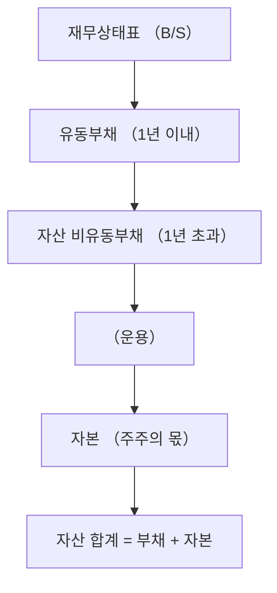

# 부채 뜻 — 기업이 갚아야 할 돈

## 한 줄 정의

부채는 기업이 외부에서 빌려 온 돈, 즉 미래에 갚아야 할 의무를 말합니다.

## 아주 쉽게 말하면

친구에게 100만 원을 빌렸다면, 그 100만 원이 내 부채입니다. 기업도 은행이나 투자자에게 돈을 빌려서 사업을 하고, 나중에 이자와 함께 갚아야 합니다.

## 왜 중요한가

부채가 적정 수준이면 레버리지 효과로 수익을 키울 수 있지만, 과도하면 이자 부담이 커져 흑자도산 위험이 생깁니다. 투자자는 부채 규모와 구성을 확인해 기업의 재무 건전성을 판단합니다.

## 그림으로 이해하기

## 숫자로 보는 예시

> ⚠️ 아래 숫자는 개념 설명을 위한 **가상 예시**이며, 실제 투자 데이터가 아닙니다.

A기업 재무상태표:
- 총자산: 1,000억 원
- 유동부채: 200억 원 (단기차입금, 매입채무 등)
- 비유동부채: 300억 원 (사채, 장기차입금 등)
- **부채 합계: 500억 원**
- 자본: 500억 원
- 부채비율 = 500억 ÷ 500억 × 100 = **100%**

## 표로 비교하기

| 구분 | 유동부채 | 비유동부채 |
|------|----------|-----------|
| 상환 시점 | 1년 이내 | 1년 초과 |
| 대표 항목 | 단기차입금, 매입채무, 미지급금 | 사채, 장기차입금, 퇴직급여충당부채 |
| 투자자 관심 | 단기 유동성 위험 | 장기 이자 부담 |
| 위험 신호 | 유동비율 100% 미만 | 이자보상배율 1배 미만 |

## 초보자가 자주 하는 오해

1. **"부채가 많으면 무조건 나쁜 기업이다"**
   → 부채는 성장을 위한 투자 수단입니다. IT·바이오처럼 성장 투자가 필요한 업종은 부채가 높을 수 있고, 이자보다 높은 수익을 내면 주주에게 이득입니다.

2. **"부채와 적자는 같은 뜻이다"**
   → 부채는 빌린 돈(재무상태표), 적자는 수익보다 비용이 큰 상태(손익계산서)입니다. 부채가 많아도 매년 흑자인 기업이 있고, 부채가 적어도 적자인 기업이 있습니다.

## 고수는 이렇게 봅니다

숙련된 투자자는 부채의 '질'을 봅니다. 같은 500억 부채라도 이자율 2% 장기 사채와 이자율 8% 단기 차입금은 위험이 다릅니다. 또한 매입채무처럼 영업 과정에서 자연 발생하는 부채는 이자가 없어 오히려 긍정적으로 평가합니다.

## 기업분석에서는 이렇게 씁니다

신규 투자를 발표한 기업이 있을 때, 투자 재원이 차입(부채 증가)인지 유보이익(자본)인지 확인합니다. 차입 비중이 높으면 향후 이자 비용 증가가 영업이익을 얼마나 깎을지 시뮬레이션해 봅니다.

## 함께 보면 좋은 용어

- [자산](./assets.md) — 부채 + 자본 = 자산이라는 회계 등식의 출발점
- [자본](./equity.md) — 부채와 함께 자산의 원천을 구성
- [부채비율](../level-04-ratios/debt-ratio.md) — 부채 ÷ 자본으로 재무 건전성 측정
- [유동비율](../level-04-ratios/current-ratio.md) — 유동자산 ÷ 유동부채로 단기 상환 능력 확인
- [이자보상배율](../level-04-ratios/interest-coverage.md) — 영업이익으로 이자를 몇 번 갚을 수 있는지

## 정리

부채는 기업이 외부에서 조달한 자금으로, 유동부채와 비유동부채로 나뉩니다. 부채 자체가 나쁜 것이 아니라, 상환 능력 대비 과도한 부채가 위험합니다. 부채비율·이자보상배율과 함께 종합적으로 판단하세요.

## 한 줄 요약

> 부채는 기업이 갚아야 할 돈이며, 규모보다 '감당할 수 있는 수준인가'가 핵심입니다.

---

*면책 조항: 이 글은 투자 권유가 아니라 주식 용어와 기업분석 방법을 설명하기 위한 교육 콘텐츠입니다. 특정 종목의 매수·매도 판단은 독자 본인의 책임입니다.*

Tags: 부채, 유동부채, 비유동부채, 재무제표, 재무상태표
