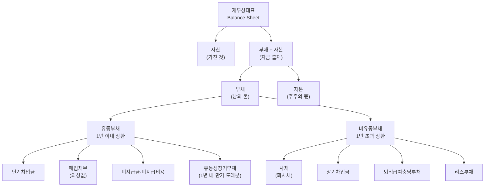

# 부채 뜻 — 기업이 갚아야 할 돈

"부채가 많으면 위험한 회사"라는 말, 들어보셨죠? 하지만 실제로는 그렇게 단순하지 않습니다. 대한민국 시가총액 상위 기업 중 부채가 0인 곳은 사실상 없습니다. 부채는 성장의 연료가 될 수도, 도산의 방아쇠가 될 수도 있습니다.

핵심은 "부채가 있느냐 없느냐"가 아니라 "감당할 수 있는 수준이냐"입니다. 이 글에서는 부채의 개념, 분류, 그리고 실전에서 좋은 부채와 위험한 부채를 구별하는 법을 가상 기업 시나리오와 함께 설명합니다.

## 한 줄 정의

부채는 기업이 외부에서 빌려 온 돈, 즉 미래에 갚아야 할 의무를 말합니다.

## 아주 쉽게 말하면

친구에게 100만 원을 빌렸다면 그 100만 원이 내 부채입니다. 갚을 날짜가 정해져 있고, 이자가 붙을 수도 있죠.

기업도 마찬가지입니다. 은행에서 대출받고, 회사채를 발행하고, 거래처에 외상(매입채무)을 지고 사업을 합니다. 이 모든 "갚아야 할 돈"의 합계가 부채입니다.

중요한 포인트: 부채는 재무상태표의 오른쪽(자금 출처)에 위치하며, 자본과 함께 자산의 원천을 구성합니다. 자산 = 부채 + 자본, 이 등식을 기억하세요.

## 왜 중요한가

- **레버리지 효과**: 자기 돈 100억으로 10억 벌면 ROE 10%. 여기에 부채 100억을 더 투입해 총 200억으로 20억 벌면 ROE 20%가 됩니다. 부채가 수익 배율을 높여줍니다.
- **역레버리지 위험**: 반대로 투자가 실패하면 부채가 손실을 증폭합니다. 원금은 반드시 갚아야 하니까요.
- **이자 비용**: 영업이익이 이자 비용보다 작으면, 본업에서 벌어도 남는 게 없는 상태입니다.
- **유동성 위기**: 단기 부채가 한꺼번에 만기 도래하면 흑자도산(영업은 흑자인데 현금이 없어 부도)이 발생할 수 있습니다.
- **신용등급 영향**: 부채비율이 업종 평균을 크게 넘으면 신용등급이 하락하고, 추가 차입 시 이자율이 높아지는 악순환에 빠집니다.

## 그림으로 이해하기

_유동부채는 1년 내 현금 유출이 확정된 항목, 비유동부채는 장기적으로 분할 상환하는 항목입니다._

## 숫자로 보는 예시

> ⚠️ 아래 숫자는 개념 설명을 위한 **가상 예시**이며, 실제 투자 데이터가 아닙니다.

가상 기업 "한빛테크"의 부채 구조를 봅시다.

| 부채 항목 | 금액 | 비중 | 이자율 | 해석 포인트 |
|---|---|---|---|---|
| 단기차입금 | 1,000억 | 12.5% | 4.5% | 1년 내 상환 필요 |
| 매입채무 | 1,500억 | 18.8% | 0% | 영업 과정에서 자연 발생, 무이자 |
| 미지급금 | 500억 | 6.3% | 0% | 미결제 비용 |
| 유동성장기부채 | 1,000억 | 12.5% | 3.2% | 올해 만기 도래하는 장기 차입분 |
| 사채 (3년 만기) | 2,000억 | 25.0% | 3.5% | 안정적 장기 자금 |
| 장기차입금 | 1,500억 | 18.8% | 3.8% | 설비투자 재원 |
| 기타 비유동부채 | 500억 | 6.3% | — | 퇴직급여 등 |
| **부채 합계** | **8,000억** | **100%** | — | — |

한빛테크의 자본이 12,000억이므로:
- **부채비율** = 8,000억 ÷ 12,000억 × 100 = **66.7%** (양호)
- **유동부채 비중** = 4,000억 ÷ 8,000억 = **50%** (절반이 단기 의무)

만약 영업이익이 2,000억이고 이자 비용이 300억이면:
- **이자보상배율** = 2,000 ÷ 300 = **6.7배** (여유 있음. 1배 미만이면 위험)

## 표로 비교하기

| 구분 | 유동부채 | 비유동부채 |
|---|---|---|
| 상환 시점 | 1년 이내 | 1년 초과 |
| 대표 항목 | 단기차입금, 매입채무, 미지급금 | 사채, 장기차입금, 퇴직급여충당부채 |
| 이자 유무 | 매입채무는 무이자 | 대부분 이자 발생 |
| 투자자 관심 | 단기 유동성 위험 | 장기 이자 부담 |
| 위험 신호 | 유동비율 100% 미만 | 이자보상배율 1배 미만 |
| 관련 지표 | 유동비율, 당좌비율 | 부채비율, 이자보상배율 |
| 업종 차이 | 유통업은 매입채무 비중 높음 | 인프라·건설업은 장기차입 비중 높음 |

## 초보자가 자주 하는 오해

**오해 1: 부채가 많으면 무조건 나쁜 기업이다**

부채는 성장을 위한 투자 수단입니다. 연 3% 이자로 빌린 돈으로 연 15% 수익을 내면, 차이(12%)가 주주의 이익으로 돌아갑니다. 문제는 부채의 존재가 아니라 "감당할 수 있는 수준인가"입니다.

**오해 2: 부채와 적자는 같은 뜻이다**

부채는 빌린 돈(재무상태표 항목)이고, 적자는 수익 < 비용인 상태(손익계산서 결과)입니다. 부채가 많아도 매년 흑자인 기업이 있고, 부채가 적어도 적자인 기업이 있습니다. 둘은 별개 개념입니다.

**오해 3: 부채비율 100% 이상이면 위험하다**

업종마다 적정 부채비율이 다릅니다. 은행은 부채비율 1,000% 이상이 일반적입니다(고객 예금이 부채). 제조업은 100~150%, IT는 50% 미만이 많습니다. 반드시 동종업 평균과 비교해야 합니다.

**오해 4: 매입채무도 위험한 부채다**

매입채무는 거래처에 물건을 받고 아직 안 낸 돈입니다. 이자가 없고 영업 과정에서 자연 발생합니다. 오히려 매입채무가 크다는 것은 거래처에 대한 협상력이 강하다는 뜻일 수 있습니다(대기업이 대표적).

## 고수는 이렇게 봅니다

숙련된 투자자는 부채의 "질(Quality)"을 분석합니다.

- **이자율 구조**: 같은 500억 부채라도 연 2% 고정금리 장기 사채와 연 7% 변동금리 단기 대출은 위험이 전혀 다릅니다. 금리 인상기에는 변동금리 비중이 높은 기업이 직격탄을 맞습니다.
- **만기 분산**: 부채가 특정 연도에 집중 만기 도래하면 차환(리파이낸싱) 리스크가 생깁니다. 좋은 재무 전략은 만기를 분산시킵니다.
- **부채의 목적**: 설비투자를 위한 부채(미래 수익 창출)와 운영자금 부족을 메우는 부채(구조적 문제)는 근본적으로 다릅니다.
- **순차입금**: 총차입금에서 현금을 뺀 금액입니다. 부채가 5,000억이어도 현금이 4,000억이면 실질 부담은 1,000억뿐입니다.
- **숨은 부채**: 리스부채(IFRS 16), 우발부채(소송·보증), 자회사 보증 등 재무상태표에 잘 드러나지 않는 부채도 확인해야 합니다.

## 기업분석에서는 이렇게 씁니다

기업분석에서 부채는 재무 건전성 판단의 핵심축입니다.

- **부채비율** = 부채 ÷ 자본 × 100 → 100%면 남의 돈과 주주의 돈이 반반. 200%를 넘으면 재무구조가 취약해지기 시작합니다.
- **이자보상배율** = 영업이익 ÷ 이자비용 → 1배 미만이면 본업 수익으로 이자도 못 내는 상태. 3배 이상이 바람직합니다.
- **순부채/EBITDA** = (총차입금 - 현금) ÷ EBITDA → 현재 수익으로 부채를 갚는 데 몇 년 걸리는지 측정합니다. 3배 이하가 일반적 기준입니다.
- **차입금 만기 구조 확인** → 향후 2~3년 내 대규모 만기 도래 여부를 체크합니다. 금리 인상기에 차환이 필요하면 이자 부담이 급증할 수 있습니다.

## 함께 보면 좋은 용어

- [자산](./assets.md) — 부채 + 자본 = 자산이라는 회계 등식의 출발점
- [자본](./equity.md) — 부채와 함께 자산의 원천을 구성
- [부채비율](../level-04-ratios/debt-ratio.md) — 부채 ÷ 자본으로 재무 건전성 측정
- [유동비율](../level-04-ratios/current-ratio.md) — 유동자산 ÷ 유동부채로 단기 상환 능력 확인
- [이자보상배율](../level-04-ratios/interest-coverage.md) — 영업이익으로 이자를 몇 번 갚을 수 있는지

## 정리

- 부채 = 기업이 외부에서 빌려 와서 갚아야 할 돈의 합계다.
- 유동부채(1년 내 상환)와 비유동부채(1년 초과)로 나뉜다.
- 부채 자체가 나쁜 것이 아니라, 상환 능력 대비 과도한 부채가 위험하다.
- 이자율, 만기 구조, 부채의 목적까지 봐야 진짜 재무 건전성이 보인다.
- 부채비율·이자보상배율·순부채/EBITDA를 종합적으로 판단해야 한다.

## 한 줄 요약

> 부채는 기업이 갚아야 할 돈이며, 규모보다 '감당할 수 있는 수준인가'와 '무엇을 위한 부채인가'가 핵심입니다.

---

이 글은 투자 권유가 아니라 주식 용어와 기업분석 방법을 설명하기 위한 교육 콘텐츠입니다. 특정 종목의 매수·매도 판단은 독자 본인의 책임입니다.

Tags: 부채, 유동부채, 비유동부채, 재무제표, 재무상태표
