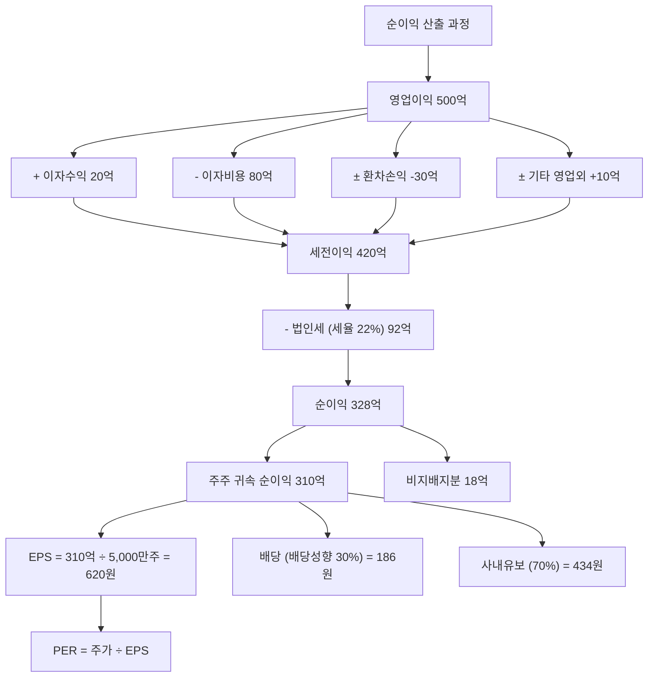

# 순이익 뜻, 최종적으로 남은 돈

"순이익 역대 최고!" 뉴스가 나오면 주가가 뛰고, "순이익 적자 전환!" 뉴스가 나오면 주가가 빠집니다. 그만큼 순이익은 투자자에게 직접적인 영향을 미치는 숫자입니다.

하지만 순이익의 함정도 있습니다. 이 글에서는 순이익이 왜 "최종 이익"이면서도 동시에 "가장 주의해야 할 이익"인지 설명하겠습니다.

## 한 줄 정의

순이익(당기순이익)은 매출에서 모든 비용(원가, 판관비, 이자, 세금 등)을 뺀 최종 이익입니다.

## 아주 쉽게 말하면

월급 300만 원에서 월세, 식비, 교통비, 보험료, 세금을 다 빼고 통장에 남는 돈이 순이익입니다.

회사도 마찬가지입니다. 1년 동안 벌어들인 모든 돈에서 쓴 모든 돈(원재료비, 직원 급여, 사무실 임대, 은행 이자, 법인세까지)을 빼면 최종적으로 남는 금액이 순이익입니다. 이 돈이 주주의 몫이 됩니다.

## 왜 중요한가

순이익이 투자에서 핵심인 이유는 **주가와 직접 연결**되기 때문입니다.

- **EPS의 원천** — EPS(주당순이익) = 순이익 ÷ 발행주식수. 이것이 PER 계산의 분모이고, PER × EPS = 주가입니다.
- **배당의 재원** — 배당금은 순이익에서 지급합니다. 순이익이 없으면 배당도 없습니다(이익잉여금에서 줄 수는 있지만 지속 불가).
- **기업가치의 바로미터** — 장기적으로 주가는 순이익 성장을 따라갑니다. 순이익이 매년 20%씩 성장하는 기업의 주가는 장기적으로 우상향합니다.
- **자본 축적** — 순이익 중 배당하지 않은 부분은 이익잉여금으로 쌓여 회사의 자본을 키웁니다.
- **밸류에이션 핵심** — "이 회사의 3년 뒤 순이익이 얼마일까?" → 이 질문의 답이 적정 주가 수준을 결정합니다.

## 그림으로 이해하기

_순이익은 영업이익에서 영업외 항목과 세금을 추가로 차감한 "맨 마지막 줄(Bottom Line)" 이익입니다._

## 숫자로 보는 예시

가상 기업 "메디팜"(제약회사)의 순이익 구조를 분해합니다.

| 항목 | 2023년 | 2024년 | 비고 |
|---|---|---|---|
| 영업이익 | 400억 | 450억 | 본업 호조 (+12.5%) |
| 이자수익 | 30억 | 25억 | 예금 금리 하락 |
| 이자비용 | -120억 | -100억 | 차입금 상환 효과 |
| 자산매각이익 | 200억 | 0 | 2023년 사옥 매각 (일회성) |
| 환차손 | -50억 | -20억 | 환율 변동 축소 |
| **세전이익** | **460억** | **355억** | -23% |
| 법인세 (22%) | -101억 | -78억 | |
| **순이익** | **359억** | **277억** | **-23%** |

2023년 순이익 359억 → 2024년 277억으로 **23% 감소**했습니다. "실적 악화"일까요?

아닙니다. 영업이익은 12.5% 성장했습니다. 순이익이 줄어든 이유는 2023년에 사옥을 팔아서 생긴 일회성 이익 200억이 2024년에 없기 때문입니다.

**조정 순이익**(일회성 제거): 2023년 약 200억 → 2024년 277억 = **실질 38% 성장**

이것이 "순이익의 함정"입니다. 숫자만 보면 악화인데, 내용을 뜯으면 오히려 개선입니다.

## 표로 비교하기

| 구분 | 영업이익 | 순이익 |
|---|---|---|
| 포함 범위 | 본업 비용만 차감 | 모든 비용(이자, 세금, 기타) 차감 |
| 일회성 영향 | 거의 없음 | 큼 (자산매각, 환차손 등) |
| 경영진 통제 | 높음 | 낮음 (환율, 금리는 통제 불가) |
| 주요 활용 | 사업 경쟁력 비교 | EPS·PER·배당 산정 |
| 조작 가능성 | 낮음 | 높음 (일회성 조정 가능) |

| 순이익과 주가의 관계 (가상 기업 "테크코") |  |  |  |
|---|---|---|---|
| 연도 | 순이익 | EPS (1억 주 기준) | 주가 (PER 20배) |
| 2022년 | 500억 | 500원 | 10,000원 |
| 2023년 | 700억 | 700원 | 14,000원 |
| 2024년 | 1,000억 | 1,000원 | 20,000원 |
| 2025년(추정) | 1,300억 | 1,300원 | 26,000원 |

순이익이 2.6배 되면 주가도 2.6배가 됩니다(PER 일정 가정). 이것이 성장주 투자의 기본 원리입니다.

## 초보자가 자주 하는 오해

**오해 1: "순이익이 크면 좋은 실적이다"**

일회성 이익(부동산 매각, 소송 합의금, 보험금)으로 순이익이 급증할 수 있습니다. 이런 이익은 내년에 반복되지 않으므로, 주가에 지속적으로 반영될 수 없습니다. 반드시 "영업이익도 함께 좋은가?"를 확인해야 합니다.

**오해 2: "순이익이 영업이익보다 항상 작다"**

보통은 그렇지만, 투자 수익이나 자산 매각 차익이 크면 순이익 > 영업이익인 경우가 있습니다. 예를 들어 영업이익 100억인데 부동산 매각으로 500억 이익이 나면 순이익 400억 이상이 됩니다. 이때 "순이익 400억 기업"으로 밸류에이션하면 과대평가입니다.

**오해 3: "순이익 적자 = 투자할 가치 없는 기업"**

성장 단계 기업은 의도적으로 순이익 적자를 감수합니다. 핵심은 영업활동현금흐름과 매출 성장률입니다. 매출이 매년 50% 성장하면서 적자인 기업과, 매출이 제자리인데 적자인 기업은 전혀 다릅니다.

## 고수는 이렇게 봅니다

숙련된 투자자는 순이익을 **그대로 믿지 않고 "분해"**합니다.

- **일회성 항목 제거** — 자산매각이익, 소송비, 구조조정비 등을 빼고 "경상 순이익(Recurring Net Income)"을 산출합니다. 이것이 진짜 실력입니다.
- **영업이익과의 괴리 확인** — 영업이익은 좋은데 순이익만 나쁘면 → 이자 부담(부채 과다)이나 환율 문제. 일시적일 수 있습니다. 영업이익도 나쁘면 → 본업 자체의 문제. 더 심각합니다.
- **실효세율 확인** — 법인세율이 갑자기 낮아져서 순이익이 좋아진 경우가 있습니다(이연법인세 환입 등). 이것도 일시적 효과입니다.
- **지배주주 순이익 구분** — 자회사를 많이 가진 지주회사는 "순이익" 중 비지배지분 몫을 빼야 실제 주주 귀속분을 알 수 있습니다. PER 계산 시 지배주주 순이익을 써야 정확합니다.
- **순이익 추정의 정확도** — 애널리스트 컨센서스 대비 실적 결과가 밸류에이션의 핵심입니다. 순이익이 컨센서스를 10% 상회하면 주가는 통상 크게 뜁니다.

## 기업분석에서는 이렇게 씁니다

순이익은 밸류에이션의 최종 출력값이며, 투자 의사결정의 결론입니다.

가상 기업 "그린모빌리티"(전기차 부품)의 분석:

- **PER 밸류에이션**: 2024년 순이익 200억, 주식수 5,000만 주 → EPS 400원. 주가 8,000원 → PER 20배. 동종업계 평균 PER 25배 대비 저평가.
- **적정가치 산정**: 2025년 순이익 300억 추정 → EPS 600원. 적정 PER 22배 적용 → 적정 주가 13,200원 수준 (+65% 상승여력).
- **순이익 질 검증**: 영업이익도 25% 성장 예상, 일회성 없음, 이자비용 감소(상환 진행 중) → "질 좋은" 순이익 성장으로 판단.
- **배당 계산**: 배당성향 25% 유지 시 → 주당 배당금 150원 → 배당수익률 1.9%.
- **리스크**: 환율 10% 상승 시 환차손 50억 → 순이익 250억으로 축소 → PER 상승. 환헷지 비율 확인 필요.

## 함께 보면 좋은 용어

- [영업이익 뜻](../level-03-financial-statements/operating-income.md)
- [영업이익과 순이익 차이](../level-03-financial-statements/operating-vs-net-income.md)
- [EPS 뜻](../level-05-valuation/eps.md)
- [PER 뜻](../level-05-valuation/per.md)
- [배당성향 뜻](../level-06-events/payout-ratio.md)

## 정리

- 순이익 = 모든 비용을 뺀 최종 이익이며, 주주에게 귀속되는 몫이다.
- EPS, PER, 배당금 계산의 기초이므로 주가와 가장 직접적으로 연결된다.
- 일회성 항목에 의한 왜곡이 크므로, 반드시 영업이익과 함께 보고 "질"을 확인해야 한다.
- 장기적으로 순이익 성장률 = 주가 상승률에 수렴한다.
- 조정 순이익(일회성 제거)과 지배주주 순이익을 구분해서 사용해야 정확한 밸류에이션이 된다.

## 한 줄 요약

> 순이익은 주주의 최종 몫이자 주가의 기초이지만, 일회성 요인에 왜곡될 수 있어 "질"을 반드시 검증해야 합니다.

---

이 글은 투자 권유가 아니라 주식 용어와 기업분석 방법을 설명하기 위한 교육 콘텐츠입니다. 특정 종목의 매수·매도 판단은 독자 본인의 책임입니다.

Tags: 순이익, 순이익뜻, 당기순이익, 주식초보, 기업분석
