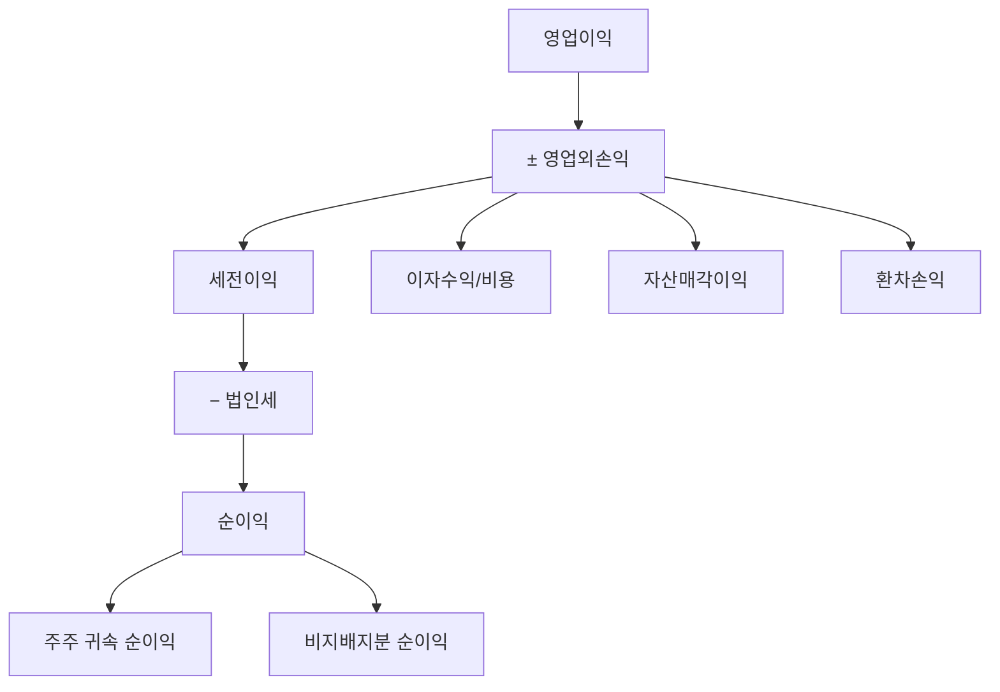

# 순이익 뜻, 최종적으로 남은 돈

모든 비용을 다 빼고 진짜로 남은 돈. 그것이 순이익입니다.

순이익은 주주에게 귀속되는 최종 이익이며, EPS(주당순이익)와 PER(주가수익비율)의 기초가 됩니다.

## 한 줄 정의

순이익(당기순이익)은 매출에서 모든 비용(원가, 판관비, 이자, 세금 등)을 뺀 최종 이익입니다.

## 아주 쉽게 말하면

월급 300만 원에서 월세, 식비, 교통비, 세금을 다 빼고 통장에 남는 돈이 순이익입니다.

회사도 마찬가지로, 벌어들인 모든 돈에서 쓴 모든 돈을 빼면 최종적으로 남는 금액이 순이익입니다.

## 왜 중요한가

- 주주에게 돌아갈 수 있는 최종 이익입니다.
- EPS(주당순이익) = 순이익 ÷ 발행주식수 → PER 계산의 기초
- 배당금은 순이익에서 지급합니다.
- 순이익이 꾸준히 증가하면 장기적으로 주가도 상승하는 경향이 있습니다.

## 그림으로 이해하기

_영업이익에서 이자, 기타손익, 세금까지 빼면 순이익입니다._

## 숫자로 보는 예시

> ⚠️ 아래 숫자는 개념 설명을 위한 **가상 예시**이며, 실제 투자 데이터가 아닙니다.

A회사 순이익 100억 원, 발행주식 1,000만 주일 때:

- EPS = 100억 ÷ 1,000만 = **1,000원**
- 주가가 15,000원이면 PER = 15,000 ÷ 1,000 = **15배**
- 배당성향 30%이면 배당금 = 1,000 × 30% = **주당 300원**

순이익이 200억으로 2배가 되면, 같은 PER 유지 시 주가도 30,000원으로 2배가 됩니다.

## 표로 비교하기

| 구분 | 영업이익 | 순이익 | 차이 원인 |
|---|---|---|---|
| 이자비용 | 미포함 | 포함 | 부채 많으면 순이익↓ |
| 환차손익 | 미포함 | 포함 | 환율 변동 영향 |
| 자산매각익 | 미포함 | 포함 | 일회성 이익 |
| 법인세 | 미포함 | 포함 | 세율 변동 영향 |
| 활용 | 본업 수익성 판단 | EPS·PER·배당 계산 | - |

## 초보자가 자주 하는 오해

**오해 1: 순이익이 크면 좋은 실적이다**

부동산 매각이나 환율 효과로 일시적으로 순이익이 커질 수 있습니다. 이런 일회성 이익은 다음 분기에 사라지므로, 반복 가능한 이익인지 확인해야 합니다.

**오해 2: 순이익이 영업이익보다 항상 작다**

대부분은 그렇지만, 영업외이익(투자 수익, 자산 매각 등)이 크면 순이익이 영업이익보다 클 수 있습니다. 이 경우 본업 외 수입에 의존하는 구조이므로 주의가 필요합니다.

## 고수는 이렇게 봅니다

숙련된 투자자는 순이익의 "질"을 확인합니다.

- 일회성 항목을 제거한 "조정 순이익"을 별도로 계산
- 영업이익은 좋은데 순이익이 나쁘면 → 부채 구조나 환율 리스크 확인
- 순이익 증가가 영업이익 증가와 동행하는지 (건강한 성장)
- 연간 순이익 추세 3~5년 확인 → 안정적 성장인지 들쭉날쭉인지

## 기업분석에서는 이렇게 씁니다

기업분석에서 순이익은 밸류에이션의 기본 재료입니다.

- PER = 시가총액 ÷ 순이익 → 가장 널리 쓰이는 밸류에이션
- 미래 순이익 추정 → 적정 주가 산출
- 순이익 성장률이 높은 기업 → 높은 PER 정당화 가능
- 적정 PER × 예상 EPS = 목표 주가

## 함께 보면 좋은 용어

- [영업이익 뜻](../level-03-financial-statements/operating-income.md)
- [영업이익과 순이익 차이](../level-03-financial-statements/operating-vs-net-income.md)
- [EPS 뜻](../level-05-valuation/eps.md)
- [PER 뜻](../level-05-valuation/per.md)
- [배당성향 뜻](../level-06-events/payout-ratio.md)

## 정리

- 순이익 = 모든 비용을 뺀 최종 이익 = 주주 귀속 이익이다.
- EPS, PER, 배당 계산의 기초가 된다.
- 일회성 항목에 의한 왜곡이 있을 수 있으므로, 영업이익과 함께 봐야 한다.

## 한 줄 요약

> 순이익은 모든 비용을 빼고 최종적으로 남은 주주의 몫이며, 주가 밸류에이션의 핵심 기초입니다.

---

*면책 조항: 이 글은 투자 권유가 아니라 주식 용어와 기업분석 방법을 설명하기 위한 교육 콘텐츠입니다. 특정 종목의 매수·매도 판단은 독자 본인의 책임입니다.*

Tags: 순이익, 순이익뜻, 당기순이익, 주식초보, 기업분석
