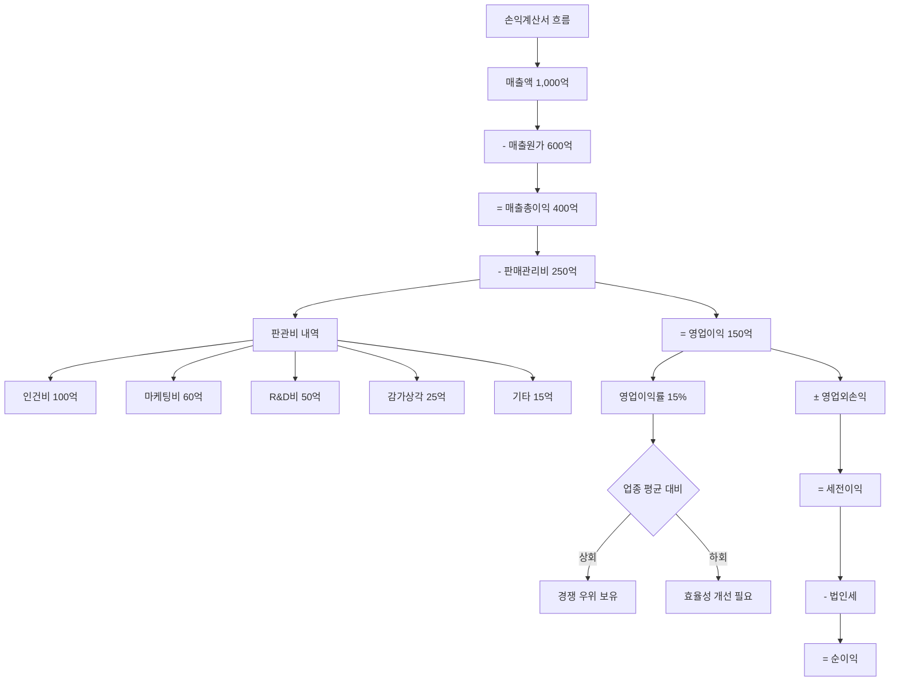

# 영업이익 뜻, 본업으로 남긴 돈

"영업이익 서프라이즈!" 실적 시즌마다 이 단어가 주가를 좌우합니다. 매출이 아무리 커도, 순이익이 일회성으로 좋아도, 투자자들이 가장 먼저 확인하는 숫자는 영업이익입니다.

영업이익은 회사가 본업으로 남긴 순수한 이익입니다. 부동산 매각이나 환율 변동 같은 잡음이 없는, 사업 자체의 실력을 보여주는 숫자입니다.

## 한 줄 정의

영업이익은 매출에서 매출원가와 판매관리비를 모두 뺀, 본업에서 남긴 이익입니다.

## 아주 쉽게 말하면

치킨집으로 예를 들어봅시다.

- 하루 매출: 200만 원
- 닭·재료비(매출원가): 120만 원
- 월세·직원급여·전기세·배달앱 수수료(판관비): 50만 원
- **영업이익: 30만 원**

이 30만 원이 "치킨 장사 자체"로 남긴 돈입니다. 여기에 은행 이자 수입이나 주식 투자 수익은 포함하지 않습니다. 오직 치킨을 튀기고 팔아서 남긴 돈만 영업이익입니다.

## 왜 중요한가

영업이익이 투자자에게 가장 중요한 이익 지표인 이유가 있습니다.

- **사업의 본질적 수익력** — 매출은 규모만 보여주고, 순이익은 일회성 요인에 왜곡됩니다. 영업이익만이 "이 사업이 지속적으로 돈을 벌 수 있는 구조인가"를 보여줍니다.
- **경영진의 실력 지표** — 영업이익은 경영진이 통제할 수 있는 영역(원가 관리, 비용 효율)의 결과물입니다. 환율이나 금리 같은 외부 요인과 분리됩니다.
- **기업가치 산정의 핵심** — EV/EBIT, EV/EBITDA 등 밸류에이션 지표의 분모가 됩니다. 영업이익 추정이 곧 목표주가 산정입니다.
- **일회성 왜곡 최소** — 부동산 매각 차익, 소송 합의금, 환차손 등은 영업이익에 포함되지 않아 사업 자체의 실적을 깨끗하게 봅니다.
- **비교 가능성** — 부채 구조(이자비용)나 세율이 다른 기업들도 영업이익으로 비교하면 사업 자체의 경쟁력을 동일 선상에서 볼 수 있습니다.

## 그림으로 이해하기

_영업이익 아래의 항목들(영업외손익, 세금)은 사업 자체와 무관한 외부 요인입니다._

## 숫자로 보는 예시

가상 기업 "디지털솔루션"(IT 서비스)의 실적을 통해 영업이익의 의미를 구체적으로 봅시다.

| 항목 | 2022년 | 2023년 | 2024년 | 해석 |
|---|---|---|---|---|
| 매출액 | 2,000억 | 2,500억 | 3,000억 | +50% 성장 |
| 매출원가 | 1,200억 | 1,450억 | 1,680억 | |
| 매출총이익 | 800억 | 1,050억 | 1,320억 | |
| 판관비 | 600억 | 700억 | 820억 | |
| **영업이익** | **200억** | **350억** | **500억** | **+150% 성장** |
| 영업이익률 | 10.0% | 14.0% | 16.7% | 매 분기 개선 |

매출은 50% 성장인데 영업이익은 150% 성장했습니다. 이는 **영업 레버리지**가 작동하고 있다는 뜻입니다.

**영업 레버리지란?**
판관비에 고정비(사무실 임대, 서버 비용 등)가 많으면, 매출이 늘어도 비용은 비례해서 늘지 않습니다. 매출 1억 추가에 판관비 3,000만 원만 추가되면, 나머지 7,000만 원이 고스란히 영업이익으로 떨어집니다. IT 기업, SaaS, 플랫폼 기업에서 자주 나타나는 구조입니다.

## 표로 비교하기

| 구분 | 매출총이익 | 영업이익 | EBITDA | 순이익 |
|---|---|---|---|---|
| 공식 | 매출 - 원가 | 매출총이익 - 판관비 | 영업이익 + 감가상각 | 모든 비용 차감 |
| 차감 범위 | 원가만 | +판관비 | +판관비(감각상각 제외) | +영업외+세금 |
| 보여주는 것 | 제품 마진 | 사업 수익력 | 현금 창출력 | 최종 수익 |
| 일회성 영향 | 거의 없음 | 거의 없음 | 거의 없음 | 큼 |
| 주요 활용 | 원가 경쟁력 | 사업 가치 평가 | 현금흐름 비교 | 배당, EPS |

| 영업이익 vs 순이익이 크게 다른 경우 |  |
|---|---|
| 영업이익 > 순이익 (큰 격차) | 이자비용이 크거나(고부채), 환차손 발생, 일회성 손실 |
| 영업이익 < 순이익 | 부동산 매각 차익, 투자 수익 등 일회성 이익 포함 |
| 영업이익 적자 + 순이익 흑자 | 본업 부진, 자산 매각으로 메꿈 (지속 불가) |
| 영업이익 흑자 + 순이익 적자 | 본업은 건강, 외부 요인(이자, 환율)이 문제 |

## 초보자가 자주 하는 오해

**오해 1: "영업이익과 순이익은 거의 같다"**

부채가 많은 회사는 이자비용이 크고, 해외 매출 비중이 높은 회사는 환차손익이 큽니다. 영업이익 1,000억인데 순이익 300억인 경우(이자 500억, 세금 200억)도 흔합니다. 두 숫자의 "격차"가 기업의 재무 구조를 보여줍니다.

**오해 2: "영업적자 = 망하는 회사"**

의도적 영업적자가 있습니다. 아마존은 수년간 영업적자를 내면서 시장 점유율을 확보했고, 쿠팡도 마찬가지였습니다. 핵심은 "왜 적자인가"입니다. 시장 선점을 위한 의도적 투자(마케팅, R&D)인지, 사업 구조 자체가 돈을 못 버는 것인지를 구분해야 합니다.

**오해 3: "영업이익률이 높을수록 무조건 좋다"**

영업이익률이 너무 높으면 투자(R&D, 마케팅)를 안 하고 있을 수 있습니다. 단기 이익을 위해 미래 성장을 포기하는 셈입니다. 이익률의 "적정 수준"은 업종마다 다르며, 성장과 수익의 균형이 중요합니다.

## 고수는 이렇게 봅니다

숙련된 투자자는 영업이익의 **질, 지속성, 성장 동력**을 분석합니다.

- **영업이익 성장률 vs 매출 성장률** — 영업이익이 매출보다 빠르게 성장하면 영업 레버리지가 작동 중. 가장 이상적인 성장 패턴입니다.
- **판관비율 추세** — 판관비/매출 비율이 매 분기 줄어들면 규모의 경제가 나타나는 중입니다.
- **일회성 비용 제거** — 구조조정비, 소송비 등이 판관비에 포함되어 영업이익을 왜곡할 수 있습니다. 이를 제거한 "조정 영업이익"으로 봅니다.
- **컨센서스 대비** — 증권사 영업이익 추정치 대비 실제 결과가 어떤가. 5% 이상 상회하면 "어닝 서프라이즈", 5% 이상 하회하면 "어닝 쇼크"로 주가에 즉시 반영됩니다.
- **분기별 계절성 조정** — YoY(전년 동기 대비)로 비교해야 계절 요인을 제거할 수 있습니다. QoQ(전분기 대비)만 보면 계절성에 속을 수 있습니다.

## 기업분석에서는 이렇게 씁니다

영업이익은 기업가치 산정(Valuation)의 핵심 입력값입니다.

가상 기업 "오토파츠"(자동차 부품 제조)의 분석:

- **EV/EBIT 밸류에이션**: 시가총액 3,000억 + 순차입금 500억 = EV 3,500억. 영업이익 350억. EV/EBIT = 10배. 동종업계 평균 12배 대비 저평가 가능성.
- **영업이익 추정**: 2025년 매출 +15% 성장, 영업이익률 2%p 개선 예상 → 영업이익 470억 추정. EV/EBIT 7.4배로 더욱 매력적.
- **마진 개선 요인**: 신규 고마진 제품(전기차 부품) 비중 확대, 구형 공장 감가상각 완료로 판관비율 하락. 구조적 마진 개선이라 지속 가능.
- **리스크**: 완성차 업체의 단가 인하 요구 시 영업이익률 하락 가능. 고객 다변화 정도를 확인.

## 함께 보면 좋은 용어

- [매출액 뜻](../level-03-financial-statements/revenue.md)
- [순이익 뜻](../level-03-financial-statements/net-income.md)
- [영업이익과 순이익 차이](../level-03-financial-statements/operating-vs-net-income.md)
- [영업이익률 뜻](../level-04-ratios/operating-margin.md)
- [EV/EBITDA 뜻](../level-05-valuation/ev-ebitda.md)

## 정리

- 영업이익 = 매출 - 매출원가 - 판관비이며, 본업에서 남긴 순수한 이익이다.
- 일회성 요인(부동산 매각, 환차손)에 영향받지 않아 사업 자체의 실력을 보여준다.
- 영업이익 성장률이 매출 성장률보다 빠르면 영업 레버리지가 작동 중이라는 좋은 신호이다.
- 영업적자라도 이유가 중요하다: 의도적 투자 vs 구조적 적자를 구분해야 한다.
- EV/EBIT 등 밸류에이션의 핵심 분모이며, 미래 영업이익 추정이 주가 예측의 핵심이다.

## 한 줄 요약

> 영업이익은 본업의 순수한 수익력이며, 이 숫자의 성장 추세가 기업가치의 방향을 결정합니다.

---

이 글은 투자 권유가 아니라 주식 용어와 기업분석 방법을 설명하기 위한 교육 콘텐츠입니다. 특정 종목의 매수·매도 판단은 독자 본인의 책임입니다.

Tags: 영업이익, 영업이익뜻, 재무제표, 주식초보, 기업분석
