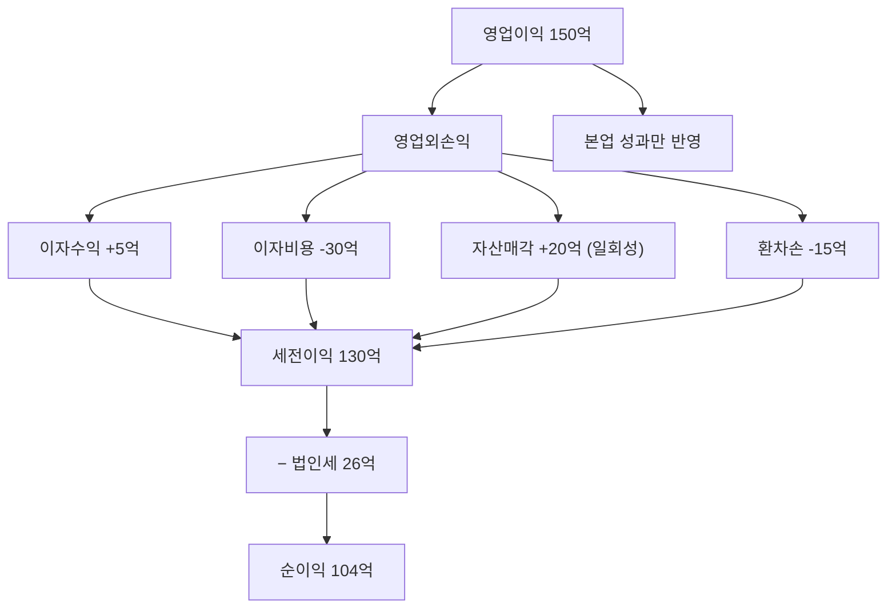

# 영업이익과 순이익 차이, 기업분석에서 중요한 이유

"영업이익은 좋은데 순이익이 나쁘다" 혹은 "순이익은 좋은데 영업이익은 별로다"라는 상황이 있습니다.

둘의 차이를 알면 회사의 진짜 실력과 일시적 효과를 구분할 수 있습니다.

## 한 줄 정의

영업이익은 본업 수익이고, 순이익은 모든 손익을 포함한 최종 수익입니다. 그 차이는 영업외손익과 세금입니다.

## 아주 쉽게 말하면

- 영업이익 = 치킨집 장사로 남긴 돈
- 순이익 = 치킨집 장사 + 주식 투자 수익 + 은행 이자 - 대출 이자 - 세금을 다 합친 최종 결과

본업이 잘 되는지는 영업이익으로, 진짜 최종 결과는 순이익으로 봅니다.

## 왜 중요한가

- 두 지표의 괴리가 크면 "왜?"를 물어야 합니다.
- 영업이익 > 순이익: 부채 이자나 일회성 손실이 크다는 의미
- 영업이익 < 순이익: 부동산 매각, 투자 이익 등 본업 외 수입이 크다는 의미
- 어떤 이익을 기준으로 밸류에이션할지 결정하는 데 중요합니다.

## 그림으로 이해하기

_영업이익에서 순이익까지의 차이가 클수록 본업 외 요인의 영향이 큽니다._

## 숫자로 보는 예시

> ⚠️ 아래 숫자는 개념 설명을 위한 **가상 예시**이며, 실제 투자 데이터가 아닙니다.

**Case 1: 건강한 구조**
- 영업이익 200억, 순이익 150억 (차이 50억 = 이자+세금)
- → 정상적. 부채 이자와 세금이 적당한 수준

**Case 2: 부채 과다**
- 영업이익 200억, 순이익 50억 (차이 150억!)
- → 이자비용이 너무 큼. 본업은 잘 되지만 부채에 짓눌림

**Case 3: 일회성 이익**
- 영업이익 100억, 순이익 300억 (순이익이 더 큼!)
- → 본사 건물 매각 등 일회성 수익. 다음 분기엔 사라질 이익

## 표로 비교하기

| 상황 | 영업이익 | 순이익 | 해석 | 투자 시사점 |
|---|---|---|---|---|
| 영업이익 ≈ 순이익 | 100억 | 90억 | 정상 구조, 부채 적음 | 건강한 재무구조 |
| 영업이익 >> 순이익 | 200억 | 50억 | 부채 과다 or 환차손 | 재무 위험 점검 |
| 영업이익 << 순이익 | 50억 | 200억 | 일회성 수익 존재 | 지속성 의심 |
| 영업적자, 순이익 흑자 | -30억 | 50억 | 자산 매각으로 버팀 | 본업 경쟁력 우려 |

## 초보자가 자주 하는 오해

**오해 1: 순이익만 보면 된다**

순이익에는 일회성 효과가 많이 섞여 있습니다. 부동산 하나 팔았다고 순이익이 3배가 될 수 있는데, 이것은 반복되지 않습니다. 영업이익으로 본업의 실력을 먼저 확인해야 합니다.

**오해 2: 영업이익이 좋으면 순이익도 당연히 좋다**

아닙니다. 영업이익 500억이어도 이자비용이 400억이면 순이익은 100억 미만입니다. 부채가 많은 회사에서 흔히 볼 수 있는 구조입니다.

## 고수는 이렇게 봅니다

숙련된 투자자는 영업이익과 순이익의 괴리 원인을 분리합니다.

- 이자비용이 큰 차이의 원인이면 → 부채 구조 개선 가능성 확인
- 환차손이 원인이면 → 일시적, 다음 분기 반전 가능
- 자산매각이 원인이면 → 일회성 제거 후 "조정 순이익" 별도 계산
- 지속가능한 이익만 골라서 밸류에이션에 적용

## 기업분석에서는 이렇게 씁니다

기업분석에서 두 지표를 함께 보는 이유:

- 밸류에이션에 어떤 이익을 쓸지 결정 (일회성 제거 순이익 or 영업이익)
- 이자보상배율(영업이익 ÷ 이자비용) → 재무 안정성 판단
- 세율 변동 → 순이익 예측 시 반영
- "정상화 순이익" = 영업이익 - 정상 이자비용 - 정상 세율 적용

## 함께 보면 좋은 용어

- [영업이익 뜻](../level-03-financial-statements/operating-income.md)
- [순이익 뜻](../level-03-financial-statements/net-income.md)
- [이자보상배율 뜻](../level-04-ratios/interest-coverage.md)
- [부채비율 뜻](../level-04-ratios/debt-ratio.md)
- [EPS 뜻](../level-05-valuation/eps.md)

## 정리

- 영업이익은 본업 수익, 순이익은 모든 것을 포함한 최종 수익이다.
- 둘의 차이 = 이자, 환차손익, 자산처분손익, 세금이다.
- 괴리가 크면 원인을 파악하고, 일회성인지 구조적인지 구분해야 한다.

## 한 줄 요약

영업이익은 본업의 실력, 순이익은 최종 결과이며, 두 숫자의 차이를 보면 회사의 재무 구조와 일회성 효과를 구분할 수 있습니다.

---

*면책 조항: 이 글은 투자 권유가 아니라 주식 용어와 기업분석 방법을 설명하기 위한 교육 콘텐츠입니다. 특정 종목의 매수·매도 판단은 독자 본인의 책임입니다.*

Tags: 영업이익, 순이익, 이익차이, 주식초보, 기업분석
