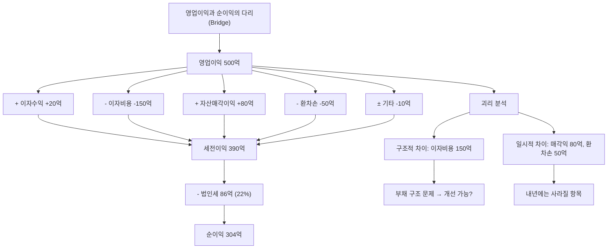

# 영업이익과 순이익 차이, 기업분석에서 중요한 이유

실적 시즌에 이런 헤드라인을 본 적 있을 겁니다: "영업이익 역대 최고, 순이익은 반토막." 혹은 반대로 "영업이익 적자인데 순이익 흑자." 어떻게 이런 일이 가능할까요?

이 두 숫자의 차이를 이해하면, 회사의 "진짜 사업 실력"과 "일시적 행운/불운"을 정확히 구분할 수 있습니다.

## 한 줄 정의

영업이익은 본업 수익이고, 순이익은 본업 외 모든 손익과 세금까지 포함한 최종 수익입니다. 차이의 원인은 영업외손익과 법인세입니다.

## 아주 쉽게 말하면

치킨집 사장의 수입을 예로 들어봅시다.

- **영업이익** = 치킨 팔아서 남긴 돈 (매출 - 재료비 - 월세 - 직원급여)
- **순이익** = 영업이익 + 주식 투자 수익 + 은행 이자 - 대출 이자 - 벌금 - 세금

치킨 장사가 잘 되는지는 영업이익으로, 사장님 주머니에 최종적으로 얼마 남는지는 순이익으로 봅니다. 치킨 장사가 망해도 주식으로 돈 벌면 순이익이 플러스일 수 있고, 치킨 장사가 잘 돼도 대출 이자에 짓눌리면 순이익이 마이너스일 수 있습니다.

## 왜 중요한가

두 숫자의 **"괴리 크기"**가 핵심 정보입니다.

- **재무 건전성 진단** — 영업이익 대비 순이익이 너무 작으면 부채 부담이 과하다는 신호입니다.
- **이익의 질 판단** — 순이익이 영업이익보다 크면 일회성 수익에 의존하고 있다는 경고입니다.
- **밸류에이션 결정** — 어떤 이익을 기준으로 PER를 계산할지 결정해야 합니다.
- **미래 예측** — 영업이익은 예측 가능하지만, 영업외손익(환율, 자산매각)은 예측이 어렵습니다. 어떤 이익이 "반복 가능한가"를 구분해야 합니다.
- **투자 전략 선택** — 본업이 좋은데 재무구조가 나쁜 기업은 "턴어라운드 투자" 대상이 될 수 있습니다.

## 그림으로 이해하기

_영업이익에서 순이익까지의 "다리"를 보면 어떤 요인이 얼마나 영향을 미치는지 한눈에 파악됩니다._

## 숫자로 보는 예시

가상 기업 3개를 비교하며 괴리의 의미를 봅시다.

**가상 기업 A: "테크코" (IT, 무차입 경영)**

| 항목 | 금액 | 비고 |
|---|---|---|
| 영업이익 | 300억 | |
| 이자수익 | +15억 | 현금 보유 많음 |
| 이자비용 | -5억 | 부채 거의 없음 |
| 기타 영업외 | -10억 | |
| 법인세 | -66억 | |
| **순이익** | **234억** | 영업이익의 78% |

→ 건강한 구조. 괴리가 작고, 순이익의 질이 높습니다.

**가상 기업 B: "빌드홈" (건설, 고부채)**

| 항목 | 금액 | 비고 |
|---|---|---|
| 영업이익 | 300억 | |
| 이자수익 | +5억 | |
| 이자비용 | -200억 | 차입금 3,000억 |
| 환차손 | -30억 | 해외 자재 수입 |
| 법인세 | -16억 | |
| **순이익** | **59억** | 영업이익의 20% |

→ 위험 구조. 본업은 잘 하는데 부채 이자에 이익 대부분을 뺏깁니다.

**가상 기업 C: "올드케미" (화학, 구조조정 중)**

| 항목 | 금액 | 비고 |
|---|---|---|
| 영업이익 | -50억 | 본업 적자 |
| 자산매각이익 | +300억 | 공장 부지 매각 |
| 이자비용 | -40억 | |
| 법인세 | -46억 | |
| **순이익** | **164억** | 영업적자인데 순이익 흑자! |

→ 위험 구조. 본업이 적자인데 부동산 팔아서 흑자를 만든 것. 내년에 팔 건물이 없으면 적자 전환.

## 표로 비교하기

| 패턴 | 영업이익 | 순이익 | 의미 | 투자 판단 |
|---|---|---|---|---|
| 정상 | 100억 | 75억 | 건전한 구조 | 안정적 투자 대상 |
| 부채 과다 | 100억 | 20억 | 이자에 짓눌림 | 부채 감소 트렌드면 턴어라운드 |
| 일회성 호재 | 50억 | 200억 | 매각익 등 | PER 계산 시 일회성 제거 |
| 환율 타격 | 100억 | 30억 | 환차손 | 일시적이면 매수 기회 |
| 본업 부실 | -50억 | 100억 | 자산 매각으로 버팀 | 본업 개선 계획 없으면 회피 |

| 괴리 원인별 특성 |  |  |
|---|---|---|
| 원인 | 성격 | 대응 |
| 이자비용 | 구조적 (부채 존재하는 한 지속) | 부채 감소 추세 확인 |
| 환차손익 | 일시적 (환율 변동) | 다음 분기 반전 가능 |
| 자산매각손익 | 일회성 (반복 불가) | 조정 이익에서 제거 |
| 투자손익 | 반복 불확실 | 보수적으로 제외 |
| 법인세율 변동 | 정책적/일시적 | 정상 세율로 조정 |

## 초보자가 자주 하는 오해

**오해 1: "순이익만 보면 된다, 최종 결과니까"**

순이익에는 반복되지 않을 일회성 요인이 섞여 있습니다. 올해 부동산 팔아서 순이익 500억이어도, 내년에 팔 부동산이 없으면 순이익 100억으로 급감합니다. PER를 올해 순이익으로 계산하면 완전히 틀린 밸류에이션이 됩니다.

**오해 2: "영업이익이 좋으면 순이익도 당연히 좋다"**

영업이익 1,000억인데 이자비용이 800억이면 순이익은 200억도 안 됩니다. 부채비율 500%인 건설사, 항공사, 해운사에서 흔히 볼 수 있습니다. 본업은 잘 하는데 과거의 과잉 투자(부채)가 이익을 갉아먹는 구조입니다.

**오해 3: "영업이익 적자면 투자 가치 없다"**

2020~2022년 쿠팡은 영업적자였지만, 시장 점유율 확대와 흑자전환 기대로 시가총액이 수십조 원이었습니다. 적자의 **원인**(의도적 투자 vs 구조적 문제)과 **개선 경로**(언제 흑자전환 가능?)가 핵심입니다.

## 고수는 이렇게 봅니다

숙련된 투자자는 두 숫자의 괴리를 **"이익 다리(Bridge) 분석"**으로 분해합니다.

- **구조적 차이 vs 일시적 차이 분리** — 이자비용은 부채가 줄지 않으면 계속됩니다(구조적). 환차손은 환율이 바뀌면 사라집니다(일시적). 밸류에이션에는 구조적 차이만 반영합니다.
- **이자보상배율 계산** — 영업이익 ÷ 이자비용. 3배 이상이면 안정, 1.5배 미만이면 위험. 1배 미만이면 본업으로 이자도 못 내는 상황입니다.
- **정상화 순이익 산출** — 영업이익에서 정상 이자비용과 정상 세율만 적용하여 "일회성 없는 순이익"을 추정합니다. 이것이 밸류에이션에 쓸 진짜 순이익입니다.
- **괴리 추세 변화** — 영업이익 대비 순이익 비율이 매 분기 개선되면(예: 40% → 50% → 60%) 부채 상환이 진행 중이라는 긍정 신호입니다.
- **현금흐름과 교차 검증** — 순이익이 좋은데 영업활동현금흐름이 나쁘면 이익의 질에 문제가 있습니다. 반대로 순이익이 나쁜데 현금흐름이 좋으면 감가상각 등 비현금 비용 때문일 수 있어 실제로는 괜찮습니다.

## 기업분석에서는 이렇게 씁니다

기업분석에서 두 이익의 괴리는 **투자 전략**을 결정하는 핵심 정보입니다.

가상 기업 "스카이항공"의 분석:

- **현황**: 영업이익 2,000억, 순이익 400억. 괴리 원인: 이자비용 1,200억(차입금 2조), 환차손 200억.
- **턴어라운드 시나리오**: 향후 3년간 차입금 5,000억 상환 → 이자비용 600억으로 감소 → 순이익 1,000억 이상 가능.
- **밸류에이션 선택**: 현재 순이익(400억) 기준 PER 25배(시총 1조). 하지만 정상화 순이익(1,000억) 기준 PER 10배. 부채 감소가 확인되면 실질적으로 저평가.
- **리스크**: 금리 인상 시 이자비용 추가 증가. 환율 급변 시 환차손 확대. 유가 급등 시 영업이익 자체 악화.
- **결론**: 본업 경쟁력(영업이익)은 충분. 재무구조 개선 속도가 핵심 변수. 부채 감소 확인될 때마다 분할 매수 검토.

## 함께 보면 좋은 용어

- [영업이익 뜻](../level-03-financial-statements/operating-income.md)
- [순이익 뜻](../level-03-financial-statements/net-income.md)
- [이자보상배율 뜻](../level-04-ratios/interest-coverage.md)
- [부채비율 뜻](../level-04-ratios/debt-ratio.md)
- [EPS 뜻](../level-05-valuation/eps.md)

## 정리

- 영업이익 = 본업 수익. 순이익 = 모든 것 포함한 최종 수익. 차이 = 이자 + 영업외손익 + 세금이다.
- 괴리가 크면 원인을 분석하고, 구조적(이자비용)인지 일시적(환차손, 매각익)인지 구분해야 한다.
- 밸류에이션 시 일회성 항목을 제거한 "정상화 순이익"을 사용하는 것이 정확하다.
- 이자보상배율(영업이익÷이자비용)로 재무 안정성을 빠르게 점검할 수 있다.
- 두 숫자의 괴리 축소 추세는 재무구조 개선의 긍정적 신호이다.

## 한 줄 요약

> 영업이익과 순이익의 차이는 회사의 재무 건전성과 이익의 질을 보여주며, 그 괴리의 원인과 추세를 아는 것이 정확한 밸류에이션의 출발점입니다.

---

이 글은 투자 권유가 아니라 주식 용어와 기업분석 방법을 설명하기 위한 교육 콘텐츠입니다. 특정 종목의 매수·매도 판단은 독자 본인의 책임입니다.

Tags: 영업이익, 순이익, 이익차이, 주식초보, 기업분석
